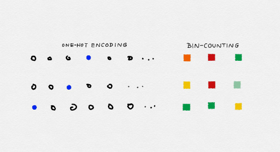

机器学习中的特征工程——分类变量的处理
==========================================

[TOC]

本文将介绍关于机器学习中的特征工程关于分类变量的处理。

分类变量
========

概念
----

顾名思义，分类变量用于表示类别或标签。例如，一个分类变量可以代表世界上的主要城市，一年的四季，或者一个公司的所在产业(如石油，旅游，科技)。

在现实世界中，分类变量的值是无穷多的。这些值可以用数字表示。然而，与数值变量不同，分类变量的值不能相互排序。

例如石油作为一种行业类型，既不高于也不低于旅游业，这被称为非序数。

判断
----

那么怎么判断一个变量是否是分类变量呢？可以通过一个简单的问题来检验"值的大小重不重要，是否具有计算关系？"如果值的大小重要并且具有计算关系，那么就是数值型变量。例如，500 美元的股价是 100 美元的 5 倍，所以股票价格应该用一个连续的数字变量来表示。另一方面，值的大小不重要且不可以计算，那么就是分类变量，例如公司的行业(石油、旅游、技术等)是分类变量。


类型
----

**少类别分类变量：类别数量的数量级小**

像是性别、颜色、产业等分类变量的类别数量级小，那么就属于少类别分类变量


**多类别分类变量：类别数量的数量级大**

多类别分类变量在事务性记录中特别常见。例如，许多 web 服务使用 id 跟踪用户，这是一个包含数亿到数亿个值的分类变量，具体取决于服务的唯一用户数量。互联网交易的 IP 地址是另一个多类别分类变量的例子。它们是分类变量，因为即使用户 id 和 IP 地址是数字，它们的大小通常与手头的任务无关。例如，当对单个交易进行欺诈检测时，IP 地址可能是相关的。某些 IP 地址或子网可能比其他 IP 地址或子网产生更多的欺诈交易。但是 164.203.x 的子网本质上并不比 164.202.x 更具欺诈性，子网的数值并不重要。

文档语料库的词汇可以解释为一个多类别分类变量。如果一个类(例如 apple这个单词)在一个数据点(文档)中出现多次，那么我们可以将其表示为一个计数，并通过它们的计数统计数据表示所有的类别。这就是所谓的`bin-counting `。

我们从少类别分类变量的处理开始讨论，最后进入到多类别分类变量的处理的讨论。


少类别分类变量处理方法
========================

范畴变量的类别通常不是数字。例如，眼睛的颜色可以是"黑色""蓝色""棕色"等等。因此，需要一种编码方法来将这些非数字类别转换为数字。简单地给每个 k 可能的类别分配一个整数，比如 1 到 k，是很诱人的。但是得到的值可以相互排序，这对于分类变量来说是不允许的。


独热编码（One-hot encoding）
----------------------------

一个更好的方法是使用一组字节，每个字节代表一个可能的类别。如果变量不能同时是多个类别，那么组中只能有一个字节是有数据的。这被称为 one-hot 编码，它在 ScikitLearn 中实现为[sklearn.preprocessing.OneHotEncoder](https://scikit-learn.org/stable/modules/generated/sklearn.preprocessing.OneHotEncoder.html) 。每个字节都是一个特征。因此，可能类别为 k 的分类变量被编码为长度为 k 的特征向量。

|     城市      | **$e_1 $** | $e_2 $ | $e_3 $ |
| :-----------: | :--------: | :----: | :----: |
| San Francisco |     1      |   0    |   0    |
|   New York    |     0      |   1    |   0    |
|    Seattle    |     0      |   0    |   1    |

独热编码非常容易理解。如果我们看到位中的前 k-1 位都为零，那么最后一位必须为 1，因为变量必须取一个 k 值。在数学上，我们可以把这个约束写成"所有位之和必须等于 1"。

约束用公式表示
$$
e_{1}+e_{2}+\ldots+e_{k}=1
$$


虚拟编码（Dummy coding）
--------

独热编码的问题在于它允许 k 个自由度，而变量本身只需要 k-1。虚拟编码通过在表示中仅使用 k-1 特征来消除多余的自由度。一个类别，由所有字节为零的向量表示。这就是所谓的参考类别。虚拟编码和一热编码，Pandas 中实现为[pandas.get_dummies](https://pandas.pydata.org/pandas-docs/stable/reference/api/pandas.get_dummies.html)。

|     城市      | $e_1 $ | $e_2 $ |
| :-----------: | :----: | :----: |
| San Francisco |   1    |   0    |
|   New York    |   0    |   1    |
|    Seattle    |   0    |   0    |

**与独热编码相比，采用虚拟编码的建模结果更具有可解释性。**

这一点很容易在简单线性回归问题中看出来。


小案例

假设我们有三个城市的公寓租赁价格数据:旧金山、纽约和西雅图。

```python
import pandas as pd
from sklearn import linear_model
```


```python
df = pd.DataFrame({'City': ['SF', 'SF', 'SF', 'NYC', 'NYC', 'NYC', 'Seattle', 'Seattle', 'Seattle'],
                   'Rent': [3999, 4000, 4001, 3499, 3500, 3501, 2499, 2500, 2501]})
df
```

|      |  City   | Rent |
| :--: | :-----: | :--: |
|  0   |   SF    | 3999 |
|  1   |   SF    | 4000 |
|  2   |   SF    | 4001 |
|  3   |   NYC   | 3499 |
|  4   |   NYC   | 3500 |
|  5   |   NYC   | 3501 |
|  6   | Seattle | 2499 |
|  7   | Seattle | 2500 |
|  8   | Seattle | 2501 |

```python
df['Rent'].mean()
```

3333.333333333335


我们可以训练一个线性回归模型，仅仅根据城市的特征来预测租金价格。

线性回归模型可以这样写:
$$
y=w_{1} x_{1}+\ldots+w_{n} x_{n}
$$
通常需要增加一个称为截距的常量项，这样当 x 为零时，y 可以是一个非零值:
$$
y=w_{1} x_{1}+\ldots+w_{n} x_{n}+b
$$

**独热编码处理**


```python
 #将数据库中的分类变量转换为 one-hot编码
one_hot_df = pd.get_dummies(df, prefix=['city'])
one_hot_df
```

<table border="1" class="dataframe">
  <thead>
    <tr style="text-align: right;">
      <th></th>
      <th>Rent</th>
      <th>city_NYC</th>
      <th>city_SF</th>
      <th>city_Seattle</th>
    </tr>
  </thead>
  <tbody>
    <tr>
      <th>0</th>
      <td>3999</td>
      <td>0</td>
      <td>1</td>
      <td>0</td>
    </tr>
    <tr>
      <th>1</th>
      <td>4000</td>
      <td>0</td>
      <td>1</td>
      <td>0</td>
    </tr>
    <tr>
      <th>2</th>
      <td>4001</td>
      <td>0</td>
      <td>1</td>
      <td>0</td>
    </tr>
    <tr>
      <th>3</th>
      <td>3499</td>
      <td>1</td>
      <td>0</td>
      <td>0</td>
    </tr>
    <tr>
      <th>4</th>
      <td>3500</td>
      <td>1</td>
      <td>0</td>
      <td>0</td>
    </tr>
    <tr>
      <th>5</th>
      <td>3501</td>
      <td>1</td>
      <td>0</td>
      <td>0</td>
    </tr>
    <tr>
      <th>6</th>
      <td>2499</td>
      <td>0</td>
      <td>0</td>
      <td>1</td>
    </tr>
    <tr>
      <th>7</th>
      <td>2500</td>
      <td>0</td>
      <td>0</td>
      <td>1</td>
    </tr>
    <tr>
      <th>8</th>
      <td>2501</td>
      <td>0</td>
      <td>0</td>
      <td>1</td>
    </tr>
  </tbody>
</table>


```python
#导入线性回归模型
lin_reg = linear_model.LinearRegression()

#对线性回归模型进行训练，分类变量作为x，Rent作为y
lin_reg.fit(one_hot_df[['city_NYC', 'city_SF', 'city_Seattle']], one_hot_df['Rent'])

LinearRegression(copy_X=True, fit_intercept=True, n_jobs=1, normalize=False)

w1 = lin_reg.coef_
b1 = lin_reg.intercept_
```


```python
#回归系数
lin_reg.coef_
```

array([ 166.66666667,  666.66666667, -833.33333333])


```python
#截距项
lin_reg.intercept_
```

3333.3333333333335


**虚拟编码处理**


```python
#pd.get_dummies里的drop_first为默认为false，默认是独热编码，当为true时，则为虚拟编码
dummy_df = pd.get_dummies(df, prefix=['city'], drop_first=True)
dummy_df
```

<table border="1" class="dataframe">
  <thead>
    <tr style="text-align: right;">
      <th></th>
      <th>Rent</th>
      <th>city_SF</th>
      <th>city_Seattle</th>
    </tr>
  </thead>
  <tbody>
    <tr>
      <th>0</th>
      <td>3999</td>
      <td>1</td>
      <td>0</td>
    </tr>
    <tr>
      <th>1</th>
      <td>4000</td>
      <td>1</td>
      <td>0</td>
    </tr>
    <tr>
      <th>2</th>
      <td>4001</td>
      <td>1</td>
      <td>0</td>
    </tr>
    <tr>
      <th>3</th>
      <td>3499</td>
      <td>0</td>
      <td>0</td>
    </tr>
    <tr>
      <th>4</th>
      <td>3500</td>
      <td>0</td>
      <td>0</td>
    </tr>
    <tr>
      <th>5</th>
      <td>3501</td>
      <td>0</td>
      <td>0</td>
    </tr>
    <tr>
      <th>6</th>
      <td>2499</td>
      <td>0</td>
      <td>1</td>
    </tr>
    <tr>
      <th>7</th>
      <td>2500</td>
      <td>0</td>
      <td>1</td>
    </tr>
    <tr>
      <th>8</th>
      <td>2501</td>
      <td>0</td>
      <td>1</td>
    </tr>
  </tbody>
</table>


```python
#利用分类变量和Rent进行训练线性模型
lin_reg.fit(dummy_df[['city_SF', 'city_Seattle']], dummy_df['Rent'])
```


```python
LinearRegression(copy_X=True, fit_intercept=True, n_jobs=1, normalize=False)

w2 = lin_reg.coef_
b2 = lin_reg.intercept_
```


```python
#回归系数
lin_reg.coef_
```

array([  500., -1000.])


```python
#截距项
lin_reg.intercept_
```

3500.0


**两种方法区别**

独热编码处理，截距项表示目标变量 Rent 的全局均值，每个线性系数表示城市平均租金与全局均值的差异。

虚拟编码处理，截距项表示参考类别（字节都为零的那个类别）的 y 的平均值，例子中的参考类别是纽约市。第 i 类特征的系数等于第 i 类特征的平均值与参考类别的平均值之差。

|          | $x_1$  | $x_2$  | $x_3$   | $b$     |
| -------- | ------ | ------ | ------- | ------- |
| 独热编码 | 166.67 | 666.67 | -833.33 | 3333.33 |
| 虚拟编码 | 0      | 500    | -1000   | 3500    |

```python
%matplotlib inline
import numpy as np
import matplotlib as mpl
import matplotlib.pyplot as plt
import seaborn as sns
sns.set(style="whitegrid", font_scale=1.4, color_codes=True)
```


```python
sns.swarmplot(x="City", y="Rent", data=df);
```


```python
print('One-hot encoding weights: ',w1, ' and intercept: ', b1)
print('Dummy encoding weights: ' , w2, ' and intercept: ', b2)

```

```python
One-hot encoding weights:  [ 166.66666667  666.66666667 -833.33333333]  and intercept:  3333.33333333
Dummy encoding weights:  [  500. -1000.]  and intercept:  3500.0
```


```python
# 独热编码和虚拟编码对比回归结果

# 独热编码的线性回归结果
one_hot_y = [((w1[0] * one_hot_df.city_NYC[i]) + 
              (w1[1] * one_hot_df.city_SF[i]) +
              (w1[2] * one_hot_df.city_Seattle[i]) + b1) 
             for i in range(0,one_hot_df.shape[0])]

# 虚拟编码的线性回归结果
dummy_y = [((w2[0] * dummy_df.city_SF[i]) +
            (w2[1] * dummy_df.city_Seattle[i]) + b2)
           for i in range(0,dummy_df.shape[0])]

print(one_hot_y)
print(dummy_y)
```

```python
[4000.0, 4000.0, 4000.0, 3500.0, 3500.0, 3500.0, 2500.0, 2500.0, 2500.0]
[3999.9999999999995, 3999.9999999999995, 3999.9999999999995, 3500.0, 3500.0, 3500.0, 2500.0, 2500.0, 2500.0]
```


效应编码（Effect coding）
-------------------------

另一种类型的变量编码方法被称为效应编码。效应编码与虚拟编码非常相似，区别在于参考类别现在由所有 -1的向量表示。

|     城市      | $e_1$ | $e_2$ |
| :-----------: | :---: | :---: |
| San Francisco |   1   |   0   |
|   New York    |   0   |   1   |
|    Seattle    |  -1   |  -1   |

效应编码与虚拟编码非常相似，但是在线性回归模型中得到的结果更容易解释。

接下来演示如何将效应编码作为输入。截距项表示目标变量的全局平均值，单个系数表示单个类别的平均值与全局平均值的差异程度。（这称为类别或级别的主要影响，因此称为“效应编码”）。独热编码实际上产生了相同的截距和系数，但在这种情况下，每个城市都有线性系数。在效应编码中，没有单个特征代表参考类别。（参见什么是[效应编码](https://stats.idre.ucla.edu/other/mult-pkg/faq/general/faqwhat-is-effect-coding/)？了解更多详细信息。)


小案例

效应编码的线性回归模型


```python
#复制原始数据
effect_df = dummy_df.copy()
#进行效应编码
effect_df.loc[3:5, ['city_SF', 'city_Seattle']] = -1.0
effect_df
```

|      | Rent | city_SF | city_Seattle |
| ---: | ---- | :-----: | :----------: |
|    0 | 3999 |   1.0   |     0.0      |
|    1 | 4000 |   1.0   |     0.0      |
|    2 | 4001 |   1.0   |     0.0      |
|    3 | 3499 |  -1.0   |     -1.0     |
|    4 | 3500 |  -1.0   |     -1.0     |
|    5 | 3501 |  -1.0   |     -1.0     |
|    6 | 2499 |   0.0   |     1.0      |
|    7 | 2500 |   0.0   |     1.0      |
|    8 | 2501 |   0.0   |     1.0      |


```python
#训练线性模型
lin_reg.fit(effect_df[['city_SF','city_Seattle']], effect_df['Rent'])
```


```python
#回归系数
lin_reg.coef_
```

array([ 666.66666667, -833.33333333])


```python
#截距项
lin_reg.intercept_
```

3333.3333333333335


优缺点对比
--------------

|          | 独热编码                               | 虚拟编码                                            | 效应编码                                     |
| -------- | -------------------------------------- | --------------------------------------------------- | -------------------------------------------- |
| **优点** | 容易理解 <br />可处理丢失数据   <br /> | 不冗余 <br />唯一性 <br />可解释性强                | 不冗余 <br />可处理丢失数据                  |
| **缺点** | 冗余的<br />非唯一性 <br />可解释性弱  | 无法轻松处理丢失数据   <br />全零向量映射到参考类别 | -1 的存储和计算都是复杂的 <br />无现成工具包 |


多类别分类变量处理方法
======================

当类别的数量级非常大时，上述三种编码技术都会崩溃，因此处理多类别分类变量需要不同的策略。

互联网上的自动数据收集可以生成多类别分类变量。这在定向广告和欺诈检测等应用中很常见。在定向广告中，任务是根据用户的搜索查询或当前页面，为用户匹配一组广告。功能包括用户 id、广告的网站域名、搜索查询、当前页面，以及这些功能的所有可能的组合。(查询是一个文本字符串，可以被分割成通常的文本特征。但是，查询通常很短，通常由短语组成。因此，在这种情况下，最好的做法通常是保持它们的完整性，或者通过散列函数来简化存储和比较。

难点在于找到一个良好的特征表示，既能有效利用内存，又能快速生成准确的模型。

现有的解决方案：

1. 模型训练。对编码不做任何花哨的操作，使用一个简单的模型进行训练。在许多机器上将独热编码输入一个线性模型(Logit 模型或线性支持向量机)。
2. 特征缩放。
   1. 特征哈希法——线性模型
   2. Bin-counting——广泛应用于线性模型和树

使用简单one-hot 编码是一个有效的选择。对于微软的搜索广告引擎，使用了贝叶斯回归模型中的这种二进制值特性，可以通过简单的更新在线训练。与此同时，其他团体则主张采用缩放方法。雅虎的研究人员青睐特性哈希法。与此同时，微软的其他员工接受了`bin-counting`的想法。
我们将先介绍这三种方法，然后讨论它们的优缺点。


特征哈希方法（Feature hashing）
-----------------------------------

哈希函数是一个确定性函数，它将一个潜在的无界整数映射到一个有界的整数范围[1，m]。

由于输入域可能大于输出范围，因此可以将多个数字映射到相同的输出。这就是所谓的碰撞。一个统一的哈希函数可以确保将编号相同的数据映射到 m 个箱子中的一个。

总而言之，我们可以把哈希函数想象成一台机器，它输入编号的球，并将其映射到到 m 个箱子中的一个。号码相同的球总是会被送到相同的箱子中。

哈希函数可以以任何可以用数字表示的对象构造(对于任何可以存储在计算机上的数据都是如此):数字、字符串、复杂结构等等。


哈希函数将键映射到箱子。这样既保持了特征空间，又减少了机器学习训练和评估周期中的存储
和处理时间。

当特征很多的时候，存储特征向会占用很多空间。特征哈希通过对特征 id 应用哈希函数将原始特征向
量压缩为一个 m 维向量。例如，如果原始特征是文档中的单词，那么无论输入中有多少个唯一的单词，
经过哈希函数处理之后的词汇表大小都是固定的m。

关于文本数据的特征哈希法

```python
def hash_features(word_list, m):
	output = [0] * m
	for word in word_list:
		index = hash_fcn(word) % m #hash_fcn()是需要根据不同情景自己定义的
		output[index] += 1
	return output
```


特性哈希的另一种变体添加了一个符号函数，这样就可以从哈希容器中增减成员。

这可以确保哈希特征之间的内部积与原始特征之间的期望值相等。

```python
def hash_features(word_list, m):
	output = [0] * m
	for word in word_list:
		index = hash_fcn(word) % m  # hash_fcn()是需要根据不同情景自己定义的
	sign_bit = sign_hash(word) % 2  # sign_hash()同样是需要自己定义
	if (sign_bit == 0):
		output[index] -= 1
	else:
		output[index] += 1
	return output
```

哈希后内积的值在原始内积的$O\left(\frac{1}{\sqrt{m}}\right)$范围内。因此，哈希表的大小m是在一定误差范围内被选择的。

在实践中，选择正确的m可能需要反复试错。

特征哈希方法可用于处理特征向量的和回归系数的内积，如线性模型和核方法。

特性哈希的一个缺点是，哈希特征是原始特征的集合，不再具有可解释性。


在这个小案例中，我们将使用Yelp评论数据集来演示使用Scikit-learn中FeatureHasher的存储和可解释性之间的权衡。

```python
# 加载前 10000 条评论
f = open('data/yelp/v6/yelp_dataset_challenge_academic_dataset/yelp_academic_dataset_review.json') #数据书籍原文并没有提供
js = []
for i in range(10000):
    js.append(json.loads(f.readline()))
f.close()
review_df = pd.DataFrame(js)
review_df.shape
```

(10000, 8)


```python
# 我们将m的值定义为business_id的唯一值的数量
m = len(review_df.business_id.unique())
print(m)
```

528


```python
from sklearn.feature_extraction import FeatureHasher

h = FeatureHasher(n_features=m, input_type='string')
f = h.transform(review_df['business_id'])
```

```python
# 这怎么影响可解释性的呢
review_df['business_id'].unique().tolist()[0:5]
```

```
['vcNAWiLM4dR7D2nwwJ7nCA',
 'UsFtqoBl7naz8AVUBZMjQQ',
 'cE27W9VPgO88Qxe4ol6y_g',
 'HZdLhv6COCleJMo7nPl-RA',
 'mVHrayjG3uZ_RLHkLj-AMg']
```

```python
f.toarray()
```

```
array([[ 0.,  0.,  0., ...,  0.,  0.,  0.],
       [ 0.,  0.,  0., ...,  0.,  0.,  0.],
       [ 0.,  0.,  0., ...,  0.,  0.,  0.],
       ..., 
       [ 0.,  0.,  0., ...,  0.,  0.,  0.],
       [ 0.,  0.,  0., ...,  0.,  0.,  0.],
       [ 0.,  0.,  0., ...,  0.,  0.,  0.]])
```

可解释性不是很好。但是，让我们看看我们的特性的存储大小

```python
# 我们可以通过观察它们的大小来了解它们在未来将如何发挥作用
from sys import getsizeof

print('Our pandas Series, in bytes: ', getsizeof(review_df['business_id']))
print('Our hashed numpy array, in bytes: ', getsizeof(f))
```

Our pandas Series, in bytes:  **790104**
Our hashed numpy array, in bytes:  **56**

我们可以清楚地看到，使用特征哈希将使我们在计算上受益，牺牲了可解释性。当从数据探索和可视化发展到大型数据集的机器学习工作流时，这是一个很容易接受的折衷方案。


Bin-counting方法
--------------------

`Bin-counting`是机器学习中的一个常年不断的重新发现。它已经被重新发明并用于各种各样的应用，从广告点进率预测到硬件分支预测。然而，由于它是一种特征工程技术，而不是一种建模或优化方法，因此目前还没有相关的研究论文。关于这项技术最详细的描述可以在 MishaBilenko 的 博客["Big Learning Made Easy with Counts" ](https://blogs.technet.microsoft.com/machinelearning/2015/02/17/big-learning-made-easy-with-counts/)找到。

`Bin-counting`的想法非常简单:与其使用类别变量的值作为特征，不如使用该值下目标变量的条件概率。换句话说，不是编码和类别值统一起来，而是计算该值与我们希望预测的目标之间的关联统计数据。对于如果熟悉朴素贝叶斯分类器，因为在假设所有特征都是条件独立的情况下，这个数据就是这个类别的条件概率。

举例说明

| User  | Number of clicks | Number of non-clicks | Proy of click | QueryHash，AdDomain      | Number of clicks | Number of non-clicks | Probability of click |
| ----- | ---------------: | -------------------: | ------------: | :----------------------- | ---------------: | -------------------: | -------------------: |
| Alice |                5 |                  120 |          0.04 | 0x598fd4fe,<br />foo.com |            5,000 |               30,000 |                0.167 |
| Bob   |               20 |                  230 |          0.08 | 0x50fa3cc0,<br />bar.org |              100 |                 9,00 |                0.100 |
| Joe   |                2 |                    3 |           0.4 | 0x437a45e1,<br />qux.net |                6 |                   18 |                0.250 |

`Bin-counting` 假定历史数据可用于统计计算。包含分类变量每个可能值的汇总历史数据。

根据用户点击任何广告的次数和未点击的次数，我们可以计算出用户"Alice"点击任何广告的概率。

类似地，我们可以计算任何查询-广告-域组合的点击概率。

在训练时，每次我们看到"Alice"，使用她的点击概率作为模型的输入特征。

对于像"0x437a45e1，qux.net"这样的 QueryHash-AdDomain 组合也是如此。

z假设有 10000 个用户。一个独热编码将生成一个长度为 10,000 的稀疏向量，对应于当前数据点值的列中
只有一个 1。`Bin-counting` 将所有 10,000 个二进制列编码为一个实际值介于 0 和 1 之间的单一特征。

除了历史点击概率之外，我们还可以包括其他特征:

- 原始计数本身(点击次数和非点击次数)、
- 对数优势比
- 其他概率衍生值。

我们这里的例子是预测广告点击率。但是这种技术很容易应用于一般的二分类。它也可以很容易地扩展到多分类问题。


`Bin-Counting`**的计算**

它通过提出这样一个问题来考察它们之间的联系强度:

"当 x 为真时y 有多大可能为真。"

例如，我们可能会问,"爱丽丝点击广告的可能性比一般人高多少?"

这里，x 是二进制变量"当前用户是Alice"，y 是变量"是否点击"

这种计算使用了所谓的列联表(基本上是对应于 x 和y 的 4 种可能组合的 4 个数字)。

|               | Click | Non-Click | Total  |
| ------------- | ----- | --------- | ------ |
| **Alice**     | 5     | 120       | 125    |
| **Not Alice** | 995   | 18,880    | 19,875 |
| **Total**     | 1000  | 19,000    | 20,000 |

给定一个输入变量$x$，和目标变量$y$,定义

`odds_ratio`$ = \frac{(P(Y=1 | X=1) / P(Y=0 | X=1)}{(P(Y=1 | X=0) / P(Y=0 | X=0)}$

在我们的例子中，这就是"Alice点击广告而不是不点击的可能性有多大"和"其他人点击而不是不点击的可
能性有多大"之间的比率在这个例子中是

`odds ratio (user, ad click) `$=\frac{(5 / 125) /(120 / 125)}{(995 / 19,875) /(18,880 / 19,875)}=0.7906$


更简单地说，我们可以看一下分子，它检查单个用户(Alice)点击广告与不点击广告的可能性有多大。这
适用于具有多类别的分类变量，而不仅仅是两个值。

`odds ratio (Alice, ad click) `$=\frac{5 / 125}{120 / 125}=0.04166$


比值很容易变得非常小或非常大。例如，有些用户几乎从来不点击广告，也许有些用户点击广告的频率要比不点击的频繁得多。

对数变换再次来拯救我们，对数的另一个有用的特性是它把除法变成减法。

`log-odds ratio (Alice, ad click) `$=\log \left(\frac{5}{125}\right)-\log \left(\frac{120}{125}\right)=-3.178$

简而言之，`Bin-counting` 将一个分类变量转换为关于值的统计信息。

**它将分类变量的大型稀疏矩阵表示转换为非常小的稠密的实数数值表示。**（如下图）




在实现方面，`bin-counting` 需要在每个类别及其相关计数之间存储一个映射。(剩下的统计数据可以从原始计数中动态地推导出来。)因此它需要**$ O(k)$**的复杂度，其中 k 是分类变量唯一值的个数。


小案例

点进率数据集统计案例。

- 有 24 个变量，包括"点击"、二进制点击/不点击计数器和"设备 id"，用于跟踪广告显示在哪个设备上等
- 整个数据集包含 40428967 个观察数据，以及 2686408 个独特的设备。

竞赛是用广告数据来预测点进率，但是我们将用它来演示如何通过计算垃圾桶来大大减少大量流数据的特征空间。

```python
import pandas as pd
```

- [Click-through ad data from Kaggle competition](https://www.kaggle.com/c/avazu-ctr-prediction/data)
- 数据大小6GB

```python
df = pd.read_csv('data/train_subset.csv')
```

```python
df.head(3)
```

<table border="1" class="dataframe">
  <thead>
    <tr style="text-align: right;">
      <th></th>
      <th>id</th>
      <th>click</th>
      <th>hour</th>
      <th>C1</th>
      <th>banner_pos</th>
      <th>site_id</th>
      <th>site_domain</th>
      <th>site_category</th>
      <th>app_id</th>
      <th>app_domain</th>
      <th>...</th>
      <th>device_type</th>
      <th>device_conn_type</th>
      <th>C14</th>
      <th>C15</th>
      <th>C16</th>
      <th>C17</th>
      <th>C18</th>
      <th>C19</th>
      <th>C20</th>
      <th>C21</th>
    </tr>
  </thead>
  <tbody>
    <tr>
      <th>0</th>
      <td>1.000009e+18</td>
      <td>0</td>
      <td>14102100</td>
      <td>1005</td>
      <td>0</td>
      <td>1fbe01fe</td>
      <td>f3845767</td>
      <td>28905ebd</td>
      <td>ecad2386</td>
      <td>7801e8d9</td>
      <td>...</td>
      <td>1</td>
      <td>2</td>
      <td>15706</td>
      <td>320</td>
      <td>50</td>
      <td>1722</td>
      <td>0</td>
      <td>35</td>
      <td>-1</td>
      <td>79</td>
    </tr>
    <tr>
      <th>1</th>
      <td>1.000017e+19</td>
      <td>0</td>
      <td>14102100</td>
      <td>1005</td>
      <td>0</td>
      <td>1fbe01fe</td>
      <td>f3845767</td>
      <td>28905ebd</td>
      <td>ecad2386</td>
      <td>7801e8d9</td>
      <td>...</td>
      <td>1</td>
      <td>0</td>
      <td>15704</td>
      <td>320</td>
      <td>50</td>
      <td>1722</td>
      <td>0</td>
      <td>35</td>
      <td>100084</td>
      <td>79</td>
    </tr>
    <tr>
      <th>2</th>
      <td>1.000037e+19</td>
      <td>0</td>
      <td>14102100</td>
      <td>1005</td>
      <td>0</td>
      <td>1fbe01fe</td>
      <td>f3845767</td>
      <td>28905ebd</td>
      <td>ecad2386</td>
      <td>7801e8d9</td>
      <td>...</td>
      <td>1</td>
      <td>0</td>
      <td>15704</td>
      <td>320</td>
      <td>50</td>
      <td>1722</td>
      <td>0</td>
      <td>35</td>
      <td>100084</td>
      <td>79</td>
    </tr>
  </tbody>
</table>
<p>3 rows × 24 columns</p>

```python
# 分类变量的唯一值个数
len(df['device_id'].unique())
```

`device_id`这个特征的唯一值数量是 **7201** 个

对于每一个分类变量 $\theta$ ，我们都需要进行如下转换计算：

 $\theta$ = [$N^+$, $N^-$, $log(N^+)-log(N^-)$, 其他衍生变量]

$N^+$ = $p(+)$ = $n^+/(n^+ + n^-)$  

$N^-$ = $p(-)$ = $n^-/(n^+ + n^-)$

$log(N^+)-log(N^-)$ = $\frac{p(+)}{p(-)}$

$n^+$是代表一个特征

其他衍生变量=： (这里没有展示)

代码实现如下所示

```python
def click_counting(x, bin_column):
    clicks = pd.Series(x[x['click'] > 0][bin_column].value_counts(), name='clicks')
    no_clicks = pd.Series(x[x['click'] < 1][bin_column].value_counts(), name='no_clicks')
    
    counts = pd.DataFrame([clicks,no_clicks]).T.fillna('0')
    counts['total'] = counts['clicks'].astype('int64') + counts['no_clicks'].astype('int64')
    
    return counts

def bin_counting(counts):
    counts['N+'] = counts['clicks'].astype('int64').divide(counts['total'].astype('int64'))
    counts['N-'] = counts['no_clicks'].astype('int64').divide(counts['total'].astype('int64'))
    counts['log_N+'] = counts['N+'].divide(counts['N-'])

#   我们直接筛选出['N+', 'N-', 'log_N+']这些字段
    bin_counts = counts.filter(items= ['N+', 'N-', 'log_N+'])
    return counts, bin_counts
```

```python
# 以device_id为例
bin_column = 'device_id'
device_clicks = click_counting(df.filter(items= [bin_column, 'click']), bin_column)
device_all, device_bin_counts = bin_counting(device_clicks)
```

```python
# 检验是否数目一致
len(device_bin_counts)
# 7201
```


于是我们利用`bin-counting`的特征处理方法，新生成的数据表结果如下。

```python
device_all.sort_values(by = 'total', ascending=False).head(4)
```

<table border="1" class="dataframe">
  <thead>
    <tr style="text-align: right;">
      <th></th>
      <th>clicks</th>
      <th>no_clicks</th>
      <th>total</th>
      <th>N+</th>
      <th>N-</th>
      <th>log_N+</th>
    </tr>
  </thead>
  <tbody>
    <tr>
      <th>a99f214a</th>
      <td>15729</td>
      <td>71206</td>
      <td>86935</td>
      <td>0.180928</td>
      <td>0.819072</td>
      <td>0.220894</td>
    </tr>
    <tr>
      <th>c357dbff</th>
      <td>33</td>
      <td>134</td>
      <td>167</td>
      <td>0.197605</td>
      <td>0.802395</td>
      <td>0.246269</td>
    </tr>
    <tr>
      <th>31da1bd0</th>
      <td>0</td>
      <td>62</td>
      <td>62</td>
      <td>0.000000</td>
      <td>1.000000</td>
      <td>0.000000</td>
    </tr>
    <tr>
      <th>936e92fb</th>
      <td>5</td>
      <td>54</td>
      <td>59</td>
      <td>0.084746</td>
      <td>0.915254</td>
      <td>0.092593</td>
    </tr>
  </tbody>
</table>


```python
# 对比独热编码和binning-count两种方法处理后的结果
from sys import getsizeof

print('Our pandas Series, in bytes: ', getsizeof(df.filter(items= ['device_id', 'click'])))
print('Our bin-counting feature, in bytes: ', getsizeof(device_bin_counts))
```

Our pandas Series, in bytes:               **7,300,031**
Our bin-counting feature, in bytes:       **525,697**

从这里我们可以清楚地看到，`bin-counting`处理完后，数据量降低了一个数量级。


优缺点对比
----------

|      | 独热编码方法                                     | 特征哈希方法                                                 | Bin-counting方法                                             |
| ---- | ------------------------------------------------ | ------------------------------------------------------------ | ------------------------------------------------------------ |
| 优点 | 最容易实现、可能是最准确的 、可线上进行          | 容易实现、训练成本低 适应新的类别、可处理稀有类别 可线上进行 | 训练时最小的计算负担、容易适应新的类别使用树模型可解释性强   |
| 缺点 | 计算效率低、不适应不断增长的类别、只适用线性模型 | 仅适用于线性或核模型哈希后特征不可解释、准确度报告不一       | 需要历史数据、需要延迟更新，不适合线上进行、更高的过拟合风险 |


没有一个方法是完美的，选择使用哪一个取决于所采用的机器学习模型。线性模型训练成本更低，更适合采用独热编码。基于树的模型通常采用`Bin-counting`的方法。特征哈希方法需要结合实际情况，灵活运用。


*本文内容整理、翻译Principl的《Feature Engineering for Machine Learning》*
*原文代码地址:https://github.com/alicezheng/feature-engineering-book.*

