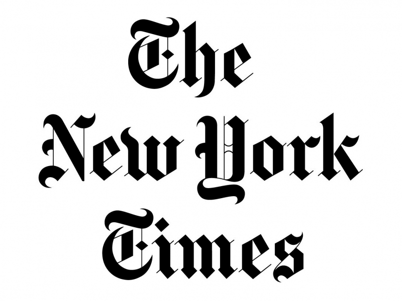

世界顶尖数据科学家采访实录——《纽约时报》首席科学家
==================================================

[TOC]

本系列整理对世界顶尖数据科学家们的访谈记录。让我们一起来领略他们对数据科学的理解和看法。

采访的第一位嘉宾是**Chris Wiggins**。

**Chris Wiggins**是《纽约时报》的首席数据科学家，哥伦比亚大学应用数学副教授。

**Chris Wiggins**在《纽约时报》工作期间，正在创建一个机器学习小组，分析记者制作的内容、读者消费文章所产生的数据，以及更广泛的读者导航模式所产生的数据，其首要目标是更好地倾听《纽约时报》消费者的声音，并重新思考未来100年的新闻业将会是什么样子。

在哥伦比亚大学，**Chris Wiggins**专注于将机器学习技术应用于生物大数据研究。这包括对自然发生的网络的分析，应用于生物时间序列数据的统计推断，以及计算生物学中的大规模序列信息学。作为他在哥伦比亚大学工作的一部分，他是该大学数据科学与工程研究所(IDSE)和系统生物学系的创始成员。

*《纽约时报》的Logo    图片来源：https://wtf-philroberts.com/2018/10/04/lox-stock-barrel-schmaltz/*

您在哪里工作
============

我在哥伦比亚大学(Columbia University)和《纽约时报》(New York Times)之间度过了一段时间。我在哥伦比亚大学担任应用数学副教授，在《纽约时报》担任首席数据科学家。

我可以长时间地谈论每个机构。作为背景，我对纽约有着长久的爱。上世纪80年代，我作为一名本科生来到纽约上哥伦比亚大学。我认为哥伦比亚大学本身就是一个伟大的实验，看看你能否在纽约市的实验中培养一个常春藤盟校的教育和一个强大的科学研究社区，纽约市充满了兴奋、分心和变化，最重要的是，充满了人性。哥伦比亚大学是一个非常令人兴奋和充满活力的地方，充满了非常具有颠覆性的学生和校友，包括我自己，而且已经有几个世纪了。

《纽约时报》也有上百年的历史。这是一家有着163年历史的公司，我认为它也代表了一套我坚信的价值观，而且与我非常喜欢的纽约有着非常紧密的联系。每当我想到《纽约时报》，我就会想到托马斯·杰斐逊(Thomas jefferson)所表达的一种观点:如果你可以在经营良好的民主与经营不良的媒体之间做出选择，或者在经营良好的媒体与经营不良的民主之间做出选择，他宁愿选择经营良好的媒体。你们需要一个经营良好的新闻媒体和一个良好的新闻文化，以培育和确保民主的存续。

数据科学如何与您的工作相适应?
=============================

我想说，在数据科学、学术界和《纽约时报》工作是一个令人兴奋的时刻。数据科学现在已经成为一个学术领域。你可以在计算统计学家比尔•克利夫兰(Bill Cleveland) 2001年的一项提议中找到它的学术根源。显然，你也可以在职位描述中找到数据科学家的根源，最著名的例子是LinkedIn的帕蒂尔(DJ Patil)和facebook的杰夫•哈默巴赫(Jeff Hammerbacher)。然而，在某些方面，知识分子的根源可以追溯到1962年统计学家约翰•图基(John Tukey)的著作。

半个世纪以来，学术界一直在酝酿着这样一种现象:统计学作为一个越来越多的数学领域，与世界每时每刻都在产生越来越多的数据、计算能力随着时间呈指数增长这一现实之间的脱节。越来越多的字段有兴趣尝试从数据中学习。

我在哥伦比亚大学(Columbia university)过去10年或更长时间里的研究一直是我们现在所说的“数据科学”——我过去常称之为“应用于生物学的机器学习”，但现在可能被称为“自然科学中的数据科学”。“我们的目标是与具有领域专长的人合作——甚至没有必要——非常定量的或数学领域的专长——这些专长是在数十年的实践中积累起来的，涉及生物学工作中一些实际问题，这些问题很复杂，但肯定不是随机的。处理这些问题的社区发现自己越来越被数据淹没。

所以这里有一个智力上的挑战并不完全是机器学习的智力上的挑战。更大的智力挑战是尝试使用机器学习来回答来自真实世界领域的问题。很长一段时间以来，在生物学领域的研究一直很令人兴奋。

能在《纽约时报》工作也令人兴奋，因为《纽约时报》是规模更大、经济更稳定的出版商之一，同时捍卫民主，并在历史上为新闻诚信设置了很高的标准。他们通过几十年甚至几百年强烈的自我反省来做到这一点。他们不怕质疑公司的原则、选择，甚至是领导层，我认为这创造了一种非常健康的知识文化。

与此同时，尽管作为出版商，它的经济实力很强，但过去两个世纪左右的出版商业模式在过去10年里已经完全消失;超过70%的平面广告收入直接蒸发了，最急剧的蒸发发生在2004年2月左右。因此，尽管这栋大楼里挤满了非常聪明的人，但就如何定义可持续新闻的未来而言，它正在经历一场明显的巨变。

目前的领导层，一直到记者，都非常好奇“数字”。这意味着:当你把新闻与传播媒介分离开来时，它会是什么样子?甚至“报纸”这个词都不会涉及到报纸。报纸对《纽约时报》来说仍然非常重要，不仅是事物的组织方式，甚至是日常日程的组织方式，而且在概念上也是如此。与此同时，我认为这里有很多非常有远见的人，包括记者和技术人员，他们开始使《纽约时报》传播新闻的方式多样化。

要做到这一点，你需要不断地做实验。如果你在做实验，你需要测量一些东西。

在2014年，你衡量事物的方式，是通过人们对产品的投入程度。因此，从weblog到每次有人与移动应用程序交互的活动，这家公司都能获得大量的数据来弄清楚:读者想要什么?他们看重的是什么?当然，这个答案可能是动态的。有可能，2014年读者想要的与2013年或2004年截然不同。因此，我们在数据科学小组中要做的就是从《纽约时报》收集的大量数据中学习，并使之有意义。

您是什么时候意识到想以数据科学为职业？
======================================

有一天，我在研究生院和其他一些研究生一起吃午饭的时候。

一名研究生走进布拉哈德，他的基因组是第一个自由测序的活体。这是一种100年前就被发现的病原体。但是，把某样东西按顺序排列意味着，你从有它的图片，或者你把东西倒在上面，然后它可能变成蓝色的实验，到有了电话簿上有价值的信息。不幸的是，这些信息是用我们没有选择的语言写的，只是一个四个字母的字母表。

这就引出了一个统计和科学的问题:你如何理解这些丰富的信息?

我们有数据。我们已经用了100年了。我们知道它的作用，现在我们面对的是一种完全不同的方式来理解数据。

上世纪90年代初，当我开始攻读博士学位时，我正在研究物理学家的建模风格，即寻找简单的问题，在这些问题中，简单的模型可以揭示洞察力。物理学和生物学之间的关系在不断发展，但在性质上却受到了限制，因为物理学家建模的风格通常是试图确定一个问题，这个问题是关键要素，是关键的简化描述，它允许基本的建模。突然把电话簿放在桌上，然后说“让他有意义”，这是一种完全不同的理解方式。在某种程度上，它与物理学家所推崇的基本模型背道而驰。那就是我开始学习学习的时候。

幸运的是，物理学家也很擅长进入其他领域。我有很多文化经纪人，我可以以其他物理学家的形式去找他们，他们勇敢地投身于计算神经科学或其他领域，在这些领域，科学领域与如何理解数据之间已经建立了良好的关系。事实上，机器学习中最杰出的会议之一叫做nipand, N代表“神经科学”。在基因组学出现之前，这个群体就已经在尝试我们现在所说的“数据科学”，也就是用数据来回答科学问题。

上世纪90年代末，当我完成我的博士学位时，我对这个不断增长的关于人们提出生物学统计问题的文献非常感兴趣。不能把小麦从谷壳中分离出来，真使我恼火。当我读这些论文的时候，真正把小麦和谷壳区分开来的唯一方法就是自己动手写论文，试着找出哪些是可行的，哪些是不可行的。学术界有时在揭示什么是小麦，什么是谷壳方面进展缓慢，但最终它做得非常好。论文数量激增，几年后，人们意识到哪些东西是金子，哪些东西是傻瓜的金子。我认为现在有一个潮流就是，人们使用机器学习来回答科学问题。

对您来说，数据科学中最令人兴奋的事情是什么?
===========================================

对我来说最令人兴奋的事情不是新事物。

对我来说最令人兴奋的事情是意识到每个人都认为的新事物实际上是旧事物。

关于这个叫做“数据科学”的新事物有很多令人兴奋的地方。“我认为去看那些比Tukey还要古老的统计数据真的很有趣。例如，Sewall Wright在20世纪20年代使用图形化的遗传学模型。真正让我兴奋的不是新奇的东西。它特别围绕着思想，而不是太多的东西，因为，再说一遍，人，思想，和事物的顺序。改变的事情。当我们认为自己有了一个新想法时，这是很有趣的，但通常我们随后意识到这个想法实际上是非常古老的。你对此有所了解，这就非常棒。

例如，随机优化和随机梯度下降，在过去的5年里取得了巨大的成功，但是它们来自于罗宾斯和蒙罗在1951年1月12日写的一篇论文，这是一个好主意，但事实上，我认为这是一个好主意意味着很久以前有人用铅笔在纸上仔细思考过。试着通过数据和你的电脑来了解这个世界是个好主意。这就是为什么图基在1962年写了一篇关于统计的文章，当时他命令每个人重新定位统计学作为一门专业学科。1962年，他写了一篇名为《数据分析的未来》(The Future of Data Analysis)的文章。

上世纪90年代，里奥•布雷曼(Leo Breiman)一直在给他的统计学家社区写信，“让我们用数据，统计社区!”上世纪90年代末，他在写论文，告诉他所有的同事们开始研究数据科学——这就像他走进荒野，回来后对伯克利的每个人说，伯克利是最早的数理统计学院之一，“你们需要醒过来，因为它着火了。你们还在证明定理。外面着火了。醒醒!”

我认为人们有一个传统，那就是通过数据来理解世界是多么的强大，多么的不同。

“数据至上”是伯克利大学的一位数理统计学家在很久以前就用过的一个词，伯克利大学强调的这种根深蒂固的传统是通过2001年从约翰·图基到里奥·布雷曼再到比尔·克利夫兰的这种极端思想而延续下来的。他们中的一些人认为自己是正统的统计学家，尽管他们是相当极端的人。因为统计学每五年就会在数学上翻一番，因为数学的起源使统计学成为一个真正的领域。

这就是我认为最令人兴奋的事情——不要被今天的事情分心，而要找到那些比你年长得多的人和他们的世界观。

数据科学的未来会是什么样子?
===========================

数据科学的未来，这是一个很大的话题，是它的形式？还是它的内容呢？还是去使用它的人呢？他们的未来都是不一样的。

我认为数据科学没有理由不像其他许多领域那样遵循同样的过程，因为它在学术界找到了归宿，这意味着它成为一种认证功能，尤其是在专业领域。你将获得硕士学位和博士学位。该领域将具有意义，但也将具有专门性。您已经看到人们使用“数据工程”和“数据科学”这两个短语作为分隔符。我在《纽约时报》的团队是数据科学组，它是数据科学与工程更大团队的一部分。人们开始理解数据科学团队如何涉及数据科学、特征工程、数据可视化和数据体系结构。

数据还不是一种产品，但如果你看一下，比如说，数据科学是如何在linkedin发生的——数据科学是如何通过产品层次结构报告出来的。在其他公司，数据科学通过业务报告;或者it通过工程报告。现在我身处《纽约时报》的工程部门，独立于产品，独立于营销，独立于广告。不同的公司在不同的部门定位数据科学。

所以我认为会有资格认证，我认为会有专业化。纽菲尔德诞生了——我不会一直这么说，因为按照现实世界的标准，学术界从来没有发生过什么事情——但大学里每隔几年就会诞生新的院系。它发生的方式是创建新字段的一部分。我已经长大了，我有幸目睹了，比如说，系统生物学作为一个领域诞生，合成生物学作为一个领域诞生，甚至纳米科学作为一个领域诞生。我在20世纪80年代的第一个研究项目是在一片混乱中进行的，而那个时候正是一个新的领域诞生的时候。詹姆斯·格莱克(James Gleick)当时为《纽约时报》撰写了一本关于这方面的著名著作，名为《混乱:创造新科学》(Chaos:Making a New science)。只是和现实世界的节奏相比，它实在是太慢了，我认为这是最好的。年轻人的未来危在旦夕，所以我认为情况其实没那么糟。

因此，我认为数据科学的未来是成为学术界的一部分，这意味着不同大学之间就什么是真正的数据科学展开激烈而有争议的对话。你已经开始看到这方面的工作了。例如，在哥伦比亚大学，我的一位名叫马特·琼斯的同事，他是一位历史学家，正在写一本关于机器学习和数据科学历史的书。所以你已经开始看到人们意识到数据科学并不是在2008年从真空中诞生的。从智力上讲，我们所有的数据科学都已经意识到——也就是说，在统计和机器学习之间存在鸿沟，还有一些其他的东西。所以我认为人们会更加欣赏历史。

当一个领域成为一个学术领域时，会发生三件主要的事情——

- 设置一个学术标准，
- 启动一个认证过程，
- 历史研究提供了该领域的背景。

学术经典是一组我们认为是该领域核心知识分子的课程。最后，通过对历史的研究，我们可以了解当时的背景:这些想法从何而来?

当人们使用的名称和短语变得更有意义时，你就有了专业化的可能性，因为我们现在所拥有的是，当人们说“数据科学”时，他们可能意味着许多事情。

它们可能意味着数据可视化、特征工程、数据科学、机器学习或其他一些东西。随着技术本身的使用更加细化，我认为您你会看到团队更加高效的专门化。你不可能有这样一个足球队，每个人都说:“我是一个乡巴佬。”“有人需要成为定位球手，有人需要成为持球手，有人需要成为后卫。当人们开始专业化的时候，你就可以通过了。你可以与人进行有意义的合作，因为人们知道他们的角色和“完成的任务”是什么样子的。

现在，我认为未来数据科学究竟是什么样子还有待观察，但是能确定的是走向专业化的细分。

*整理和翻译《Data Scientists at Work》一书*