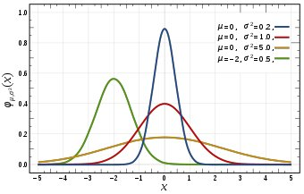
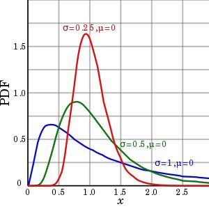

# 每个数据科学家应该知道的概率分布

[TOC]

概率分布就像3D眼镜，它们能够增强数据科学家准确识别随机变量的能力。

在某种程度上，大多数数据科学或机器学习技能都基于对数据概率分布的一些假设。

这使得概率知识成为作为数据科学家构建工具箱的基础。这是我们迈向数据科学家的第一步。

话不多说，我们进入正题。

 

什么是概率分布？
================

在概率论和统计学中，**随机变量**是一个**随机值**的东西  ，比如“我看到一个人的身高”或“我下一碗面里的厨师头发数量”。

给定一个随机变量 $X$,我们想要一种描述它需要的值的方法。更重要的是，我们想要描述该变量**获取特定值**$X$的**概率**。 

例如，如果 $X$ 是“我的女朋友有多少只猫”，那么这个数字可能是1。有人可能会认为这个值甚至可能是5或10。

然而，没有可能一个人会有负数的猫。

因此，我们想要一种明确的数学方法来表达变量 $X$ 可以采用的每个可能值$X$，以及事件$（X = x）$的可能性   。

为了做到这一点，我们定义函数 $P​$，使得  $P（X = x）​$ 是变量$X​$ 具有值$X​$的概率  。

对于连续值而不是离散值，我们也可以要求$P（X <x）$或$P（X> x）$。这将很快变得更加重要。

$P$ 是变量的**密度函数**，它表示变量的**分布**。

随着时间的推移，科学家们开始意识到自然界中的许多事物，现实生活往往表现相似，变量共享一个分布，或具有相同的密度函数（或类似的函数改变其中的一些常数）。

有趣的是，对于  $P$ 是一个密度函数。

-  对于任何值  $x$，$P（X = x） <= 1$。
-  对于任何值  $x$，$P（X = x）> = 0$。
- 和最后一个：$X$ 的$P（X = x）$的**求和为1**。

离散与连续随机变量分布
======================

最后，随机变量可以被认为属于两类：**离散**和**连续**随机变量。

 

离散随机变量
------------

**离散变量**  具有一组离散的可能值，每个值都具有非零概率。

例如，如果我们说，当翻转硬币时

> X =“1如果硬币是正面，0则是背面”

然后  $P（X = 1）= P（X = 0）= 0.5$。

但是请注意，离散集合不必是有限的。

**几何分布**，概率  *$p$*  第$k$次成功发生的概率

它具有以下密度公式。

$P(X=k)=(1-p)^{k} p$
$$0 \leq p \leq 1$$

其中  ***k***  **可以是任何非负值**。

注意所有可能值的概率之和仍然**加起来为1**。

 

连续随机变量
------------

如果你说

$X =“从我头上随机拔一根头发的长度（以毫米为单位）$

$X$可以 采用哪些可能的值  ？我们都可能都认为负值在这里没有任何意义。

但是，如果你说它只是1毫米，而不是1.1853759 ......或类似的东西，我会怀疑你的测量技巧，或你的测量错误报告。

连续随机变量可以 在给定（连续）区间中取**任何值**。

因此，如果我们**为其所有可能值**分配了  **非零概率**，则它们的总和  **不会加起来为1**。

为了解决这个问题，如果  $X$  是连续的，我们 为所有  *$k$*设置 $P（X = x）= 0$，而是为$X$赋予一个非零的机会获取**某个区间**的值  **。**

为了表示在值 $a$ 和 $b$之间放置X的概率，我们说*​$P（a <X <b）$*。

而不是仅仅在一个密度函数替换值，得到  *$P（A <X <B）$* 为  $X$  连续变量。

哇，你已经完成了整个理论部分！这是你的奖励。

现在您已经知道了概率分布是什么，让我们了解一些最常见的分布！

 

常见概率分布
============

伯努利概率分布
--------------

具有伯努利分布的随机变量是最简单的。

它代表一个**事件**：“这件事发生” VS“这种情况没有发生”，并采取了概率值  *$p$*作为其**唯一的参数**，它代表的**概率**是**会发生的事件**。

 具有参数*$p$*的伯努利分布的  随机变量  *$B$*  将具有以下密度函数：

*$P（B = 1）= p$*

*$P（B = 0）=（1-p）$*

这里  *$B = 1​$*  表示事件发生，$B = 0​$表示事件没发生。

注意两个概率为什么加起来为1，因为$B$只有两种结果。

 

均匀概率分布
------------

有两种均匀随机变量：离散变量和连续变量。

- **离散均匀分布**  

将采取**（有限的）**值的集合，和的概率分配的$\frac {1 }{ n}$  ，其中他们每个人，的$n$是在元素的数量。

这样，如果我的变量 *Y*  在{1,2,3}中是均匀的，则每个值出现的概率为33％。

在骰子中可以找到离散均匀随机变量的典型情况  ，其中典型的骰子具有一组值{1,2,3,4,5,6}。

- **连续均匀分布**

相反，只需要两个值$a$和$b$作为参数，和相同的密度分配给在相应的区间

这意味着Y 在一个**区间**（从$c$到$d$）取值的概率  与其大小相对于整个区间（$b-a$）的大小成比例。

因此，如果 *Y*  在*a*  和  *b*之间均匀分布  ，那么

$P(c<Y<d)=(d-c) /(b-a) \quad   其中(d>c, b>a)$

这样，如果  *$Y$*  是1和2之间的均匀随机变量，

$P(1<X<2)=1​$ 

$P(1<X<1.5)=0.5$

Python的  `random` 包的  `random` 方法在0和1之间采样均匀分布的连续变量。

有趣的是，可以证明， 在给定[均匀随机生成器和微积分的情况下](https://www.mathworks.com/help/stats/generate-random-numbers-using-the-uniform-distribution-inversion-method.html)，可以对**任何其他分布**进行采样。

 

正态概率分布
------------

**正态分布的变量**在自然界中很常见，它们实际上是常态。这实际上就是这个名字的来源。

如果你把所有的同事都围起来并测量他们的身高，或者对它们进行称重并用结果绘制直方图，则可能会接近正态分布。

当我向您展示[探索性数据分析](http://www.datastuff.tech/data-analysis/data-analysis-pandas-seaborn-kaggle-dataset/) 示例时，我实际上看到了这种效果  。

还可以证明，如果你采用任意随机变量的样本并对这些度量进行平均，并多次重复该过程，则该平均值也将具有正态分布。这个事实非常重要，它被称为[统计学](https://math.tutorvista.com/statistics/fundamental-theorem-of-statistics.html)的[基本定理](https://math.tutorvista.com/statistics/fundamental-theorem-of-statistics.html)。

通常分布的变量：

- 是**对称的**，以均值为中心（通常称为  **μ**）。
- 可以**在真实空间中**获取  **所有值**，但仅在5％的可能性内偏离均值的两个sigma。
- 是**几乎无处不在**。

大多数情况下，如果你测量任何经验数据并且它是对称的，假设它是正常的将有点工作。

例如，掷  *$K$*  次骰子的结果就是一个正态分布。

 

**对数正态概率分布**

 

对数正态概率分布是正态概率分布的变换。

 如果变量  *$Y = log（X）​$*  遵循正态分布， 则称变量  $X​$是**对数正态分布**的。

当在直方图中绘制时，对数正态概率分布是**不对称的**，并且如果它们的标准偏差更大则更加不对称。

我认为**对数正态分布**值得一提，因为大多数**关于货币的变量**都是这样的。

如果你看一下与钱有关的任何变量的概率分布，比如

- 在某个银行的最新转账金额。
- 华尔街最新交易量。
- 一组公司在特定季度的季度收益。

它们通常没有正态的概率分布，但会更接近对数正态随机变量。

 

指数概率分布
------------

**指数概率分布**也随处可见。

它们与称为**泊松过程**的概率概念密切相关  。

  [泊松过程](https://en.wikipedia.org/wiki/Poisson_point_process)  是“**事件以恒定的平均速率连续且独立地发生的过程** ”。

所有这些意味着，如果：

- 有很多活动。
- 它们以一定的速率发生（**不**随时间**变化**）。
- 仅仅因为一个发生了另一个发生的机会不改变。

然后就有了泊松过程。

一些例子可能是来到服务器的请求，在超市中发生的交易，或在某个湖中捕鱼的鸟类。

想象一下频率为$λ$的泊松过程（比如，事件每秒发生一次）。

指数随机变量模拟事件发生后下一个事件发生所需的时间。

有趣的是，在泊松过程中  **，事件可以**在任何时间间隔内**发生在0到无穷大之间**的任何地方。

这意味着  **无论您等待多久，事件都不会发生非零的概率事件**。这也意味着它可能在很短的时间内发生很多次。

在课堂上，我们常常开玩笑的是巴士到达泊松过程。我认为将WhatsApp消息发送给某些人的响应时间也符合标准。

但是，$λ$参数调节事件的频率。

它将使事件实际发生的**预期时间以某个值为中心**。

这意味着如果我们知道出租车每隔15分钟通过我们的街区，即使理论上我们可以永远等待它，我们也很可能不会等待30分钟。

 

**数据科学中的指数概率分布**

这是指数分布随机变量的密度函数：

$f(x ; \lambda)=\lambda e^{(-\lambda x)}$  $(x \geq 0)$

假设您有一个来自变量的样本，并希望查看它是否可以使用指数分布变量建模。

最佳**λ参数估计**可以简单的取样本平均值的倒数。

指数变量非常适合用非常罕见但巨大（和平均值）的**异常值**对任何概率分布进行建模  。

这是因为它们可以**取任何非负值**但以较小值为中心，随着值的增加频率降低。

在特别是异常值众多的样本中，您可能希望将λ估计为中位数而不是平均值，因为**中位数**对异常值更为稳健。

 

结论
====

总而言之，作为数据科学家，我认为学习基础知识对我们很重要。

概率和统计可能不像**深度学习**或**无监督机器学习**那样惹人注目，但它们是**数据科学**的**基石**，特别是**机器学习**。

根据我的经验，提供具有功能的机器学习模型，而不知道他们遵循哪种分布，这是一个糟糕的选择。

记住**无处不在的指数和正态概率分布**，对数正态分布也是很好的  。

**在训练机器学习模型时**，了解数据的分布是十分有用的。

*原文《Probability Distributions Every Data Scientist Should Know》*
*链接:https://www.kdnuggets.com/2019/07/5-probability-distributions-every-data-scientist-should-know.html*

