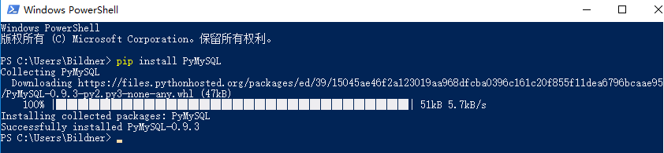
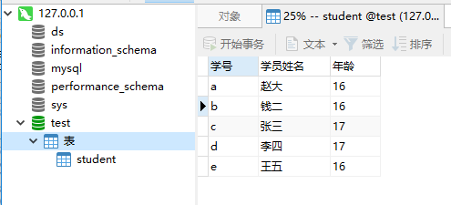
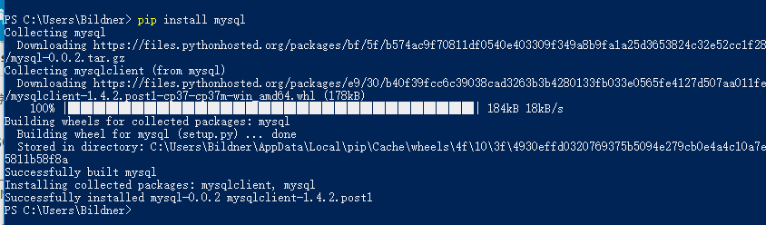

Python连接MySQL数据库方法介绍（超详细！手把手项目案例操作！）
=====================

[TOC]


Python连接MySQL数据库
=============================


> 本文涉及到的开发环境：
>
> - 操作系统 Windows 10
>
> - 数据库 MySQL 8.0
>
> - Python 3.7.2 
> - pip 19.0.3


两种方法进行数据库的连接分别是**PyMySQL**和**mysql.connector**

**步骤**：

1. 连接数据库
2. 生成游标对象
3. 执行SQL语句
4. 关闭游标
5. 关闭连接


PyMySQL
-------

PyMySQL简介

PyMySQL ： 是封装了MySQL驱动的Python驱动，一个能使Python连接到MySQL的库

环境要求：Python version >= 3.4


### PyMySQL安装

**安装**

Win键+X键再按I键，调出Windows PowerShell窗口，输入

```powershell
pip install PyMySQL
```

回车

运行结果如下则安装成功



> pip version ===19.0.3


**查看版本**

查看PyMySQL的版本，输入

```powershell
pip show PyMySQL
```

回车


### 利用PyMySQL连接数据库

首先我们的MySQL数据库已安装，且已建好名为`test`的数据库，其中有名为`student`的表



```python
import pymysql
#连接数据库
conn=pymysql.connect(host  = '127.0.0.1'                   # 连接名称，默认127.0.0.1 
                     ,user = 'root'                        # 用户名
                     ,passwd='password'        			   # 密码
                     ,port= 3306                           # 端口，默认为3306
                     ,db='test'                            # 数据库名称
                     ,charset='utf8'                       # 字符编码
                    )
cur = conn.cursor()								  # 生成游标对象
sql="select * from `student` " 					  # SQL语句
cur.execute(sql)    							  # 执行SQL语句
data = cur.fetchall() 							  # 通过fetchall方法获得数据
for i in data[:2]:								  # 打印输出前2条数据
    print (i)
cur.close() 									  # 关闭游标
conn.close()									  # 关闭连接
```

上述代码中，实现了通过Python连接MySQL查询所有的数据，并输出前2条数据的功能。执行结果如下：

```
('a', '赵大', '16')
('b', '钱二', '16')
```


mysql.connector
---------------


### mysql.connector简介

mysql-connector-python：是MySQL官方的纯Python驱动；


mysql.connector安装

**安装**

```powershell
pip install mysql
```




**查看版本**

```
pip show mysql
```


### 利用 mysql.connector连接数据库

首先我们的MySQL数据库已安装，且已建好名为`test`的数据库，其中有名为`student`的表


```python
import mysql.connector
conn=mysql.connector.connect(host  = '127.0.0.1'  # 连接名称，默认127.0.0.1             
                     ,user = 'root'               # 用户名
                     ,passwd='password'           # 密码
                     ,port= 3306                  # 端口，默认为3306
                     ,db='test'                   # 数据库名称
                     ,charset='utf8'              # 字符编码
                    )
cur = conn.cursor()								  # 生成游标对象
sql="select * from `student` " 					  # SQL语句
cur.execute(sql)    							  # 执行SQL语句
data = cur.fetchall() 							  # 通过fetchall方法获得数据
for i in data[:2]:								  # 打印输出前2条数据
    print (i)
cur.close() 									  # 关闭游标
conn.close()									  # 关闭连接
```
上述代码中，实现了通过Python连接MySQL查询所有的数据，并输出前2条数据的功能。执行结果如下：

```
('a', '赵大', '16')
('b', '钱二', '16')
```


Python对MySql数据库实现增删改查
===============================

接下来我们以用`pymysql`包为例，介绍一下如何用Python对数据库中的数据进行增删改查 。

增
--

```python
import pymysql
#连接数据库
conn=pymysql.connect(host  = '127.0.0.1'                   # 连接名称，默认127.0.0.1 
                     ,user = 'root'                        # 用户名
                     ,passwd='password'        			   # 密码
                     ,port= 3306                           # 端口，默认为3306
                     ,db='test'                            # 数据库名称
                     ,charset='utf8'                       # 字符编码
                    )
cur = conn.cursor()								  # 生成游标对象 
#=============插入语句===============================
sql= "INSERT INTO student VALUES ('p','魏六','17')"
#===================================================
try:
    cur.execute(sql1)   # 执行插入的sql语句
    conn.commit()    # 提交到数据库执行
except:
    coon.rollback()# 如果发生错误则回滚
    
conn.close()    # 关闭数据库连接
```

然后我们再运行查询语句

```python
import mysql.connector
conn=mysql.connector.connect(host  = '127.0.0.1'  # 连接名称，默认127.0.0.1             
                     ,user = 'root'               # 用户名
                     ,passwd='password'           # 密码
                     ,port= 3306                  # 端口，默认为3306
                     ,db='test'                   # 数据库名称
                     ,charset='utf8'              # 字符编码
                    )
cur = conn.cursor()								  # 生成游标对象
sql="select * from `student` " 					  # SQL语句
cur.execute(sql)    							  # 执行SQL语句
data = cur.fetchall() 							  # 通过fetchall方法获得数据
for i in data[:]:								  # 打印输出所有数据
    print (i)
cur.close() 									  # 关闭游标
conn.close()									  # 关闭连接
```

执行结果就是

```
('b', '钱二', '16')
('c', '张三', '17')
('d', '李四', '17')
('e', '王五', '16')
('a', '赵大', '16')
('p', '魏六', '17')
```


删
--

```python
import pymysql
#连接数据库
conn=pymysql.connect(host  = '127.0.0.1'                   # 连接名称，默认127.0.0.1 
                     ,user = 'root'                        # 用户名
                     ,passwd='password'        			   # 密码
                     ,port= 3306                           # 端口，默认为3306
                     ,db='test'                            # 数据库名称
                     ,charset='utf8'                       # 字符编码
                    )
cur = conn.cursor()								  # 生成游标对象 
#=============删除语句===============================
    sql = "DELETE FROM student WHERE `学号`  = "a"
#===================================================
try:
    cur.execute(sql)   # 执行插入的sql语句
    conn.commit()    # 提交到数据库执行
except:
    coon.rollback()# 如果发生错误则回滚
    
conn.close()    # 关闭数据库连接
```


改
--

```python
import pymysql
#连接数据库
conn=pymysql.connect(host  = '127.0.0.1'                   # 连接名称，默认127.0.0.1 
                     ,user = 'root'                        # 用户名
                     ,passwd='password'        			   # 密码
                     ,port= 3306                           # 端口，默认为3306
                     ,db='test'                            # 数据库名称
                     ,charset='utf8'                       # 字符编码
                    )
cur = conn.cursor()								  # 生成游标对象 
#=============删除语句===============================
sql ="UPDATE student SET `学员姓名` = '欧阳' WHERE `学号`  = 'b' "
#===================================================
try:
    cur.execute(sql)   # 执行插入的sql语句
    conn.commit()    # 提交到数据库执行
except:
    coon.rollback()# 如果发生错误则回滚
    
conn.close()    # 关闭数据库连接
```


查
--

```python
import pymysql
#连接数据库
conn=pymysql.connect(host  = '127.0.0.1'                   # 连接名称，默认127.0.0.1 
                     ,user = 'root'                        # 用户名
                     ,passwd='password'        			   # 密码
                     ,port= 3306                           # 端口，默认为3306
                     ,db='test'                            # 数据库名称
                     ,charset='utf8'                       # 字符编码
                    )
cur = conn.cursor()								  # 生成游标对象 
#=============删除语句===============================
sql="select * from `student` " 					  # SQL语句
#====================================================
try:
    cur.execute(sql)   # 执行插入的sql语句
    data = cur.fetchall()
    
    for i in data[:]:								  
        print (i)

    conn.commit()    # 提交到数据库执行
except:
    coon.rollback()# 如果发生错误则回滚
    
conn.close()    # 关闭数据库连接
```


小型案例
========

```python
import pymysql

config = {
    'host': '127.0.0.1',
    'port': 3306,
    'user': 'root',
    'passwd': 'password',
    'charset':'utf8',
    
    }
conn = pymysql.connect(**config)

cursor = conn.cursor()

try:
    # 创建数据库
    DB_NAME = 'test_3'
    cursor.execute('DROP DATABASE IF EXISTS %s' %DB_NAME)
    cursor.execute('CREATE DATABASE IF NOT EXISTS %s' %DB_NAME)
    conn.select_db(DB_NAME)

    #创建表
    TABLE_NAME = 'bankData'
    cursor.execute('CREATE TABLE %s(id int primary key,money  int(30))' %TABLE_NAME)

    # 批量插入纪录
    values = []
    for i in range(20):
        values.append((int(i),int(156*i)))
    cursor.executemany('INSERT INTO bankData values(%s,%s)',values)
    conn.commit()
    # 查询数据条目
    count = cursor.execute('SELECT * FROM %s' %TABLE_NAME)
    print ('total records:{}'.format(cursor.rowcount))

    # 获取表名信息
    desc = cursor.description
    print ("%s %3s" % (desc[0][0], desc[1][0]))

    cursor.scroll(10,mode='absolute')
    results = cursor.fetchall()
    for result in results:
        print (result)

except:
    import traceback
    traceback.print_exc()
    # 发生错误时会滚
    conn.rollback()
finally:
    # 关闭游标连接
    cursor.close()
    # 关闭数据库连接
    conn.close()
```


综合案例
========

FIFA球员信息系统
----------------

```python
from pymysql import *
class Mysqlpython:
    def __init__(self, database='test', host='127.0.0.1', user="root",
                 password='password', port=3306, charset="utf8"):
        self.host = host
        self.user = user
        self.password = password
        self.port = port
        self.database = database 
        self.charset = charset

    # 数据库连接方法:
    def open(self):
        self.db = connect(host=self.host, user=self.user,
                          password=self.password, port=self.port,
                          database=self.database,
                          charset=self.charset)
        # 游标对象
        self.cur = self.db.cursor()

    # 数据库关闭方法:
    def close(self):
        self.cur.close()
        self.db.close()

    # 数据库执行操作方法:
    def Operation(self, sql):
        try:
            self.open()
            self.cur.execute(sql)
            self.db.commit()
            print("ok")
        except Exception as e:
            self.db.rollback()
            print("Failed", e)
        self.close()

    # 数据库查询所有操作方法:
    def Search(self, sql):
        try:
            self.open()
            self.cur.execute(sql)
            result = self.cur.fetchall()
            return result
        except Exception as e:
            print("Failed", e)
        self.close()


def Insert():#如何从外面将数据录入到sql语句中
    ID = int(input("请输入球员编号："))
    people_name = input("请输入球员名字：")
    PAC = int(input("请输入速度评分："))
    DRI = int(input("请输入盘带评分："))
    SHO = int(input("请输入射门评分："))
    DEF = int(input("请输入防守评分："))
    PAS = int(input("请输入传球评分："))
    PHY = int(input("请输入身体评分："))
    score =(PAC+DRI+SHO+DEF+PAS+PHY)/6
    sql_insert = "insert into FIFA(ID, people_name, PAC,DRI,SHO,DEF, PAS, PHY, score) values(%d,'%s',%d,%d,%d,%d,%d,%d,%d)"%(ID, people_name, PAC,DRI,SHO,DEF, PAS, PHY, score)
    print(people_name)
    return  sql_insert

def Project():
    print("球员的能力评分有：")
    list=['速度','盘带','射门','防守','传球','身体','综合']
    print(list)


def Exit():
    print("欢迎下次使用!!!")
    exit()

def Search_choice(num):
    date = Mysqlpython()
    date.open()
    if num=="2":
        # 1.增加操作
        sql_insert = Insert()
        date.Operation(sql_insert)
        print("添加成功！")
        Start()
    elif num=="1":
        # 2.查找数据,其中order by 是为了按什么顺序输出，asc 是升序输出，desc降序输出
        input_date=input("请选择您想要以什么格式输出：默认升序排列1.球员编号，2.速度，3.盘带，4.射门， 5.防守， 6.传球， 7.身体 ， 8.综合 ")
        if input_date=="1":
            sql_search = "select * from FIFA order by ID asc"
        elif input_date=="2":
            sql_search = "select * from FIFA order by PAC asc"
        elif input_date=="3":
            sql_search = "select * from FIFA order by DRI asc"
        elif input_date=="4":
            sql_search = "select * from FIFA order by SHO asc"
        elif input_date=="5":
            sql_search = "select * from FIFA order by DEF asc"
        elif input_date=="6":
            sql_search = "select * from FIFA order by PAS asc"
        elif input_date=="7":
            sql_search = "select * from FIFA order by PHY asc"            
        elif input_date=="8":
            sql_search = "select * from FIFA order by PHY score"           
        else:
            print("请重新输入！")
        result = date.Search(sql_search)
        print(" 编号 姓名 速度 盘带 射门 防守 传球 身体 综合 ")
        for str in result:
            print(str)
        Start()
    elif num=="3":
        Project()
        Start()

    elif num=="4":
        del_num=input("请输入您要删除球员的编号：")
        sql_delete="delete from FIFA where id=%s"%del_num
        date.Operation(sql_delete)
        print("删除成功！")
        Start()
    elif num=="5":
        Exit()
    else:
        print("输入有误，请重新输入！")

def Start():
    print("********************************************************")
    print("*              欢迎来到FIFA球员信息系统                    *")
    print("*1.查看球员信息                          2.球员信息录入   *")
    print("*3.球员能力                                4.删除球员信息   *")
    print("*5.退出系统                                                       *")

    print("********************************************************")
    choice = input("请输入您的选择：")
    Search_choice(choice)

if __name__=="__main__":
    Start()

```


银行转账系统
------------

先建立数据库`test_3`和表`bankdata`

```python
import pymysql

config = {
    'host': '127.0.0.1',
    'port': 3306,
    'user': 'root',
    'passwd': 'password',
    'charset':'utf8',
    
    }
conn = pymysql.connect(**config)

cursor = conn.cursor()

try:
    # 创建数据库
    DB_NAME = 'test_3'
    cursor.execute('DROP DATABASE IF EXISTS %s' %DB_NAME)
    cursor.execute('CREATE DATABASE IF NOT EXISTS %s' %DB_NAME)
    conn.select_db(DB_NAME)

    #创建表
    TABLE_NAME = 'bankData'
    cursor.execute('CREATE TABLE %s(id int primary key,money  int(30))' %TABLE_NAME)

    # 批量插入纪录
    values = []
    for i in range(20):
        values.append((int(i),int(156*i)))
    cursor.executemany('INSERT INTO bankData values(%s,%s)',values)
    conn.commit()
    # 查询数据条目
    count = cursor.execute('SELECT * FROM %s' %TABLE_NAME)
    print ('total records:{}'.format(cursor.rowcount))

    # 获取表名信息
    desc = cursor.description
    print ("%s %3s" % (desc[0][0], desc[1][0]))

    cursor.scroll(10,mode='absolute')
    results = cursor.fetchall()
    for result in results:
        print (result)

except:
    import traceback
    traceback.print_exc()
    # 发生错误时会滚
    conn.rollback()
finally:
    # 关闭游标连接
    cursor.close()
    # 关闭数据库连接
    conn.close()
```

构建系统

```python
import pymysql
class TransferMoney(object):
    # 构造方法
    def __init__(self, conn):
        self.conn = conn
        self.cur = conn.cursor()
    def transfer(self, source_id, target_id, money):
        if not self.check_account_avaialbe(source_id):
            raise  Exception("账户不存在")
        if not self.check_account_avaialbe(target_id):
            raise  Exception("账户不存在")
        if self.has_enough_money(source_id, money):
            try:
                self.reduce_money(source_id, money)
                self.add_money(target_id, money)
            except Exception as e:
                print("转账失败:", e)
                self.conn.rollback()
            else:
                self.conn.commit()
                print("%s给%s转账%s金额成功" % (source_id, target_id, money))
                
    def check_account_avaialbe(self, acc_id):
        """判断帐号是否存在， 传递的参数是银行卡号的id"""
        select_sqli = "select * from bankData where id=%d;" % (acc_id)
        print("execute sql:", select_sqli)
        res_count = self.cur.execute(select_sqli)
        if res_count == 1:
            return True
        else:
            # raise  Exception("账户%s不存在" %(acc_id))
            return False
            
    def has_enough_money(self, acc_id, money):
        """判断acc_id账户上金额> money"""
        # 查找acc_id存储金额?
        select_sqli = "select money from bankData where id=%d;" % (acc_id)
        print("execute sql:", select_sqli)
        self.cur.execute(select_sqli)  # ((1, 500), )
        # 获取查询到的金额钱数;
        acc_money = self.cur.fetchone()[0]
        # 判断
        if acc_money >= money:
            return True
        else:
            return False

    def add_money(self, acc_id, money):
        update_sqli = "update bankData set money=money+%d  where id=%d" % (money, acc_id)
        print("add money:", update_sqli)
        self.cur.execute(update_sqli)

    def reduce_money(self, acc_id, money):
        update_sqli = "update bankData set money=money-%d  where id=%d" % (money, acc_id)
        print("reduce money:", update_sqli)
        self.cur.execute(update_sqli)
    # 析构方法
    def __del__(self):
        self.cur.close()
        self.conn.close()
        
if __name__ == '__main__':
    # 1. 连接数据库，
    conn = pymysql.connect(host  = '127.0.0.1'                   # 连接名称，默认127.0.0.1 
                     ,user = 'root'                        # 用户名
                     ,passwd='password'        			   # 密码
                     ,port= 3306                           # 端口，默认为3306
                     ,db='test_3'                            # 数据库名称
                     ,charset='utf8'
        ,autocommit=True,    # 如果插入数据，自动提交给数据库 
    )
    trans = TransferMoney(conn)   
    trans.transfer(15, 12, 200)	
```


*参考文章：*

1. *[数据库校运会项目](https://blog.csdn.net/weixin_42213622/article/details/86523400)*

   