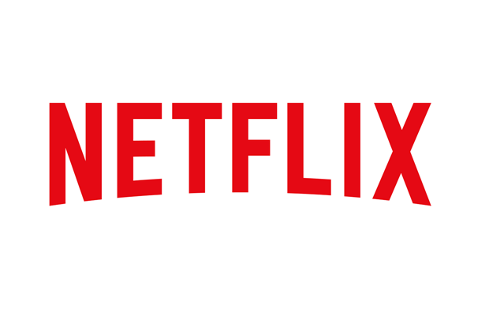

世界顶尖数据科学家采访实录——Netflix算法副总裁
=============================================

*图片来源:http://img5.imgtn.bdimg.com/it/u=2204882180,2780397853&fm=26&gp=0.jpg*

[TOC]

**凯特琳·斯莫尔伍德(Caitlin Smallwood)**是Netlix科学与算法副总裁，Netlix是一家按需互联网媒体提供商，提供电视节目和电影流媒体服务。

Netlix在40多个国家拥有超过100万的用户，并且正在迅速扩张，用户可以在任何时间、任何地点、几乎任何与互联网连接的屏幕上观看他们想看的任何内容，而不需要广告或承诺。

Netlix站在互联网电视的最前沿，并开始开发和制作自己的节目，进一步巩固了其领导地位。随着可用和消费的内容数量快速增长(目前每月有超过10亿小时的电视节目和电影在流媒体上播放)，有效个性化推荐和确保即时内容交付所需的预测引擎和数据基础设施变得越来越复杂。

为了应对Netlix的这些挑战，斯莫尔伍德利用她在实验、分析和推荐方面的广泛技术专长，这些都是她在20多年互联网数据产品经验中积累的。她之前还在Netlix担任过多个职位，最近担任消费者科学与分析总监，并在普华永道(PwC)担任分析顾问。她拥有斯坦福大学运筹学硕士学位和威廉玛丽学院数学学士学位。

斯莫尔伍德的职业生涯跨越了大数据、分析、实验和建议的发展历程，从互联网的萌芽阶段，一直到我们今天生活的这个不断互联、数据丰富的世界。当她分享她对互联网出现之前的分析的想法，以及她在雅虎第一次遇到海量数据时的兴奋之情时，她非凡的视角就显现出来了。以及她在Netlix的第一组数据集，以及她对数据中心组织中文化和团队的重要性的看法。斯莫尔伍德的采访充满智慧、经验和领导力。

在Netflix工作是怎样的体验？
===========================

在很多层面上，这都是一次扣人心弦、激动人心的经历。虽然我很幸运能在很多很棒的地方工作，但我在Netflix非常开心。就使命而言，该公司正在改变电视业务。互联网电视的诞生是令人着迷的，参与其中是一件很棒的事情。聪明的人，我喜欢在我们这样的文化中工作。我们有一个名为“Netflix文化:自由与责任”的公共文化文件，发布在我们的招聘网站上，它定义了我们的核心价值观。最重要的是，这种文化实际上就是你在文档中读到的。它真的是。从你面试的那一刻就能看出来。身处一个自由自在、才华横溢的地方是一件很有力量的事情，你可以参与其中。从个人和职业上来说，在这种文化中工作是很好的收获。就数据而言，身处数据的世界，并在Netflix这样的公司工作是非常出色的，因为在整个公司，从高管到底层，数据都被放在非常重要的位置。这种观点使处理数据的任何方面都成为一种享受，无论是数据工程、分析还是更核心的数学建模。这很好，因为你不用为诸如“我们能捕捉到这种数据吗?”或者，“会不会有人花精力来构建我们真正想要做伟大事情的数据?”“让人们相信这些项目很重要并不难。然后有这么多的辩论和公众分享数据和结果，这让它真的很令人兴奋。

驱动数据文化，在您加入时它是否存在?
===================================

我刚来的时候，数据文化就已经存在了，而且还在不断加强。至于谁在驱动它，我想说没有一个人或组织。这是一个集体的努力。你会看到它是如何激励每一个人参与其中的，所以它只是在自我满足。也就是说，我们的首席执行官里德·哈斯廷斯(Reed Hastings)是我们拥有如此强大的数据文化的一个重要原因。他相信因果关系比相关性更重要，而且在做出决策时，他非常擅长使用尽可能多的数据，而不仅仅是判断。当然，良好的判断是重要的，但试图用数据和分析来支持事物一直是他的一个信念，而且它只是从那里传播开来。

最近一年您在做什么？
====================

这是一家生产效率如此之高的公司，因为它的流程水平很低。这意味着我们在一年内完成了大量的工作，所以我将快速地列出去年我们一直在做的一些事情。我们在个性化算法、推荐系统和算法方面做了很多工作，这是一个不断优化的领域。这是一笔很大的投资，因为我们一直在努力改进。

我们还在研究搜索，因为这是Netflix产品中一个非常有趣的领域。我们一直在努力使搜索体验对人们来说非常灵活。例如，使用搜索自动完成功能，当你输入字母A时，我们会根据你的历史和Netflix的用户数量立即知道你在搜索什么电影或电视剧。

我们已经在产品方面形成了一种大的实验文化，现在我们正试图把同样的严格程度带到业务的其他部分，比如我们的营销组织和Netflix的其他部分。这很有趣，因为组织的其他部分对决策和探索想法有不同的思维方式和方法。这对我们来说是一个很大的领域。

我们真正关注的一个关键的内部问题是小型、灵活的用户界面，让人们可以探索模型的输出，这样就不会很难访问了。例如，我们的排名算法会向你展示Netflix中所有游戏的排名?我们能把它作为内部工具展示给你们吗?这种类型的工具有助于更快地进行创新，因为这样Netflix的每个人都可以访问模型输出来学习和理解它们。然后这就会让他们思考他们可能在做什么。因此，我们一直在努力以更多人可以利用的方式，公开这些复杂模型的更多输出。

当您来到Netflix，您使用的第一个数据集是什么?
============================================

我研究的第一个数据，大约四年前，是我们的视图数据，这是我们最大的数据。那时，我的角色与现在略有不同。它比现在更倾向于数据工程方面。该项目包括对查看数据及其背后的数据工程的全面检查。在这一点上,尽管数据比现在小得多,我们可以看到我们的轨迹,我们知道我们需要重新设计。

该项目包括理解我们在日志级别收集的所有数据及其包含的内容。

这个数据集包括每个流的每个段，每个比特率。所以当你在看电影的时候，比特率在快速变化，我们为你提供很多很多的数据流，这些数据流汇聚在一起形成了一个你所看到的客户视图。所以，这只是大量的数据。我们还收集您采取的每一个动作，如暂停、重放和您正在观看的比特率。这个数据集还包括带宽变化、网络拥塞、重新缓冲事件，或者在您试图查看服务上的某些内容时可能发生的任何其他事件。正如你所能想象的，这个体积和细节使事情既令人畏惧又有趣。

互联网娱乐作为一个行业有点难以定义。该行业目前面临的主要问题有哪些?
===================================================================

你是对的，我们很难准确地定位我们的行业——即使我们在内部拿它开玩笑。如果你在我们比弗利山庄的办公室，你会觉得自己在为一家娱乐公司工作。但如果你在我们洛斯加托斯的总部，你会觉得自己在为一家互联网技术公司工作。我们真的都是。

我想说，人们试图解决的关键问题是**消费者想看什么**，**他们想怎么看**?人们看电视的方式是一个大问题，因为现在有更多的选择。netflix和其他公司正在提供的产品具有很大的灵活性，因此我们必须找到最适合消费者的设置方式，这一点非常重要。例如，有很多关于Netflix和人们如何观看网络娱乐的公开文章。这些文章关注的是狂看，这是否是一件好事，人们是否喜欢这样。

有趣的是，有几个人告诉我，他们每次都要取消Netflix几个月，因为他们觉得自己周末是在沙发上度过的。所以他们自律，取消了Netflix几个月的服务，打算晚些时候再回来。你可以看到这是一个艰难的领域，因为在观看方式和时间上提供更多的选择和灵活性，导致一些人取消了几个月的账户。

另一个问题是决定人们想看什么。我们在广播电视中看到了整个向真人秀的转变。而且，就像互联网上的其他东西一样，来自世界各地的内容变得更容易访问，所以现在你可以在观看的内容上有更多的选择和灵活性。有了人们可以观看的所有这些新类型的东西，我们很难在未来提供他们真正想要的东西。在一个行业和公司层面，我们必须弄清楚我们应该把重点放在哪里，以便为我们的客户和他们的观看选择提供最好的服务。

广播电视和其他玩家也在考虑同样的事情。每个人都非常关注应该开发什么样的内容。例如，人们使用的序列化编程要比电影多得多。这是否意味着他们更喜欢连续剧而不是电影?或者他们更喜欢混合物?所以有很多模糊的东西是我们真正想要理解的。

在使用数据方面，您最大的改变是什么?
===================================

毫无疑问，这是A/B测试。许多年前，当我第一次以“web分析”的身份接触到它时，我对它并没有多少敬意。对我来说，这似乎非常直接和老套。直到我来到Netflix，我才真正体会到它的力量。让我感兴趣的是，人们的直觉经常是错误的，即使你是某个领域的专家。即使你在一个领域有很多领域和背景，你回答任何一个问题的直觉有时仍然是错误的。

同样，对于预测模型，当AUC为0.75时，我们会感到兴奋。我们会说，“哦，我的天哪!那是个很棒的模型!“但很多时候，它仍然是错误的，只有通过实验，你才能真正对某件事有一个因果关系。”它是如此有趣和迷人的观看。我们可以在Netflix做这两件事:我们可以开发替代算法，然后我们可以测试它。我们可能一开始会想，“这个算法会比我们以前的算法好得多!”它有一个惊人的AUC。“或者不管我们离线测量什么，也许MRR(意思是倒数排名)。然后我们对模型进行测试，结果却比之前的模型更糟。将会有一个又一个令人惊讶的结果。对我来说，获得真正的因果关系的力量完全震撼了我对数据的思考。

我们确实尝试着去寻找我们在测试中学到的东西的主题，但是重点是我们还可以在哪里做我们还没有做的测试。我们希望在内容空间中进行测试，以了解对客户最重要的标题和目录组成的更多信息，但我们不想测试对客户来说是负面体验的东西。所以我们没有，也不会这么做。我们讨论过一些最简单的实验，比如，“如果我们从图书馆里拿出一个书名，试着看看我们是否能衡量它的影响，结果会怎样?”“尽管如此，我们不仅与电影公司有合同协议，而且我们也不想降低客户的体验。但我们总是在考虑，我们是否可以在内容空间中进行试验，以帮助做出这些决定。

数据科学的未来会是什么样子?
===========================

我认为它会继续**爆炸性传播**，并且会变得无处不在。

我认为模型、算法和更深层次的数据科学也是如此。这些技术已经很了不起了，而且还会继续改进。即使在我们今天所处的位置，它们也随着数学的深度和复杂程度以及各种不同的技术而发生了惊人的变化。这是因为有这么多的数据，让人们可以真正研究不同的细微差别的技术。所以我认为这些技术将继续传播开来。对数据科学来说，更具挑战性的是要意识到这么多不同的技术，善于用正确的技术来表述问题，而不是滥用这些技术。

我认为也会有一些危险。我认为开发不好的模型是很容易的，因为开源的可用性，编程这些技术是多么容易，还有大量复杂的技术。开发不好的模型已经很容易了，不幸的是，我认为这将变得更加容易。

我认为这是真的，特别是对于那些试图建立一个数据科学团队的公司来说，他们以前没有这样的团队。我认为这对他们来说有点危险。雇佣一个建立了回归模型并在面试中使用“支持向量机”等花哨术语的人会非常容易，高管们会说:“哇!进来建立我们的数据科学团队。“对于这些公司来说，无法衡量他们雇佣的人是否知道他们在做什么，因为一个好的模式和一个坏的模式仍然是一个模式。它们都给出了相同类型的结果，并且您可以确定这是否是一个好结果，但是不可能真正知道它是否是一个好模型。

在我看来，关键在于构建这些模型的人的素质，我认为，缺乏经验的公司将很难发现这一点。

您最喜欢数据科学的什么?
=======================

我喜欢它的地方在于它非常有**创意**和**创新性**。

如果有人刚刚涉足这个领域，那就来吧，可以学得更多，因为这是一个迷人的领域。

如果你想，“哦，这只是一个无聊的数学领域，”那就完全不是。

它极具**挑战性**和**创造性**。这些年来，这一直让我感到惊讶，现在仍然如此。你在其中的时间越长，它就会变得越来越有创造力，因为你有更多的工具可以使用，在不同的时间，你对数据有更多的直觉，不管是对的还是错的。

所以随着时间的推移，它会变得更加令人兴奋和有创意。