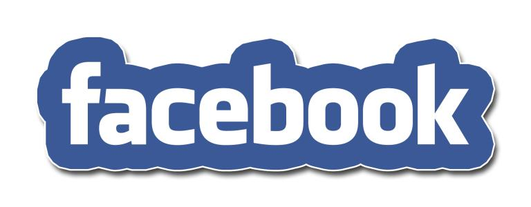

世界顶尖数据科学家采访实录——Facebook人工智能研究总监
====================================================

[TOC]

受访者简介
==========

Yann LeCun是全球最大社交网站Facebook的人工智能研究总监。

Facebook的核心业务是促进人与人之间、人与人与数字世界之间的沟通。考虑到涉及的数据规模之大，支持这项任务所需的技术是巨大的。截至2014年，Facebook拥有超过13亿的活跃用户(彼此之间的连接超过1500亿)和8.29亿的每日独立登录。这些用户平均每天上传约3.5亿张照片，分享约47.5亿项内容，发送约100亿条信息。这些流数据集的可用性是如此之大，以至于在大多数情况下，Facebook的系统只有一次时间查看任何数据。这样的活动水平带来了一系列独特的挑战:如何最好地理解和理解所有的数据，以及如何使用这种信息关联来做出决策

在加入Facebook之前，LeCun是纽约大学计算机科学、神经科学、电子和计算机工程的银牌教授，现在仍然是纽约大学数据科学中心的创始主任。

在多伦多发展理论后，他加入了美国电话电报公司贝尔Laage处理研究部门。2003年加入纽约大学。在他迄今为止的职业生涯中，他发表了180多篇关于机器学习、计算机视觉、笔迹识别、图像处理和压缩以及神经网络作品的技术论文和书籍章节。他尤其以他在深度学习方法方面的工作而闻名，这些方法被公司用来理解图像、视频、文档、人机交互和语音。

LeCun是一个无与伦比的数据科学家的例子，他有一个转型的愿景——在他的例子中，使用深度学习来教机器感知世界——他努力在学术和工业研究实验室实现这一愿景。 LeCun的采访证明了他对机器学习的热情和对未来的信念。

您的工作职责是什么？
====================

我是Facebook的人工智能研究总监。

这个角色的一部分涉及到数据科学，尽管Facebook也有其他团队在做数据科学。如果你愿意，人工智能研究可以被认为是数据科学更先进的一面。我也是纽约大学的兼职教授，就在我的Facebook实验室对面。虽然我现在是一名大学教授，但我的大部分职业生涯都是在工业研究方面。

早些时候，我在贝尔实验室的一个小组里工作，当时，这个小组致力于机器学习，神经网络和类似的项目。然后我成为AT&T实验室的部门主管，这是AT&T在1996年公司分裂后的研究实验室的名字。我2003年加入纽约大学，所以我在这里已经11年多一点。我是在2013年底加入Facebook的。

您的职业生涯是如何形成的？
==========================

- **兴趣导向**

虽然在我工作过的机构方面没有明确的途径，但在我感兴趣的技术问题方面有明确的路径。事实上，我感兴趣的是相当恒定的，除了很短的时间。我从小就对人工智能和相关学科非常着迷。上世纪70年代末至80年代初，我读本科时学的是电气工程。在这段时间里，我做了很多项目，试图弄清楚我们是否能让机器学习。我一直坚信，制造智能机器的唯一方法就是学习，因为每一种动物都有学习的能力。任何有大脑的东西都能学习。

我通过搜索文献来解决这个问题，寻找能够学习的机器，并意识到，至少在20世纪80年代初，没有人在研究这类问题。我唯一能找到的文献是20世纪60年代的，有些是70年代的，但大部分是60年代的。这是上世纪50年代神经网络1.0版的旧作。像百分率加速器和其他类似的技术然后是1970年代早期的统计模式识别文献。但当我开始对这个研究领域感兴趣时，这个领域已经被研究团体所抛弃了。这段时间有时被称为“神经网络的寒冬”。

我毕业了——尽管我的专业实际上不是机器学习，因为那时还没有机器学习这种东西。事实上，在那个时候的法国，甚至还没有计算机科学。我毕业的专业是VLSI集成电路设计和自动控制。大学毕业后，我上了研究生院。不幸的是，我很难找到对我想做的事情感兴趣的人，因为我已经确切地知道我想做什么。当我还在读本科的时候，我就已经意识到，早在上世纪60年代，人们一直在追求的东西，却永远无法解决，基本上就是多层神经网络和深度学习的概念。

- **研究算法**

也许在我读研究生的两年前，我开始尝试各种算法。我提出了一个最终成为我们现在所说的反向传播算法的东西——我们每天在Facebook上都在非常非常大规模地使用它——独立于David Rumelhart, Paul Werbos, David Parker, Geoff Hinton和其他人。我很难找到研究生院的高年级学生来帮助我，因为这个领域已经被遗弃了。

幸运的是，我有一个很好的顾问，莫里斯·米尔格拉姆，我有自己的资金，基本上是独立于我的顾问的。我的导师很好，他对我所做的一切都不感兴趣，他基本上告诉我，他会签署这份文件，因为我看起来很聪明，但他帮不了我。

最初是什么激发了您对人工智能的兴趣?
===================================

- **家庭熏陶**

我出生于1960年。在我九岁的时候，火箭飞上了太空，人类登上了月球，《2001太空漫游》问世了，里面有太空和智能电脑。科幻小说是那个时代的精神。我一直对科学感兴趣。当我还是个孩子的时候，我想，也希望我能成为一名科学家。在天体物理学、古生物学、神经科学或人工智能之间，我犹豫了——不幸的是，没有犹豫很长时间。但我确实是个工程师。这是我爸爸给我的，他是个机械工程师，我喜欢做东西。

所以当我想到做科学的时候，我想到的是:我们这个时代最大的科学问题是什么?

一个问题是:宇宙是由什么构成的?天体物理学和基础物理学试图回答这个问题。

另一个问题是:生活是关于什么的?哪一种生物学，等等。

另一个问题是:大脑是如何工作的?这个问题是一个很大的科学谜团。

如果你是一名年轻的科学家，还没有意识到自己的局限性，那就去做大事吧。理解智力是一个很大的问题。

作为一名工程师，我认为大脑是一个非常复杂的系统。

- **好奇心**

智能是一种非常抽象的东西，它可能可以用数学方法来建模，所以我们可以用工程学的方法来弄清楚大脑是如何工作的，通过尝试建造智能机器来验证我们的设计或概念想法。关于大脑是如何工作的，已经说了很多，有些非常抽象。但是在你建立一个真正有效的系统之前，你怎么知道他们是正确的呢?所以至少你有了大部分必要的成分。这就是我感兴趣的科学问题。

当然，我不仅要满足我建造东西的欲望，我还必须找到工作，在那里我可以开发好的技术和做伟大的工作。这对我来说很奇怪，但我从来都不清楚我是否会成为一名学者。我

做过——也许我应该早点做——但长期以来，行业研究对我来说是一种完美的环境。所以我现在又回到这个话题上了，尽管我也涉足学术界，我发现这两个世界在这方面是互补的。所以我处在一个非常优越的环境中，我可以在工业上有1.5英尺，在学术上有0.5英尺，这让我可以利用两者之间的互补。在学术界，你可以做像计算神经科学和理论这样的事情，而在工业界，你可以做一些在学术界很难做到的雄心勃勃的事情。

您使用的第一个数据集是什么?
===========================

- **医疗数据集**

我研究的第一个真实数据集是我在做博士研究时使用的医疗数据集，数据集来自于对因腹痛来到急诊室的病人进行的医学研究。事实证明，仅仅根据腹痛来决定是否手术是一个非常困难的诊断。根据腹痛，你可以做出大约20种不同的基本诊断。有些诊断需要非常快的手术，比如阑尾炎。所以当时有一个相当大的数据集，有成千上万的样本，有对病人的基本描述，有缺失的值，诸如此类的东西，你会预料到的。

- **神经网络方法**

我采访过的收集这些数据的人都尝试过朴素贝叶斯和类似的方法。我尝试了神经网络。神经网络还不存在，但我基本上尝试了这个新奇的东西——反向传播——我得到了一些相当不错的结果。这帮助我想出的想法裁剪系统的体系结构,它将能够识别症状,这样的事情,这是集合的症状,以减少系统中的自由参数的数量,因为我们知道,甚至在1986年,当时,过度拟合是一个大问题。

未来的数据科学领域会是什么样子?
===============================

- **数据指数增长**

关于数据科学的未来，我经常说的是，需要注意的最重要的一点是，收集和存储的数据量呈指数级增长。它要么以通信网络带宽增长的速度增长，要么以硬盘容量增长的速度增长。它总是两者之一，这取决于它是流数据还是存储数据。这是一个非常大的指数。目前，当你试图从数据中提取知识边缘时，循环中有人类。地球上人类脑力的数量实际上也在呈指数增长，但是指数非常非常小。与数据增长率相比，增长速度非常慢。

这意味着，不可避免的是——事实上，这种情况已经发生了——地球上已经没有足够的脑细胞去观察或浏览这些数据，更不用说分析数据并从中提取知识了。所以很明显，未来世界上的大部分知识都将被机器提取出来，并将驻留在机器中。实际上可能已经是这样了，这取决于你对知识的定义。对我来说，知识是一些数据的汇编，使你能够做出决定，而我们今天所发现的是，计算机正在自动做出许多决定。这在未来不会有任何改善。

- **成为一种时尚**

如果我们看数据科学的未来,数据科学是不会消失的,科学和现有的工程在从数据中提取知识将是一个未来的大事情,社会要依靠。在某种程度上已经是这样了。网络已经依赖于此。但整个社会都将依赖于此。所以这不是一时的流行;它不会消失。如果你说数据科学是一种时尚，就像你在1962年说计算机科学是一种时尚一样。看看我们现在的处境。

因此，我对这一现象的看法是，它将创造——当然，它创造了一个我们都知道的产业——对这一领域受过教育的人的需求。这也创造了一种学术学科的需要来处理这个问题。这一点有些人还没有完全理解。例如，如果你是一名统计学家，你会说，“嗯，那只是统计。如果你是一个机器学习的人，你会说，“嗯，那就是机器学习。”如果你是一个数据库人员，你会说，“嗯，那只是一个数据库，上面有一些机器学习和统计数据。”如果你是一个应用数学的人，你会说，“所有这些技术和方法都使用了应用数学。”

所有这些人都错了。它是所有这些东西组合成一个系统:统计、应用数学、计算、基础设施和应用领域，这些都是那些方法可以应用的东西，需要专业知识。因此，像深度学习这样的技术可以让我们减少或最小化处理新问题所需的人类专业技能，这样机器就可以尽可能地自己完成任务。当然，在这一点上，总是有人参与其中。像数据可视化这样的东西使得人们可以很容易地做这样的事情，只要循环中还有人。然而，最终，这些模型将从本质上自行构建。

- **新兴学科**

我坚信数据科学是一门新兴的学科。在纽约大学，我们帮助开创了这一趋势，因为我们很早就创建了一个数据科学中心。我们也很早就创立了数据科学硕士学位，这是一个巨大的成功。我们得到了摩尔-斯隆数据科学环境倡议的大力支持，这是摩尔和斯隆基金会的一个大型项目。该计划将纽约大学、华盛顿大学和加州大学伯克利分校联合起来，目的是将数据科学确立为科学的一门学科。

您对数据科学的新人有什么建议么？
================================

我总是给同样的建议，因为我经常被问到这个问题。

- **学习数学和物理的课程**

我的观点是，如果你是一名本科生，学习一门专业，你可以选修尽可能多的数学和物理课程。不幸的是，它必须是正确的课程。我要说的可能听起来有些矛盾，但工程学或物理学专业可能比数学、计算机科学或经济学专业更合适。

- **学习编程**

当然，你需要学习编程，所以你需要上大量的计算机科学课程来学习如何编程的机制。然后，再做一个数据科学的研究生项目。参加本科阶段的机器学习、人工智能或计算机视觉课程，因为你需要接触这些技术。然后，在那之后，参加所有你能参加的数学和物理课程。尤其是像优化这样的连续应用数学课程，因为它们让你为真正的挑战做好准备。

您认为数据科学的最大机遇在哪里?
===============================

- **社会科学领域**
- **深度学习方法**

如果你是一名实验科学领域的科学家，尤其是社会科学领域的科学家，我认为在数据科学的方法领域和领域科学之间存在着大量的机会。这将给很多科学领域带来革命性的变化，所以这是一个非常令人兴奋的地方，尤其是在社会科学领域。其他领域，如基因组学和生物学，已经先行一步。

而社会科学，是一个充满机遇的大领域。如果人们刚刚开始，我建议他们去寻找一些有趣的、令人兴奋的大问题来解决。当然，如果你对方法感兴趣，深度学习才是关键。

*翻译整理自 《Data Scientists at Work》 一书*