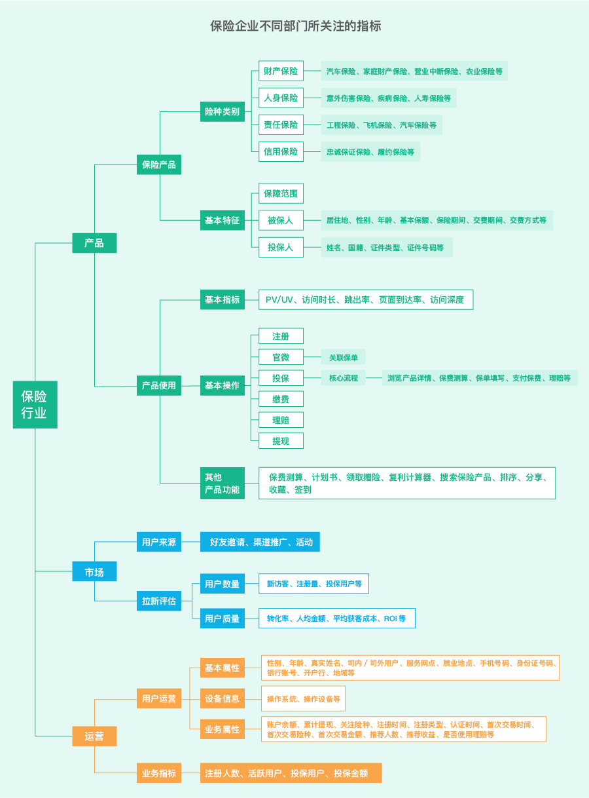

项目案例之决策树在保险行业的应用
================================

[TOC]

> 前提知识基础：
>
> 1. 信息熵
> 2. 信息增益
> 3. 信息增益比
> 4. 决策树基本介绍
> 5. 决策树原理介绍
>    1. ID3算法
>    2. C4.5算法
>    3. CART树
> 6. 决策树应用基础
> 7. 分类模型的性能度量
>    1. 混淆矩阵
>    2. ROC曲线
>    3. AUC面积
> 8. 模型选择
>    1. 交叉验证
>    2. 超参数调参
> 9. 对于保险行业的认知


业务背景——保险行业
==================

业务环境
--------

- 宏观

中国是世界第二大保险市场,但在保险密度上与世界平均水平仍有明显差距

- 业界

保险行业2018年保费规模为38万亿,同比增长不足4%,过去“短平快“的发展模式已经不能适应新时代的行业发展需求,行业及用户长期存在难以解决的痛点,限制了行业发展发展环境。

- 社会

互联网经济的发展,为保险行业带来了增量市场,同时随着网民规模的扩大,用户的行为习惯已发生转变,这些都需要互联网的方式进行触达。

保险科技:当前沿科技不断应用于保险行业,互联网保险的概念将会与保险科技概念高度融合。


*(资料来源: 艾瑞研究院自主研究及绘制C2019.6 iResearch www.iresearch.com.cn)*

**中国保险市场持续高速增长。**根据银保监会数据，2011~2018年，全国保费收入从1.4万亿增长至3.8万亿，年复合增长率17.2%。2014年，中国保费收入突破2万亿，成为全球仅次于美国、日本的第三大新兴保险市场市场；2016年，中国整体保费收入突破3万亿，超过日本，成为全球第二大保险市场；2019年，中国保费收入有望突破4万亿。


发展现状
--------

- 概览

受保险行业结构转型时期影响,互联网保险整体发展受阻,2018年行业保费收入为1889亿元,
较去年基本持平,不同险种发展呈现分化格局,其中健康险增长迅猛,2018年同比增长108%,主要
由短期医疗险驱动

- 格局

供给端专业互联网保险公司增长迅速,但过高的固定成本及渠道费用使得其盈利问题凸显,加
发展现状强自营渠道建设及科技输出是未来的破局方法,渠道端形成第三方平台为主,官网为辅的格局,第三
方平台逐渐发展出B2C、B2A、B2B2C等多种创新业务模式。

- 模式

互联网保险不仅仅局限于渠道创新,其核心优势同样体现在产品设计的创新和服务体验的提升
竟合格局:随着入局企业増增多,流量争夺更加激烈,最终保险公司与第三方平台深度合作将成为常态
发展趋势


发展趋势
--------

- 竞合格局

随着入局企业增多，流量争夺更加激烈，最终保险公司与第三方平台深度合作将成为常态。
发展趋势

- 保险科技 

当前沿科技不断应用于保险行业，互联网保险的概念将会与保险科技概念高度融合。


衡量指标
--------



*图片来源：《聚焦客户体验，数据驱动重塑保险行业》白皮书*


业务目标
--------

**针对保险公司的健康险产品的用户，制作用户画像，然后进行精准保险营销。**


数据分析
========

分析流程框架
------------


本次案例的数据数据的字段含义如下


导入数据
--------

（**特殊原因，无法分享数据**）

```python
import pandas as pd
df = pd.read_csv(r'data.csv', sep=',', header = 0)
df.shape
```

```
(5000000, 50)
```

在这里我们可以看到我们的数据是有5000000条记录和19个特征


数据探索性分析
--------------

### 描述性统计

在我们正式建模型之前，我们需要对我们的数据进行描述性统计，这样我们就能知道整个数据的大致分布是什么样的，做到心里有数，然后能够数据大致的全貌有一定的了解。

```python
type_0=df.dtypes
type_0.to_excel( 'original.xlsx')

#将 KBM_INDV_ID 的int64转化为object
df['KBM_INDV_ID']=df['KBM_INDV_ID'].astype('object')

describe=df.describe().T
type(describe)
describe.to_excel( '../output/describe_var.xlsx')

# 引入画图模块
import seaborn as sns
import matplotlib.pyplot as plt
import numpy as np
# 为分类型变量:所处区的大小，创建直方图

plt.subplot(1, 2, 1)
sns.countplot(x='N2NCY', hue='resp_flag', data=df); #设置 x,y 以及颜色控制的变量,以及画图的数据
plt.xlabel('N2NCY');
plt.ylabel('Frequency');

#了解因变量的分布
Resp_count=df['KBM_INDV_ID'].groupby(df['resp_flag']).count()
print(Resp_count)
str(round(Resp_count[1]/len(df)*100,2))+str('%') #查看购买了
```


从这个图片我们可以看到，买了保险的用户和未买保险的人所处县的情况。


### 缺失值处理

我们需要对数据进行缺失值检查，先对每一条记录查看是否有缺失，然后查看一下每一个特征是否有缺失，然后进行相应的缺失值处理。

```python
Next Step：
# 检查是否有缺失的行
df.shape[0]-df.dropna().shape[0] ###

# 检查是否有缺失的列
len(df.columns)-df.dropna(axis =1).shape[1] #626

NA=df.isnull().sum()
print('orginal NA=',NA)
NA=NA.reset_index()

NA.columns=['Var','NA_count']

NA=NA[NA.NA_count>0].reset_index(drop=True)
print(NA)
NA.to_excel( '../output/var_incl_na.xls',index=False)

####处理缺失值
var_char_na=[]
# 我们对连续型数据进行中位数填补，然后对离散型数据进行特殊值填补，我们这里利用的是N
for i in range(len(NA)):
    if NA['NA_count'][i]/len(df)>0.75 or len(df[NA['Var'][i]].unique())<=2 :
        del df[NA['Var'][i]]
    elif  df[NA['Var'][i]].dtypes!="object":
        # 填充缺失值-中位数
        for_na_value = df[NA['Var'][i]].quantile(0.5)
        # for_na_value
        df[NA['Var'][i]] = df[NA['Var'][i]].fillna(for_na_value)
    elif df[NA['Var'][i]].dtypes=="object" and len(df[NA['Var'][i]].unique())<=3:
        df[NA['Var'][i]] = df[NA['Var'][i]].fillna('N', inplace=True)
    else:
        var_char_na.append(NA['Var'][i])
var_char_na
```


### 处理分类型变量

```python
#Drop Variables that are not necessary
drop_list=['STATE_NAME','KBM_INDV_ID']

for var in drop_list:
    del df[var]


## 检查数据集中数值型变量和字符型变量
var_num = []
var_char_uniq2 = []
var_char_mul= []
for var in list(df):
    if df[var].dtypes=="object" and len(df[var].unique())>2:
        var_char_mul.append(var)
    elif  df[var].dtypes!="object"  :
        var_num.append(var)
    else:
        var_char_uniq2.append(var)


##处理多值型字符变量
for var in var_char_mul:
    
    temp= pd.get_dummies(df[var], prefix=var, prefix_sep='_')
    print(temp)
    for var2 in list(temp):
        if var2 in '_nan':
            del temp[var2]
    del df[var]
    df = pd.concat([df,temp], axis=1)
del temp
len(df.columns) ##88
df.head(5)
df.to_excel( '../output/data.xls',index=False)


##处理二值型的字符变量

import numpy as np
from sklearn.preprocessing import LabelEncoder
def integer_encode(var):
    values = np.array(df[var])
    label_encoder = LabelEncoder()
    df[var] = label_encoder.fit_transform(values)

for var in var_char_uniq2:
    if len(df[var].unique())<2:
        del df[var]
    else: integer_encode(var)
```


建模
----

当我们发现，我们的数据中分类变量比较多，我们尝试采取决策树进行建模，

具体理由：我们做出来的模型需要指导业务人员进行使用，那么要求做出来的模型的可解释要高，而决策树模型的解释性就很强，那么业务人员理解起来就会很容易，那么之后进行应用就不用再专门进行对业务人员的培训，直接让他按照模型做出来的结果进行后续的业务，会提升效率。

```python
# 引用sklearn 模块
from sklearn import tree
from sklearn.model_selection  import train_test_split
from sklearn.metrics import classification_report
#from sklearn import cross_validation, metrics
from sklearn import metrics
from sklearn.model_selection import cross_val_score
#from sklearn.grid_search import GridSearchCV
from sklearn.model_selection import GridSearchCV
import matplotlib.pylab as plt
from matplotlib.pylab import rcParams
rcParams['figure.figsize'] = 12, 4
```

```python
##在模型样本内将数据集7：3分，70%用来建模，30%用来测试

# 定义特征变量和目标变量
features= list(df.columns[1:]) 
X = df[features]
y = df['resp_flag']
# 将数据集7：3分，70%用来建模，30%用来测试
X_train, X_test, y_train, y_test = train_test_split(X, y, test_size=.3)
```

```python
clf = tree.DecisionTreeClassifier()

param_test={'min_samples_leaf':list(range(1000,6000,100)),'min_samples_split':list(range(4000,6000,100))}
gsearch = GridSearchCV(estimator=clf,
                       param_grid = param_test, scoring='roc_auc',n_jobs=1,iid=False, cv=5)
gsearch.fit(X_train,y_train)
#gsearch.grid_scores_, gsearch.best_params_, gsearch.best_score_
gsearch.cv_results_, gsearch.best_params_, gsearch.best_score_
```

验证输出结果
------------

```python
clf = tree.DecisionTreeClassifier(
            class_weight=None, 
            criterion='gini',
            max_features=None,
            max_leaf_nodes=8,
            min_samples_leaf=2000,
            min_samples_split=5000,
            min_weight_fraction_leaf=0.0, 
            splitter='best' )
results=modelfit(clf, X_train, y_train, X_test,y_test)
```

画出决策树
----------

```python
import os
import pydotplus
from IPython.display import Image
from sklearn.externals.six import StringIO
#os.environ["PATH"] += os.pathsep + 'C:/Users/yacao/Downloads/graphviz-2.38/release/bin'

dot_data = StringIO()
tree.export_graphviz(clf,                             #决策树分类器
                     out_file = dot_data)
```


输出规则
--------

```
 if (df['meda'][i] <= 56.5 ):
     if (df['age'][i] <= 70.5 ):
         if (df['c210hva'][i] <= 312.5 ):
             if (df['ilor'][i] <= 10.5 ):
                 temp=11
                 segment.append(temp)
             else:
                 temp=12
                 segment.append(temp)
             
         else:
             temp=8
             segment.append(temp)
         
     else:
         if (df['tins'][i] <= 5.5 ):
             temp=9
             segment.append(temp)
         else:
             temp=10
             segment.append(temp)
         
     
 else:
     if (df['pdpe'][i] <= 46.5 ):
         if (df['MOBPLUS_M'][i] <= 0.5 ):
             temp=13
             segment.append(temp)
         else:
             temp=14
             segment.append(temp)
         
     else:
         temp=4
         segment.append(temp)
```


业务应用
========

我们来看一下购买比例最高的两类客户的特征是什么：

第一类：

- 处于医疗险覆盖率比例较低区域
- 居住年限小于7年
- 65-72岁群体

那么我们对业务人员进行建议的时候就是，建议他们在医疗险覆盖率比例较低的区域进行宣传推广，然后重点关注那些刚到该区域且年龄65岁以上的老人，向这些人群进行保险营销，成功率应该会更高。

第二类：

- 处于医疗险覆盖率比例较低区域
- 居住年限大于7年
- 居住房屋价值较高

这一类人群，是区域内常住的高端小区的用户。这些人群也同样是我们需要重点进行保险营销的对象。

除此之外，我们还可以做什么呢？

**了解客户需求**

我们需要了解客户的需求，并根据客户的需求举行保险营销。PIOS数据：向客户推荐产品，并利用个人的数据（个人特征）向客户推荐保险产品。旅行者：根据他们自己的数据（家庭数据），生活阶段信息推荐的是财务保险、人寿保险、保险、旧保险和用户教育保险。外部数据、资产保险和人寿保险都提供给高层人士，利用外部数据，我们可以改进保险产品的管理，增加投资的收益和收益。

**开发新的保险产品**

保险公司还应协助外部渠道开发适合不同商业环境的保险产品，例如新的保险类型，如飞行延误保险、旅行时间保险和电话盗窃保险。目的是提供其他保险产品，而不是从这些保险中受益，而是寻找潜在的客户。此外，保险公司将通过数据分析与客户联系，了解客户。外部因素将降低保险的营销成本，并直接提高投资回报率。