# 推荐算法竞赛案例

[TOC]

准备工作
========

赛题：[安泰杯 —— 跨境电商智能算法大赛](https://tianchi.aliyun.com/competition/entrance/231718/information)

[赛题目标](https://tianchi.aliyun.com/competition/entrance/231718/introduction)：通过用户历史订单数据，预测用户下一次购买的商品。

[赛题数据](https://tianchi.aliyun.com/competition/entrance/231718/information)：数据保存为四个文件中

1. 训练数据(Antai_AE_round1_train_20190626.csv)、
2. 测试数据(Antai_AE_round1_test_20190626.csv)、
3. 商品信息(Antai_AE_round1_item_attr_20190626.csv)、
4. 提交示例(Antai_AE_round1_submit_20190715.csv)


1. 训练数据：用户每次购买的商品id，订单日期以及用户国家标识

2. 测试数据：较于训练数据，测试数据剔除了用户需要预测最后一次购买记录

3. 商品信息：商品id、品类id、店铺id和商品价格

4. 提交示例：预测用户购买商品Top30的item_id依概率从高到低排序，buyer_admin_id,predict 1,predict 2,…,predict 30


代码运行环境：
    
    Jupyter Notebook
    Python 3.7
    Pandas 0.24.2
    matplotlib 3.0.2
    seaborn 0.9.0

## 载入数据分析库包


```python
import pandas as pd 
import numpy as np 
import matplotlib.pyplot as plt 
import seaborn as sns 
import gc
%matplotlib inline
# 禁用科学计数法
pd.set_option('display.float_format',lambda x : '%.2f' % x)
```

## 读取数据


```python
item = pd.read_csv('../data/Antai_AE_round1_item_attr_20190626.csv')
train = pd.read_csv('../data/Antai_AE_round1_train_20190626.csv')
test = pd.read_csv('../data/Antai_AE_round1_test_20190626.csv')
submit = pd.read_csv('../data/Antai_AE_round1_submit_20190715.csv')
```

### 数据预处理
* 合并train和test文件
* 提取日期年月日等信息
* 关联商品价格、品类、店铺
* 转化每列数据类型为可存储的最小值，减少内存消耗
* 保存为hdf5格式文件，加速读取


```python
df = pd.concat([train.assign(is_train=1), test.assign(is_train=0)])

df['create_order_time'] = pd.to_datetime(df['create_order_time'])
df['date'] = df['create_order_time'].dt.date
df['day'] = df['create_order_time'].dt.day
df['hour'] = df['create_order_time'].dt.hour

df = pd.merge(df, item, how='left', on='item_id')
```


```python
memory = df.memory_usage().sum() / 1024**2 
print('Before memory usage of properties dataframe is :', memory, " MB")

dtype_dict = {'buyer_admin_id' : 'int32', 
              'item_id' : 'int32', 
              'store_id' : pd.Int32Dtype(),
              'irank' : 'int16',
              'item_price' : pd.Int16Dtype(),
              'cate_id' : pd.Int16Dtype(),
              'is_train' : 'int8',
              'day' : 'int8',
              'hour' : 'int8',
             }

df = df.astype(dtype_dict)
memory = df.memory_usage().sum() / 1024**2 
print('After memory usage of properties dataframe is :', memory, " MB")
del train,test; gc.collect()
```

    Before memory usage of properties dataframe is : 1292.8728713989258  MB
    After memory usage of properties dataframe is : 696.1623153686523  MB


    22


```python
for col in ['store_id', 'item_price', 'cate_id']:
    df[col] = df[col].fillna(0).astype(np.int32).replace(0, np.nan)
df.to_hdf('../data/train_test.h5', '1.0')
```


```python
%%time
df = pd.read_hdf('../data/train_test.h5', '1.0')
```

    CPU times: user 3.55 s, sys: 2.91 s, total: 6.46 s
    Wall time: 6.46 s


```python
%%time
train = pd.read_csv('../data/Antai_AE_round1_train_20190626.csv')
test = pd.read_csv('../data/Antai_AE_round1_test_20190626.csv')
item = pd.read_csv('../data/Antai_AE_round1_item_attr_20190626.csv')
del train, test; gc.collect()
```

    CPU times: user 13.3 s, sys: 1.29 s, total: 14.6 s
    Wall time: 14.6 s


经过前处理后:
* 文件内存占用从1200M减少至600M
* 采用hdf5格式存储，读取时间从15秒减少到仅需5秒

# Overview: 数据内容


```python
df.head()
```

</style>
<table border="1" class="dataframe">
  <thead>
    <tr style="text-align: right;">
      <th></th>
      <th>buyer_country_id</th>
      <th>buyer_admin_id</th>
      <th>item_id</th>
      <th>create_order_time</th>
      <th>irank</th>
      <th>is_train</th>
      <th>date</th>
      <th>day</th>
      <th>hour</th>
      <th>cate_id</th>
      <th>store_id</th>
      <th>item_price</th>
    </tr>
  </thead>
  <tbody>
    <tr>
      <th>0</th>
      <td>xx</td>
      <td>8362078</td>
      <td>1</td>
      <td>2018-08-10 23:49:44</td>
      <td>12</td>
      <td>1</td>
      <td>2018-08-10</td>
      <td>10</td>
      <td>23</td>
      <td>2324.00</td>
      <td>10013.00</td>
      <td>4501.00</td>
    </tr>
    <tr>
      <th>1</th>
      <td>xx</td>
      <td>9694304</td>
      <td>2</td>
      <td>2018-08-03 23:55:07</td>
      <td>9</td>
      <td>1</td>
      <td>2018-08-03</td>
      <td>3</td>
      <td>23</td>
      <td>3882.00</td>
      <td>4485.00</td>
      <td>2751.00</td>
    </tr>
    <tr>
      <th>2</th>
      <td>yy</td>
      <td>101887</td>
      <td>3</td>
      <td>2018-08-27 08:31:26</td>
      <td>3</td>
      <td>1</td>
      <td>2018-08-27</td>
      <td>27</td>
      <td>8</td>
      <td>155.00</td>
      <td>8341.00</td>
      <td>656.00</td>
    </tr>
    <tr>
      <th>3</th>
      <td>xx</td>
      <td>8131786</td>
      <td>3</td>
      <td>2018-08-31 06:00:19</td>
      <td>9</td>
      <td>1</td>
      <td>2018-08-31</td>
      <td>31</td>
      <td>6</td>
      <td>155.00</td>
      <td>8341.00</td>
      <td>656.00</td>
    </tr>
    <tr>
      <th>4</th>
      <td>xx</td>
      <td>9778613</td>
      <td>5</td>
      <td>2018-08-21 06:01:56</td>
      <td>14</td>
      <td>1</td>
      <td>2018-08-21</td>
      <td>21</td>
      <td>6</td>
      <td>1191.00</td>
      <td>1949.00</td>
      <td>1689.00</td>
    </tr>
  </tbody>
</table>
</div>


```python
# Null 空值统计
for pdf in [df, item]:
    for col in pdf.columns:
        print(col, pdf[col].isnull().sum())
```

    buyer_country_id 0
    buyer_admin_id 0
    item_id 0
    create_order_time 0
    irank 0
    is_train 0
    date 0
    day 0
    hour 0
    cate_id 26119
    store_id 26119
    item_price 26119
    item_id 0
    cate_id 0
    store_id 0
    item_price 0


```python
df.describe()
```


<div>
<style scoped>
    .dataframe tbody tr th:only-of-type {
        vertical-align: middle;
    }


</style>
<table border="1" class="dataframe">
  <thead>
    <tr style="text-align: right;">
      <th></th>
      <th>buyer_admin_id</th>
      <th>item_id</th>
      <th>irank</th>
      <th>is_train</th>
      <th>day</th>
      <th>hour</th>
      <th>cate_id</th>
      <th>store_id</th>
      <th>item_price</th>
    </tr>
  </thead>
  <tbody>
    <tr>
      <th>count</th>
      <td>13035341.00</td>
      <td>13035341.00</td>
      <td>13035341.00</td>
      <td>13035341.00</td>
      <td>13035341.00</td>
      <td>13035341.00</td>
      <td>13009222.00</td>
      <td>13009222.00</td>
      <td>13009222.00</td>
    </tr>
    <tr>
      <th>mean</th>
      <td>6527293.86</td>
      <td>6522519.78</td>
      <td>143.62</td>
      <td>0.99</td>
      <td>18.62</td>
      <td>9.06</td>
      <td>1498.53</td>
      <td>40575.67</td>
      <td>1099.75</td>
    </tr>
    <tr>
      <th>std</th>
      <td>3764280.24</td>
      <td>3765432.09</td>
      <td>1573.84</td>
      <td>0.11</td>
      <td>9.21</td>
      <td>6.56</td>
      <td>903.26</td>
      <td>24284.46</td>
      <td>2880.00</td>
    </tr>
    <tr>
      <th>min</th>
      <td>1.00</td>
      <td>1.00</td>
      <td>-32768.00</td>
      <td>0.00</td>
      <td>1.00</td>
      <td>0.00</td>
      <td>1.00</td>
      <td>1.00</td>
      <td>1.00</td>
    </tr>
    <tr>
      <th>25%</th>
      <td>3269515.00</td>
      <td>3261386.00</td>
      <td>4.00</td>
      <td>1.00</td>
      <td>10.00</td>
      <td>4.00</td>
      <td>616.00</td>
      <td>20648.00</td>
      <td>123.00</td>
    </tr>
    <tr>
      <th>50%</th>
      <td>6528429.00</td>
      <td>6522878.00</td>
      <td>8.00</td>
      <td>1.00</td>
      <td>19.00</td>
      <td>8.00</td>
      <td>1505.00</td>
      <td>39368.00</td>
      <td>246.00</td>
    </tr>
    <tr>
      <th>75%</th>
      <td>9787265.00</td>
      <td>9784900.00</td>
      <td>16.00</td>
      <td>1.00</td>
      <td>27.00</td>
      <td>13.00</td>
      <td>2010.00</td>
      <td>59273.00</td>
      <td>700.00</td>
    </tr>
    <tr>
      <th>max</th>
      <td>13046721.00</td>
      <td>13046734.00</td>
      <td>32767.00</td>
      <td>1.00</td>
      <td>31.00</td>
      <td>23.00</td>
      <td>4243.00</td>
      <td>95105.00</td>
      <td>20230.00</td>
    </tr>
  </tbody>
</table>
</div>


```python
item.describe()
```


<div>
<style scoped>
    .dataframe tbody tr th:only-of-type {
        vertical-align: middle;
    }


</style>
<table border="1" class="dataframe">
  <thead>
    <tr style="text-align: right;">
      <th></th>
      <th>item_id</th>
      <th>cate_id</th>
      <th>store_id</th>
      <th>item_price</th>
    </tr>
  </thead>
  <tbody>
    <tr>
      <th>count</th>
      <td>2832669.00</td>
      <td>2832669.00</td>
      <td>2832669.00</td>
      <td>2832669.00</td>
    </tr>
    <tr>
      <th>mean</th>
      <td>6429138.00</td>
      <td>1481.10</td>
      <td>40256.46</td>
      <td>1124.00</td>
    </tr>
    <tr>
      <th>std</th>
      <td>3725431.44</td>
      <td>923.09</td>
      <td>24370.92</td>
      <td>2110.62</td>
    </tr>
    <tr>
      <th>min</th>
      <td>1.00</td>
      <td>1.00</td>
      <td>1.00</td>
      <td>1.00</td>
    </tr>
    <tr>
      <th>25%</th>
      <td>3224114.00</td>
      <td>600.00</td>
      <td>19850.00</td>
      <td>180.00</td>
    </tr>
    <tr>
      <th>50%</th>
      <td>6391845.00</td>
      <td>1499.00</td>
      <td>38954.00</td>
      <td>400.00</td>
    </tr>
    <tr>
      <th>75%</th>
      <td>9636216.00</td>
      <td>2050.00</td>
      <td>58406.00</td>
      <td>1200.00</td>
    </tr>
    <tr>
      <th>max</th>
      <td>13046734.00</td>
      <td>4243.00</td>
      <td>95105.00</td>
      <td>20230.00</td>
    </tr>
  </tbody>
</table>
</div>


数据内容：
* 用户、商品、店铺、品类乃至商品价格都是从1开始用整数编号
* 订单日期格式为：YYYY-mm-dd HH:mm:ss
* 源数据中都木有空值，但是由于某些商品，不在商品表，因此缺少了一些价格、品类信息。

# 数据探查

下一步，我们依次对每个文件的特征进行基础统计和可视化处理，这是对数据进一步理解的基础。

[]~(￣▽￣)~* Let's do it.

## 训练集与测试集


```python
train = df['is_train']==1
test = df['is_train']==0
```


```python
train_count = len(df[train])
print('训练集样本量是',train_count)
test_count = len(df[test])
print('测试集样本量是',test_count)
print('样本比例为：', train_count/test_count)
```

    训练集样本量是 12868509
    测试集样本量是 166832
    样本比例为： 77.13453653975256


### buyer_country_id 国家编号


```python
def groupby_cnt_ratio(df, col):
    if isinstance(col, str):
        col = [col]
    key = ['is_train', 'buyer_country_id'] + col
    
    # groupby function
    cnt_stat = df.groupby(key).size().to_frame('count')
    ratio_stat = (cnt_stat / cnt_stat.groupby(['is_train', 'buyer_country_id']).sum()).rename(columns={'count':'count_ratio'})
    return pd.merge(cnt_stat, ratio_stat, on=key, how='outer').sort_values(by=['count'], ascending=False)
```


```python
groupby_cnt_ratio(df, [])
```


<div>
<style scoped>
    .dataframe tbody tr th:only-of-type {
        vertical-align: middle;
    }


</style>
<table border="1" class="dataframe">
  <thead>
    <tr style="text-align: right;">
      <th></th>
      <th></th>
      <th>count</th>
      <th>count_ratio</th>
    </tr>
    <tr>
      <th>is_train</th>
      <th>buyer_country_id</th>
      <th></th>
      <th></th>
    </tr>
  </thead>
  <tbody>
    <tr>
      <th rowspan="2" valign="top">1</th>
      <th>xx</th>
      <td>10635642</td>
      <td>1.00</td>
    </tr>
    <tr>
      <th>yy</th>
      <td>2232867</td>
      <td>1.00</td>
    </tr>
    <tr>
      <th>0</th>
      <th>yy</th>
      <td>166832</td>
      <td>1.00</td>
    </tr>
  </tbody>
</table>
</div>


```python
plt.figure(figsize=(8,6))
sns.countplot(x='is_train', data = df, palette=['red', 'blue'], hue='buyer_country_id', order=[1, 0])
plt.xticks(np.arange(2), ('训练集', '测试集'))
plt.xlabel('数据文件')
plt.title('国家编号');
```


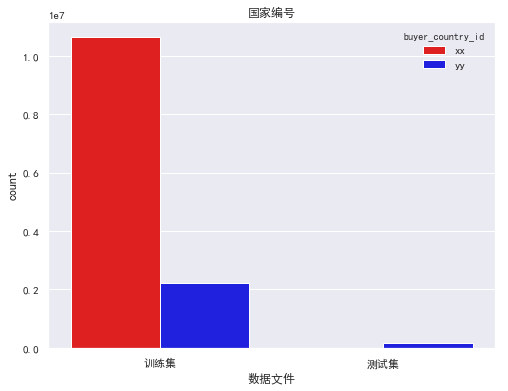


buyer_country_id 国家编号

> 本次比赛给出若干日内来自成熟国家的部分用户的行为数据，以及来自待成熟国家的A部分用户的行为数据，以及待成熟国家的B部分用户的行为数据去除每个用户的最后一条购买数据，让参赛人预测B部分用户的最后一条行为数据。

* 训练集中有2个国家数据，xx国家样本数10635642，占比83%，yy国家样本数2232867条，仅占17%
* 预测集中有yy国家的166832数据, 训练集中yy国样本数量是测试集中的13倍，如赛题目的所言，期望通过大量成熟国家来预测少量带成熟国家的用户购买行为

### buyer_admin_id 用户编号


```python
print('训练集中用户数量',len(df[train]['buyer_admin_id'].unique()))
print('测试集中用户数量',len(df[test]['buyer_admin_id'].unique()))
```

    训练集中用户数量 809213
    测试集中用户数量 11398


```python
union = list(set(df[train]['buyer_admin_id'].unique()).intersection(set(df[test]['buyer_admin_id'].unique())))
print('同时在训练集测试集出现的有6位用户，id如下：',union)
```

    同时在训练集测试集出现的有6位用户，id如下： [12647969, 13000419, 3106927, 12858772, 12929117, 12368445]


```python
df[train][df['buyer_admin_id'].isin(union)].sort_values(by=['buyer_admin_id','irank']).head(10)
```


<div>
<style scoped>
    .dataframe tbody tr th:only-of-type {
        vertical-align: middle;
    }


</style>
<table border="1" class="dataframe">
  <thead>
    <tr style="text-align: right;">
      <th></th>
      <th>buyer_country_id</th>
      <th>buyer_admin_id</th>
      <th>item_id</th>
      <th>create_order_time</th>
      <th>irank</th>
      <th>is_train</th>
      <th>date</th>
      <th>day</th>
      <th>hour</th>
      <th>cate_id</th>
      <th>store_id</th>
      <th>item_price</th>
    </tr>
  </thead>
  <tbody>
    <tr>
      <th>7546704</th>
      <td>xx</td>
      <td>3106927</td>
      <td>7645546</td>
      <td>2018-08-30 02:49:22</td>
      <td>1</td>
      <td>1</td>
      <td>2018-08-30</td>
      <td>30</td>
      <td>2</td>
      <td>1164.00</td>
      <td>73781.00</td>
      <td>770.00</td>
    </tr>
    <tr>
      <th>4582539</th>
      <td>xx</td>
      <td>3106927</td>
      <td>4639151</td>
      <td>2018-08-30 02:49:22</td>
      <td>2</td>
      <td>1</td>
      <td>2018-08-30</td>
      <td>30</td>
      <td>2</td>
      <td>2214.00</td>
      <td>53190.00</td>
      <td>1669.00</td>
    </tr>
    <tr>
      <th>11953258</th>
      <td>xx</td>
      <td>3106927</td>
      <td>12122118</td>
      <td>2018-08-30 02:49:22</td>
      <td>3</td>
      <td>1</td>
      <td>2018-08-30</td>
      <td>30</td>
      <td>2</td>
      <td>236.00</td>
      <td>73781.00</td>
      <td>884.00</td>
    </tr>
    <tr>
      <th>255625</th>
      <td>xx</td>
      <td>3106927</td>
      <td>258860</td>
      <td>2018-08-30 02:49:22</td>
      <td>4</td>
      <td>1</td>
      <td>2018-08-30</td>
      <td>30</td>
      <td>2</td>
      <td>189.00</td>
      <td>24221.00</td>
      <td>900.00</td>
    </tr>
    <tr>
      <th>7402817</th>
      <td>xx</td>
      <td>3106927</td>
      <td>7499372</td>
      <td>2018-08-30 02:49:22</td>
      <td>5</td>
      <td>1</td>
      <td>2018-08-30</td>
      <td>30</td>
      <td>2</td>
      <td>2214.00</td>
      <td>32535.00</td>
      <td>2714.00</td>
    </tr>
    <tr>
      <th>9483312</th>
      <td>xx</td>
      <td>3106927</td>
      <td>9613063</td>
      <td>2018-08-30 02:49:22</td>
      <td>6</td>
      <td>1</td>
      <td>2018-08-30</td>
      <td>30</td>
      <td>2</td>
      <td>3069.00</td>
      <td>73781.00</td>
      <td>110.00</td>
    </tr>
    <tr>
      <th>2740080</th>
      <td>xx</td>
      <td>3106927</td>
      <td>2773189</td>
      <td>2018-08-27 08:18:23</td>
      <td>10</td>
      <td>1</td>
      <td>2018-08-27</td>
      <td>27</td>
      <td>8</td>
      <td>1865.00</td>
      <td>49499.00</td>
      <td>20067.00</td>
    </tr>
    <tr>
      <th>12152249</th>
      <td>xx</td>
      <td>3106927</td>
      <td>12324030</td>
      <td>2018-08-27 07:15:05</td>
      <td>11</td>
      <td>1</td>
      <td>2018-08-27</td>
      <td>27</td>
      <td>7</td>
      <td>880.00</td>
      <td>92968.00</td>
      <td>1764.00</td>
    </tr>
    <tr>
      <th>2201292</th>
      <td>xx</td>
      <td>3106927</td>
      <td>2227720</td>
      <td>2018-08-19 02:36:36</td>
      <td>12</td>
      <td>1</td>
      <td>2018-08-19</td>
      <td>19</td>
      <td>2</td>
      <td>1164.00</td>
      <td>6404.00</td>
      <td>1900.00</td>
    </tr>
    <tr>
      <th>6717641</th>
      <td>xx</td>
      <td>3106927</td>
      <td>6804187</td>
      <td>2018-08-19 02:33:39</td>
      <td>13</td>
      <td>1</td>
      <td>2018-08-19</td>
      <td>19</td>
      <td>2</td>
      <td>1164.00</td>
      <td>52421.00</td>
      <td>230.00</td>
    </tr>
  </tbody>
</table>
</div>


```python
df[test][df['buyer_admin_id'].isin(union)].sort_values(by=['buyer_admin_id','irank']).head(3)
```


<div>
<style scoped>
    .dataframe tbody tr th:only-of-type {
        vertical-align: middle;
    }


</style>
<table border="1" class="dataframe">
  <thead>
    <tr style="text-align: right;">
      <th></th>
      <th>buyer_country_id</th>
      <th>buyer_admin_id</th>
      <th>item_id</th>
      <th>create_order_time</th>
      <th>irank</th>
      <th>is_train</th>
      <th>date</th>
      <th>day</th>
      <th>hour</th>
      <th>cate_id</th>
      <th>store_id</th>
      <th>item_price</th>
    </tr>
  </thead>
  <tbody>
    <tr>
      <th>13016145</th>
      <td>yy</td>
      <td>3106927</td>
      <td>202354</td>
      <td>2018-08-30 02:48:40</td>
      <td>7</td>
      <td>0</td>
      <td>2018-08-30</td>
      <td>30</td>
      <td>2</td>
      <td>642.00</td>
      <td>24221.00</td>
      <td>989.00</td>
    </tr>
    <tr>
      <th>13008981</th>
      <td>yy</td>
      <td>3106927</td>
      <td>6994414</td>
      <td>2018-08-29 05:48:06</td>
      <td>8</td>
      <td>0</td>
      <td>2018-08-29</td>
      <td>29</td>
      <td>5</td>
      <td>7.00</td>
      <td>37411.00</td>
      <td>1521.00</td>
    </tr>
    <tr>
      <th>13008982</th>
      <td>yy</td>
      <td>3106927</td>
      <td>6994414</td>
      <td>2018-08-29 05:48:06</td>
      <td>9</td>
      <td>0</td>
      <td>2018-08-29</td>
      <td>29</td>
      <td>5</td>
      <td>7.00</td>
      <td>37411.00</td>
      <td>1521.00</td>
    </tr>
  </tbody>
</table>
</div>


```python
df[(train) & (df['irank']==1) & (df['buyer_admin_id'].isin(['12858772','3106927','12368445']))]
```


<div>
<style scoped>
    .dataframe tbody tr th:only-of-type {
        vertical-align: middle;
    }


</style>
<table border="1" class="dataframe">
  <thead>
    <tr style="text-align: right;">
      <th></th>
      <th>buyer_country_id</th>
      <th>buyer_admin_id</th>
      <th>item_id</th>
      <th>create_order_time</th>
      <th>irank</th>
      <th>is_train</th>
      <th>date</th>
      <th>day</th>
      <th>hour</th>
      <th>cate_id</th>
      <th>store_id</th>
      <th>item_price</th>
    </tr>
  </thead>
  <tbody>
    <tr>
      <th>3488248</th>
      <td>xx</td>
      <td>12858772</td>
      <td>3530835</td>
      <td>2018-08-27 20:49:33</td>
      <td>1</td>
      <td>1</td>
      <td>2018-08-27</td>
      <td>27</td>
      <td>20</td>
      <td>579.00</td>
      <td>38151.00</td>
      <td>399.00</td>
    </tr>
    <tr>
      <th>6404074</th>
      <td>xx</td>
      <td>12368445</td>
      <td>6486053</td>
      <td>2018-08-31 04:24:46</td>
      <td>1</td>
      <td>1</td>
      <td>2018-08-31</td>
      <td>31</td>
      <td>4</td>
      <td>1423.00</td>
      <td>55861.00</td>
      <td>400.00</td>
    </tr>
    <tr>
      <th>7546704</th>
      <td>xx</td>
      <td>3106927</td>
      <td>7645546</td>
      <td>2018-08-30 02:49:22</td>
      <td>1</td>
      <td>1</td>
      <td>2018-08-30</td>
      <td>30</td>
      <td>2</td>
      <td>1164.00</td>
      <td>73781.00</td>
      <td>770.00</td>
    </tr>
  </tbody>
</table>
</div>


emmm... 为啥同一个用户在训练集和测试集国家不一样了呢？但是其他信息能对上。。。，而且rank=1的结果直接给出来了。。。

id为12858772、3106927、12368445直接把结果给出来

可能是数据清洗出问题了，后面再看看怎么处理

#### 用户记录数分布


```python
admin_cnt = groupby_cnt_ratio(df, 'buyer_admin_id')
admin_cnt.groupby(['is_train','buyer_country_id']).head(3)
```


<div>
<style scoped>
    .dataframe tbody tr th:only-of-type {
        vertical-align: middle;
    }


</style>
<table border="1" class="dataframe">
  <thead>
    <tr style="text-align: right;">
      <th></th>
      <th></th>
      <th></th>
      <th>count</th>
      <th>count_ratio</th>
    </tr>
    <tr>
      <th>is_train</th>
      <th>buyer_country_id</th>
      <th>buyer_admin_id</th>
      <th></th>
      <th></th>
    </tr>
  </thead>
  <tbody>
    <tr>
      <th rowspan="6" valign="top">1</th>
      <th rowspan="3" valign="top">xx</th>
      <th>10828801</th>
      <td>42751</td>
      <td>0.00</td>
    </tr>
    <tr>
      <th>10951390</th>
      <td>23569</td>
      <td>0.00</td>
    </tr>
    <tr>
      <th>11223615</th>
      <td>19933</td>
      <td>0.00</td>
    </tr>
    <tr>
      <th rowspan="3" valign="top">yy</th>
      <th>2381782</th>
      <td>3480</td>
      <td>0.00</td>
    </tr>
    <tr>
      <th>2333316</th>
      <td>1944</td>
      <td>0.00</td>
    </tr>
    <tr>
      <th>2365356</th>
      <td>1686</td>
      <td>0.00</td>
    </tr>
    <tr>
      <th rowspan="3" valign="top">0</th>
      <th rowspan="3" valign="top">yy</th>
      <th>2041038</th>
      <td>1386</td>
      <td>0.01</td>
    </tr>
    <tr>
      <th>2070430</th>
      <td>399</td>
      <td>0.00</td>
    </tr>
    <tr>
      <th>1144848</th>
      <td>286</td>
      <td>0.00</td>
    </tr>
  </tbody>
</table>
</div>


```python
# 用户购买记录数——最多、最少、中位数
admin_cnt.groupby(['is_train','buyer_country_id'])['count'].agg(['max','min','median'])
```


<div>
<style scoped>
    .dataframe tbody tr th:only-of-type {
        vertical-align: middle;
    }


</style>
<table border="1" class="dataframe">
  <thead>
    <tr style="text-align: right;">
      <th></th>
      <th></th>
      <th>max</th>
      <th>min</th>
      <th>median</th>
    </tr>
    <tr>
      <th>is_train</th>
      <th>buyer_country_id</th>
      <th></th>
      <th></th>
      <th></th>
    </tr>
  </thead>
  <tbody>
    <tr>
      <th>0</th>
      <th>yy</th>
      <td>1386</td>
      <td>7</td>
      <td>11</td>
    </tr>
    <tr>
      <th rowspan="2" valign="top">1</th>
      <th>xx</th>
      <td>42751</td>
      <td>8</td>
      <td>11</td>
    </tr>
    <tr>
      <th>yy</th>
      <td>3480</td>
      <td>8</td>
      <td>12</td>
    </tr>
  </tbody>
</table>
</div>


```python
fig, ax = plt.subplots(1, 2 ,figsize=(16,6))
ax[0].set(xlabel='用户记录数')
sns.kdeplot(admin_cnt.loc[(1, 'xx')]['count'].values, ax=ax[0]).set_title('训练集--xx国用户记录数')

ax[1].legend(labels=['训练集', '测试集'], loc="upper right")
ax[1].set(xlabel='用户记录数')
sns.kdeplot(admin_cnt[admin_cnt['count']<50].loc[(1, 'yy')]['count'].values, ax=ax[1]).set_title('yy国用户记录数')
sns.kdeplot(admin_cnt[admin_cnt['count']<50].loc[(0, 'yy')]['count'].values, ax=ax[1]);
```


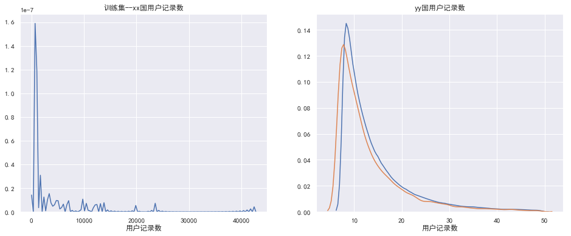


用户记录数进行了一波简单的探查：
* 训练集中记录了*809213*个用户的数据，其中id为10828801的用户拔得头筹，有42751条购买记录，用户至少都有8条记录
* 训练集中记录了*11398*个用户的数据，其中id为2041038的用户勇冠三军，有1386条购买记录，用户至少有7条记录

Notes: 验证集中用户最少仅有7条，是因为最后一条记录被抹去

从上面数据和图表看到，用户记录数大都都分布在0~50，少量用户记录甚至超过了10000条，下一步对用户记录数分布继续探索


```python
admin_cnt.columns = ['记录数', '占比']
admin_user_cnt = groupby_cnt_ratio(admin_cnt, '记录数')
admin_user_cnt.columns = ['人数', '人数占比']
admin_user_cnt.head()
```


<div>
<style scoped>
    .dataframe tbody tr th:only-of-type {
        vertical-align: middle;
    }


</style>
<table border="1" class="dataframe">
  <thead>
    <tr style="text-align: right;">
      <th></th>
      <th></th>
      <th></th>
      <th>人数</th>
      <th>人数占比</th>
    </tr>
    <tr>
      <th>is_train</th>
      <th>buyer_country_id</th>
      <th>记录数</th>
      <th></th>
      <th></th>
    </tr>
  </thead>
  <tbody>
    <tr>
      <th rowspan="5" valign="top">1</th>
      <th rowspan="5" valign="top">xx</th>
      <th>8</th>
      <td>118155</td>
      <td>0.18</td>
    </tr>
    <tr>
      <th>9</th>
      <td>91757</td>
      <td>0.14</td>
    </tr>
    <tr>
      <th>10</th>
      <td>72936</td>
      <td>0.11</td>
    </tr>
    <tr>
      <th>11</th>
      <td>57678</td>
      <td>0.09</td>
    </tr>
    <tr>
      <th>12</th>
      <td>46534</td>
      <td>0.07</td>
    </tr>
  </tbody>
</table>
</div>


```python
# xx国——用户记录数与用户数
admin_user_cnt.loc[(1,'xx')][['人数','人数占比']].T
```


<div>
<style scoped>
    .dataframe tbody tr th:only-of-type {
        vertical-align: middle;
    }


</style>
<table border="1" class="dataframe">
  <thead>
    <tr style="text-align: right;">
      <th>记录数</th>
      <th>8</th>
      <th>9</th>
      <th>10</th>
      <th>11</th>
      <th>12</th>
      <th>13</th>
      <th>14</th>
      <th>15</th>
      <th>16</th>
      <th>17</th>
      <th>18</th>
      <th>19</th>
      <th>20</th>
      <th>21</th>
      <th>22</th>
      <th>23</th>
      <th>24</th>
      <th>25</th>
      <th>26</th>
      <th>27</th>
      <th>28</th>
      <th>29</th>
      <th>30</th>
      <th>31</th>
      <th>32</th>
      <th>33</th>
      <th>34</th>
      <th>35</th>
      <th>36</th>
      <th>37</th>
      <th>38</th>
      <th>39</th>
      <th>40</th>
      <th>41</th>
      <th>42</th>
      <th>43</th>
      <th>44</th>
      <th>45</th>
      <th>46</th>
      <th>47</th>
      <th>48</th>
      <th>49</th>
      <th>50</th>
      <th>51</th>
      <th>52</th>
      <th>53</th>
      <th>54</th>
      <th>55</th>
      <th>56</th>
      <th>60</th>
      <th>...</th>
      <th>346</th>
      <th>348</th>
      <th>352</th>
      <th>355</th>
      <th>360</th>
      <th>361</th>
      <th>457</th>
      <th>460</th>
      <th>461</th>
      <th>618</th>
      <th>573</th>
      <th>582</th>
      <th>584</th>
      <th>585</th>
      <th>594</th>
      <th>597</th>
      <th>604</th>
      <th>607</th>
      <th>619</th>
      <th>568</th>
      <th>630</th>
      <th>638</th>
      <th>640</th>
      <th>649</th>
      <th>655</th>
      <th>656</th>
      <th>659</th>
      <th>660</th>
      <th>570</th>
      <th>559</th>
      <th>468</th>
      <th>504</th>
      <th>475</th>
      <th>476</th>
      <th>477</th>
      <th>479</th>
      <th>481</th>
      <th>488</th>
      <th>494</th>
      <th>497</th>
      <th>521</th>
      <th>556</th>
      <th>526</th>
      <th>528</th>
      <th>529</th>
      <th>537</th>
      <th>545</th>
      <th>549</th>
      <th>550</th>
      <th>554</th>
    </tr>
  </thead>
  <tbody>
    <tr>
      <th>人数</th>
      <td>118155.00</td>
      <td>91757.00</td>
      <td>72936.00</td>
      <td>57678.00</td>
      <td>46534.00</td>
      <td>38114.00</td>
      <td>31432.00</td>
      <td>26735.00</td>
      <td>22352.00</td>
      <td>18742.00</td>
      <td>16113.00</td>
      <td>13677.00</td>
      <td>12092.00</td>
      <td>10097.00</td>
      <td>8974.00</td>
      <td>7749.00</td>
      <td>6816.00</td>
      <td>5910.00</td>
      <td>5387.00</td>
      <td>4751.00</td>
      <td>4166.00</td>
      <td>3769.00</td>
      <td>3525.00</td>
      <td>3005.00</td>
      <td>2828.00</td>
      <td>2476.00</td>
      <td>2289.00</td>
      <td>2069.00</td>
      <td>1817.00</td>
      <td>1683.00</td>
      <td>1626.00</td>
      <td>1464.00</td>
      <td>1364.00</td>
      <td>1218.00</td>
      <td>1150.00</td>
      <td>1001.00</td>
      <td>988.00</td>
      <td>963.00</td>
      <td>802.00</td>
      <td>768.00</td>
      <td>710.00</td>
      <td>681.00</td>
      <td>597.00</td>
      <td>595.00</td>
      <td>548.00</td>
      <td>533.00</td>
      <td>503.00</td>
      <td>473.00</td>
      <td>448.00</td>
      <td>428.00</td>
      <td>...</td>
      <td>1.00</td>
      <td>1.00</td>
      <td>1.00</td>
      <td>1.00</td>
      <td>1.00</td>
      <td>1.00</td>
      <td>1.00</td>
      <td>1.00</td>
      <td>1.00</td>
      <td>1.00</td>
      <td>1.00</td>
      <td>1.00</td>
      <td>1.00</td>
      <td>1.00</td>
      <td>1.00</td>
      <td>1.00</td>
      <td>1.00</td>
      <td>1.00</td>
      <td>1.00</td>
      <td>1.00</td>
      <td>1.00</td>
      <td>1.00</td>
      <td>1.00</td>
      <td>1.00</td>
      <td>1.00</td>
      <td>1.00</td>
      <td>1.00</td>
      <td>1.00</td>
      <td>1.00</td>
      <td>1.00</td>
      <td>1.00</td>
      <td>1.00</td>
      <td>1.00</td>
      <td>1.00</td>
      <td>1.00</td>
      <td>1.00</td>
      <td>1.00</td>
      <td>1.00</td>
      <td>1.00</td>
      <td>1.00</td>
      <td>1.00</td>
      <td>1.00</td>
      <td>1.00</td>
      <td>1.00</td>
      <td>1.00</td>
      <td>1.00</td>
      <td>1.00</td>
      <td>1.00</td>
      <td>1.00</td>
      <td>1.00</td>
    </tr>
    <tr>
      <th>人数占比</th>
      <td>0.18</td>
      <td>0.14</td>
      <td>0.11</td>
      <td>0.09</td>
      <td>0.07</td>
      <td>0.06</td>
      <td>0.05</td>
      <td>0.04</td>
      <td>0.03</td>
      <td>0.03</td>
      <td>0.02</td>
      <td>0.02</td>
      <td>0.02</td>
      <td>0.02</td>
      <td>0.01</td>
      <td>0.01</td>
      <td>0.01</td>
      <td>0.01</td>
      <td>0.01</td>
      <td>0.01</td>
      <td>0.01</td>
      <td>0.01</td>
      <td>0.01</td>
      <td>0.00</td>
      <td>0.00</td>
      <td>0.00</td>
      <td>0.00</td>
      <td>0.00</td>
      <td>0.00</td>
      <td>0.00</td>
      <td>0.00</td>
      <td>0.00</td>
      <td>0.00</td>
      <td>0.00</td>
      <td>0.00</td>
      <td>0.00</td>
      <td>0.00</td>
      <td>0.00</td>
      <td>0.00</td>
      <td>0.00</td>
      <td>0.00</td>
      <td>0.00</td>
      <td>0.00</td>
      <td>0.00</td>
      <td>0.00</td>
      <td>0.00</td>
      <td>0.00</td>
      <td>0.00</td>
      <td>0.00</td>
      <td>0.00</td>
      <td>...</td>
      <td>0.00</td>
      <td>0.00</td>
      <td>0.00</td>
      <td>0.00</td>
      <td>0.00</td>
      <td>0.00</td>
      <td>0.00</td>
      <td>0.00</td>
      <td>0.00</td>
      <td>0.00</td>
      <td>0.00</td>
      <td>0.00</td>
      <td>0.00</td>
      <td>0.00</td>
      <td>0.00</td>
      <td>0.00</td>
      <td>0.00</td>
      <td>0.00</td>
      <td>0.00</td>
      <td>0.00</td>
      <td>0.00</td>
      <td>0.00</td>
      <td>0.00</td>
      <td>0.00</td>
      <td>0.00</td>
      <td>0.00</td>
      <td>0.00</td>
      <td>0.00</td>
      <td>0.00</td>
      <td>0.00</td>
      <td>0.00</td>
      <td>0.00</td>
      <td>0.00</td>
      <td>0.00</td>
      <td>0.00</td>
      <td>0.00</td>
      <td>0.00</td>
      <td>0.00</td>
      <td>0.00</td>
      <td>0.00</td>
      <td>0.00</td>
      <td>0.00</td>
      <td>0.00</td>
      <td>0.00</td>
      <td>0.00</td>
      <td>0.00</td>
      <td>0.00</td>
      <td>0.00</td>
      <td>0.00</td>
      <td>0.00</td>
    </tr>
  </tbody>
</table>
<p>2 rows × 506 columns</p>
</div>


```python
# yy国——记录数与用户数占比
admin_user_cnt.loc[([1,0],'yy',slice(None))][['人数','人数占比']].unstack(0).drop('人数',1).head(10)
```


<div>
<style scoped>
    .dataframe tbody tr th:only-of-type {
        vertical-align: middle;
    }


</style>
<table border="1" class="dataframe">
  <thead>
    <tr>
      <th></th>
      <th></th>
      <th colspan="2" halign="left">人数占比</th>
    </tr>
    <tr>
      <th></th>
      <th>is_train</th>
      <th>0</th>
      <th>1</th>
    </tr>
    <tr>
      <th>buyer_country_id</th>
      <th>记录数</th>
      <th></th>
      <th></th>
    </tr>
  </thead>
  <tbody>
    <tr>
      <th rowspan="10" valign="top">yy</th>
      <th>8</th>
      <td>0.13</td>
      <td>0.16</td>
    </tr>
    <tr>
      <th>9</th>
      <td>0.10</td>
      <td>0.13</td>
    </tr>
    <tr>
      <th>10</th>
      <td>0.09</td>
      <td>0.10</td>
    </tr>
    <tr>
      <th>11</th>
      <td>0.08</td>
      <td>0.08</td>
    </tr>
    <tr>
      <th>12</th>
      <td>0.06</td>
      <td>0.07</td>
    </tr>
    <tr>
      <th>13</th>
      <td>0.05</td>
      <td>0.06</td>
    </tr>
    <tr>
      <th>14</th>
      <td>0.04</td>
      <td>0.05</td>
    </tr>
    <tr>
      <th>15</th>
      <td>0.04</td>
      <td>0.04</td>
    </tr>
    <tr>
      <th>16</th>
      <td>0.03</td>
      <td>0.03</td>
    </tr>
    <tr>
      <th>17</th>
      <td>0.03</td>
      <td>0.03</td>
    </tr>
  </tbody>
</table>
</div>


```python
fig, ax = plt.subplots(2, 1, figsize=(16,10))
admin_plot = admin_user_cnt.reset_index()
sns.barplot(x='记录数', y='人数占比', data=admin_plot[(admin_plot['记录数']<50) & (admin_plot['buyer_country_id']=='xx')], 
            estimator=np.mean, ax=ax[0]).set_title('训练集——xx国记录数与人数占比');

sns.barplot(x='记录数', y='人数占比', hue='is_train', data=admin_plot[(admin_plot['记录数']<50) & (admin_plot['buyer_country_id']=='yy')], 
            estimator=np.mean, ax=ax[1]).set_title('yy国记录数与人数占比');
```


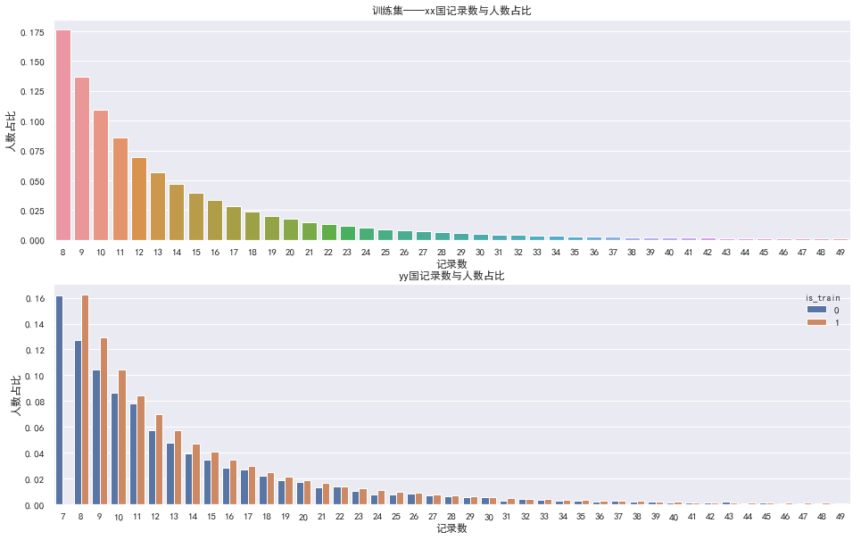


用户记录数进一步探查结论：
    * 不管是训练集还是验证集，99%的用户购买记录都在50条内，这是比较符合正常逻辑
    * TODO:对于发生大量购买行为的用户，后面再单独探查，是否有其他规律或疑似刷单现象

### item_id 商品编号


```python
print('商品表中商品数：',len(item['item_id'].unique()))
print('训练集中商品数：',len(df[train]['item_id'].unique()))
print('验证集中商品数：',len(df[test]['item_id'].unique()))
print('仅训练集有的商品数：',len(list(set(df[train]['item_id'].unique()).difference(set(df[test]['item_id'].unique())))))
print('仅验证集有的商品数：',len(list(set(df[test]['item_id'].unique()).difference(set(df[train]['item_id'].unique())))))
print('训练集验证集共同商品数：',len(list(set(df[train]['item_id'].unique()).intersection(set(df[test]['item_id'].unique())))))
print('训练集中不在商品表的商品数：',len(list(set(df[train]['item_id'].unique()).difference(set(item['item_id'].unique())))))
print('验证集中不在商品表的商品数：',len(list(set(df[test]['item_id'].unique()).difference(set(item['item_id'].unique())))))
```

    商品表中商品数： 2832669
    训练集中商品数： 2812048
    验证集中商品数： 104735
    仅训练集有的商品数： 2735801
    仅验证集有的商品数： 28488
    训练集验证集共同商品数： 76247
    训练集中不在商品表的商品数： 7733
    验证集中不在商品表的商品数： 313


#### 商品销量


```python
item_cnt = groupby_cnt_ratio(df, 'item_id')
item_cnt.columns=['销量', '总销量占比']
item_cnt.reset_index(inplace=True)
```


```python
top_item_plot = item_cnt.groupby(['is_train','buyer_country_id']).head(10)
```


```python
fig, ax = plt.subplots(2, 1, figsize=(16,12))
sns.barplot(x='item_id', y='销量', data=top_item_plot[top_item_plot['buyer_country_id']=='xx'], 
            order=top_item_plot['item_id'][top_item_plot['buyer_country_id']=='xx'], ax=ax[0], estimator=np.mean).set_title('xx国-TOP热销商品')
sns.barplot(x='item_id', y='销量', hue='is_train', data=top_item_plot[top_item_plot['buyer_country_id']=='yy'], 
            order=top_item_plot['item_id'][top_item_plot['buyer_country_id']=='yy'], ax=ax[1], estimator=np.mean).set_title('yy国-TOP热销商品');
```


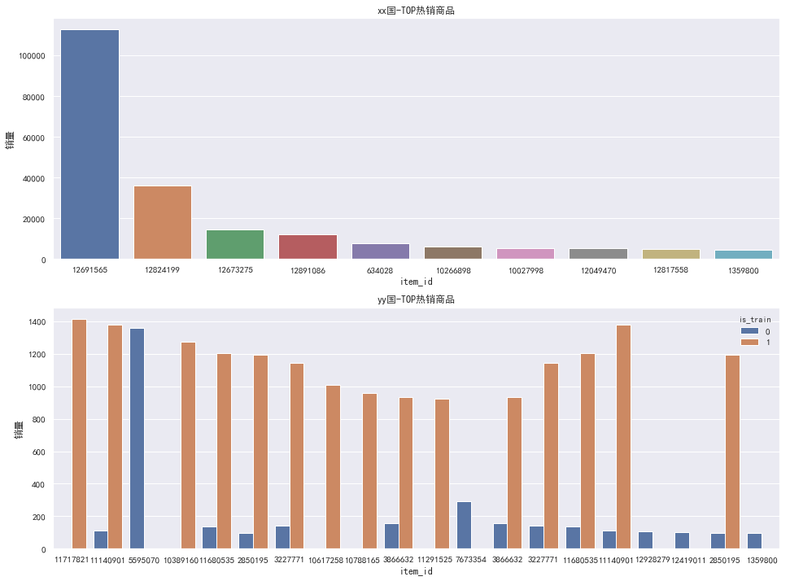


初步数据发现：
* 训练集中出售最多商品是12691565，卖了112659次。
* 训练集中出售最多商品是5595070，卖了112659次。
* 大部分商品只有1次出售记录，符合电商长尾属性
* 比较奇怪的yy国中，训练集和测试集中热销商品并不太一样

#### 整体商品销量分布


```python
item_order_cnt = groupby_cnt_ratio(item_cnt, '销量')
item_order_cnt.columns = ['商品数', '占比']
```


```python
item_order_cnt.groupby(['is_train','buyer_country_id']).head(5).sort_values(by=['buyer_country_id','is_train'])
```


<div>
<style scoped>
    .dataframe tbody tr th:only-of-type {
        vertical-align: middle;
    }


</style>
<table border="1" class="dataframe">
  <thead>
    <tr style="text-align: right;">
      <th></th>
      <th></th>
      <th></th>
      <th>商品数</th>
      <th>占比</th>
    </tr>
    <tr>
      <th>is_train</th>
      <th>buyer_country_id</th>
      <th>销量</th>
      <th></th>
      <th></th>
    </tr>
  </thead>
  <tbody>
    <tr>
      <th rowspan="5" valign="top">1</th>
      <th rowspan="5" valign="top">xx</th>
      <th>1</th>
      <td>1331056</td>
      <td>0.58</td>
    </tr>
    <tr>
      <th>2</th>
      <td>361829</td>
      <td>0.16</td>
    </tr>
    <tr>
      <th>3</th>
      <td>164953</td>
      <td>0.07</td>
    </tr>
    <tr>
      <th>4</th>
      <td>95629</td>
      <td>0.04</td>
    </tr>
    <tr>
      <th>5</th>
      <td>61551</td>
      <td>0.03</td>
    </tr>
    <tr>
      <th rowspan="5" valign="top">0</th>
      <th rowspan="5" valign="top">yy</th>
      <th>1</th>
      <td>81212</td>
      <td>0.78</td>
    </tr>
    <tr>
      <th>2</th>
      <td>13083</td>
      <td>0.12</td>
    </tr>
    <tr>
      <th>3</th>
      <td>4350</td>
      <td>0.04</td>
    </tr>
    <tr>
      <th>4</th>
      <td>2123</td>
      <td>0.02</td>
    </tr>
    <tr>
      <th>5</th>
      <td>1200</td>
      <td>0.01</td>
    </tr>
    <tr>
      <th rowspan="5" valign="top">1</th>
      <th rowspan="5" valign="top">yy</th>
      <th>1</th>
      <td>625041</td>
      <td>0.67</td>
    </tr>
    <tr>
      <th>2</th>
      <td>139607</td>
      <td>0.15</td>
    </tr>
    <tr>
      <th>3</th>
      <td>55274</td>
      <td>0.06</td>
    </tr>
    <tr>
      <th>4</th>
      <td>29848</td>
      <td>0.03</td>
    </tr>
    <tr>
      <th>5</th>
      <td>17782</td>
      <td>0.02</td>
    </tr>
  </tbody>
</table>
</div>


```python
item_order_plot = item_order_cnt.reset_index()
item_order_plot = item_order_plot[item_order_plot['销量']<=8]

xx_item_order_plot = item_order_plot[item_order_plot['buyer_country_id']=='xx']
yy_item_order_plot = item_order_plot[item_order_plot['buyer_country_id']=='yy']
yy_item_order_plot_1 = yy_item_order_plot[yy_item_order_plot['is_train']==1]
yy_item_order_plot_0 = yy_item_order_plot[yy_item_order_plot['is_train']==0]
```


```python
# 商品销量饼图
def text_style_func(pct, allvals):
    absolute = int(pct/100.*np.sum(allvals))
    return "{:.1f}%({:d})".format(pct, absolute)

def pie_param(ax, df, color_palette):
    return ax.pie(df['占比'].values, autopct=lambda pct: text_style_func(pct, df['商品数']), labels = df['销量'], 
                  explode = [0.1]+ np.zeros(len(df)-1).tolist(), pctdistance = 0.7, colors=sns.color_palette(color_palette, 8))

fig, ax = plt.subplots(1, 3, figsize=(16,12))
ax[0].set(xlabel='xx国-商品销量')
ax[0].set(ylabel='xx国-商品数量比例')
pie_param(ax[0], xx_item_order_plot, "coolwarm")
ax[1].set(xlabel='yy国-训练集商品销量')
pie_param(ax[1], yy_item_order_plot_1, "Set3")
ax[2].set(xlabel='yy国测试集集商品销量')
pie_param(ax[2], yy_item_order_plot_0, "Set3");
```


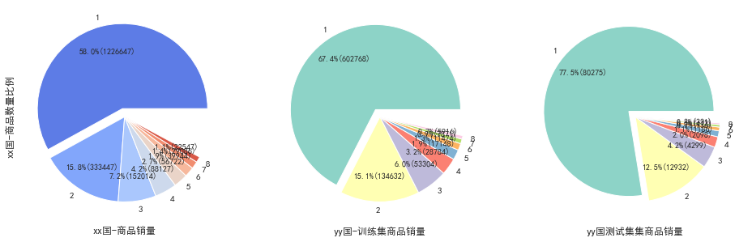


```python
print(xx_item_order_plot.head(10)['占比'].sum())
print(yy_item_order_plot_1.head(10)['占比'].sum())
print(yy_item_order_plot_0.head(10)['占比'].sum())
```

    0.9215598591503256
    0.9643666018897873
    0.9884661288012603


总体来看，由于训练集数据远多于测试集数据：
* 训练集商品销量大于测试集商品销量
* 长尾趋势严重，热门商品少，大量商品仅有数次销售记录，1单商品占了绝大部分(均超过50%)
* 训练集中92%的商品销量不超过10件，而在测试集中97%的商品销量不超过10件
* 此外训练集中yy国的商品销量略大于测试集

### cate_id 品类编号


```python
print('商品品类数', len(item['cate_id'].unique()))
print('训练集商品品类数', len(df[train]['cate_id'].unique()))
print('测试集商品品类数', len(df[test]['cate_id'].unique()))
```

    商品品类数 4243
    训练集商品品类数 4239
    测试集商品品类数 2727


#### 各个品类下商品数量


```python
cate_cnt = item.groupby(['cate_id']).size().to_frame('count').reset_index()
cate_cnt.sort_values(by=['count'], ascending=False).head(5)
```


<div>
<style scoped>
    .dataframe tbody tr th:only-of-type {
        vertical-align: middle;
    }


</style>
<table border="1" class="dataframe">
  <thead>
    <tr style="text-align: right;">
      <th></th>
      <th>cate_id</th>
      <th>count</th>
    </tr>
  </thead>
  <tbody>
    <tr>
      <th>578</th>
      <td>579</td>
      <td>170074</td>
    </tr>
    <tr>
      <th>2395</th>
      <td>2396</td>
      <td>44467</td>
    </tr>
    <tr>
      <th>1497</th>
      <td>1498</td>
      <td>42676</td>
    </tr>
    <tr>
      <th>599</th>
      <td>600</td>
      <td>39729</td>
    </tr>
    <tr>
      <th>1591</th>
      <td>1592</td>
      <td>34820</td>
    </tr>
  </tbody>
</table>
</div>


```python
plt.figure(figsize=(12,4))
sns.kdeplot(data=cate_cnt[cate_cnt['count']<1000]['count']);
```


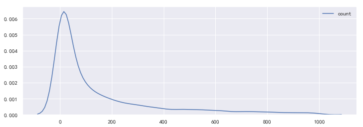


我们发现：
    * 579品类一花独秀有17W个商品，可能是平台主营方向
    * 大部分品类都在100个以上

### store_id 店铺编号


```python
print('商品店铺数', len(item['store_id'].unique()))
print('训练集店铺数', len(df[train]['store_id'].unique()))
print('测试集店铺数', len(df[train]['store_id'].unique()))
```

    商品店铺数 95105
    训练集店铺数 94970
    测试集店铺数 94970


#### 店铺下品类数量


```python
store_cate_cnt = item.groupby(['store_id'])['cate_id'].nunique().to_frame('count').reset_index()
store_cate_cnt.sort_values(by=['count'], ascending=False).head(5)
```


<div>
<style scoped>
    .dataframe tbody tr th:only-of-type {
        vertical-align: middle;
    }


</style>
<table border="1" class="dataframe">
  <thead>
    <tr style="text-align: right;">
      <th></th>
      <th>store_id</th>
      <th>count</th>
    </tr>
  </thead>
  <tbody>
    <tr>
      <th>0</th>
      <td>1</td>
      <td>326</td>
    </tr>
    <tr>
      <th>45594</th>
      <td>45595</td>
      <td>280</td>
    </tr>
    <tr>
      <th>44983</th>
      <td>44984</td>
      <td>274</td>
    </tr>
    <tr>
      <th>1870</th>
      <td>1871</td>
      <td>258</td>
    </tr>
    <tr>
      <th>22034</th>
      <td>22035</td>
      <td>241</td>
    </tr>
  </tbody>
</table>
</div>


```python
store_cnt_cate_cnt = store_cate_cnt.groupby(['count']).size().reset_index()
store_cnt_cate_cnt.columns = ['店铺品类数', '店铺数量']
```


```python
plt.figure(figsize=(12,4))
sns.barplot(x='店铺品类数', y='店铺数量', data=store_cnt_cate_cnt[store_cnt_cate_cnt['店铺品类数']<50], estimator=np.mean);
```


#### 店铺下商品数量


```python
store_item_cnt = item.groupby(['store_id'])['item_id'].nunique().to_frame('count').reset_index()
store_item_cnt.sort_values(by=['count'], ascending=False).head(5)
```


<div>
<style scoped>
    .dataframe tbody tr th:only-of-type {
        vertical-align: middle;
    }


</style>
<table border="1" class="dataframe">
  <thead>
    <tr style="text-align: right;">
      <th></th>
      <th>store_id</th>
      <th>count</th>
    </tr>
  </thead>
  <tbody>
    <tr>
      <th>0</th>
      <td>1</td>
      <td>6911</td>
    </tr>
    <tr>
      <th>68671</th>
      <td>68672</td>
      <td>2435</td>
    </tr>
    <tr>
      <th>33381</th>
      <td>33382</td>
      <td>2220</td>
    </tr>
    <tr>
      <th>17544</th>
      <td>17545</td>
      <td>2053</td>
    </tr>
    <tr>
      <th>82146</th>
      <td>82147</td>
      <td>2016</td>
    </tr>
  </tbody>
</table>
</div>


```python
store_cnt_item_cnt = store_item_cnt.groupby(['count']).size().reset_index()
store_cnt_item_cnt.columns = ['店铺商品数', '店铺数量']
```


```python
store_cnt_item_cnt.T
```


<div>
<style scoped>
    .dataframe tbody tr th:only-of-type {
        vertical-align: middle;
    }


</style>
<table border="1" class="dataframe">
  <thead>
    <tr style="text-align: right;">
      <th></th>
      <th>0</th>
      <th>1</th>
      <th>2</th>
      <th>3</th>
      <th>4</th>
      <th>5</th>
      <th>6</th>
      <th>7</th>
      <th>8</th>
      <th>9</th>
      <th>10</th>
      <th>11</th>
      <th>12</th>
      <th>13</th>
      <th>14</th>
      <th>15</th>
      <th>16</th>
      <th>17</th>
      <th>18</th>
      <th>19</th>
      <th>20</th>
      <th>21</th>
      <th>22</th>
      <th>23</th>
      <th>24</th>
      <th>25</th>
      <th>26</th>
      <th>27</th>
      <th>28</th>
      <th>29</th>
      <th>30</th>
      <th>31</th>
      <th>32</th>
      <th>33</th>
      <th>34</th>
      <th>35</th>
      <th>36</th>
      <th>37</th>
      <th>38</th>
      <th>39</th>
      <th>40</th>
      <th>41</th>
      <th>42</th>
      <th>43</th>
      <th>44</th>
      <th>45</th>
      <th>46</th>
      <th>47</th>
      <th>48</th>
      <th>49</th>
      <th>...</th>
      <th>579</th>
      <th>580</th>
      <th>581</th>
      <th>582</th>
      <th>583</th>
      <th>584</th>
      <th>585</th>
      <th>586</th>
      <th>587</th>
      <th>588</th>
      <th>589</th>
      <th>590</th>
      <th>591</th>
      <th>592</th>
      <th>593</th>
      <th>594</th>
      <th>595</th>
      <th>596</th>
      <th>597</th>
      <th>598</th>
      <th>599</th>
      <th>600</th>
      <th>601</th>
      <th>602</th>
      <th>603</th>
      <th>604</th>
      <th>605</th>
      <th>606</th>
      <th>607</th>
      <th>608</th>
      <th>609</th>
      <th>610</th>
      <th>611</th>
      <th>612</th>
      <th>613</th>
      <th>614</th>
      <th>615</th>
      <th>616</th>
      <th>617</th>
      <th>618</th>
      <th>619</th>
      <th>620</th>
      <th>621</th>
      <th>622</th>
      <th>623</th>
      <th>624</th>
      <th>625</th>
      <th>626</th>
      <th>627</th>
      <th>628</th>
    </tr>
  </thead>
  <tbody>
    <tr>
      <th>店铺商品数</th>
      <td>1</td>
      <td>2</td>
      <td>3</td>
      <td>4</td>
      <td>5</td>
      <td>6</td>
      <td>7</td>
      <td>8</td>
      <td>9</td>
      <td>10</td>
      <td>11</td>
      <td>12</td>
      <td>13</td>
      <td>14</td>
      <td>15</td>
      <td>16</td>
      <td>17</td>
      <td>18</td>
      <td>19</td>
      <td>20</td>
      <td>21</td>
      <td>22</td>
      <td>23</td>
      <td>24</td>
      <td>25</td>
      <td>26</td>
      <td>27</td>
      <td>28</td>
      <td>29</td>
      <td>30</td>
      <td>31</td>
      <td>32</td>
      <td>33</td>
      <td>34</td>
      <td>35</td>
      <td>36</td>
      <td>37</td>
      <td>38</td>
      <td>39</td>
      <td>40</td>
      <td>41</td>
      <td>42</td>
      <td>43</td>
      <td>44</td>
      <td>45</td>
      <td>46</td>
      <td>47</td>
      <td>48</td>
      <td>49</td>
      <td>50</td>
      <td>...</td>
      <td>747</td>
      <td>765</td>
      <td>767</td>
      <td>771</td>
      <td>774</td>
      <td>782</td>
      <td>797</td>
      <td>809</td>
      <td>816</td>
      <td>834</td>
      <td>835</td>
      <td>841</td>
      <td>842</td>
      <td>845</td>
      <td>861</td>
      <td>871</td>
      <td>881</td>
      <td>897</td>
      <td>910</td>
      <td>915</td>
      <td>926</td>
      <td>955</td>
      <td>974</td>
      <td>975</td>
      <td>991</td>
      <td>999</td>
      <td>1019</td>
      <td>1026</td>
      <td>1051</td>
      <td>1081</td>
      <td>1083</td>
      <td>1094</td>
      <td>1138</td>
      <td>1145</td>
      <td>1161</td>
      <td>1207</td>
      <td>1276</td>
      <td>1307</td>
      <td>1374</td>
      <td>1554</td>
      <td>1556</td>
      <td>1558</td>
      <td>1642</td>
      <td>1820</td>
      <td>1997</td>
      <td>2016</td>
      <td>2053</td>
      <td>2220</td>
      <td>2435</td>
      <td>6911</td>
    </tr>
    <tr>
      <th>店铺数量</th>
      <td>9129</td>
      <td>6897</td>
      <td>5593</td>
      <td>4879</td>
      <td>4206</td>
      <td>3698</td>
      <td>3374</td>
      <td>3050</td>
      <td>2773</td>
      <td>2486</td>
      <td>2251</td>
      <td>2030</td>
      <td>1966</td>
      <td>1799</td>
      <td>1673</td>
      <td>1478</td>
      <td>1437</td>
      <td>1293</td>
      <td>1246</td>
      <td>1219</td>
      <td>1171</td>
      <td>1059</td>
      <td>1044</td>
      <td>958</td>
      <td>910</td>
      <td>885</td>
      <td>772</td>
      <td>792</td>
      <td>709</td>
      <td>675</td>
      <td>656</td>
      <td>626</td>
      <td>596</td>
      <td>582</td>
      <td>538</td>
      <td>532</td>
      <td>479</td>
      <td>456</td>
      <td>496</td>
      <td>437</td>
      <td>441</td>
      <td>415</td>
      <td>401</td>
      <td>383</td>
      <td>374</td>
      <td>371</td>
      <td>330</td>
      <td>325</td>
      <td>335</td>
      <td>306</td>
      <td>...</td>
      <td>1</td>
      <td>1</td>
      <td>1</td>
      <td>1</td>
      <td>1</td>
      <td>1</td>
      <td>2</td>
      <td>1</td>
      <td>1</td>
      <td>2</td>
      <td>1</td>
      <td>1</td>
      <td>1</td>
      <td>1</td>
      <td>1</td>
      <td>1</td>
      <td>1</td>
      <td>1</td>
      <td>1</td>
      <td>1</td>
      <td>1</td>
      <td>1</td>
      <td>1</td>
      <td>1</td>
      <td>1</td>
      <td>1</td>
      <td>1</td>
      <td>1</td>
      <td>1</td>
      <td>1</td>
      <td>1</td>
      <td>1</td>
      <td>1</td>
      <td>1</td>
      <td>1</td>
      <td>1</td>
      <td>1</td>
      <td>1</td>
      <td>1</td>
      <td>1</td>
      <td>1</td>
      <td>1</td>
      <td>1</td>
      <td>1</td>
      <td>1</td>
      <td>1</td>
      <td>1</td>
      <td>1</td>
      <td>1</td>
      <td>1</td>
    </tr>
  </tbody>
</table>
<p>2 rows × 629 columns</p>
</div>


```python
plt.figure(figsize=(16,4))
sns.barplot(x='店铺商品数', y='店铺数量', data=store_cnt_item_cnt[store_cnt_item_cnt['店铺商品数']<80], estimator=np.mean);
```


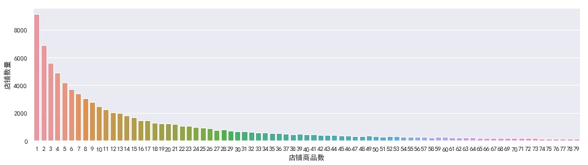


#### item_price 商品价格


```python
print(item['item_price'].max(), item['item_price'].min(), item['item_price'].mean(), item['item_price'].median())
```

    20230 1 1124.0030755446542 400.0


```python
plt.figure(figsize=(16,4))
plt.subplot(121)
sns.kdeplot(item['item_price'])
plt.subplot(122)
sns.kdeplot(item['item_price'][item['item_price']<1000]);
```


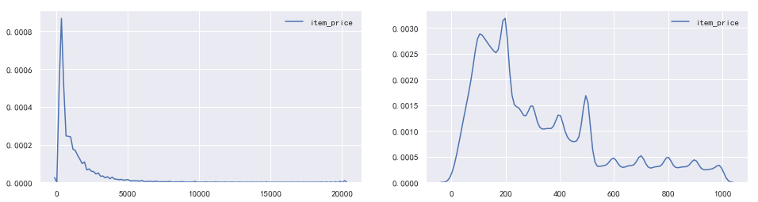


```python
price_cnt = item.groupby(['item_price']).size().to_frame('count').reset_index()
price_cnt.sort_values(by=['count'], ascending=False).head(10)
```


<div>
<style scoped>
    .dataframe tbody tr th:only-of-type {
        vertical-align: middle;
    }


</style>
<table border="1" class="dataframe">
  <thead>
    <tr style="text-align: right;">
      <th></th>
      <th>item_price</th>
      <th>count</th>
    </tr>
  </thead>
  <tbody>
    <tr>
      <th>199</th>
      <td>200</td>
      <td>75872</td>
    </tr>
    <tr>
      <th>499</th>
      <td>500</td>
      <td>61283</td>
    </tr>
    <tr>
      <th>99</th>
      <td>100</td>
      <td>33826</td>
    </tr>
    <tr>
      <th>399</th>
      <td>400</td>
      <td>27670</td>
    </tr>
    <tr>
      <th>299</th>
      <td>300</td>
      <td>26044</td>
    </tr>
    <tr>
      <th>198</th>
      <td>199</td>
      <td>18032</td>
    </tr>
    <tr>
      <th>999</th>
      <td>1000</td>
      <td>16739</td>
    </tr>
    <tr>
      <th>699</th>
      <td>700</td>
      <td>12028</td>
    </tr>
    <tr>
      <th>100</th>
      <td>101</td>
      <td>11972</td>
    </tr>
    <tr>
      <th>120</th>
      <td>121</td>
      <td>11833</td>
    </tr>
  </tbody>
</table>
</div>


关于商品价格：商品价格是通过函数转化成了从1开始的整数，最大值为20230，最小值为1。
    * 经常对商品价格统计，大部门商品都是整百数，Top5价格200\500\100\400\300
    * TODO：整百商品探查

#### 有售商品价格


```python
print(df[train]['item_price'].max(), df[train]['item_price'].min(), df[train]['item_price'].mean(), df[train]['item_price'].median())
print(df[test]['item_price'].max(), df[test]['item_price'].min(), df[test]['item_price'].mean(), df[test]['item_price'].median())
```

    20230.0 1.0 1103.9060915681803 245.0
    19907.0 1.0 778.7395852140734 270.0


```python
plt.figure(figsize=(12,4))
sns.kdeplot(df[train][df[train]['item_price']<1000][['item_id','item_price']].drop_duplicates()['item_price'])
sns.kdeplot(df[test][df[test]['item_price']<1000][['item_id','item_price']].drop_duplicates()['item_price']);
```


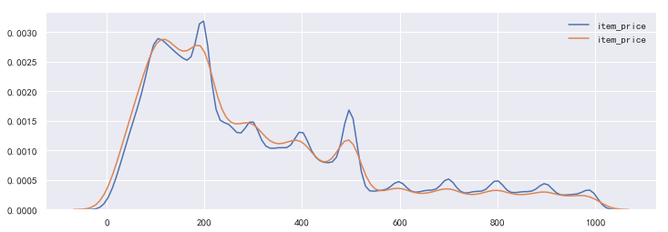


商品价格与销量


```python
df[train].groupby(['item_price'])['item_id'].nunique().to_frame('商品数量').head()
```


<div>
<style scoped>
    .dataframe tbody tr th:only-of-type {
        vertical-align: middle;
    }


</style>
<table border="1" class="dataframe">
  <thead>
    <tr style="text-align: right;">
      <th></th>
      <th>商品数量</th>
    </tr>
    <tr>
      <th>item_price</th>
      <th></th>
    </tr>
  </thead>
  <tbody>
    <tr>
      <th>1.00</th>
      <td>266</td>
    </tr>
    <tr>
      <th>2.00</th>
      <td>1305</td>
    </tr>
    <tr>
      <th>3.00</th>
      <td>204</td>
    </tr>
    <tr>
      <th>4.00</th>
      <td>152</td>
    </tr>
    <tr>
      <th>5.00</th>
      <td>133</td>
    </tr>
  </tbody>
</table>
</div>


```python
price_cnt = groupby_cnt_ratio(df, 'item_price')
price_cnt.groupby(['is_train', 'buyer_country_id']).head(5)
```


<div>
<style scoped>
    .dataframe tbody tr th:only-of-type {
        vertical-align: middle;
    }


</style>
<table border="1" class="dataframe">
  <thead>
    <tr style="text-align: right;">
      <th></th>
      <th></th>
      <th></th>
      <th>count</th>
      <th>count_ratio</th>
    </tr>
    <tr>
      <th>is_train</th>
      <th>buyer_country_id</th>
      <th>item_price</th>
      <th></th>
      <th></th>
    </tr>
  </thead>
  <tbody>
    <tr>
      <th rowspan="10" valign="top">1</th>
      <th rowspan="5" valign="top">xx</th>
      <th>200.00</th>
      <td>404366</td>
      <td>0.04</td>
    </tr>
    <tr>
      <th>500.00</th>
      <td>201061</td>
      <td>0.02</td>
    </tr>
    <tr>
      <th>100.00</th>
      <td>186473</td>
      <td>0.02</td>
    </tr>
    <tr>
      <th>17844.00</th>
      <td>114631</td>
      <td>0.01</td>
    </tr>
    <tr>
      <th>121.00</th>
      <td>92956</td>
      <td>0.01</td>
    </tr>
    <tr>
      <th rowspan="5" valign="top">yy</th>
      <th>200.00</th>
      <td>82625</td>
      <td>0.04</td>
    </tr>
    <tr>
      <th>500.00</th>
      <td>48651</td>
      <td>0.02</td>
    </tr>
    <tr>
      <th>100.00</th>
      <td>38838</td>
      <td>0.02</td>
    </tr>
    <tr>
      <th>300.00</th>
      <td>27452</td>
      <td>0.01</td>
    </tr>
    <tr>
      <th>400.00</th>
      <td>24144</td>
      <td>0.01</td>
    </tr>
    <tr>
      <th rowspan="5" valign="top">0</th>
      <th rowspan="5" valign="top">yy</th>
      <th>200.00</th>
      <td>6846</td>
      <td>0.04</td>
    </tr>
    <tr>
      <th>500.00</th>
      <td>3582</td>
      <td>0.02</td>
    </tr>
    <tr>
      <th>100.00</th>
      <td>3019</td>
      <td>0.02</td>
    </tr>
    <tr>
      <th>300.00</th>
      <td>2084</td>
      <td>0.01</td>
    </tr>
    <tr>
      <th>400.00</th>
      <td>1765</td>
      <td>0.01</td>
    </tr>
  </tbody>
</table>
</div>


似乎价格与销量并无直接关系
    * 但是价格为100、200、300、400、500整百数位居销量榜
    * xx国，17844如此高价格的商品销量这么高？

### create_order_time 订单日期


```python
print(df[train]['create_order_time'].min(), df[train]['create_order_time'].max())
print(df[test]['create_order_time'].min(), df[test]['create_order_time'].max())
```

    2018-07-13 05:54:54 2018-08-31 23:59:57
    2018-07-17 07:43:40 2018-08-31 23:58:56


```python
train_df_seven = df[train][df[train]['create_order_time']<pd.to_datetime('2018-08-01')]
train_df_eight = df[train][df[train]['create_order_time']>pd.to_datetime('2018-08-01')]
train_df_seven = df[train][df[train]['create_order_time']<pd.to_datetime('2018-08-01')]
train_df_eight = df[train][df[train]['create_order_time']>pd.to_datetime('2018-08-01')]
```


```python
print('7月数据量',len(df[train][df[train]['create_order_time']<pd.to_datetime('2018-08-01')]),
      '\n8月数据量',len(df[train][df[train]['create_order_time']>pd.to_datetime('2018-08-02')]))
```

    7月数据量 17856 
    8月数据量 12838990


```python
date_cnt = groupby_cnt_ratio(df, 'date')
date_cnt.columns = ['当天销量', "占比"]
date_cnt = date_cnt.reset_index()
```


```python
fig, ax = plt.subplots(2, 1, figsize=(16,10))
sns.lineplot(x='date', y='当天销量', hue='buyer_country_id', data=date_cnt[(date_cnt['is_train']==1)], 
            estimator=np.mean, ax=ax[0]).set_title('训练集——每日销量');

sns.lineplot(x='date', y='当天销量', hue='is_train', data=date_cnt[(date_cnt['buyer_country_id']=='yy')], 
            estimator=np.mean, ax=ax[1]).set_title('yy国每日销量');
```


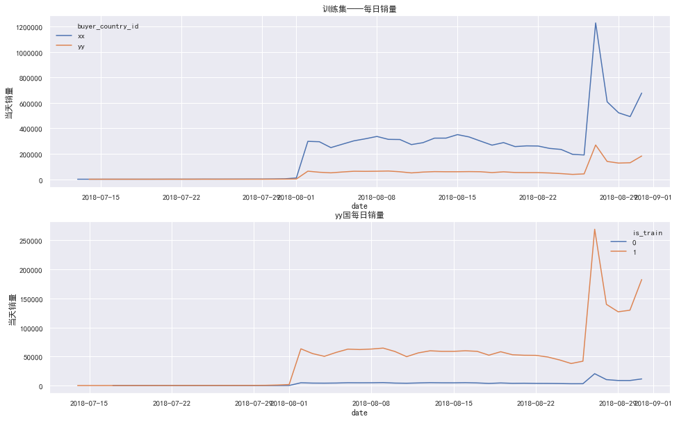


很明显：
* 训练集中7月份数据远小于8月份数据
* 训练集中xx国和yy国每日销量趋势十分相似，且在27日有个波峰


```python
seven = date_cnt[date_cnt['date']<pd.to_datetime('2018-08-02')]
eight = date_cnt[date_cnt['date']>=pd.to_datetime('2018-08-02')]
```


```python
fig, ax = plt.subplots(2, 3, figsize=(20,16))
def barplot(ax, df, title):
    df['date'] = df['date'].astype(str)
    sns.barplot(y='date', x='当天销量' ,data=df, order=sorted(df['date'].unique()), ax=ax, estimator=np.mean)\
    .set_title(title)
    
barplot(ax[0][0], seven[(seven['is_train']==1) & (seven['buyer_country_id']=='xx')], 'xx国7月份销量')
barplot(ax[1][0], eight[(eight['is_train']==1) & (eight['buyer_country_id']=='xx')], 'xx国8月份销量')
barplot(ax[0][1], seven[(seven['is_train']==1) & (seven['buyer_country_id']=='yy')], '训练集-yy国7月份销量')
barplot(ax[1][1], eight[(eight['is_train']==1) & (eight['buyer_country_id']=='yy')], '训练集-yy国8月份销量')
barplot(ax[0][2], seven[(seven['is_train']==0) & (seven['buyer_country_id']=='yy')], '测试集-yy国7月份销量')
barplot(ax[1][2], eight[(eight['is_train']==0) & (eight['buyer_country_id']=='yy')], '测试集-yy国8月份销量')
plt.tight_layout()
```


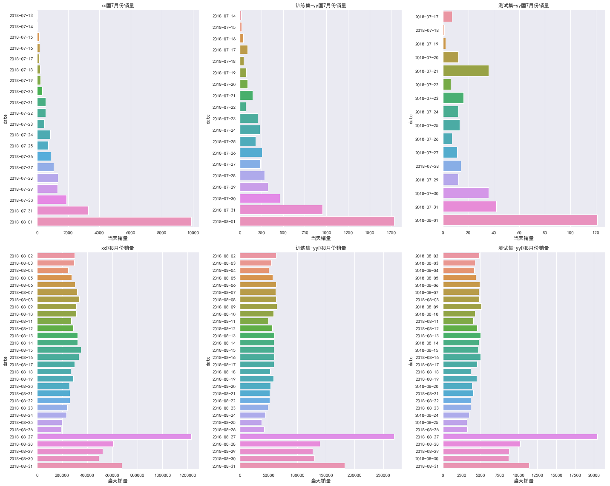


数据放大后看：
* 训练集和测试集在8月份有相似的波动规律，27号出现波峰，当天剧增数据有待下一步探查

#### 每日uv与商品数(去重)


```python
unique = df.groupby(['is_train', 'buyer_country_id', 'date']).agg({'buyer_admin_id':'nunique','item_id':['nunique','size']})
unique.columns = ['uv','商品数(去重)', '销量']
unique = unique.reset_index()
unique = pd.melt(unique, id_vars=['is_train', 'buyer_country_id', 'date'], value_vars=['uv', '商品数(去重)', '销量'])
unique['date'] = unique['date'].astype(str)
unique = unique[unique['date']>='2018-08-02']
```


```python
fig, ax = plt.subplots(3, 1, figsize=(16,8), sharex=True)
sns.lineplot(x='date', y='value', hue='variable', data=unique[(unique['is_train']==1) & (unique['buyer_country_id']=='xx')], 
             estimator=np.mean, ax=ax[0]).set_title('xx国每日销售数据');

sns.lineplot(x='date', y='value', hue='variable', data=unique[(unique['is_train']==0) & (unique['buyer_country_id']=='yy')], 
            estimator=np.mean, ax=ax[1]).set_title('训练集-yy国每日销量');

sns.lineplot(x='date', y='value', hue='variable', data=unique[(unique['is_train']==1) & (unique['buyer_country_id']=='yy')], 
            estimator=np.mean, ax=ax[2]).set_title('测试集-yy国每日销量')
plt.xticks(rotation=90);
```

对每日的uv、商品数和销量作图发现：
* 三者基本上呈正相关，xx国的商品单品销量更高
* 

算法建模
========

## BASELINE

选取用户近30次购买记录作为预测值，越近购买的商品放在越靠前的列，不够30次购买记录的用热销商品5595070填充


```python
test = pd.read_csv('../data/Antai_AE_round1_test_20190626.csv')
tmp = test[test['irank']<=31].sort_values(by=['buyer_country_id', 'buyer_admin_id', 'irank'])[['buyer_admin_id','item_id','irank']]
sub = tmp.set_index(['buyer_admin_id', 'irank']).unstack(-1)
sub.fillna(5595070).astype(int).reset_index().to_csv('../submit/sub.csv', index=False, header=None)
```


```python
# 最终提交文件格式
sub = pd.read_csv('../submit/sub.csv', header = None)
sub.head()
```


userCF
------

新的如何使用trian xx国用户购买次数大于16个以上的跟全部yy过的 一同训练效果会提升到0.095
首先尝试CF方法 基于前分析 train总共有809213用户和2812048 商品，使用itemcf方法：速度比较慢
用户少，应该是用usercf # 可以尝试只用yy国的数据，目前并没有证明xx国数据有效

```python
import datetime
import pandas as pd
import numpy as np
import os
import seaborn as sns
import matplotlib.pyplot as plt
sns.set(style="darkgrid")
plt.rcParams['font.sans-serif']=['SimHei'] #用来正常显示中文标签
plt.rcParams['axes.unicode_minus']=False #用来正常显示
from zipfile import ZipFile
```

```python
import pickle
usingSaved=True
```

```python
#读取item
if not usingSaved:
    output = open('item_attr.pkl', 'wb')
    myzip=ZipFile('data/Antai_AE_round1_item_attr_20190626.zip')
    f=myzip.open('Antai_AE_round1_item_attr_20190626.csv')
    item_attr=pd.read_csv(f)
    f.close()
    myzip.close()
    pickle.dump(item_attr, output)
    output.close()
else:
    item_attr = pickle.load(open('item_attr.pkl', 'rb'), encoding='iso-8859-1')
#     item_attr = pickle.load(open('item_attr.pkl', 'rb'))

#读取train  
if not usingSaved:
    output = open('train.pkl', 'wb')
    myzip=ZipFile('data/Antai_AE_round1_train_20190626.zip')
    f=myzip.open('Antai_AE_round1_train_20190626.csv')
    train=pd.read_csv(f)
    f.close()
    myzip.close()
    train['create_order_time'] = train.create_order_time.apply(lambda x:pd.to_datetime(x))
    train['hour']=train['create_order_time'].dt.hour
    train['date']=train['create_order_time'].dt.day
    train['month']=train['create_order_time'].dt.month
    train['year']=train['create_order_time'].dt.year
    train['month-date'] = train.month.astype(str)+'-'+train.date.astype(str)
    train['count'] = 1
    train['dayofweek']=train['create_order_time'].dt.dayofweek
    train['isweekend']=train['dayofweek'].apply(lambda x:0 if x<5 else 1)
    pickle.dump(train, output)
    output.close()
else:
    train = pickle.load(open('train.pkl', 'rb'),encoding='iso-8859-1')
#     train = pickle.load(open('train.pkl', 'rb'))
    
#读取test
if not usingSaved:
    output = open('test.pkl', 'wb')
    test=pd.read_csv('data/Antai_AE_round1_test_20190626.csv')
    test['create_order_time'] = test.create_order_time.apply(lambda x:pd.to_datetime(x))
    test['hour']=test['create_order_time'].dt.hour
    test['date']=test['create_order_time'].dt.day
    test['month']=test['create_order_time'].dt.month
    test['year']=test['create_order_time'].dt.year
    test['count'] = 1
    test['month-date'] = test.month.astype(str)+'-'+test.date.astype(str)
    test['dayofweek']=test['create_order_time'].dt.dayofweek
    test['isweekend']=test['dayofweek'].apply(lambda x:0 if x<5 else 1)
    pickle.dump(test, output)
    output.close()
else:
    test = pickle.load(open('test.pkl', 'rb'), encoding='iso-8859-1')
submit = pd.read_csv('data/Antai_AE_round1_submit_20190715.csv')
#     test = pickle.load(open('test.pkl', 'rb'))
```

- yy国 有138678用户，926771item

```
trainyy = train[train.buyer_country_id =='yy']
submit.head()
```

```
merge_yy = pd.concat([trainyy,test])

merge_yy.item_id.unique().shape,merge_yy.buyer_admin_id.unique().shape
```

- 融合 yy过的train和test一起学习usercf
- 推荐时候可能会重复购买

```python
import sys
import random
import math
import os
from operator import itemgetter

from collections import defaultdict

random.seed(0)

class UserBasedCF(object):
    ''' TopN recommendation - User Based Collaborative Filtering '''

    # 构造函数，用来初始化
    def __init__(self):
        # 定义 训练集 测试集 为字典类型
        self.trainset = {}
        self.testset = {}
        # 训练集用的相似用户数
        self.n_sim_user = 30
        # 推荐Item数量
        self.n_rec_item = 30

        self.user_sim_mat = {}
        self.item_popular = {}
        self.item_count = 0
        # sys.stderr 是用来重定向标准错误信息的
        print ('相似用户数目为 = %d' % self.n_sim_user, file=sys.stderr)
        print ('推荐Item数目为 = %d' %
               self.n_rec_item, file=sys.stderr)

    # 划分训练集和测试集 pivot用来定义训练集和测试集的比例
    def generate_dataset(self, train,test=None, pivot=0.90):
        ''' load rating data and split it to training set and test set '''
        trainset_len = 0
        testset_len = 0
        if test is None:# 随机分配验证机实验 
            print('算法尝试！')
            for line in train.iterrows():
                user, item, rating = line[1][0],line[1][1],1
                # split the data by pivot
                if random.random() < pivot:
                    self.trainset.setdefault(user, {})
                    self.trainset[user][item] = int(rating)
                    trainset_len += 1
                else:
                    self.testset.setdefault(user, {})
                    self.testset[user][item] = int(rating)
                    testset_len += 1
        else:#真正预测
            print('预测尝试！')
            for line in train.iterrows():
                user, item, rating = line[1][0],line[1][1],1
                # split the data by pivot
                self.trainset.setdefault(user, {})
                self.trainset[user][item] = int(rating)
                trainset_len += 1
            del user,item,rating
            for line in test.iterrows():
                user, item, rating = line[1][0],line[1][1],1
                self.testset.setdefault(user, {})
                self.testset[user][item] = int(rating)
                testset_len += 1
            
        print ('split training set and test set succ')
        print ('train set = %s' % trainset_len)
        print ('test set = %s' % testset_len)
    # 建立物品-用户 倒排表
    def calc_user_sim(self):
        ''' calculate user similarity matrix '''
        # build inverse table for item-users
        # key=itemID, value=list of userIDs who have seen this item
        print ('构建物品-用户倒排表中，请等待......', file=sys.stderr)
        item2users = dict()

        # Python 字典(Dictionary) items() 函数以列表返回可遍历的(键, 值) 元组数组
        for user, items in self.trainset.items():
            for item in items:
                # inverse table for item-users
                if item not in item2users:
                    # 根据商品id 构造set() 函数创建一个无序不重复元素集
                    item2users[item] = set()
                # 集合中值为用户id
                # 数值形如
                # {'914': {'1','6','10'}, '3408': {'1'} ......}
                item2users[item].add(user)
                # 记录电影的流行度
                if item not in self.item_popular:
                    self.item_popular[item] = 0
                self.item_popular[item] += 1
        print ('构建物品-用户倒排表成功', file=sys.stderr)

        # save the total item number, which will be used in evaluation
        self.item_count = len(item2users)
        print ('总共被操作过的物品数目为 = %d' % self.item_count, file=sys.stderr)

        # count co-rated items between users
        usersim_mat = self.user_sim_mat

        print ('building user co-rated items matrix...', file=sys.stderr)
        # 令系数矩阵 C[u][v]表示N(u)∩N（v) ，假如用户u和用户v同时属于K个物品对应的用户列表，就有C[u][v]=K
        for item, users in item2users.items():
            for u in users:
                usersim_mat.setdefault(u, defaultdict(int))
                for v in users:
                    if u == v:
                        continue
                    usersim_mat[u][v] += 1
        print ('build user co-rated items matrix succ', file=sys.stderr)

        # calculate similarity matrix
        print ('calculating user similarity matrix...', file=sys.stderr)
        simfactor_count = 0
        PRINT_STEP = 2000000
        # 循环遍历usersim_mat 根据余弦相似度公式计算出用户兴趣相似度
        for u, related_users in usersim_mat.items():
            for v, count in related_users.items():
                # 以下是公式计算过程
                usersim_mat[u][v] = count / math.sqrt(
                    len(self.trainset[u]) * len(self.trainset[v]))
                #计数 并没有什么卵用
                simfactor_count += 1
                if simfactor_count % PRINT_STEP == 0:
                    print ('calculating user similarity factor(%d)' %
                           simfactor_count, file=sys.stderr)

        print ('calculate user similarity matrix(similarity factor) succ',
               file=sys.stderr)
        print ('Total similarity factor number = %d' %
               simfactor_count, file=sys.stderr)
    # 根据用户给予推荐结果
    def recommend(self, user,predict=False):
        '''定义给定K个相似用户和推荐N个商品'''
        K = self.n_sim_user
        N = self.n_rec_item
        # 定义一个字典来存储为用户推荐的电影
        rank = dict()
        
        watched_items = self.trainset[user]
        # sorted() 函数对所有可迭代的对象进行排序操作。 key 指定比较的对象 ，reverse=True 降序
        for similar_user, similarity_factor in sorted(self.user_sim_mat[user].items(),
                                                      key=itemgetter(1), reverse=True)[0:K]:
            for item in self.trainset[similar_user]:
                # 判断 如果这个商品 该用户已经买过 则跳出循环 ##此处不太成立
#                 if item in watched_items:
#                     continue
                # 记录用户对推荐的电影的兴趣度
                rank.setdefault(item, 0)
                rank[item] += similarity_factor
        # return the N best items
        return sorted(rank.items(), key=itemgetter(1), reverse=True)[0:N]
    def predict(self):
        print('Predict start...')

        N = self.n_rec_item
        #  varables for precision and recall
        hit = 0
        rec_count = 0
        test_count = 0
        # varables for coverage
        all_rec_items = set()
        # varables for popularity
        popular_sum = 0
        predict_result=[]
        for i, user in enumerate(self.testset):
            if i % 500 == 0:
                print ('recommended for %d users' % i)
            rec_items = self.recommend(user,predict=True)
            predict_result.append((user,rec_items))
        print('Predict end...')
        return predict_result
    # 计算 准确略，召回率，覆盖率，流行度
    def evaluate(self):

        ''' print evaluation result: precision, recall, coverage and popularity '''
        print ('Evaluation start...', file=sys.stderr)

        N = self.n_rec_item
        #  varables for precision and recall
        #记录推荐正确的电影数
        hit = 0
        #记录推荐电影的总数
        rec_count = 0
        #记录测试数据中总数
        test_count = 0
        # varables for coverage
        all_rec_items = set()
        # varables for popularity
        popular_sum = 0

        for i, user in enumerate(self.trainset):
            if i % 500 == 0:
                print ('recommended for %d users' % i, file=sys.stderr)
            test_items = self.testset.get(user, {})
            rec_items = self.recommend(user,predict=False)
            for item, _ in rec_items:
                if item in test_items:
                    hit += 1
                all_rec_items.add(item)
                popular_sum += math.log(1 + self.item_popular[item])
            rec_count += N
            test_count += len(test_items)
        # 计算准确度
        precision = hit / (1.0 * rec_count)
        # 计算召回率
        recall = hit / (1.0 * test_count)
        # 计算覆盖率
        coverage = len(all_rec_items) / (1.0 * self.item_count)
        #计算流行度
        popularity = popular_sum / (1.0 * rec_count)

        print ('precision=%.4f\trecall=%.4f\tcoverage=%.4f\tpopularity=%.4f' %
               (precision, recall, coverage, popularity), file=sys.stderr)
```

算法尝试

```python
usercf = UserBasedCF()
usercf.generate_dataset(merge_yy[['buyer_admin_id','item_id']])
usercf.calc_user_sim()
usercf.evaluate()
```

预测尝试

```python
usercf_pred = UserBasedCF()
usercf_pred.generate_dataset(merge_yy[['buyer_admin_id','item_id']],test[['buyer_admin_id','item_id']].drop_duplicates(subset=['buyer_admin_id'], keep='first'))
usercf_pred.calc_user_sim()
output = open('usercf_pred.pkl', 'wb')
pickle.dump(usercf_pred, output)
output.close()
result = usercf_pred.predict()
```

```python
result_df = pd.DataFrame(result,columns=['buyer_admin_id','rec_items'])
result_df['rec_items'] = result_df.rec_items.apply(lambda x:[i[0] for i in x])
result_df['len'] = result_df.rec_items.apply(lambda x:len(x))
result_df[result_df['len'] < 30].head()
```

使用活跃商品填补

```python
popularity_check = usercf_pred.item_popular
popularity_check_sorted = sorted(popularity_check.items(), key=lambda obj: obj[1],reverse=True) 
for i in range(30):
    result_df['predict '+str(i+1)] = result_df.rec_items.apply(lambda x:x[i] if len(x) >i else random.choice( popularity_check_sorted [:100])[0])
result_df[result_df['len']<20].head(2) # 已经填上了

result_df.buyer_admin_id.unique().shape # 跟测试集个数匹配

result_df.sort_values('buyer_admin_id').drop(['rec_items','len'],axis=1).to_csv('user_cf.csv',index=False,header=False)

```


itemCF
------

首先尝试CF方法 基于前分析 train总共有809213用户和2812048 商品，使用itemcf方法：速度比较慢

```python
import datetime
import pandas as pd
import numpy as np
import os
import seaborn as sns
import matplotlib.pyplot as plt
sns.set(style="darkgrid")
plt.rcParams['font.sans-serif']=['SimHei'] #用来正常显示中文标签
plt.rcParams['axes.unicode_minus']=False #用来正常显示
from zipfile import ZipFile

import pickle
usingSaved=True
```

```python
#读取item
if not usingSaved:
    output = open('item_attr.pkl', 'wb')
    myzip=ZipFile('data/Antai_AE_round1_item_attr_20190626.zip')
    f=myzip.open('Antai_AE_round1_item_attr_20190626.csv')
    item_attr=pd.read_csv(f)
    f.close()
    myzip.close()
    pickle.dump(item_attr, output)
    output.close()
else:
    item_attr = pickle.load(open('item_attr.pkl', 'rb'), encoding='iso-8859-1')
#读取train  
if not usingSaved:
    output = open('train.pkl', 'wb')
    myzip=ZipFile('data/Antai_AE_round1_train_20190626.zip')
    f=myzip.open('Antai_AE_round1_train_20190626.csv')
    train=pd.read_csv(f)
    f.close()
    myzip.close()
    train['create_order_time'] = train.create_order_time.apply(lambda x:pd.to_datetime(x))
    train['hour']=train['create_order_time'].dt.hour
    train['date']=train['create_order_time'].dt.day
    train['month']=train['create_order_time'].dt.month
    train['year']=train['create_order_time'].dt.year
    train['month-date'] = train.month.astype(str)+'-'+train.date.astype(str)
    train['count'] = 1
    train['dayofweek']=train['create_order_time'].dt.dayofweek
    train['isweekend']=train['dayofweek'].apply(lambda x:0 if x<5 else 1)
    pickle.dump(train, output)
    output.close()
else:
    train = pickle.load(open('train.pkl', 'rb'),encoding='iso-8859-1')
#读取test
if not usingSaved:
    output = open('test.pkl', 'wb')
    test=pd.read_csv('data/Antai_AE_round1_test_20190626.csv')
    test['create_order_time'] = test.create_order_time.apply(lambda x:pd.to_datetime(x))
    test['hour']=test['create_order_time'].dt.hour
    test['date']=test['create_order_time'].dt.day
    test['month']=test['create_order_time'].dt.month
    test['year']=test['create_order_time'].dt.year
    test['month-date'] = test.month.astype(str)+'-'+test.date.astype(str)
    test['count'] = 1
    train['dayofweek']=train['create_order_time'].dt.dayofweek
    train['isweekend']=train['dayofweek'].apply(lambda x:0 if x<5 else 1)
    pickle.dump(test, output)
    output.close()
else:
    test = pickle.load(open('test.pkl', 'rb'), encoding='iso-8859-1')
```

```python
test.head()
item_attr.head()
train.head()
```

```python
import sys
import random
import math
import os
from operator import itemgetter
from collections import defaultdict

random.seed(44)

class ItemBasedCF(object):
    ''' TopN recommendation - Item Based Collaborative Filtering '''

    def __init__(self):
        self.trainset = {}
        self.testset = {}

        self.n_sim_item = 100
        self.n_rec_item = 30

        self.item_sim_mat = {}
        self.item_popular = {}
        self.item_count = 0

        print('Similar item number = %d' % self.n_sim_item)
        print('Recommended item number = %d' % self.n_rec_item)

    def generate_dataset(self, train,test=None, pivot=0.7):
        ''' load rating data and split it to training set and test set '''
        trainset_len = 0
        testset_len = 0
        if test is None:# 随机分配验证机实验 
            print('算法尝试！')
            for line in train.iterrows():
                user, item, rating = line[1][0],line[1][1],1
                # split the data by pivot
                if random.random() < pivot:
                    self.trainset.setdefault(user, {})
                    self.trainset[user][item] = int(rating)
                    trainset_len += 1
                else:
                    self.testset.setdefault(user, {})
                    self.testset[user][item] = int(rating)
                    testset_len += 1
        else:#真正预测
            print('预测尝试！')
            for line in train.iterrows():
                user, item, rating = line[1][0],line[1][1],1
                # split the data by pivot
                self.trainset.setdefault(user, {})
                self.trainset[user][item] = int(rating)
                trainset_len += 1
            del user,item,rating
            for line in test.iterrows():
                user, item, rating = line[1][0],line[1][1],1
                self.testset.setdefault(user, {})
                self.testset[user][item] = int(rating)
                testset_len += 1
            
        print ('split training set and test set succ')
        print ('train set = %s' % trainset_len)
        print ('test set = %s' % testset_len)

    def calc_item_sim(self):
        ''' calculate item similarity matrix '''
        print('counting items number and popularity...')

        for user, items in self.trainset.items():
            for item in items:
                # count item popularity
                if item not in self.item_popular:
                    self.item_popular[item] = 0
                self.item_popular[item] += 1

        print('count items number and popularity succ')

        # save the total number of items
        self.item_count = len(self.item_popular)
        print('total item number = %d' % self.item_count)

        # count co-rated users between items
        itemsim_mat = self.item_sim_mat
        print('building co-rated users matrix...')

        for user, items in self.trainset.items():
            for m1 in items:
                itemsim_mat.setdefault(m1, defaultdict(int))
                for m2 in items:
                    if m1 == m2:
                        continue
                    itemsim_mat[m1][m2] += 1

        print('build co-rated users matrix succ')

        # calculate similarity matrix
        print('calculating item similarity matrix...')
        simfactor_count = 0
        PRINT_STEP = 2000000

        for m1, related_items in itemsim_mat.items():
            for m2, count in related_items.items():
                itemsim_mat[m1][m2] = count / math.sqrt(
                    self.item_popular[m1] * self.item_popular[m2])
                simfactor_count += 1
                if simfactor_count % PRINT_STEP == 0:
                    print('calculating item similarity factor(%d)' %
                          simfactor_count)

        print('calculate item similarity matrix(similarity factor) succ')
        print('Total similarity factor number = %d' % simfactor_count)

    def recommend(self, user,predict=False):
        ''' Find K similar items and recommend N items. '''
        K = self.n_sim_item
        N = self.n_rec_item
        rank = {}
        if not predict:
            watched_items = self.trainset[user]
        else:
            watched_items = self.testset[user]

        for item, rating in watched_items.items():
            if itemcf.item_sim_mat.get(item,None) is None:
                continue
            for related_item, similarity_factor in sorted(self.item_sim_mat[item].items(),
                                                           key=itemgetter(1), reverse=True)[:K]:
                if related_item in watched_items:
                    continue
                rank.setdefault(related_item, 0)
                rank[related_item] += similarity_factor * rating
        # return the N best items
        return sorted(rank.items(), key=itemgetter(1), reverse=True)[:N]

    def evaluate(self):
        ''' print evaluation result: precision, recall, coverage and popularity '''
        print('Evaluation start...')

        N = self.n_rec_item
        #  varables for precision and recall
        hit = 0
        rec_count = 0
        test_count = 0
        # varables for coverage
        all_rec_items = set()
        # varables for popularity
        popular_sum = 0

        for i, user in enumerate(self.trainset):
            if i % 500 == 0:
                print ('recommended for %d users' % i)
            test_items = self.testset.get(user, {})
            rec_items = self.recommend(user)
            for item, _ in rec_items:
                if item in test_items:
                    hit += 1
                all_rec_items.add(item)
                popular_sum += math.log(1 + self.item_popular[item])
            rec_count += N
            test_count += len(test_items)

        precision = hit / (1.0 * rec_count)
        recall = hit / (1.0 * test_count)
        coverage = len(all_rec_items) / (1.0 * self.item_count)
        popularity = popular_sum / (1.0 * rec_count)

        print ('precision=%.4f\trecall=%.4f\tcoverage=%.4f\tpopularity=%.4f' %
               (precision, recall, coverage, popularity))
    def predict(self):
        print('Predict start...')

        N = self.n_rec_item
        #  varables for precision and recall
        hit = 0
        rec_count = 0
        test_count = 0
        # varables for coverage
        all_rec_items = set()
        # varables for popularity
        popular_sum = 0
        predict_result=[]
        for i, user in enumerate(self.testset):
            if i % 500 == 0:
                print ('recommended for %d users' % i)
            rec_items = self.recommend(user,predict=True)
            predict_result.append((user,rec_items))
        print('Predict end...')
        return predict_result
```

```
itemcf = ItemBasedCF()
```

算法尝试

```python
itemcf.generate_dataset(train[['buyer_admin_id','item_id']][:10000])#随机选择1W个交易记录测试
```

```
itemcf.calc_item_sim()


itemcf.evaluate()
```

预测尝试

```python
itemcf.generate_dataset(train[['buyer_admin_id','item_id']],test[['buyer_admin_id','item_id']])
```

```
itemcf.calc_item_sim()
```

```
output = open('itemcf.pkl', 'wb')
pickle.dump(itemcf, output)
output.close()
```

```
result = itemcf.predict()
```

```python
result_df = pd.DataFrame(result,columns=['buyer_admin_id','rec_items'])
result_df['rec_items'] = result_df.rec_items.apply(lambda x:[i[0] for i in x])
```

```
result_df['len'].value_counts()[:5]
```

使用活跃商品填补

```python
popularity_check = itemcf.item_popular

popularity_check_sorted = sorted(popularity_check.items(), lambda x, y: cmp(x[1], y[1]), reverse=True) 


for i in range(30):
    result_df['predict '+str(i+1)] = result_df.rec_items.apply(lambda x:x[i] if len(x) >i else random.choice( popularity_check_sorted [:100])[0])


result_df[result_df['len']<20].head(2)

result_df[result_df.buyer_admin_id.isin(test.buyer_admin_id.unique())].drop(['rec_items','len'],axis=1).to_csv('username.csv',index=False,header=False)
```


SVD 
----

```python
import numpy as np
import pandas as pd
import tensorflow as tf
from tfcf.metrics import mae  # 需要安装这个包；最上面有link
from tfcf.metrics import rmse
from tfcf.datasets import ml1m
from tfcf.config import Config
from svd import SVD
from tfcf.models.svdpp import SVDPP
from sklearn.model_selection import train_test_split
from zipfile import ZipFile
```

```python
import numpy as np
import tensorflow as tf

try:
    from tensorflow.keras import utils
except:
    from tensorflow.contrib.keras import utils
from tfcf.models.model_base import BaseModel
from tfcf.utils.data_utils import BatchGenerator
from tfcf.metrics import mae
from tfcf.metrics import rmse

class SVD(BaseModel):
    """Collaborative filtering model based on SVD algorithm.
    """

    def __init__(self, config, sess):
        super(SVD, self).__init__(config)
        self._sess = sess

    def _create_placeholders(self):
        """Returns the placeholders.
        """
        with tf.variable_scope('placeholder'):
            users = tf.placeholder(tf.int32, shape=[None, ], name='users')
            items = tf.placeholder(tf.int32, shape=[None, ], name='items')
            ratings = tf.placeholder(
                tf.float32, shape=[None, ], name='ratings')

        return users, items, ratings

    def _create_constants(self, mu):
        """Returns the constants.
        """
        with tf.variable_scope('constant'):
            _mu = tf.constant(mu, shape=[], dtype=tf.float32)

        return _mu

    def _create_user_terms(self, users):
        """Returns the tensors related to users.
        """
        num_users = self.num_users
        num_factors = self.num_factors

        with tf.variable_scope('user',reuse=tf.AUTO_REUSE):
            self.user_embeddings = tf.get_variable(
                name='embedding',
                shape=[num_users, num_factors],
                initializer=tf.contrib.layers.xavier_initializer(),
                regularizer=tf.contrib.layers.l2_regularizer(self.reg_p_u))

            self.user_bias = tf.get_variable(
                name='bias',
                shape=[num_users, ],
                initializer=tf.contrib.layers.xavier_initializer(),
                regularizer=tf.contrib.layers.l2_regularizer(self.reg_b_u))

            p_u = tf.nn.embedding_lookup(
                self.user_embeddings,
                users,
                name='p_u')

            b_u = tf.nn.embedding_lookup(
                self.user_bias,
                users,
                name='b_u')

        return p_u, b_u

    def _create_item_terms(self, items):
        """Returns the tensors related to items.
        """
        num_items = self.num_items
        num_factors = self.num_factors

        with tf.variable_scope('item',reuse=tf.AUTO_REUSE):
            self.item_embeddings = tf.get_variable(
                name='embedding',
                shape=[num_items, num_factors],
                initializer=tf.contrib.layers.xavier_initializer(),
                regularizer=tf.contrib.layers.l2_regularizer(self.reg_q_i))

            self.item_bias = tf.get_variable(
                name='bias',
                shape=[num_items, ],
                initializer=tf.contrib.layers.xavier_initializer(),
                regularizer=tf.contrib.layers.l2_regularizer(self.reg_b_i))

            q_i = tf.nn.embedding_lookup(
                self.item_embeddings,
                items,
                name='q_i')

            b_i = tf.nn.embedding_lookup(
                self.item_bias,
                items,
                name='b_i')

        return q_i, b_i
    def _get_item_terms(self):
        """Returns the tensors related to items.
        """
        import pickle
        saver = tf.train.Saver()
        item_embeddings = self.item_embeddings.eval()
        saver_path = saver.save(self._sess, './')
        print("saver path: ",saver_path)
        with open('./item_embeddings.pkl', 'wb') as fw:
            pickle.dump({'embeddings': item_embeddings}, fw)

    def _create_prediction(self, mu, b_u, b_i, p_u, q_i):
        """Returns the tensor of prediction.

           Note that the prediction 
            r_hat = \mu + b_u + b_i + p_u * q_i
        """
        with tf.variable_scope('prediction'):
            pred = tf.reduce_sum(
                tf.multiply(p_u, q_i),
                axis=1)

            pred = tf.add_n([b_u, b_i, pred])

            pred = tf.add(pred, mu, name='pred')

        return pred

    def _create_loss(self, pred, ratings):
        """Returns the L2 loss of the difference between
            ground truths and predictions.

           The formula is here:
            L2 = sum((r - r_hat) ** 2) / 2
        """
        with tf.variable_scope('loss'):
            loss = tf.nn.l2_loss(tf.subtract(ratings, pred), name='loss')

        return loss

    def _create_optimizer(self, loss):
        """Returns the optimizer.

           The objective function is defined as the sum of
            loss and regularizers' losses.
        """
        with tf.variable_scope('optimizer'):
            objective = tf.add(
                loss,
                tf.add_n(tf.get_collection(
                    tf.GraphKeys.REGULARIZATION_LOSSES)),
                name='objective')

            try:
                optimizer = tf.contrib.keras.optimizers.Nadam(
                ).minimize(objective, name='optimizer')
            except:
                optimizer = tf.train.AdamOptimizer().minimize(objective, name='optimizer')

        return optimizer

    def _build_graph(self, mu):
        _mu = self._create_constants(mu)

        self._users, self._items, self._ratings = self._create_placeholders()

        p_u, b_u = self._create_user_terms(self._users)
        q_i, b_i = self._create_item_terms(self._items)

        self._pred = self._create_prediction(_mu, b_u, b_i, p_u, q_i)

        loss = self._create_loss(self._ratings, self._pred)

        self._optimizer = self._create_optimizer(loss)

        self._built = True

    def _run_train(self, x, y, epochs, batch_size, validation_data):
        train_gen = BatchGenerator(x, y, batch_size)
        steps_per_epoch = np.ceil(train_gen.length / batch_size).astype(int)

        self._sess.run(tf.global_variables_initializer())

        for e in range(1, epochs + 1):
            print('Epoch {}/{}'.format(e, epochs))

            pbar = utils.Progbar(steps_per_epoch)

            for step, batch in enumerate(train_gen.next(), 1):
                users = batch[0][:, 0]
                items = batch[0][:, 1]
                ratings = batch[1]

                self._sess.run(
                    self._optimizer,
                    feed_dict={
                        self._users: users,
                        self._items: items,
                        self._ratings: ratings
                    })

                pred = self.predict(batch[0])

                update_values = [
                    ('rmse', rmse(ratings, pred)),
                    ('mae', mae(ratings, pred))
                ]

                if validation_data is not None and step == steps_per_epoch:
                    valid_x, valid_y = validation_data
                    valid_pred = self.predict(valid_x)

                    update_values += [
                        ('val_rmse', rmse(valid_y, valid_pred)),
                        ('val_mae', mae(valid_y, valid_pred))
                    ]

                pbar.update(step, values=update_values)

    def train(self, x, y, epochs=100, batch_size=1024, validation_data=None):

        if x.shape[0] != y.shape[0] or x.shape[1] != 2:
            raise ValueError('The shape of x should be (samples, 2) and '
                             'the shape of y should be (samples, 1).')

        if not self._built:
            self._build_graph(np.mean(y))

        self._run_train(x, y, epochs, batch_size, validation_data)
        self._get_item_terms()

    def predict(self, x):
        if not self._built:
            raise RunTimeError('The model must be trained '
                               'before prediction.')

        if x.shape[1] != 2:
            raise ValueError('The shape of x should be '
                             '(samples, 2)')

        pred = self._sess.run(
            self._pred,
            feed_dict={
                self._users: x[:, 0],
                self._items: x[:, 1]
            })

        pred = pred.clip(min=self.min_value, max=self.max_value)

        return pred

```

```python
train_counts = train.groupby(['buyer_admin_id','item_id'])['count'].sum().reset_index()


train_counts['count_ratio']=train_counts['count']/1271.0


train_counts.head()


```

```python
train_counts.buyer_admin_id.min(),train_counts.buyer_admin_id.max() # 次数对不上embedding，使用labelencoder规范化
```

```python
from sklearn import preprocessing
le_buyer = preprocessing.LabelEncoder()
le_buyer.fit(train_counts.buyer_admin_id.unique()) 
le_item = preprocessing.LabelEncoder()
le_item.fit(train_counts.item_id.unique()) 
```

```python
train_counts['buyer'] = le_buyer.transform(train_counts.buyer_admin_id.values)
train_counts['item'] = le_item.transform(train_counts.item_id.values)


train_counts['buyer'] = train_counts['buyer']+1
train_counts['item'] = train_counts['item']+1

train_counts.head()


x,y=train_counts[['buyer','item']].values,train_counts.count_ratio.values
```

算法尝试

购买次数越多的推荐的概率越高，来学习item的embedding 层，svd的pq

```python
# Note that x is a 2D numpy array, 
# x[i, :] contains the user-item pair, and y[i] is the corresponding rating.
x_train, x_test, y_train, y_test = train_test_split(
    x, y, test_size=0.2, random_state=0)

config = Config()
config.num_users = np.max(x[:, 0]) + 1
config.num_items = np.max(x[:, 1]) + 1
config.min_value = np.min(y)
config.max_value = np.max(y)

with tf.Session() as sess:
    # For SVD++ algorithm, if `dual` is True, then the dual term of items' 
    # implicit feedback will be added into the original SVD++ algorithm.
    # model = SVDPP(config, sess, dual=False)
    # model = SVDPP(config, sess, dual=True)
    model = SVD(config, sess)# 给模型加了保存embedding的一个功能
    model.train(x_train, y_train, validation_data=(
        x_test, y_test), epochs=2, batch_size=8092)
        
    y_pred = model.predict(x_test)
    print('rmse: {}, mae: {}'.format(rmse(y_test, y_pred), mae(y_test, y_pred)))
        
    # Save model
    model.save_model('model/')
```

预测尝试

购买次数越多的推荐的概率越高，来学习item的embedding 层，svd的pq

- 使用knn找到最相似的item

```python
import pickle
with open('./item_embeddings.pkl', 'rb') as fr:
    data = pickle.load(fr)
    final_embeddings = data['embeddings']


test_counts = test[test.item_id.isin(train.item_id.unique())].groupby(['buyer_admin_id','item_id']).agg({'count':'sum','irank':'max'}).reset_index()
test_counts['item'] = le_item.transform(test_counts.item_id.values)


test_counts.head()


from sklearn.neighbors import NearestNeighbors
nbrs = NearestNeighbors(n_neighbors=31, algorithm='ball_tree').fit(final_embeddings)


test_final_embeddings=[]
for line in test_counts.iterrows():
    test_final_embeddings.append(final_embeddings[line[1]['item']])


len(test_final_embeddings)


# 比较费时间
distances, indices = nbrs.kneighbors(test_final_embeddings) # 已经按照距离排好序了


indices_inversed = le_item.inverse_transform(indices)


indices_inversed_str = [str(li) for li in indices_inversed]


indices_inversed[:,0]


for i in range(indices_inversed.shape[1]):
    test_counts['recomend_'+str(i)] = indices_inversed[:,i]


test_counts.head()


test_counts.to_csv('test_counts.csv',index=False,encoding='gbk')

```

- 从最优购买的前几个item中选择30个；第一个选15个剩下3个都选5个的思路

```
test_counts = pd.read_csv('test_counts.csv')

test_counts.head()
```

```python
test_counts.groupby('buyer_admin_id').apply(lambda t: t[t.irank==t.irank.min()]).reset_index(drop=True).drop(['item_id','count','irank','item','rec_items_labled','recomend_0'],axis=1).to_csv('username_svd.csv',index=False,header=False,encoding='gbk')
```

