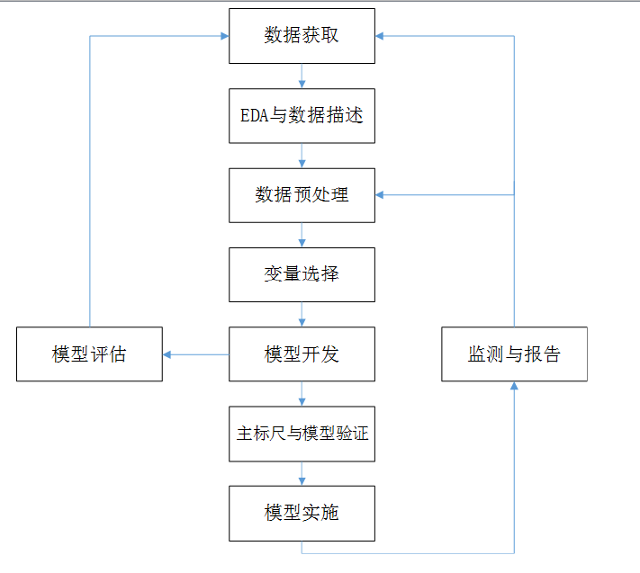
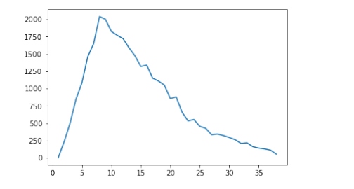
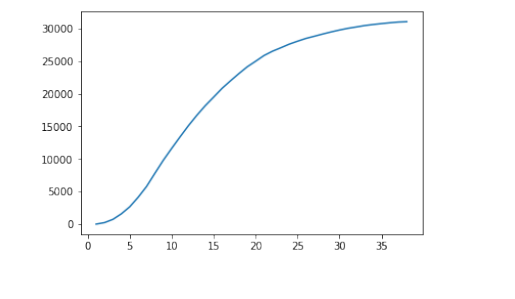
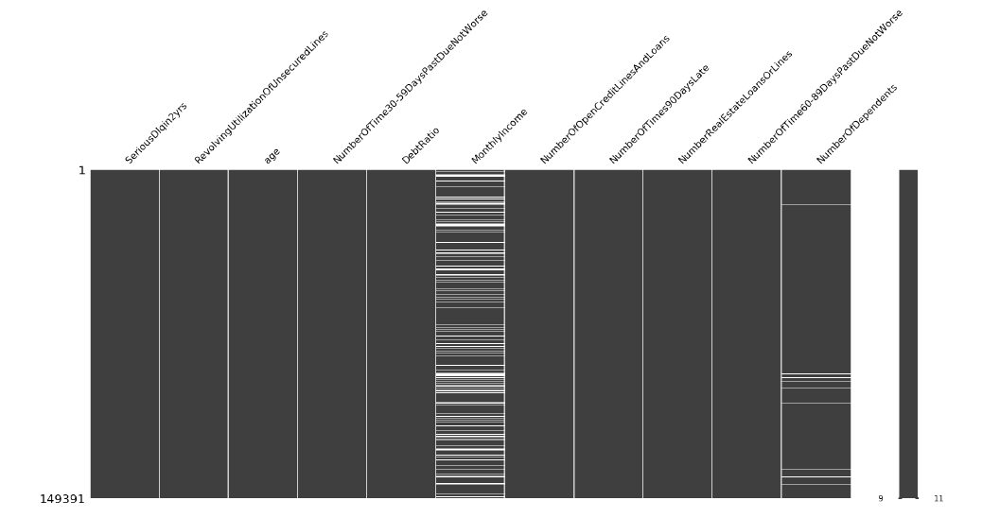
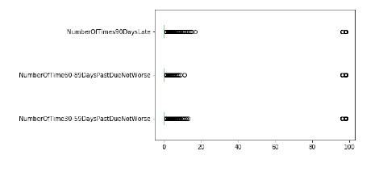
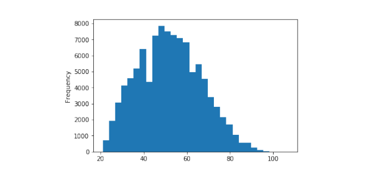
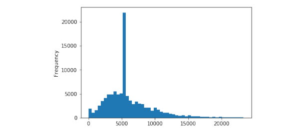
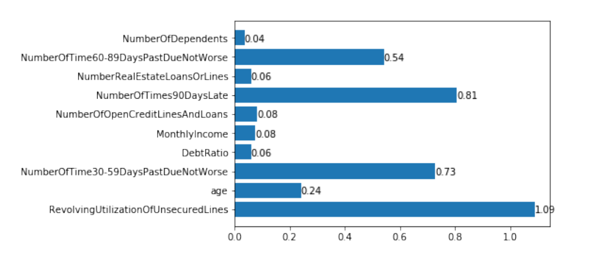
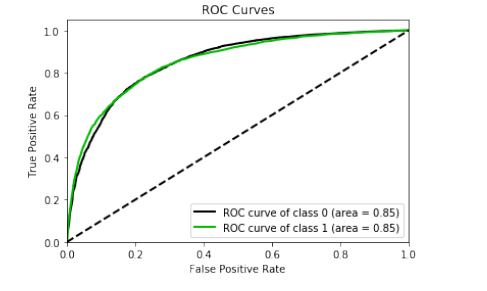

超详细——Python信用评分卡项目
============================

[TOC]

项目背景
========

信用风险和评分卡模型的基本概念 
-------------------------------

信用风险指的是交易对手未能履行约定合同中的义务造成经济损失的风险，即受信人不能履行还 本付息的责任而使授信人的预期收益与实际收益发生偏离的可能性，它是金融风险的主要类型。

借贷场景中的评分卡是一种以分数的形式来衡量风险几率的一种手段，也是对未来一段时间内违约、逾期、 失联概率的预测。一般来说，分数越高，风险越小。

 信用风险计量体系包括主体评级模型和债项评级两部分。主体评级和债项评级均有一系列评级模 型组成，其中主体评级模型可用「四张卡」来表示，分别是 A 卡、B 卡、C 卡和 F 卡；

债项评级模型通 常按照主体的融资用途，分为企业融资模型、现金流融资模型和项目融资模型等。

 • A 卡：又称为申请者评级模型，主要应用于相关融资类业务中新用户的主体评级，适用于个人和 机构融资主体。

 • B 卡：又称为行为评级模型，主要应用于相关融资类业务中存量客户在续存期内的管理，如对客 户可能出现的逾期、延期等行为进行预测，仅适用于个人融资主体。

 • C 卡：又称为催收评级模型，主要应用于相关融资类业务中存量客户是否需要催收的预测管理，仅 适用于个人融资主体。

 • F 卡：又称为欺诈评级模型，主要应用于相关融资类业务中新客户可能存在的欺诈行为的预测管 理，适用于个人和机构融资主体。 本项目主要为申请者评分模型的开发过程。


信用风险评级模型开发流程
------------------------

典型的评级模型开发流程如图所示。该流程中各个步骤的顺序可根据具体情况的不同进行适当调整，也可以根据需要重复某些步骤。

信用风险评级模型的主要开发流程如下：



1. 数据获取，包括获取存量客户及潜在客户的数据。存量客户是指已经在证券公司开展相关融资类 业务的客户，包括个人客户和机构客户；潜在客户是指未来拟在证券公司开展相关融资类业务的 客户，主要包括机构客户，这也是解决证券业样本较少的常用方法，这些潜在机构客户包括上市 公司、公开发行债券的发债主体、新三板上市公司、区域股权交易中心挂牌公司、非标融资机构 等。 
2. EDA（探索性数据分析）与数据描述，该步骤主要是获取样本总体的大概情况，以便制定样本总 体的数据预处理方法。描述样本总体情况的指标主要有缺失值情况、异常值情况、平均值、中位 数、最大值、最小值、分布情况等。
3. 数据预处理，主要工作包括数据清洗、缺失值处理、异常值处理，主要是为了将获取的原始数据 转化为可用作模型开发的格式化数据。 
4. 变量选择，该步骤主要是通过统计学的方法，筛选出对违约状态影响最显著的指标。
5. 模型开发，该步骤主要包括变量分段、变量的 WOE（证据权重）变换和逻辑回归估算三部分。
6. 主标尺与模型验证，该步骤主要是开发某类主体的主标尺并进行模型的验证与校准。 
7. 模型评估，该步骤主要是根据模型验证和主标尺设计的结果，评估模型的区分能力、预测能力、稳 定性，并形成模型评估报告，得出模型是否可以使用的结论。
8. 模型实施，即模型的部署和应用。
9. 监测与报告，该步骤主要工作是定期检测模型的使用情况，并关注和定期检验模型的区分能力与 预测能力的变化及模型稳定性的变化，在出现模型可能不能满足业务需求的情况时，反馈至模型 开发团队，及时进行模型更新或重新开发。


业务场景定义
============

我们做预测模型的一个基本原理是用历史数据来预测未来，申请者评分模型需要解决的问题是未 来一段时间（如 12 个月）融资人出现违约（如至少一次 90 天或 90 天以上逾期）的概率。

在这个需求 中，「未来一段时间」为表现时间窗口 (performance window)，「融资人出现至少一次 90 天或 90 天以 上逾期」为观察时间窗口 (sample window)。个人主体的违约跟个人行为习惯有很大的相关性，因此我 们可以通过分析个人样本总体中客户的历史的违约频率来确定表现时间窗口和观察时间窗口。

这两个 窗口的确定对于我们要解决的问题，有着非常重要的影响，我们将放在后续步骤中结合具体的数据来分析，并讲述具体的确定方法。


定义观察时间窗口
----------------

对于违约的时长的定义（观察时间窗口）可以简单的使用基本的业务逻辑来定义，也可以通过一定 的统计方法来确定，一般而言为了避免偏差会使用使用统计方法作为验证，这里我们通过查看历史上违 约的情况分析定义什么样的情况下才定义为违约比较合适。 

取订单审批日 (APPLY_DT) 在 2015 年 1 月 1 日之后的 2017 年 10 月 31 日之前的所有订单号，取 所有订单号对应的所有的逾期详情的记录（最后的截至时间为 201805）： 

逾期阶段详情表：

```python
import numpy as np
import pandas as pd
sample_window =pd.read_csv("./data/CreditSampleWindow.csv",encoding="utf8")
print(sample_window.columns.values)

sample_window.shape

sample_window.info()

sample_window.head()
```


```python
# 查看缺失值情况
sample_window.isnull().sum()/sample_window.shape[
# sample_window.isnull().mean()
```


```python
# 去除所有的完全重复行
sample_window.drop_duplicates(inplace=True)
sample_window.shape
```


```python
# 去除没有逾期阶段记录的信息
sample_window.dropna(subset=['STAGE_BEF','STAGE_AFT'], inplace=True)
sample_window.shape
```


取每个 ID 每个月份内的最高逾期记录作为该月份的逾期指标，记录中只有从低阶段到高阶段的记录，因此用 _AFT 字段作为该月的指标。

```python
sample_window["START_MONTH"] = sample_window.START_DATE.apply(lambda x: int(x//100))
sample_window["CLOSE_MONTH"] = sample_window.CLOSE_DATE.apply(lambda x: int(x//100))
sample_window["AFT_FLAG"] = sample_window.STAGE_AFT.apply(lambda x: int(x[-1]))
sample_window.head()
```

```python
# 将 CLOSE_DATE 为空的数据填补为 201805。（根据数据缺失的业务背景确定）
sample_window.loc[sample_window.CLOSE_MONTH == 0,"CLOSE_MONTH"] = 201805
生成单个订单的流水
# 提取 ID、月份、月份对应状态作为新的数据
overdue = sample_window.loc[:,["CID","START_MONTH","AFT_FLAG"]]\
.rename(columns={"START_MONTH":"CLOSE_MONTH"})\
.append(sample_window.loc[:,["CID","CLOSE_MONTH","AFT_FLAG"]],
ignore_index=True)
# 生成每个订单的逾期信息
overdue = overdue.sort_values(by=["CID","CLOSE_MONTH","AFT_FLAG"])\
.drop_duplicates(subset=["CID","CLOSE_MONTH"],keep="last")\
.set_index(["CID","CLOSE_MONTH"]).unstack(1)
overdue.columns = overdue.columns.droplevel()
In [17]: # overdue.head()

# 构建转移矩阵，横坐标（行）表示转移前状态，纵坐标（列）表示下一个月状态（转移后）, 选取连续两个月的有记录的，记录逾期阶段迁移，计算 count 录入转移矩阵。
import collections
def get_mat(df):
"""
构建转移矩阵，索引表示转移前的逾期状态，
列名表示转移后的逾期状态。
"""
    trans_mat = pd.DataFrame(data=0,
        columns=range(0,10),
        index=range(0,10))
        counter = collections.Counter()

    for i,j in zip(df.columns,df.columns[1:]):
    	select = (df[i].notnull()) & (df[j].notnull())
    	counter += collections.Counter(tuple(x)
    		for x in df.loc[select, [i,j]].values)
    		
	for key in counter.keys():
			trans_mat.loc[key[0],key[1]] = counter[key]
	trans_mat["all_count"] = trans_mat.apply(sum, axis=1)
	bad_count = []
	for j in range(10):
		bad_count.append(trans_mat.iloc[j,j+1:10].sum())
	trans_mat["bad_count"] = bad_count
    trans_mat["to_bad"] =trans_mat["bad_count"]/trans_mat["all_count"]
	return trans_mat
```

定义表现时间窗口
----------------

在开发信用风险评分卡模型时，需要选择客户违约处于稳定状态的时间点来作为最优表现时间窗 口，这样既可以最大限度地降低模型的不稳定性，也可以避免低估最终的违约样本的比率。通过逾期表 的数据来统计推断最合适的表现窗口。

```python
first_use = pd.read_csv("./data/CreditFirstUse.csv",encoding="utf8")
first_use.set_index("CID",inplace=True)
first_use["FST_USE_MONTH"] = first_use.FST_USE_DT.map(lambda x:x//100)
first_use.head()

def get_first_overdue(ser):
    array = np.where(ser >= 2)[0]
    if array.size > 0:
		return array[0]
	else:
			return np.nan
```

```python
OVERDUE_INDEX = overdue.apply(get_first_overdue,axis=1)
# 用时约 1 ～ 2 分钟
first_use["OVERDUE_INDEX"] = OVERDUE_INDEX
first_use["START_INDEX"] = first_use.FST_USE_MONTH.map({k:v
for v,k in enumerate(overdue.columns)})
first_use.loc[first_use.OVERDUE_INDEX.notnull()].head()
# 查看异常数据
first_use[first_use.OVERDUE_INDEX < first_use.START_INDEX]

month_count = (first_use.OVERDUE_INDEX - first_use.START_INDEX).value_counts().sort_index()[1:]
month_count.plot();
```



```
month_count.cumsum().plot()
```



此处能看出来，该产品的定义逾期较适合定义在首 15 期之后。


数据预处理
==========

```
# 数据属于个人消费类贷款，详细的数据介绍参照数据字典(DataDictionary.xls)。

 # 载入数据
train_data = pd.read_csv("./data/cs-training.csv",index_col=0)
# 查看数据分布
train_data.describe().T

train_data.info()

train_data.notnull().sum()/train_data.shape[0]

# 删除重复项
train_data.drop_duplicates(inplace=True)
```


缺失值处理
----------

在提缺失值之前简单说明一下关于错误值的情况，错误值一般是数据本身错误和逻辑上有错误，有
时会使用缺失值替代掉错误值。缺失值在现实问题中非常普遍，常见的缺失值处理的方法包括如下几种：

1. 直接删除含有缺失值的样本
2. 使用普通的统计方法或根据业务经验填补
3. 将缺失值作为一个单独的独立编码
4. 使用算法进行填补，如果需要较好的可视化缺失值的缺失状况，可以使用绘制缺失值的包来完成：

```
import missingno as msno
msno.matrix(train_data)
```

注意：在实际业务当中，多数情况下会采取 1、2 和 3，较少采取方法 4使用模型填补缺失数据在实际业务中慎用，多数情况下这样的做法仅仅是尝试性的参考这里我们简单的使用中位数进行填补。



```python
train_data.MonthlyIncome.fillna(value=median, inplace=True)
```

NumberOfDependents 变量缺失值比较少，可以考虑直接删除。

异常值处理
----------

异常值一般是从统计上看起来异常，但是很多时候并不代表这条数据是错误的，可能只是这条观测
和普遍情况不同而已，处理时需要谨慎。这里举一例 age 字段中包含有为 0 的值，通常认为该值为异常
值，查看数据可以发现仅有一条数据年龄为 0，因此可以直接删除。

```python
train_data = train_data.loc[train_data.age>0]
# 还可以通过简单的可视化来查看异常值
import matplotlib.pyplot as plt
columns = ["NumberOfTime30-59DaysPastDueNotWorse",
           "NumberOfTime60-89DaysPastDueNotWorse",
           "NumberOfTimes90DaysLate"]
train_data[columns].plot.box(vert=False);
plt.xticks(rotation=90);
```



从业务上考虑，不应当出现这样的高的次数，这里同样删除掉这些异常数据。

```python
for col in columns:
    train_data = train_data.loc[train_data[col] < 90]
    
train_data.info()
```

数据集划分
----------

数据集的划分原则上应当在缺失值和异常值处理之前就进行，也就是说从数据预处理阶段开始，验 证集和测试集就不应参与到模型构建的各个阶段中来，而应仅使用训练集得到的信息，这样才能有效严 谨的保证模型验证和评估不会出现潜在的过拟合问题。此外，因为评分卡与其他机器学习略有区别，评 分卡的数据是带有时间因素的而并非单纯的截面数据，因此，在划分数据集的时候，应当使用更早时间 段的数据作为训练集，稍晚和最晚的时间段的数据分别作为验证集和测试集。同时，合理划分数据集后 应当保证训练集、验证集和测试集和数据分布应当相同。（使用指标请参考模型监控部分的 PSI 指标）

此处简单化处理数据仅随机划分为训练集和验证集，训练集用于提供模型训练，验证集用于提供模
型调整。（请注意，原则上需要考虑时间窗口且要有测试集来做最后的模型评估。）

```python
from sklearn.model_selection import train_test_split

Y = train_data['SeriousDlqin2yrs']
X = train_data.iloc[:, 1:]
X_train, X_vali, Y_train, Y_vali = train_test_split(X, Y, test_size=0.3)
model_data = pd.concat([Y_train, X_train], axis=1)
vali_data = pd.concat([Y_vali, X_vali], axis=1)
```

探索性数据分析
--------------

```python
# 查看数据分布
# model_data.describe([.01,.1,.25,.5,.75,.9,.99]).T
model_data["SeriousDlqin2yrs"].value_counts()

# 考虑是否需要进行样本平衡
model_data["age"].plot.hist(bins=30);
```



```python
# 可以看出收入有少部分人非常高，使用小于 99% 的分位数的数据查看收入分布
income = model_data["MonthlyIncome"]
income.loc[income < 23334].plot.hist(bins=50);
```



变量选择
========

在进行模型开发时，并非我们收集的每个指标都会用作模型开发，而是需要从收集的所有指标中筛 选出对违约状态影响最大的指标，作为入模指标来开发模型。特征变量选择非常重要，好的特征选择能 够很好的提升模型的性能。我们采用信用卡评分模型常用的 IV 值进行筛选。

对数据分箱
----------

变量分为连续变量和分类变量。在评分卡建模中，变量分箱 (binning) 是对连续变量离散化 (dis-cretization) 的一种称呼。要将 logistic 模型转换为标准评分卡的形式，这一环节是必须完成的。

信用评分卡开发中一般有常用的等距分段、等深分段、最优分段。
分箱一般原则：
• 组间差异大
• 组内差异小
• 每组占比不低于 5%
• 必须有好、坏两种分类

• $WOE $值的定义
$WOE $(weight of Evidence) 字面意思证据权重，对分箱后的每组进行计算。假设 good 为好客户（未违约），bad 为坏客户（违约）。
$$
W O E_{i}=\ln \frac{P\left(y_{i}\right)}{P\left(n_{i}\right)}=\ln \frac{(\frac{y_{i}}{y})}{(\frac{n_{i}}{n})}
$$
$P\left(y_{i}\right)​$代表第i组中，违约样本占所有违约样本的比例；

$P\left(n_{i}\right)$代表第i组中，未违约样本占所有未违约样本比例；

$y$：所有违约样本数；

$n$：所有未违约样本数。


$$
\begin{array}{l}{I V_{t}=\left(P\left(y_{i}\right)-P\left(n_{i}\right)\right)^{*} W O E_{i}} \\ {
I V=\sum_{i=1}^{N}{I V_{t}}}\end{array}
$$
$N$为分组的组数，$IV $可用来表示一个变量的预测能力。

| $IV$             | 预测能力   |
| ---------------- | ---------- |
| $<0.03$          | 无预测能力 |
| $0.03 \sim 0.09$ | 低         |
| $0.1 \sim 0.29$  | 中         |
| $0.3 \sim 0.49$  | 高         |
| $\geq0.5$        | 极高且可疑 |

可根据 IV 值来调整分箱结构并重新计算 WOE 和 IV。

但并不完全是 IV 值越大越好，还需要考虑 分组数量合适，并且当 IV 值大于 0.5 时，我们需要对这个特征打个疑问，

因为它过于太好而显得不够 真实。通常我们会选择 IV 值在 0.1~0.5 这个范围的特征。多数时候分箱都需要手动做一些调整。

```python
from auto_bin import AutoBins
bins_data = AutoBins(model_data, "SeriousDlqin2yrs")
model_data.columns
Index(['SeriousDlqin2yrs'
       , 'RevolvingUtilizationOfUnsecuredLines'
       , 'age'
       ,'NumberOfTime30-59DaysPastDueNotWorse'
       , 'DebtRatio', 'MonthlyIncome'
       ,'NumberOfOpenCreditLinesAndLoans'
       , 'NumberOfTimes90DaysLate'
       ,'NumberRealEstateLoansOrLines'
       , 'NumberOfTime60-89DaysPastDueNotWorse'
       ,'NumberOfDependents'],
dtype='object')
# 分析过程中手动完成分箱个数的添加
bins_num = {
    "RevolvingUtilizationOfUnsecuredLines":5,
    "age":5,
    "NumberOfTime30-59DaysPastDueNotWorse":3,
    "DebtRatio":5,
    "MonthlyIncome":6,
    "NumberOfOpenCreditLinesAndLoans":4,
    "NumberOfTimes90DaysLate":2,
    "NumberRealEstateLoansOrLines":4,
    "NumberOfTime60-89DaysPastDueNotWorse":2,
    "NumberOfDependents":4,}

# 通过下面的函数来完成分箱个数的判断 箱体是前开后闭
num_bins, woe_df, iv = bins_data.auto_bins("age",n=4)
```

```python
In [64]: # 通过下面的函数来完成分箱个数的判断 箱体是前开后闭
num_bins, woe_df, iv = bins_data.auto_bins("age",n=4)
'''对 age 列进行分箱:
分组个数: 20iv 值: 0.2460424884603194
分组个数: 19iv 值: 0.24604239153117852
分组个数: 18iv 值: 0.24604233764454297
分组个数: 17iv 值: 0.24602220882769507
分组个数: 16iv 值: 0.24601187879397773
分组个数: 15iv 值: 0.24599566110677326
分组个数: 14iv 值: 0.24595580486731466
分组个数: 13iv 值: 0.24592575551937854
分组个数: 12iv 值: 0.24587171666987812
分组个数: 11iv 值: 0.24569564649194137
分组个数: 10iv 值: 0.24545558881492197
分组个数: 09iv 值: 0.24512723946904097
分组个数: 08iv 值: 0.2446491369109793
分组个数: 07iv 值: 0.24425983803681872
分组个数: 06iv 值: 0.24381325554105876
分组个数: 05iv 值: 0.24044708257628417
分组个数: 04iv 值: 0.23455656193696597
最后分箱情况:
分组个数: 04iv 值: 0.23455656193696597
分组 woe 情况：
minmaxcount_0count_1totalpercentagebad_rate
0-inf36.000000143091768160770.1580100.109971
136.00000056.000000429243673465970.4579690.078825
256.00000062.00000013276695139710.1373110.049746
362.000000inf24420682251020.2467100.027169\
woe
0 -0.542523
1 -0.175141
20.316238
30.944565
'''
```

保存所有的分箱对应的 iv 值:

```python
info_values = {}
woe_values = {}
bins_values = {}
for key in bins_num:
	num_bins, woe_df, iv = bins_data.auto_bins(key,n=bins_num[key], show_iv=False)
	info_values[key] = iv
	woe_values[key] = woe_df
	bins_values[key] = [x[0] for x in num_bins] + [float("inf")]
	
#对 RevolvingUtilizationOfUnsecuredLines 列进行分箱:
#对 age 列进行分箱:
#对 NumberOfTime30-59DaysPastDueNotWorse 列进行分箱:
#对 DebtRatio 列进行分箱:
#对 MonthlyIncome 列进行分箱:
#对 NumberOfOpenCreditLinesAndLoans 列进行分箱:
#对 NumberOfTimes90DaysLate 列进行分箱:
#对 NumberRealEstateLoansOrLines 列进行分箱:
#对 NumberOfTime60-89DaysPastDueNotWorse 列进行分箱:
#对 NumberOfDependents 列进行分箱:
```

**分箱的重要性及其优势**

1.离散特征的增加和减少都很容易，易于模型的快速迭代；

2.稀疏向量内积乘法运算速度快，计算结果方便存储，容易扩展；

3.离散化后的特征对异常数据有很强的鲁棒性：比如一个特征是年龄>30是1，否则0。如果特征没有离散化，一个异常数据“年龄300岁”会给模型造成很大的干扰；

4.逻辑回归属于广义线性模型，表达能力受限；单变量离散化为N个后，每个变量有单独的权重，相当于为模型引入了非线性，能够提升模型表达能力，加大拟合；

5.离散化后可以进行特征交叉，由M+N个变量变为M*N个变量，进一步引入非线性，提升表达能力；

6.特征离散化后，模型会更稳定，比如如果对用户年龄离散化，20-30作为一个区间，不会因为一个用户年龄长了一岁就变成一个完全不同的人。当然处于区间相邻处的样本会刚好相反，所以怎么划分区间是门学问；

7.特征离散化以后，起到了简化了逻辑回归模型的作用，降低了模型过拟合的风险；

8.可以将缺失作为独立的一类带入模型；

9.将所有变量变换到相似的尺度上。

变量筛选
--------

```python
def plt_iv(info_values):
    keys,values = zip(*info_values.items())
    nums = range(len(keys))
    plt.barh(nums,values)
    plt.yticks(nums,keys)
    for i, v in enumerate(values):
    	plt.text(v, i-.2, f"{v:.2f}")
    	
plt_iv(info_values)
```



可以看出 NumberRealEstateLoansOrLines 和 NumberOfDependents 变量的 IV 值明显较低，所以予以删除。DebtRatio、MonthlyIncome、NumberOfOpenCreditLinesAndLoans 等变量可以考虑删 除也可以予以保留。


模型构建
========

在建立模型之前，我们需要将筛选后的变量转换为 WoE 值，便于信用评分。

$WOE$转换
---------

```
model_woe = pd.DataFrame(index=model_data.index)
woe_values['age']#["woe"]
```

```
'''
min max count_0 count_1 total percentage bad_rate
0-inf36.000000143091768160770.1580100.109971
136.00000050.000000293202691320110.3146140.084065
250.00000056.00000013604982145860.1433560.067325
356.00000062.00000013276695139710.1373110.049746
462.000000inf24420682251020.2467100.027169
woe
0 -0.542523
1 -0.245206
2 -0.005035
30.316238
40.944565
'''
```


```python
for col in bins_values:
    bins = bins_values[col]
    cut_df = pd.cut(model_data[col]
    				, bins
    				,labels=range(len(bins)-1))
	model_woe[col] = cut_df.map(woe_values[col]["woe"])
model_woe["SeriousDlqin2yrs"] =model_data["SeriousDlqin2yrs"]
model_woe.to_csv('WoeData.csv',encoding="utf8", index=False)
```

```
RevolvingUtilizationOfUnsecuredLinesage
1109440.494939 -0.542523
60559-1.076256 -0.245206
1227900.494939
182591.334195 -0.542523
30761.334195 -0.245206\
0.944565
NumberOfTime30-59DaysPastDueNotWorseDebtRatioMonthlyIncome
1109440.5368640.099483-0.185889
605590.5368640.0701970.085362
1227900.5368640.0994830.354996
182590.5368640.099483-0.410475
30760.5368640.0994830.085362
NumberOfOpenCreditLinesAndLoansNumberOfTimes90DaysLate
1109440.1244740.376063
605590.1244740.376063
122790-0.0768520.376063
182590.1244740.376063
30760.1244740.376063\
\
NumberRealEstateLoansOrLinesNumberOfTime60-89DaysPastDueNotWorse
110944-0.2403930.275234
605590.2242130.275234
122790-0.5752490.275234
182590.2242130.275234
30760.2242130.275234
NumberOfDependentsSeriousDlqin2yrs\
1109440.1539620
605590.1539620
1227900.1539620
182590.1539620
30760.1539620
```


$Logisic$模型建立
-----------------

```python
# 我们直接调用 statsmodels 包来实现逻辑回归：
import statsmodels.api as sm
data = pd.read_csv('WoeData.csv',encoding="utf8")
# 设置因变量
endog = data['SeriousDlqin2yrs']
 X = data.drop(["SeriousDlqin2yrs",
"NumberRealEstateLoansOrLines",
"NumberOfDependents"],axis=1)
 # 设置自变量
exog = sm.add_constant(X)
ogit = sm.Logit(endog,exog)
result = logit.fit()
result.summary()
```

检验是否通过显著性检验

模型检验
--------

```python
vali_woe = pd.DataFrame(index=vali_data.index)
for col in bins_values:
    bins = bins_values[col]
    cut_df = pd.cut(vali_data[col], bins,
    labels=range(len(bins)-1))
    vali_woe[col] = cut_df.map(woe_values[col]["woe"])
vali_woe["SeriousDlqin2yrs"] = vali_data["SeriousDlqin2yrs"]
vali_Y = vali_woe['SeriousDlqin2yrs']
vali_X = vali_woe.drop(["SeriousDlqin2yrs",
"NumberRealEstateLoansOrLines",
"NumberOfDependents"],axis=1)
vali_exog = sm.add_constant(vali_X)
vali_proba = result.predict(vali_exog)

import scikitplot as skplt
# 预测结果为对应 1 的概率，转换为数组用于绘图
vali_proba_df = pd.DataFrame(vali_proba,columns=[1])
vali_proba_df.insert(0,0,1-vali_proba_df)
skplt.metrics.plot_roc(vali_Y
                       ,vali_proba_df
                       ,plot_micro=False
                       ,plot_macro=False);
```



信用评分
========

我们已经基本完成了建模相关的工作，并用 ROC 曲线验证了模型的预测能力。接下来的步骤，就 是将 Logistic 模型转换为标准评分卡的形式。为了转换成评分，可根据发生比 (odds) 建立线性表达式。 我们将客户违约的概率表示为 p，则正常的概率为 1 − p 。因此，可以得到：
$$
O d d s=\frac{p}{1-p}
$$
此时，客户违约的概率 p 可表示为：
$$
p=\frac{\text { Odds }}{1+\text { Odds }}
$$
评分卡设定的分值刻度可以通过将分值表示为比率对数的线性表达式来定义，即可表示为下式：
$$
\text {Score}=A-B * \log (\text {Odds})
$$
其中，A 和 B 是常数。式中的负号可以使得违约概率越低，得分越高。通常情况下，这是分值的理想变动方向，即高分值代表低风险，低分值代表高风险。逻辑回归模型计算比率如下所示：
$$
\log (O d d s)=\beta_{0}+\beta_{1} x_{1}+\beta_{2} x_{2}+\ldots+\beta_{n} x_{n}
$$
其中，用建模参数拟合模型可以得到模型参数 β 0 、β 1 、β 2 。
式中的常数 A、B 的值可以通过将两个已知或假设的分值带入计算得到。通常情况下，需要设定两个假设：

1. 某个特定的违约概率下的预期分值
2. 指定的违约概率翻倍的分数（$PDO$）
    根据以上的分析，我们首先假设比率为 θ0 的特定点的分值为 。则比率为 θ0 /2 的点的分值应该为$P_{0}$ + $PDO$。代入式中，可以得到如下两个等式：

$$
\begin{array}{c}{P_{0}=A-B * \log \left(\theta_{0}\right)} \\ {P_{0}+P D O=A-B * \log \left(\theta_{0} / 2\right)}\end{array}
$$

解该方程得：$B=\frac{P D O}{\log 2}, A=P_{0}+B * \log \left(2 \theta_{0}\right)$

这里的 A 通常被称为补偿，B 为刻度。log 2
例如：假定比率 Odds 为 1 : 60 时设定的特定分数为 600，PDO = 20 ，那么比率为 1 : 120 时的分数为 620，代入以上线性表达式，可得：

```python
B = 20/np.log(2)
A = 600 + B*np.log(1/60)
A,B
```

(481.8621880878296, 28.85390081777927)

```python 
base_score = A - B*result.params["const"]
base_score```

```

557.1690011918629

```
result.params
```

```
const-2.609935
RevolvingUtilizationOfUnsecuredLines-0.597576
age-0.484840
NumberOfTime30-59DaysPastDueNotWorse-0.555676
DebtRatio-0.606951
MonthlyIncome-0.278302
NumberOfOpenCreditLinesAndLoans-0.346849
NumberOfTimes90DaysLate-0.533956
NumberOfTime60-89DaysPastDueNotWorse-0.422473
dtype: float64
```


```python
# 将评分卡写入文件
file = "ScoreData.csv"
with open(file,"w") as fdata:
	fdata.write(f"base_score,{base_score}\n")
for col in result.params.index[1:]:
    score = woe_values[col]["woe"] * (-B*result.params[col])
    score.name = "Score"
    score.index.name = col
    score.to_csv(file,header=True,mode="a")
```

一般会对分数进行取整处理

模型监控
========

一般在评分卡上线后，需要对评分卡的效果和稳定性进行有效监测，监测的内容包括评分卡得分分
布的 PSI (Population Stability Index), 评分卡所有涉及变量的 PSI。
从业务方面来讲，我们比较关注这两个问题：
1. 模型分数分布稳定性：监测模型的打分结果的分布是否有变化，主要将评分卡上线后的样本 Real-Data 与建模时的样本 Train_Data 比较。
2. 变量稳定性：监测模型的输入变量的分布是否有变化，主要将评分卡上线后的样本 RealData 与建模时的样本 Train_Data 比较。主要使用的指标主要是 PSI，用于衡量两组样本偏评分或分布是否有显著差异，PSI 计算公式：

$$
P S I=\sum\left[(A \%-B \%) * \ln \left(\frac{A \%}{B \%}\right)\right]
$$

通常可以使用下面的参考判断标准：
• index ≤ 0.1，无差异
• 0.1 < index ≤ 0.25，需进一步判断
• 0.25 ≤ index，有显著位移，模型需调整。

> 注：数据集的划分，在数据集划分完成后，一般会对各个变量的数据的分布进行验证，保证参与建模的变量没有因为时间的变化出现分布的明显差异。如果有变量随着时间的变化分布发生了变化，那么多数情况下需要进行原因的分析并作相应的处理或者是删除该变量。

关于拒绝推断
============

一般来说，信用评分的训练样本均来自于以前申请贷款被接受的那些人，而评分模型则是要应用到所有申请的人，因此如直接应用模型到被拒绝者，很有可能会出现问题，拒绝推断就是对模型修正来解 决这个问题的。其核心的理念就是将历史贷款信息中拒绝的客户的信息加入建模的数据当中，并使用 一定的手段（违约比、模型等等）来推断被拒绝用户是否违约作为标签。

不同的公司、不同的业务会采取不同的手段完成。