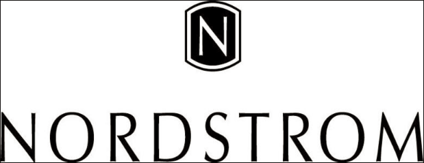

世界顶尖数据科学家采访实录——Nordstrom数据科学家
===============================================

[TOC]

艾琳·谢尔曼(Erin Shellman)是诺德斯特龙数据实验室(Nordstrom data lab)的统计学家和数据科学家。诺德斯特龙数据实验室是一个由数据科学家和软件开发人员组成的小型团队，他们开发的是数据驱动的技术，比如产品推荐。截至2015年，诺德斯特龙在美国和加拿大经营着289家全线百货商店，以及151家诺德斯特龙货铺。消费者越来越多地在网上购物，诺德斯特龙提供了各种不同的零售体验。对于喜欢砍价的人来说，睫毛销售网站Hautelook每天都为会员提供打折服务，而对于那些想要亲身体验的男士来说，Trunk Club则提供精心策划的家居试用体验。与Nordstrom.com、nordstromrack.com和实体商店相结合，这些渠道形成了丰富的数据生态系统，数据实验室使用这些数据生态系统来通知业务决策并增强客户体验。

谢尔曼的数据科学生涯始于美国国立卫生研究院(National Institutes of Health)计算生物科学部门的实习。正是在这里，她开始学习并应用机器学习来揭示基因组进化的模式。实习结束后，她在安娜堡的密歇根大学获得了生物统计学硕士学位和生物信息学博士学位。在密歇根大学期间，谢尔曼经常合作，分析多种类型的异质生物数据，包括基因表达微阵列、代谢组学、网络图和临床时间序列。

作为一名频繁的演讲者和教师，谢尔曼曾在Strata和大数据大会II等会议上发言，还定期在西雅图科技社区的见面和聚会上发言。她还在华盛顿大学继续教育项目中教授数据挖掘。作为社区外展领导人，谢尔曼是PyLadies西雅图分会的联合组织者，PyLadies是Python开放源码社区中一个面向女性的国际导师团体，也是通过妇女数学协会(Association for women in Mathematics)寻求数学教育和职业的年轻女性的导师。

谢尔曼是物理学家向数据科学领域过渡的一个杰出的例子，使公司和组织能够利用数据做出更好的决策。谢尔曼在采访中透露了她对生物学的热爱，以及科学推理在数据科学领域的应用，以及作为一个新进入这个领域的人，她是如何调整自己的技能和心态来迎接新职业的挑战的。她讨论了record linkage在高SKU周转率的类似产品上的应用，她如何思考如何构建和解决哪些问题，并为本科生和有兴趣转行进入数据科学领域的毕业生提供建议。

可以聊聊您工作的地方么？
========================

我在诺德斯特龙数据实验室的诺德斯特龙工作。

这是一份令人兴奋的工作，因为在零售业，特别是时装零售业，我有机会研究数据应用和许多领域的问题，包括跨概念、商业运作、点击流和服装颜色的季节性趋势。

像诺德斯特龙这样规模和年龄的零售商能够获得许多在线零售商无法获得的独特数据，因为它们没有实体店。我们使用的数据的异构性使这项工作非常有趣和具有挑战性。

数据科学是如何与开发人员合作的?
===============================

我已经做了十年的R程序员，但是你不能用R来开发通用软件，所以我必须学习很多东西，并从不同的角度思考问题。今年早些时候，我们发布了recommendation 2.0，这是我们产品推荐API的第二个版本，我开发了其中一个实时组件叫做“得分器”。简而言之，记分员会收到关于客户行为的mes- sages，比如产品页面浏览量或add-to-bag事件。然后，它根据当前会话中的客户行为实时重新订购建议。

我最初使用Python库panda编写记分员，因为我们在夜间批处理推荐中使用了它。嗯，我了解到Pandas数据框架的便利，我们享受批处理作业的性能在实时应用程序中低于平均水平。每次得分器运行时，都需要解析一条消息，需要计算和更新分数，并且这个过程需要对AWS上的Dynamo表进行多次读写。在这种情况下，数据帧对象的设置成本太高，最终我不得不在没有Pandas的情况下重写整个东西。

在过去，我并不需要担心程序的性能，所以我没有意识到我所编写的评分器的性能限制。当我需要建议的时候，有才华横溢的开发人员在我身边，这真的很棒

从本科到诺德斯特龙有什么进展?
=============================

当前位置我本科时主修经济学和哲学，因为我非常喜欢思考人类行为和互动中的复杂性。我特别喜欢经济学，因为我喜欢用数学描述这种复杂性的过程。随着学习的深入，我意识到我不可能在40岁时还从事经济学工作，我知道我需要改变。我年轻的时候没有意识到你不需要做你的专业，你的余生。

促使我从社会科学转向社会科学的部分原因是，我阅读了理查德·道金斯(Richard Dawkins)的《自私的基因》(The Selfish Gene1)和罗伯特·阿克塞尔罗德(Robert Axelrod)的《合作的进化》(The Evolution of Cooperation2)，这是一本关于进化博弈论的经典著作。我对将类似于经济学的数学模型应用于生物学产生了钦佩和热爱。因此，我没有继续专注于经济学，而是决定在继续专注于数学的同时学习生物科学。为了真正探索这一领域，我在美国国立卫生研究院(National Institutes of Health)的计算生物科学部门实习。我曾为吉姆·马利(Jim Malley)工作，他是一位数学家，教我机器学习以及如何将它应用于生物问题。我用随机森林做了很多比较基因组学的研究

我非常喜欢这份实习工作，我知道我想在本科毕业后从事统计学和生物学方面的工作。我在密歇根大学(University of Michigan)开始攻读生物统计学硕士学位，后来又在密歇根大学(Michigan)攻读生物信息学博士学位。当我完成后，我决定传统的学术道路不适合我，我想从事具有挑战性的问题在数据科学。有趣的是，尽管学术界在应用机器学习技术方面领先于工业界，但在有效使用数据技术方面却落后。我想，为了真正学习这项技术，我需要离开学术界，这就是我所做的。

您什么时候意识到您想以数据为职业?
=================================

当前位置在美国国立卫生研究院(NIH)实习之后，我就知道我想从事科学工作，收集和分析数据是科学工作的重要组成部分。我从来没有真正意识到我想要处理数据本身，我只是想要回答一些很酷的问题。数据就是这个世界对你发出的噪音。我想我对申请更感兴趣。

关于数据科学的问题是，它几乎是包罗万象的，以至于毫无意义。几乎每个人在开始一场数据科学讲座时，都会用一张幻灯片来讨论“它到底是什么意思?”这几乎毫无意义。对我来说，数据科学家是具有一定的定量和计算技能的人，这些技能适用于不同的领域。所以作为一个数据科学家，即使我没有领域的专业知识，我也可以学习它，可以处理任何可以量化描述的问题。我几乎可以保证，我不会在40多岁时从事时装零售，但我肯定我会从事一些依赖数据、使用类似技术和方法的工作。

您如何将历史悠久的Nordstrom品牌与创新的数据科学方法结合起来?
============================================================

谢尔曼:这是一个持续的挑战，但我们已经开发了一些成功的策略。第一个实际上是全公司范围的开放政策，邀请人们来看看我们，他们经常这么做。来自各行各业的人会来告诉我们他们是如何处理问题的，以及他们认为我们可以在哪些方面提供帮助。他们经常在原地打转，对我们如何处理这个问题的想法很感兴趣。其他时候，人们只是停下来聊天，把我们当作一个留言板。我们还努力与那些最终负责将我们的工作呈现给客户的人(主要是web团队)建立良好的关系。所以我们经常和他们保持联系，让他们知道我们这边发生了什么。

我们还确保当他们发现我们立即响应的bug时，特别是在企业环境中，他们已经习惯了必须提交服务请求，而有些人需要一周的时间才能响应。所以当我们回应说，“我只是推动了改变，大约十分钟后，它将在网站上直播，”他们显然喜欢这样。最后，为我们的产品建立原型，以便内部客户能够尽早使用，这对我们的成功至关重要。它甚至不必是什么花哨的东西。

例如，我们的推荐预览工具没有一个特别有趣的可视化，但它足以显示我们的算法的结果。现在，我们可以向内部客户发送一个URL，让他们坐在自己的办公桌前，了解我们产品的行为，并进行试验，在我们讨论将其投入生产之前，提供反馈。这是非常有用的，也是让人们对我们的工作感到兴奋的好方法。建立和维护这些关系就像其他任何事情一样——你必须一直致力于它们。培养这些关系是工作的一部分，如果你不去管他们，他们以后可能就不会来了。

从数据科学的角度出发，一个初入职场的人如何才能对时尚零售业有更多的了解呢?
=========================================================================

学术会议是一个学习和认识处理类似问题的人的好地方。

老实说，Twitter是一个非常棒的资源。在Rent the Runway、Warby Parker、Zulily和其他公司，你很容易就能找到并跟踪他们，了解他们在做什么，以及他们目前在使用什么工具和技术。另一个很棒的地方是公司博客。MailChimp和Etsy有很棒的博客。我还建议，当你在谈话中有机会学习时，多问问题，不要担心别人认为你不知道正在发生什么。然后问后续问题。电子邮件是一种很好的交流媒介。

不要担心不懂这种语言。我来自生物医学专业，没有任何零售方面的经验，所以有很多东西我不知道，我只是让人们给我解释一下。如果你以这种态度进入每一个阶段，人们会告诉你很多东西，而你的工作就是吸收它们。

您认为数据科学的未来会是什么样子?
=================================

当前位置如果你观察一下数据科学初创企业的趋势，你会发现我们似乎正朝着按下按钮的数据科学方向前进。

我听到很多关于“将数据科学家从编程中解放出来”或“将数据科学家从技术开销中解放出来，以便他们能够回到数据中”的营销。“我认为这些产品是对缺乏数据科学技能人才的回应。

在那些有幸拥有一位数据科学家的小公司里，这些工具有望使它们更有效率。但这并不容易，所以我对这些产品及其寿命持怀疑态度。我认为我们在未来将看到什么是数据科学的进化。目前，数据科学家通常是拥有硕士或博士学位的前学术人员，但他们的数量不足以满足需求，所以我预计我们将看到大量软件工程师的再培训，以及向数据科学角色的迁移。你可以看到Coursera和Udacity已经在提供数据科学课程和认证。

您对正在找工作的数据科学家有什么建议?
=====================================

发布给数据科学家的帖子可能相当吓人，因为它们中的大多数读起来像一个数据科学词汇表。

事实是，技术的变化如此之快，以至于没有人拥有任何可以写在帖子上的经验。

当你看着它的时候，它会让你不知所措，你可能会觉得，“这不是给我的。”我没有这些技能，也没有什么可以贡献的。“

只要你能接受改变和不断学习新事物，我就鼓励你克服这种心态。

最终，公司需要的是一个能够严格定义问题和设计解决方案路径的人。

他们也想要善于学习的人。我认为这些是核心技能。

---

*整理和翻译《Data Scientists at Work》一书*