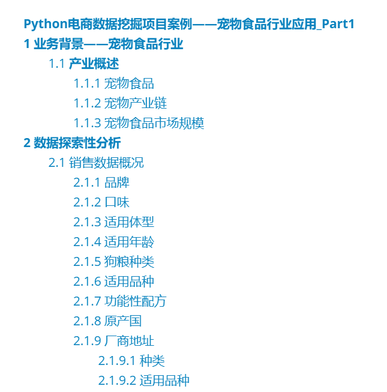
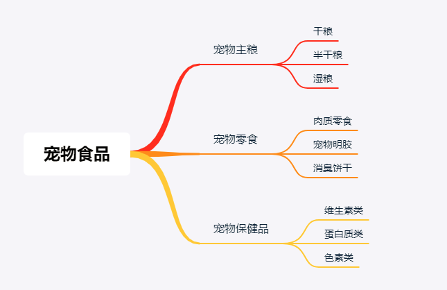
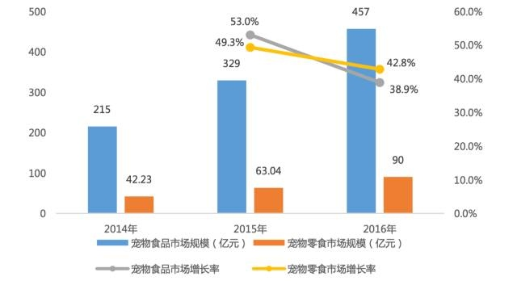

Python电商数据挖掘项目案例——宠物食品行业应用_Part1
==================================================

[TOC]

**目录**



业务背景——宠物食品行业
======================


**产业概述**
------------

**宠物一般是指家庭饲养的、作为伴侣动物的犬和猫等。**

根据海通证券研究报告，2015年美国饲养宠物的家庭中，宠物狗、宠物猫占比达到75%，中国为81%。

### 宠物食品

**宠物食品是专门为宠物提供的食品，介于人类食品与传统畜禽饲料之间，其作用主要是为各种宠物提供最基础的生命保证、生长发育和健康所需的营养物质，具有营养全面、消化吸收率高、配方科学、饲喂方便以及可预防某些疾病等优点。**

**按功能划分，宠物食品主要可分为**

- **宠物主食、**
- **宠物零食和**
- **宠物保健品**，

其中宠物主食占采食量的70%以上。



*资料来源：佩蒂股份招股说明书*


### 宠物产业链

**从产业链角度出发，宠物食品位于宠物行业上游，在宠物市场中占比最大。**根据有庞研究院及天风证券研究所报告，2016年宠物食品在我国宠物市场占比约37.5%，在美国为38.26%。除宠物食品，宠物产业链还包括宠物饲养、宠物食品、宠物用品、宠物医疗、宠物美容、宠物培训、宠物保险以及宠物善终等。

.png)

*资料来源：安信证券研究中心*


### 宠物食品市场规模

**人均收入提升带来的消费升级，老龄化比率上升增加了老年人对宠物的需求，我国宠物食品市场目前正处于高速增长期**。

根据前瞻产业研究院的报告，

2008年-2015年我国宠物食品市场规模复合增长率超过30%；

2016年我国宠物食品的市场规模约457亿元, 同比增长38.9%，宠物零食市场规模约90亿元，同比增长42.8%。

**较于发达国家，我国宠物食品产业仍旧滞后，家庭宠物保有量、宠物的年消费支出较低，未来仍然具有广阔的发展空间**。

天风证券预计2020年

我国宠物食品市场规模将达到 1160亿元，较2016年增长137.7%，

宠物零食的市场规模将达到270亿元，较2016年增长200%。



*资料来源：有宠研究院*


数据探索性分析
==============

**版本问题**

 wheel安装步骤 
    - 下载适合自己python版本的包：https://www.lfd.uci.edu/~gohlke/pythonlibs/  
        - pip install wheel
        - 目标文件夹的cd,pip install somewhat.whl

```python
print("pandas 版本：",pd.__version__)
print("numpy 版本：",np.__version__)
```

```
pandas 版本： 0.23.4
numpy 版本： 1.16.3
```

- 检查更新：pip list --outdated
- 更新： pip install --upgrade xxxx

pandas 0.23.4 documentation  http://pandas.pydata.org/pandas-docs/stable/index.html

```python
import os
import pandas as pd
from pandas.core.frame import DataFrame
import numpy as np
import jieba

import matplotlib
import matplotlib.pyplot as plt
plt.figure(figsize = (12,8))

%matplotlib inline
plt.rcParams['axes.unicode_minus'] = False

# 解决中文乱码问题
plt.rcParams['font.sans-serif'] = ['Simhei']
from wordcloud import WordCloud,ImageColorGenerator
import imageio
import snownlp
from snownlp import SnowNLP
```

```python
os.getcwd()
```


```
'C:\\Users\\Administrator\\a'
```


销售数据概况
------------

```python
df_raw_1 = pd.read_excel('Product_details_rawdata.xlsx')  # 183 rows x 25 columns
df_raw_1.columns
```


```
Index(['item_id', 'item_name', 'TradeName', 'price', 'total_sale',
       'month_sale', 'accum_comm', 'TM_points', 'CollectCount', 'Tastes',
       'BodyType', 'ApplicablePhase', 'Brand', 'Classification', 'Breed',
       'Manufacturer', 'Weight', 'Origin', 'ManufacturerAddress',
       'RecipeTastePrescription'],
      dtype='object')
```


```python
df_raw_1.head()
```


<div>
<style scoped>
    .dataframe tbody tr th:only-of-type {
        vertical-align: middle;
    }

```
.dataframe tbody tr th {
    vertical-align: top;
}

.dataframe thead th {
    text-align: right;
}
```

</style>

<table border="1" class="dataframe">
  <thead>
    <tr style="text-align: right;">
      <th></th>
      <th>item_id</th>
      <th>item_name</th>
      <th>TradeName</th>
      <th>price</th>
      <th>total_sale</th>
      <th>month_sale</th>
      <th>accum_comm</th>
      <th>TM_points</th>
      <th>CollectCount</th>
      <th>Tastes</th>
      <th>BodyType</th>
      <th>ApplicablePhase</th>
      <th>Brand</th>
      <th>Classification</th>
      <th>Breed</th>
      <th>Manufacturer</th>
      <th>Weight</th>
      <th>Origin</th>
      <th>ManufacturerAddress</th>
      <th>RecipeTastePrescription</th>
    </tr>
  </thead>
  <tbody>
    <tr>
      <th>0</th>
      <td>19045209534</td>
      <td>Royal Canin皇家狗粮 德牧幼犬粮AGS30 12KG 大型犬狗粮28省包邮</td>
      <td>德国牧羊犬幼犬专用粮 12kg</td>
      <td>650.0</td>
      <td>2046</td>
      <td>39</td>
      <td>418</td>
      <td>325</td>
      <td>348</td>
      <td>其他</td>
      <td>通用型</td>
      <td>幼犬</td>
      <td>ROYAL CANIN/皇家</td>
      <td>专用粮</td>
      <td>德国牧羊犬</td>
      <td>皇誉宠物食品（上海）有限公司</td>
      <td>12000</td>
      <td>中国</td>
      <td>上海</td>
      <td>NaN</td>
    </tr>
    <tr>
      <th>1</th>
      <td>547144906363</td>
      <td>Royal Canin皇家狗粮 柴犬幼犬专用粮SIJ29/3KG 犬主粮狗粮</td>
      <td>日本柴犬幼犬 3000g</td>
      <td>285.0</td>
      <td>560</td>
      <td>39</td>
      <td>132</td>
      <td>142</td>
      <td>200</td>
      <td>其他</td>
      <td>NaN</td>
      <td>幼犬</td>
      <td>ROYAL CANIN/皇家</td>
      <td>NaN</td>
      <td>日本柴犬</td>
      <td>皇誉宠物食品（上海）有限公司</td>
      <td>3000</td>
      <td>中国</td>
      <td>上海</td>
      <td>NaN</td>
    </tr>
    <tr>
      <th>2</th>
      <td>26255560615</td>
      <td>皇家狗粮 大型犬奶糕MAS30 4KG哺乳孕期犬离乳期幼犬牧羊阿拉斯加</td>
      <td>(大型犬)离乳期奶糕 4kg</td>
      <td>301.0</td>
      <td>1571</td>
      <td>27</td>
      <td>390</td>
      <td>150</td>
      <td>554</td>
      <td>其他</td>
      <td>大型犬</td>
      <td>离乳期</td>
      <td>ROYAL CANIN/皇家</td>
      <td>奶糕</td>
      <td>通用型</td>
      <td>皇誉宠物食品（上海）有限公司</td>
      <td>4000</td>
      <td>中国</td>
      <td>上海</td>
      <td>NaN</td>
    </tr>
    <tr>
      <th>3</th>
      <td>39792870853</td>
      <td>Royal Canin皇家狗粮 迷你雪纳瑞成犬粮SNZ25/3KG 犬主粮</td>
      <td>雪纳瑞成犬 3000g</td>
      <td>260.0</td>
      <td>2113</td>
      <td>32</td>
      <td>281</td>
      <td>130</td>
      <td>379</td>
      <td>其他</td>
      <td>NaN</td>
      <td>成犬</td>
      <td>ROYAL CANIN/皇家</td>
      <td>NaN</td>
      <td>雪纳瑞</td>
      <td>皇誉宠物食品（上海）有限公司</td>
      <td>3000</td>
      <td>中国</td>
      <td>上海奉贤区肖南路475号</td>
      <td>NaN</td>
    </tr>
    <tr>
      <th>4</th>
      <td>547165690913</td>
      <td>Royal Canin皇家狗粮 拉布拉多幼犬粮ALR33 3KG 大型犬全犬种热卖</td>
      <td>拉布拉多幼犬 3000g</td>
      <td>210.0</td>
      <td>643</td>
      <td>48</td>
      <td>173</td>
      <td>105</td>
      <td>318</td>
      <td>其他</td>
      <td>NaN</td>
      <td>幼犬</td>
      <td>ROYAL CANIN/皇家</td>
      <td>NaN</td>
      <td>拉布拉多</td>
      <td>皇誉宠物食品（上海）有限公司</td>
      <td>3000</td>
      <td>中国</td>
      <td>上海</td>
      <td>NaN</td>
    </tr>
  </tbody>
</table>

</div>


```python
len(df_raw_1)
```


```
183
```


```python
df_raw_1.describe()
```


<div>
<style scoped>
    .dataframe tbody tr th:only-of-type {
        vertical-align: middle;
    }

```
.dataframe tbody tr th {
    vertical-align: top;
}

.dataframe thead th {
    text-align: right;
}
```

</style>

<table border="1" class="dataframe">
  <thead>
    <tr style="text-align: right;">
      <th></th>
      <th>item_id</th>
      <th>price</th>
      <th>total_sale</th>
      <th>month_sale</th>
      <th>accum_comm</th>
      <th>TM_points</th>
      <th>CollectCount</th>
      <th>Weight</th>
    </tr>
  </thead>
  <tbody>
    <tr>
      <th>count</th>
      <td>1.830000e+02</td>
      <td>183.000000</td>
      <td>183.000000</td>
      <td>183.000000</td>
      <td>183.000000</td>
      <td>183.000000</td>
      <td>183.000000</td>
      <td>183.000000</td>
    </tr>
    <tr>
      <th>mean</th>
      <td>2.669680e+11</td>
      <td>307.403279</td>
      <td>11136.404372</td>
      <td>407.229508</td>
      <td>2648.890710</td>
      <td>153.508197</td>
      <td>1879.065574</td>
      <td>5344.699454</td>
    </tr>
    <tr>
      <th>std</th>
      <td>2.556689e+11</td>
      <td>257.744147</td>
      <td>31369.026185</td>
      <td>1068.822091</td>
      <td>6659.411861</td>
      <td>128.909154</td>
      <td>4007.666013</td>
      <td>4927.903706</td>
    </tr>
    <tr>
      <th>min</th>
      <td>1.562877e+10</td>
      <td>9.900000</td>
      <td>15.000000</td>
      <td>1.000000</td>
      <td>2.000000</td>
      <td>4.000000</td>
      <td>13.000000</td>
      <td>100.000000</td>
    </tr>
    <tr>
      <th>25%</th>
      <td>2.669303e+10</td>
      <td>135.500000</td>
      <td>1064.500000</td>
      <td>39.000000</td>
      <td>267.500000</td>
      <td>67.500000</td>
      <td>248.500000</td>
      <td>2000.000000</td>
    </tr>
    <tr>
      <th>50%</th>
      <td>4.388117e+10</td>
      <td>225.000000</td>
      <td>2883.000000</td>
      <td>149.000000</td>
      <td>736.000000</td>
      <td>112.000000</td>
      <td>584.000000</td>
      <td>3000.000000</td>
    </tr>
    <tr>
      <th>75%</th>
      <td>5.364667e+11</td>
      <td>460.000000</td>
      <td>7704.500000</td>
      <td>322.500000</td>
      <td>2090.000000</td>
      <td>230.000000</td>
      <td>1458.500000</td>
      <td>7500.000000</td>
    </tr>
    <tr>
      <th>max</th>
      <td>5.649716e+11</td>
      <td>1300.000000</td>
      <td>337524.000000</td>
      <td>9931.000000</td>
      <td>56434.000000</td>
      <td>650.000000</td>
      <td>34370.000000</td>
      <td>30000.000000</td>
    </tr>
  </tbody>
</table>

</div>


describe方法用于一次性产生多个汇总统计,默认对数值型数据.对于非数值型数据,describe会产生出另外一种汇总统计.

```python
df_raw_1.item_name.describe()
```


```
count                                   183
unique                                  183
top       宝路狗粮狗主粮泰迪比熊贵宾中型小型通用型成犬牛肉味15斤7.5kg
freq                                      1
Name: item_name, dtype: object
```


共有183种不同的产品

### 品牌

```python
df_raw_1.Brand.describe()
```


```
count                183
unique                 5
top       ROYAL CANIN/皇家
freq                  91
Name: Brand, dtype: object
```


```python
df_raw_1.Brand.value_counts(dropna=False)
```


```
ROYAL CANIN/皇家       91
Pedigree/宝路          38
Nature Bridge/比瑞吉    28
Fish4Dogs/海洋之星       24
Chappi/佳贝             2
Name: Brand, dtype: int64
```


### 口味

```python
df_raw_1.Tastes.describe()
```


```
count     183
unique      5
top        其他
freq      130
Name: Tastes, dtype: object
```


```python
df_raw_1.Tastes.unique()
```


```
array(['其他', '牛肉味', '鸡肉味', '鱼肉味', '深海鱼味'], dtype=object)
```


```python
df_raw_1.Tastes.value_counts(dropna=False)
```


```
其他      130
鱼肉味      25
牛肉味      17
鸡肉味       9
深海鱼味      2
Name: Tastes, dtype: int64
```


### 适用体型

```python
df_raw_1.BodyType.describe()
```


```
count     137
unique      6
top       通用型
freq       47
Name: BodyType, dtype: object
```


```python
df_raw_1.BodyType.unique()
```


```
array(['通用型', nan, '大型犬', '小型犬', '中型犬', '中小型犬', '中大型犬'], dtype=object)
```


```python
df_raw_1.BodyType.value_counts(dropna=False)
```


```
通用型     47
小型犬     46
NaN     46
大型犬     20
中小型犬    16
中型犬      6
中大型犬     2
Name: BodyType, dtype: int64
```


### 适用年龄

```python
df_raw_1.ApplicablePhase.describe()
```


```
count     183
unique      6
top        成犬
freq       92
Name: ApplicablePhase, dtype: object
```


```python
df_raw_1.ApplicablePhase.value_counts(dropna=False)
```


```
成犬                               92
幼犬                               55
老年犬                              13
全犬期                              12
离乳期                               7
使用于怀孕42天起的母犬、哺乳期母犬及2月龄以下离乳期幼犬     4
Name: ApplicablePhase, dtype: int64
```


### 狗粮种类

```python
df_raw_1.Classification.describe()
```


```
count     148
unique      3
top        犬粮
freq      104
Name: Classification, dtype: object
```


```python
df_raw_1.Classification.value_counts(dropna=False)
```


```
犬粮     104
专用粮     36
NaN     35
奶糕       8
Name: Classification, dtype: int64
```


### 适用品种

```python
df_raw_1.Breed.describe()
```


```
count     156
unique     14
top       通用型
freq      106
Name: Breed, dtype: object
```


```python
df_raw_1.Breed.value_counts(dropna=False)
```


```
通用型       106
NaN        27
贵宾/泰迪      15
约克夏梗        4
日本柴犬        4
金毛          4
拉布拉多        4
斗牛犬         4
雪纳瑞         3
比熊          3
德国牧羊犬       3
吉娃娃         2
可卡          2
博美          1
西部高地白梗      1
Name: Breed, dtype: int64
```


### 功能性配方

```python
df_raw_1.RecipeTastePrescription.describe()
```


```
count     79
unique    48
top        无
freq       6
Name: RecipeTastePrescription, dtype: object
```


### 原产国

```python
df_raw_1.Origin.describe()
```


```
count     183
unique      3
top        中国
freq      169
Name: Origin, dtype: object
```


```python
df_raw_1.Origin.value_counts(dropna=False)
```


```
中国     169
比利时     10
其他       4
Name: Origin, dtype: int64
```


### 厂商地址

```python
df_raw_1.ManufacturerAddress.describe()
```


```
count     183
unique     12
top        上海
freq       79
Name: ManufacturerAddress, dtype: object
```


```python
df_raw_1.ManufacturerAddress.value_counts(dropna=False)
```


```
上海                                    79
北京                                    35
上海市金山区                                20
Terdonkkaai 16, 9042 Gent, Belgium    10
山东省聊城市经济开发区牡丹江路8号                     10
上海奉贤区肖南路475号                           8
上海市金山区亭卫公路                             7
中国                                     5
Fish4Dogs.Ltd                          4
上海上海奉贤区肖南路475号                         2
皇誉宠物食品（上海）有限公司                         2
上海金山区                                  1
Name: ManufacturerAddress, dtype: int64
```


数据概括总结：

- 一共有183种不同产品
- 分别来自于4种主流品牌
- 商品属性信息有：商品名，种类，适用品种，适用体型，适用年龄，净重，功能性配方
- 商品销售信息有：价格，总销售量，月销售量，累计评论，收藏量，

```python
import jieba
```

```python
# import jieba.posseg as psg
```

```python
jieba.__version__  # 0.38
```


```
'0.39'
```


对最详细的产品名进行分词处理

```python
b= jieba.cut(df_raw_1.item_name[1])
for i in b:
    print(i)

```

```
Building prefix dict from the default dictionary ...
Loading model from cache C:\Users\ADMINI~1\AppData\Local\Temp\jieba.cache
Loading model cost 1.632 seconds.
Prefix dict has been built succesfully.
```

```
Royal
 
Canin
皇家
狗
粮
 
柴犬
幼犬
专用
粮
SIJ29
/
3KG
 
犬
主粮
狗
粮
```

存在专有名词，默认无法分割正确时，加入特定词语list

```python
 jieba.load_userdict('AddWords.txt')
```

```python
c= jieba.lcut(df_raw_1.item_name[1])
c
```


```
['Royal',
 ' ',
 'Canin',
 '皇家',
 '狗粮',
 ' ',
 '柴犬',
 '幼犬',
 '专用粮',
 'SIJ29',
 '/',
 '3KG',
 ' ',
 '犬主粮',
 '狗粮']
```


对所有item name 进行分词，添加到源数据中

```python
item_cut=[]
for i in df_raw_1.item_name:
    j=jieba.lcut(i)
    item_cut.append(j)
```

```python
df_raw_1['item_name_cut'] = item_cut
```

```python
df_raw_1[['item_name','item_name_cut']]
```


<div>
<style scoped>
    .dataframe tbody tr th:only-of-type {
        vertical-align: middle;
    }

```
.dataframe tbody tr th {
    vertical-align: top;
}

.dataframe thead th {
    text-align: right;
}
```

</style>

<table border="1" class="dataframe">
  <thead>
    <tr style="text-align: right;">
      <th></th>
      <th>item_name</th>
      <th>item_name_cut</th>
    </tr>
  </thead>
  <tbody>
    <tr>
      <th>0</th>
      <td>Royal Canin皇家狗粮 德牧幼犬粮AGS30 12KG 大型犬狗粮28省包邮</td>
      <td>[Royal,  , Canin, 皇家, 狗粮,  , 德牧, 幼犬粮, AGS30,  ...</td>
    </tr>
    <tr>
      <th>1</th>
      <td>Royal Canin皇家狗粮 柴犬幼犬专用粮SIJ29/3KG 犬主粮狗粮</td>
      <td>[Royal,  , Canin, 皇家, 狗粮,  , 柴犬, 幼犬, 专用粮, SIJ2...</td>
    </tr>
    <tr>
      <th>2</th>
      <td>皇家狗粮 大型犬奶糕MAS30 4KG哺乳孕期犬离乳期幼犬牧羊阿拉斯加</td>
      <td>[皇家, 狗粮,  , 大型犬, 奶糕, MAS30,  , 4KG, 哺乳, 孕期, 犬离...</td>
    </tr>
    <tr>
      <th>3</th>
      <td>Royal Canin皇家狗粮 迷你雪纳瑞成犬粮SNZ25/3KG 犬主粮</td>
      <td>[Royal,  , Canin, 皇家, 狗粮,  , 迷你, 雪纳瑞, 成犬粮, SNZ...</td>
    </tr>
    <tr>
      <th>4</th>
      <td>Royal Canin皇家狗粮 拉布拉多幼犬粮ALR33 3KG 大型犬全犬种热卖</td>
      <td>[Royal,  , Canin, 皇家, 狗粮,  , 拉布拉多, 幼犬粮, ALR33,...</td>
    </tr>
    <tr>
      <th>5</th>
      <td>Royal Canin皇家狗粮 小型犬老年犬狗粮SPR27/0.8kg公斤  犬主粮</td>
      <td>[Royal,  , Canin, 皇家, 狗粮,  , 小型犬, 老年犬, 狗粮, SPR...</td>
    </tr>
    <tr>
      <th>6</th>
      <td>Royal Canin皇家狗粮 大型犬幼犬粮MAJ30/15KG  犬主粮28省包邮</td>
      <td>[Royal,  , Canin, 皇家, 狗粮,  , 大型犬, 幼犬粮, MAJ30, ...</td>
    </tr>
    <tr>
      <th>7</th>
      <td>Royal Canin皇家狗粮 约克夏成犬专用粮PRY28/1.5KG 犬主粮</td>
      <td>[Royal,  , Canin, 皇家, 狗粮,  , 约克夏, 成犬, 专用粮, PRY...</td>
    </tr>
    <tr>
      <th>8</th>
      <td>皇家狗粮 小型犬成犬通用型PR27 2KG 博美迷你腊肠京巴八哥全犬种</td>
      <td>[皇家, 狗粮,  , 小型犬, 成犬, 通用型, PR27,  , 2KG,  , 博美,...</td>
    </tr>
    <tr>
      <th>9</th>
      <td>Royal Canin皇家狗粮 法国斗牛犬幼犬粮FBJ30/3KG 法斗粮</td>
      <td>[Royal,  , Canin, 皇家, 狗粮,  , 法国, 斗牛犬, 幼犬粮, FBJ...</td>
    </tr>
    <tr>
      <th>10</th>
      <td>Royal Canin皇家狗粮 小型犬幼犬粮MIJ31 8KG 犬主粮28省包邮</td>
      <td>[Royal,  , Canin, 皇家, 狗粮,  , 小型犬, 幼犬粮, MIJ31, ...</td>
    </tr>
    <tr>
      <th>11</th>
      <td>皇家繁育期母犬 离乳期幼犬狗粮中型犬奶糕MES30 4KG 松狮哈士奇</td>
      <td>[皇家, 繁育, 期母, 犬,  , 离乳期, 幼犬, 狗粮, 中型犬, 奶糕, MES30...</td>
    </tr>
    <tr>
      <th>12</th>
      <td>皇家狗粮 吉娃娃成犬专用粮食C28 1.5KG*2  小型犬 28省包邮</td>
      <td>[皇家, 狗粮,  , 吉娃娃, 成犬, 专用, 粮食, C28,  , 1.5, KG, ...</td>
    </tr>
    <tr>
      <th>13</th>
      <td>皇家狗粮 小型犬成犬狗粮 通用型狗粮均衡营养减少牙石PR27/0.8KG</td>
      <td>[皇家, 狗粮,  , 小型犬, 成犬, 狗粮,  , 通用型, 狗粮, 均衡, 营养, 减...</td>
    </tr>
    <tr>
      <th>14</th>
      <td>皇家小型犬幼犬粮MIJ31 2KG博美西施杜宾腊肠犬狗粮通用型全犬种</td>
      <td>[皇家, 小型犬, 幼犬粮, MIJ31,  , 2KG, 博美, 西施, 杜宾, 腊肠犬,...</td>
    </tr>
    <tr>
      <th>15</th>
      <td>Royal Canin皇家狗粮 泰迪/贵宾成犬粮PD30/7.5KG 犬主粮</td>
      <td>[Royal,  , Canin, 皇家, 狗粮,  , 泰迪, /, 贵宾, 成犬粮, P...</td>
    </tr>
    <tr>
      <th>16</th>
      <td>皇家狗粮中型犬成犬粮M25 4KG哈士奇松狮萨摩耶粮柯基牛头梗热卖</td>
      <td>[皇家, 狗粮, 中型犬, 成犬粮, M25,  , 4KG, 哈士奇, 松狮, 萨摩耶, ...</td>
    </tr>
    <tr>
      <th>17</th>
      <td>Roayl Canin皇家狗粮 贵宾幼犬粮 泰迪专用粮APD33/0.5kg 犬主粮</td>
      <td>[Roayl,  , Canin, 皇家, 狗粮,  , 贵宾, 幼犬粮,  , 泰迪, 专...</td>
    </tr>
    <tr>
      <th>18</th>
      <td>皇家官方旗舰店 贵宾泰迪狗粮8岁以上老年犬PDA26 3KG热卖新品</td>
      <td>[皇家, 官方, 旗舰店,  , 贵宾, 泰迪, 狗粮, 8, 岁, 以上, 老年犬, PD...</td>
    </tr>
    <tr>
      <th>19</th>
      <td>皇家狗粮小型犬8岁以上成犬粮SPR27 4KG*2  博美犬茶杯 28省包邮</td>
      <td>[皇家, 狗粮, 小型犬, 8, 岁, 以上, 成犬粮, SPR27,  , 4KG, *,...</td>
    </tr>
    <tr>
      <th>20</th>
      <td>Royal Canin皇家狗粮 贵宾/泰迪成犬粮PD30/3KG 犬主粮</td>
      <td>[Royal,  , Canin, 皇家, 狗粮,  , 贵宾, /, 泰迪, 成犬粮, P...</td>
    </tr>
    <tr>
      <th>21</th>
      <td>Royal Canin皇家狗粮 大型犬成犬粮GR26/15KG 犬主粮28省包邮</td>
      <td>[Royal,  , Canin, 皇家, 狗粮,  , 大型犬, 成犬粮, GR26, /...</td>
    </tr>
    <tr>
      <th>22</th>
      <td>皇家官方旗舰店 狗粮比熊犬成犬粮BF29 3KG主粮热卖新品小型犬</td>
      <td>[皇家, 官方, 旗舰店,  , 狗粮, 比熊犬, 成犬粮, BF29,  , 3KG, 主...</td>
    </tr>
    <tr>
      <th>23</th>
      <td>皇家狗粮 中型犬奶糕MES30 4KG*2繁育母犬离乳幼柯基萨摩28省包邮</td>
      <td>[皇家, 狗粮,  , 中型犬, 奶糕, MES30,  , 4KG, *, 2, 繁育, ...</td>
    </tr>
    <tr>
      <th>24</th>
      <td>Royal Canin皇家狗粮 贵宾成犬专用粮PD30/0.5KG 泰迪犬主粮</td>
      <td>[Royal,  , Canin, 皇家, 狗粮,  , 贵宾, 成犬, 专用粮, PD30...</td>
    </tr>
    <tr>
      <th>25</th>
      <td>Royal Canin皇家狗粮 大型犬成犬粮GR26/4KG*4包犬主粮 28省包邮</td>
      <td>[Royal,  , Canin, 皇家, 狗粮,  , 大型犬, 成犬粮, GR26, /...</td>
    </tr>
    <tr>
      <th>26</th>
      <td>Royal Canin皇家狗粮 金毛幼犬粮AGR29 3.5KG 大型犬狗粮精品热卖</td>
      <td>[Royal,  , Canin, 皇家, 狗粮,  , 金毛, 幼犬粮, AGR29,  ...</td>
    </tr>
    <tr>
      <th>27</th>
      <td>皇家小型犬幼犬粮通用型狗粮 MIJ31 0.8KG博美八哥腊肠京巴犬热卖</td>
      <td>[皇家, 小型犬, 幼犬粮, 通用型, 狗粮,  , MIJ31,  , 0.8, KG, ...</td>
    </tr>
    <tr>
      <th>28</th>
      <td>皇家小型犬成犬粮 通用型狗粮PR27 8KG 博美京巴全犬种28省包邮</td>
      <td>[皇家, 小型犬, 成犬粮,  , 通用型, 狗粮, PR27,  , 8KG,  , 博美...</td>
    </tr>
    <tr>
      <th>29</th>
      <td>Royal Canin皇家狗粮 约克夏成犬粮PRY28/1.5KG*2犬主粮 28省包邮</td>
      <td>[Royal,  , Canin, 皇家, 狗粮,  , 约克夏, 成犬粮, PRY28, ...</td>
    </tr>
    <tr>
      <th>...</th>
      <td>...</td>
      <td>...</td>
    </tr>
    <tr>
      <th>153</th>
      <td>比瑞吉小型成犬粮 小型犬成犬天然粮 比熊泰迪成犬比瑞吉狗粮10kg</td>
      <td>[比瑞吉, 小型, 成犬粮,  , 小型犬, 成犬, 天然粮,  , 比熊, 泰迪, 成犬,...</td>
    </tr>
    <tr>
      <th>154</th>
      <td>比瑞吉无谷六种肉全期犬粮 非五谷狗粮 无谷多肉成犬幼犬狗粮2kg</td>
      <td>[比瑞吉, 无谷, 六种, 肉, 全期犬粮,  , 非, 五谷, 狗粮,  , 无谷, 多肉...</td>
    </tr>
    <tr>
      <th>155</th>
      <td>比瑞吉狗粮 小型成犬粮通用型成犬狗粮2kg 雪纳瑞博美泰迪狗粮</td>
      <td>[比瑞吉, 狗粮,  , 小型, 成犬粮, 通用型, 成犬, 狗粮, 2kg,  , 雪纳瑞...</td>
    </tr>
    <tr>
      <th>156</th>
      <td>狗粮 比瑞吉泰迪贵宾成犬粮 泰迪狗粮成犬天然粮 比瑞吉狗粮2kg</td>
      <td>[狗粮,  , 比瑞吉, 泰迪, 贵宾, 成犬粮,  , 泰迪, 狗粮, 成犬, 天然粮, ...</td>
    </tr>
    <tr>
      <th>157</th>
      <td>比瑞吉狗粮 小型成犬粮泰迪贵宾比熊博美雪纳瑞通用天然狗粮1.5kg</td>
      <td>[比瑞吉, 狗粮,  , 小型, 成犬粮, 泰迪, 贵宾, 比熊博美, 雪纳瑞, 通用, 天...</td>
    </tr>
    <tr>
      <th>158</th>
      <td>狗粮幼犬 比瑞吉小型幼犬粮 泰迪比熊通用 室内小型全价幼犬粮2kg</td>
      <td>[狗粮, 幼犬,  , 比瑞吉, 小型, 幼犬粮,  , 泰迪, 比熊, 通用,  , 室内...</td>
    </tr>
    <tr>
      <th>159</th>
      <td>海洋之星SUPERIOR进口营养加强体重控制三文鱼狗粮泰迪通用型12kg</td>
      <td>[海洋之星, SUPERIOR, 进口, 营养, 加强, 体重, 控制, 三文鱼, 狗粮, ...</td>
    </tr>
    <tr>
      <th>160</th>
      <td>海洋之星SUPERIOR原装进口营养加强三文鱼成犬狗粮泰迪通用型12kg</td>
      <td>[海洋之星, SUPERIOR, 原装, 进口, 营养, 加强, 三文鱼, 成犬, 狗粮, ...</td>
    </tr>
    <tr>
      <th>161</th>
      <td>海洋之星SUPERIOR进口营养加强体重控制三文鱼狗粮中大型犬12kg</td>
      <td>[海洋之星, SUPERIOR, 进口, 营养, 加强, 体重, 控制, 三文鱼, 狗粮, ...</td>
    </tr>
    <tr>
      <th>162</th>
      <td>海洋之星SUPERIOR原装进口营养加强三文鱼成犬狗粮中大型犬12kg</td>
      <td>[海洋之星, SUPERIOR, 原装, 进口, 营养, 加强, 三文鱼, 成犬, 狗粮, ...</td>
    </tr>
    <tr>
      <th>163</th>
      <td>海洋之星SUPERIOR原装进口营养加强三文鱼幼犬狗粮中大型犬12kg</td>
      <td>[海洋之星, SUPERIOR, 原装, 进口, 营养, 加强, 三文鱼, 幼犬, 狗粮, ...</td>
    </tr>
    <tr>
      <th>164</th>
      <td>海洋之星狗粮金毛阿拉斯加大型犬幼犬无谷天然粮大颗粒犬粮12kg</td>
      <td>[海洋之星, 狗粮, 金毛, 阿拉斯加, 大型犬, 幼犬, 无谷, 天然粮, 大颗粒, 犬粮...</td>
    </tr>
    <tr>
      <th>165</th>
      <td>海洋之星SUPERIOR原装进口营养加强体重控制三文鱼配方狗粮6kg</td>
      <td>[海洋之星, SUPERIOR, 原装, 进口, 营养, 加强, 体重, 控制, 三文鱼, ...</td>
    </tr>
    <tr>
      <th>166</th>
      <td>海洋之星SUPERIOR进口营养加强体重控制三文鱼狗粮通用型1.5kg</td>
      <td>[海洋之星, SUPERIOR, 进口, 营养, 加强, 体重, 控制, 三文鱼, 狗粮, ...</td>
    </tr>
    <tr>
      <th>167</th>
      <td>海洋之星SUPERIOR原装进口营养加强三文鱼幼犬狗粮泰迪通用型6kg</td>
      <td>[海洋之星, SUPERIOR, 原装, 进口, 营养, 加强, 三文鱼, 幼犬, 狗粮, ...</td>
    </tr>
    <tr>
      <th>168</th>
      <td>海洋之星SUPERIOR进口营养加强三文鱼成犬狗粮泰迪通用型1.5kg</td>
      <td>[海洋之星, SUPERIOR, 进口, 营养, 加强, 三文鱼, 成犬, 狗粮, 泰迪, ...</td>
    </tr>
    <tr>
      <th>169</th>
      <td>大幼试吃装中大型犬幼犬金毛阿拉斯牧羊犬哈士奇狗粮三包*30g</td>
      <td>[大幼, 试吃装, 中大型犬, 幼犬, 金毛, 阿拉斯, 牧羊犬, 哈士奇, 狗粮, 三包,...</td>
    </tr>
    <tr>
      <th>170</th>
      <td>海洋之星SUPERIOR原装进口营养加强三文鱼成犬狗粮泰迪通用型6kg</td>
      <td>[海洋之星, SUPERIOR, 原装, 进口, 营养, 加强, 三文鱼, 成犬, 狗粮, ...</td>
    </tr>
    <tr>
      <th>171</th>
      <td>试吃装 深海鱼三文鱼成犬中大型犬试吃装大颗粒阿拉斯加三包*30g</td>
      <td>[试吃装,  , 深海鱼, 三文鱼, 成犬, 中大型犬, 试吃装, 大颗粒, 阿拉斯加, 三...</td>
    </tr>
    <tr>
      <th>172</th>
      <td>海洋之星深海鱼狗粮无谷天然粮中小型犬成犬主粮小颗粒6kg</td>
      <td>[海洋之星, 深海鱼, 狗粮, 无谷, 天然粮, 中小型犬, 成, 犬主粮, 小颗粒, 6kg]</td>
    </tr>
    <tr>
      <th>173</th>
      <td>海洋之星深海鱼狗粮无谷天然粮金毛萨摩耶大型犬成犬大颗粒12kg</td>
      <td>[海洋之星, 深海鱼, 狗粮, 无谷, 天然粮, 金毛, 萨摩耶, 大型犬, 成犬, 大颗粒...</td>
    </tr>
    <tr>
      <th>174</th>
      <td>海洋之星深海鱼狗粮无谷天然粮中小型犬幼犬小颗粒狗粮6kg</td>
      <td>[海洋之星, 深海鱼, 狗粮, 无谷, 天然粮, 中小型犬, 幼犬, 小颗粒, 狗粮, 6kg]</td>
    </tr>
    <tr>
      <th>175</th>
      <td>海洋之星深海鱼狗粮无谷天然粮中小型犬幼犬小颗粒12kg</td>
      <td>[海洋之星, 深海鱼, 狗粮, 无谷, 天然粮, 中小型犬, 幼犬, 小颗粒, 12kg]</td>
    </tr>
    <tr>
      <th>176</th>
      <td>海洋之星狗粮三文鱼无谷天然粮金毛拉布拉多大型犬成犬主粮 12kg</td>
      <td>[海洋之星, 狗粮, 三文鱼, 无谷, 天然粮, 金毛, 拉布拉多, 大型犬, 成, 犬主粮...</td>
    </tr>
    <tr>
      <th>177</th>
      <td>海洋之星深海鱼成犬狗粮无谷天然粮中小型犬成犬小颗粒1.5kg</td>
      <td>[海洋之星, 深海鱼, 成犬, 狗粮, 无谷, 天然粮, 中小型犬, 成犬, 小颗粒, 1....</td>
    </tr>
    <tr>
      <th>178</th>
      <td>海洋之星深海鱼成犬狗粮无谷天然粮中小型犬成犬狗粮12kg小颗粒</td>
      <td>[海洋之星, 深海鱼, 成犬, 狗粮, 无谷, 天然粮, 中小型犬, 成犬, 狗粮, 12k...</td>
    </tr>
    <tr>
      <th>179</th>
      <td>海洋之星狗粮试吃装泰迪比熊玩具犬幼犬成犬全犬期小颗粒三包*30g</td>
      <td>[海洋之星, 狗粮, 试吃装, 泰迪, 比熊, 玩具犬, 幼犬, 成犬, 全犬期, 小颗粒,...</td>
    </tr>
    <tr>
      <th>180</th>
      <td>海洋之星狗粮通用型天然粮中小型犬幼犬主粮泰迪博美比熊1.5kg</td>
      <td>[海洋之星, 狗粮, 通用型, 天然粮, 中小型犬, 幼犬主粮, 泰迪, 博美比, 熊, 1...</td>
    </tr>
    <tr>
      <th>181</th>
      <td>海洋之星狗粮试吃装泰迪比熊贵宾幼犬通用型小颗粒美毛三包*30g</td>
      <td>[海洋之星, 狗粮, 试吃装, 泰迪, 比熊, 贵宾, 幼犬, 通用型, 小颗粒, 美毛, ...</td>
    </tr>
    <tr>
      <th>182</th>
      <td>海洋之星三文鱼狗粮泰迪吉娃娃贵宾玩具犬狗粮无谷天然粮6kg</td>
      <td>[海洋之星, 三文鱼, 狗粮, 泰迪, 吉娃娃, 贵宾, 玩具犬, 狗粮, 无谷, 天然粮,...</td>
    </tr>
  </tbody>
</table>
<p>183 rows × 2 columns</p>

</div>


#### 种类

```python
df_raw_1.Classification.value_counts(dropna=False)
```


```
犬粮     104
专用粮     36
NaN     35
奶糕       8
Name: Classification, dtype: int64
```


存在35条空值

```python
len(df_raw_1[df_raw_1.Classification.isnull()])
```


```
35
```


```python
df_raw_1[df_raw_1.Classification.isnull()][['item_name','item_name_cut']]
```


<div>
<style scoped>
    .dataframe tbody tr th:only-of-type {
        vertical-align: middle;
    }

```
.dataframe tbody tr th {
    vertical-align: top;
}

.dataframe thead th {
    text-align: right;
}
```

</style>

<table border="1" class="dataframe">
  <thead>
    <tr style="text-align: right;">
      <th></th>
      <th>item_name</th>
      <th>item_name_cut</th>
    </tr>
  </thead>
  <tbody>
    <tr>
      <th>1</th>
      <td>Royal Canin皇家狗粮 柴犬幼犬专用粮SIJ29/3KG 犬主粮狗粮</td>
      <td>[Royal,  , Canin, 皇家, 狗粮,  , 柴犬, 幼犬, 专用粮, SIJ2...</td>
    </tr>
    <tr>
      <th>3</th>
      <td>Royal Canin皇家狗粮 迷你雪纳瑞成犬粮SNZ25/3KG 犬主粮</td>
      <td>[Royal,  , Canin, 皇家, 狗粮,  , 迷你, 雪纳瑞, 成犬粮, SNZ...</td>
    </tr>
    <tr>
      <th>4</th>
      <td>Royal Canin皇家狗粮 拉布拉多幼犬粮ALR33 3KG 大型犬全犬种热卖</td>
      <td>[Royal,  , Canin, 皇家, 狗粮,  , 拉布拉多, 幼犬粮, ALR33,...</td>
    </tr>
    <tr>
      <th>12</th>
      <td>皇家狗粮 吉娃娃成犬专用粮食C28 1.5KG*2  小型犬 28省包邮</td>
      <td>[皇家, 狗粮,  , 吉娃娃, 成犬, 专用, 粮食, C28,  , 1.5, KG, ...</td>
    </tr>
    <tr>
      <th>26</th>
      <td>Royal Canin皇家狗粮 金毛幼犬粮AGR29 3.5KG 大型犬狗粮精品热卖</td>
      <td>[Royal,  , Canin, 皇家, 狗粮,  , 金毛, 幼犬粮, AGR29,  ...</td>
    </tr>
    <tr>
      <th>30</th>
      <td>皇家狗粮小型犬奶糕MIS30 1KG 哺乳孕期母犬 博美京巴幼犬通用型</td>
      <td>[皇家, 狗粮, 小型犬, 奶糕, MIS30,  , 1KG,  , 哺乳, 孕期, 母犬...</td>
    </tr>
    <tr>
      <th>33</th>
      <td>皇家狗粮 拉布拉多成犬粮LR30 3KG*4 大型犬种 28省包邮</td>
      <td>[皇家, 狗粮,  , 拉布拉多, 成犬粮, LR30,  , 3KG, *, 4,  , ...</td>
    </tr>
    <tr>
      <th>36</th>
      <td>皇家小型犬奶糕MIS30 3KG*2繁育期母离乳期幼犬博美狗粮28省包邮</td>
      <td>[皇家, 小型犬, 奶糕, MIS30,  , 3KG, *, 2, 繁育, 期母, 离乳期...</td>
    </tr>
    <tr>
      <th>37</th>
      <td>Royal Canin皇家 金毛幼犬粮AGR29/3.5KG*4 犬主粮 28省包邮</td>
      <td>[Royal,  , Canin, 皇家,  , 金毛, 幼犬粮, AGR29, /, 3....</td>
    </tr>
    <tr>
      <th>41</th>
      <td>Royal Canin皇家狗粮 柴犬成犬专用粮SIA26/3KG*2 犬主粮28省包邮</td>
      <td>[Royal,  , Canin, 皇家, 狗粮,  , 柴犬, 成犬, 专用粮, SIA2...</td>
    </tr>
    <tr>
      <th>43</th>
      <td>皇家狗粮 迷你雪纳瑞成犬粮SNZ25/3KG*2包 犬主粮 28省包邮</td>
      <td>[皇家, 狗粮,  , 迷你, 雪纳瑞, 成犬粮, SNZ25, /, 3KG, *, 2,...</td>
    </tr>
    <tr>
      <th>44</th>
      <td>皇家小型幼犬狗粮MIJ31 0.8KG*3 博美狗茶杯腊肠犬 28省包邮</td>
      <td>[皇家, 小型, 幼犬, 狗粮, MIJ31,  , 0.8, KG, *, 3,  , 博...</td>
    </tr>
    <tr>
      <th>45</th>
      <td>Royal Canin皇家狗粮 拉布拉多幼犬粮ALR33 3KG*4 大型犬28省包邮</td>
      <td>[Royal,  , Canin, 皇家, 狗粮,  , 拉布拉多, 幼犬粮, ALR33,...</td>
    </tr>
    <tr>
      <th>46</th>
      <td>Royal Canin皇家狗粮 柴犬幼犬专用粮SIJ29/3KG*2犬主粮 28省包邮</td>
      <td>[Royal,  , Canin, 皇家, 狗粮,  , 柴犬, 幼犬, 专用粮, SIJ2...</td>
    </tr>
    <tr>
      <th>49</th>
      <td>皇家小型老年犬狗粮SPR27 0.8KG*3  博美京巴腊肠犬粮 28省包邮</td>
      <td>[皇家, 小型, 老年犬, 狗粮, SPR27,  , 0.8, KG, *, 3,  , ...</td>
    </tr>
    <tr>
      <th>50</th>
      <td>皇家狗粮 中型犬成犬粮M25 4KG*4 哈士奇沙皮通用型粮食 28省包邮</td>
      <td>[皇家, 狗粮,  , 中型犬, 成犬粮, M25,  , 4KG, *, 4,  , 哈士...</td>
    </tr>
    <tr>
      <th>55</th>
      <td>皇家狗粮 中型犬幼犬粮MEJ32 4KG*4萨摩耶哈士奇柯基狗粮28省包邮</td>
      <td>[皇家, 狗粮,  , 中型犬, 幼犬粮, MEJ32,  , 4KG, *, 4, 萨摩耶...</td>
    </tr>
    <tr>
      <th>60</th>
      <td>Royal Canin皇家狗粮 大型犬成犬粮GR26/15KG*2 犬主粮 28省包邮</td>
      <td>[Royal,  , Canin, 皇家, 狗粮,  , 大型犬, 成犬粮, GR26, /...</td>
    </tr>
    <tr>
      <th>66</th>
      <td>Royal Canin皇家狗粮 西高地成犬粮WT21/3KG 专用粮 犬主粮</td>
      <td>[Royal,  , Canin, 皇家, 狗粮,  , 西高地, 成犬粮, WT21, /...</td>
    </tr>
    <tr>
      <th>67</th>
      <td>Royal Canin皇家狗粮 居家小型犬老年犬粮LIS24/1.5KG 犬主粮</td>
      <td>[Royal,  , Canin, 皇家, 狗粮,  , 居家, 小型犬, 老年犬, 粮, ...</td>
    </tr>
    <tr>
      <th>68</th>
      <td>Royal Canin皇家狗粮 居家小型犬幼犬粮LIJ27/1.5KG*2 28省包邮</td>
      <td>[Royal,  , Canin, 皇家, 狗粮,  , 居家, 小型犬, 幼犬粮, LIJ...</td>
    </tr>
    <tr>
      <th>70</th>
      <td>Royal Canin皇家狗粮 拉布拉多成犬粮LR30 3KG大型犬狗粮热卖新品</td>
      <td>[Royal,  , Canin, 皇家, 狗粮,  , 拉布拉多, 成犬粮, LR30, ...</td>
    </tr>
    <tr>
      <th>72</th>
      <td>皇家狗粮 绝育呵护小型犬成犬粮MSA30 2KG 腊肠博美八哥犬全犬种</td>
      <td>[皇家, 狗粮,  , 绝育, 呵护, 小型犬, 成犬粮, MSA30,  , 2KG,  ...</td>
    </tr>
    <tr>
      <th>73</th>
      <td>Royal Canin皇家狗粮 西高地成犬粮WT21/3KG*2 犬主粮 28省包邮</td>
      <td>[Royal,  , Canin, 皇家, 狗粮,  , 西高地, 成犬粮, WT21, /...</td>
    </tr>
    <tr>
      <th>74</th>
      <td>Royal Canin皇家狗粮 居家小型犬幼犬粮LIJ27/1.5KG 犬主粮</td>
      <td>[Royal,  , Canin, 皇家, 狗粮,  , 居家, 小型犬, 幼犬粮, LIJ...</td>
    </tr>
    <tr>
      <th>79</th>
      <td>Royal Canin皇家狗粮 居家小型犬成犬粮LIA21/1.5KG 犬主粮</td>
      <td>[Royal,  , Canin, 皇家, 狗粮,  , 居家, 小型犬, 成犬粮, LIA...</td>
    </tr>
    <tr>
      <th>83</th>
      <td>皇家狗粮 大型犬繁育期/离乳期幼犬奶糕MAS30/4KG*2袋 28省包邮</td>
      <td>[皇家, 狗粮,  , 大型犬, 繁育, 期, /, 离乳期, 幼犬, 奶糕, MAS30,...</td>
    </tr>
    <tr>
      <th>84</th>
      <td>Royal Canin皇家狗粮 约克夏幼犬粮APRY29/1.5KG*2犬主粮28省包邮</td>
      <td>[Royal,  , Canin, 皇家, 狗粮,  , 约克夏, 幼犬粮, APRY29,...</td>
    </tr>
    <tr>
      <th>85</th>
      <td>Royal Canin皇家狗粮 中型犬奶糕MES30/10KG 离乳期幼犬主粮</td>
      <td>[Royal,  , Canin, 皇家, 狗粮,  , 中型犬, 奶糕, MES30, /...</td>
    </tr>
    <tr>
      <th>86</th>
      <td>Royal Canin皇家狗粮 居家小型犬成犬粮LIA21/1.5KG*2  28省包邮</td>
      <td>[Royal,  , Canin, 皇家, 狗粮,  , 居家, 小型犬, 成犬粮, LIA...</td>
    </tr>
    <tr>
      <th>87</th>
      <td>Royal Canin皇家狗粮 柴犬成犬专用粮SIA26/3KG 犬主粮狗粮</td>
      <td>[Royal,  , Canin, 皇家, 狗粮,  , 柴犬, 成犬, 专用粮, SIA2...</td>
    </tr>
    <tr>
      <th>88</th>
      <td>Royal Canin皇家狗粮 居家小型犬老年犬粮LIS24/1.5KG*2 28省包邮</td>
      <td>[Royal,  , Canin, 皇家, 狗粮,  , 居家, 小型犬, 老年犬, 粮, ...</td>
    </tr>
    <tr>
      <th>97</th>
      <td>宝路狗粮狗主粮泰迪金毛拉布拉多大型小型通用型幼犬380g*10包</td>
      <td>[宝路, 狗粮, 狗主粮, 泰迪, 金毛, 拉布拉多, 大型, 小型, 通用型, 幼犬, 3...</td>
    </tr>
    <tr>
      <th>109</th>
      <td>宝路狗粮狗主粮泰迪金毛拉布拉多比熊大型小型通用型幼犬380g*5包</td>
      <td>[宝路, 狗粮, 狗主粮, 泰迪, 金毛, 拉布拉多, 比熊, 大型, 小型, 通用型, 幼...</td>
    </tr>
    <tr>
      <th>128</th>
      <td>宝路狗粮狗主粮中型小型通用型成犬泰迪比熊牛肉味10斤500g*10包</td>
      <td>[宝路, 狗粮, 狗主粮, 中型, 小型, 通用型, 成犬, 泰迪, 比熊, 牛肉, 味, ...</td>
    </tr>
  </tbody>
</table>

</div>


```python
classi = []
for i in range(len(df_raw_1)):
    if not pd.isnull(df_raw_1.Classification[i]):
        classi.append(df_raw_1.Classification[i])
    elif df_raw_1.Breed[i] == '通用型':
        classi.append('犬粮')
    elif not pd.isnull(df_raw_1.Breed[i]):
        classi.append('专用粮')
    elif '专用粮' in  df_raw_1.item_name_cut[i]:
        classi.append('专用粮')
    elif '专用' in  df_raw_1.item_name_cut[i]:
        classi.append('专用粮')
    elif '奶糕' in  df_raw_1.item_name_cut[i]:
        classi.append('奶糕')
    else:
        classi.append('犬粮')
```

```python
df_raw_1.Classification = classi
```

```python
df_raw_1.Classification.value_counts(dropna=False)
```


```
犬粮     122
专用粮     51
奶糕      10
Name: Classification, dtype: int64
```


#### 适用品种

```python
df_raw_1.Breed.value_counts(dropna=False)
```


```
通用型       106
NaN        27
贵宾/泰迪      15
金毛          4
日本柴犬        4
斗牛犬         4
拉布拉多        4
约克夏梗        4
比熊          3
雪纳瑞         3
德国牧羊犬       3
吉娃娃         2
可卡          2
西部高地白梗      1
博美          1
Name: Breed, dtype: int64
```


存在27条空值

```python
df_raw_1[df_raw_1.Breed.isnull()][['item_name','item_name_cut']]
```

