Python电商数据挖掘项目案例
==========================

[TOC]


```python
import os
import pandas as pd
from pandas.core.frame import DataFrame
import numpy as np
import jieba

import matplotlib
import matplotlib.pyplot as plt
plt.figure(figsize = (12,8))

%matplotlib inline
plt.rcParams['axes.unicode_minus'] = False

# 解决中文乱码问题
plt.rcParams['font.sans-serif'] = ['Simhei']
from wordcloud import WordCloud,ImageColorGenerator
import imageio
import snownlp
from snownlp import SnowNLP
```


```python
os.getcwd()
```


    'C:\\Users\\Administrator\\a'


版本问题
--------

 wheel安装步骤 
    - 下载适合自己python版本的包：https://www.lfd.uci.edu/~gohlke/pythonlibs/  
    - pip install wheel
    - 目标文件夹的cd,pip install somewhat.whl


```python
print("pandas 版本：",pd.__version__)
print("numpy 版本：",np.__version__)
```

    pandas 版本： 0.23.4
    numpy 版本： 1.16.3


- 检查更新：pip list --outdated
- 更新： pip install --upgrade xxxx

pandas 0.23.4 documentation  http://pandas.pydata.org/pandas-docs/stable/index.html

# 数据处理（一）

#### 销售数据概况


```python
df_raw_1 = pd.read_excel('Product_details_rawdata.xlsx')  # 183 rows x 25 columns
df_raw_1.columns
```


    Index(['item_id', 'item_name', 'TradeName', 'price', 'total_sale',
           'month_sale', 'accum_comm', 'TM_points', 'CollectCount', 'Tastes',
           'BodyType', 'ApplicablePhase', 'Brand', 'Classification', 'Breed',
           'Manufacturer', 'Weight', 'Origin', 'ManufacturerAddress',
           'RecipeTastePrescription'],
          dtype='object')


```python
df_raw_1.head()
```


<div>
<style scoped>
    .dataframe tbody tr th:only-of-type {
        vertical-align: middle;
    }

    .dataframe tbody tr th {
        vertical-align: top;
    }
    
    .dataframe thead th {
        text-align: right;
    }
</style>
<table border="1" class="dataframe">
  <thead>
    <tr style="text-align: right;">
      <th></th>
      <th>item_id</th>
      <th>item_name</th>
      <th>TradeName</th>
      <th>price</th>
      <th>total_sale</th>
      <th>month_sale</th>
      <th>accum_comm</th>
      <th>TM_points</th>
      <th>CollectCount</th>
      <th>Tastes</th>
      <th>BodyType</th>
      <th>ApplicablePhase</th>
      <th>Brand</th>
      <th>Classification</th>
      <th>Breed</th>
      <th>Manufacturer</th>
      <th>Weight</th>
      <th>Origin</th>
      <th>ManufacturerAddress</th>
      <th>RecipeTastePrescription</th>
    </tr>
  </thead>
  <tbody>
    <tr>
      <th>0</th>
      <td>19045209534</td>
      <td>Royal Canin皇家狗粮 德牧幼犬粮AGS30 12KG 大型犬狗粮28省包邮</td>
      <td>德国牧羊犬幼犬专用粮 12kg</td>
      <td>650.0</td>
      <td>2046</td>
      <td>39</td>
      <td>418</td>
      <td>325</td>
      <td>348</td>
      <td>其他</td>
      <td>通用型</td>
      <td>幼犬</td>
      <td>ROYAL CANIN/皇家</td>
      <td>专用粮</td>
      <td>德国牧羊犬</td>
      <td>皇誉宠物食品（上海）有限公司</td>
      <td>12000</td>
      <td>中国</td>
      <td>上海</td>
      <td>NaN</td>
    </tr>
    <tr>
      <th>1</th>
      <td>547144906363</td>
      <td>Royal Canin皇家狗粮 柴犬幼犬专用粮SIJ29/3KG 犬主粮狗粮</td>
      <td>日本柴犬幼犬 3000g</td>
      <td>285.0</td>
      <td>560</td>
      <td>39</td>
      <td>132</td>
      <td>142</td>
      <td>200</td>
      <td>其他</td>
      <td>NaN</td>
      <td>幼犬</td>
      <td>ROYAL CANIN/皇家</td>
      <td>NaN</td>
      <td>日本柴犬</td>
      <td>皇誉宠物食品（上海）有限公司</td>
      <td>3000</td>
      <td>中国</td>
      <td>上海</td>
      <td>NaN</td>
    </tr>
    <tr>
      <th>2</th>
      <td>26255560615</td>
      <td>皇家狗粮 大型犬奶糕MAS30 4KG哺乳孕期犬离乳期幼犬牧羊阿拉斯加</td>
      <td>(大型犬)离乳期奶糕 4kg</td>
      <td>301.0</td>
      <td>1571</td>
      <td>27</td>
      <td>390</td>
      <td>150</td>
      <td>554</td>
      <td>其他</td>
      <td>大型犬</td>
      <td>离乳期</td>
      <td>ROYAL CANIN/皇家</td>
      <td>奶糕</td>
      <td>通用型</td>
      <td>皇誉宠物食品（上海）有限公司</td>
      <td>4000</td>
      <td>中国</td>
      <td>上海</td>
      <td>NaN</td>
    </tr>
    <tr>
      <th>3</th>
      <td>39792870853</td>
      <td>Royal Canin皇家狗粮 迷你雪纳瑞成犬粮SNZ25/3KG 犬主粮</td>
      <td>雪纳瑞成犬 3000g</td>
      <td>260.0</td>
      <td>2113</td>
      <td>32</td>
      <td>281</td>
      <td>130</td>
      <td>379</td>
      <td>其他</td>
      <td>NaN</td>
      <td>成犬</td>
      <td>ROYAL CANIN/皇家</td>
      <td>NaN</td>
      <td>雪纳瑞</td>
      <td>皇誉宠物食品（上海）有限公司</td>
      <td>3000</td>
      <td>中国</td>
      <td>上海奉贤区肖南路475号</td>
      <td>NaN</td>
    </tr>
    <tr>
      <th>4</th>
      <td>547165690913</td>
      <td>Royal Canin皇家狗粮 拉布拉多幼犬粮ALR33 3KG 大型犬全犬种热卖</td>
      <td>拉布拉多幼犬 3000g</td>
      <td>210.0</td>
      <td>643</td>
      <td>48</td>
      <td>173</td>
      <td>105</td>
      <td>318</td>
      <td>其他</td>
      <td>NaN</td>
      <td>幼犬</td>
      <td>ROYAL CANIN/皇家</td>
      <td>NaN</td>
      <td>拉布拉多</td>
      <td>皇誉宠物食品（上海）有限公司</td>
      <td>3000</td>
      <td>中国</td>
      <td>上海</td>
      <td>NaN</td>
    </tr>
  </tbody>
</table>
</div>


```python
len(df_raw_1)
```


    183


```python
df_raw_1.describe()
```


<div>
<style scoped>
    .dataframe tbody tr th:only-of-type {
        vertical-align: middle;
    }

    .dataframe tbody tr th {
        vertical-align: top;
    }
    
    .dataframe thead th {
        text-align: right;
    }
</style>
<table border="1" class="dataframe">
  <thead>
    <tr style="text-align: right;">
      <th></th>
      <th>item_id</th>
      <th>price</th>
      <th>total_sale</th>
      <th>month_sale</th>
      <th>accum_comm</th>
      <th>TM_points</th>
      <th>CollectCount</th>
      <th>Weight</th>
    </tr>
  </thead>
  <tbody>
    <tr>
      <th>count</th>
      <td>1.830000e+02</td>
      <td>183.000000</td>
      <td>183.000000</td>
      <td>183.000000</td>
      <td>183.000000</td>
      <td>183.000000</td>
      <td>183.000000</td>
      <td>183.000000</td>
    </tr>
    <tr>
      <th>mean</th>
      <td>2.669680e+11</td>
      <td>307.403279</td>
      <td>11136.404372</td>
      <td>407.229508</td>
      <td>2648.890710</td>
      <td>153.508197</td>
      <td>1879.065574</td>
      <td>5344.699454</td>
    </tr>
    <tr>
      <th>std</th>
      <td>2.556689e+11</td>
      <td>257.744147</td>
      <td>31369.026185</td>
      <td>1068.822091</td>
      <td>6659.411861</td>
      <td>128.909154</td>
      <td>4007.666013</td>
      <td>4927.903706</td>
    </tr>
    <tr>
      <th>min</th>
      <td>1.562877e+10</td>
      <td>9.900000</td>
      <td>15.000000</td>
      <td>1.000000</td>
      <td>2.000000</td>
      <td>4.000000</td>
      <td>13.000000</td>
      <td>100.000000</td>
    </tr>
    <tr>
      <th>25%</th>
      <td>2.669303e+10</td>
      <td>135.500000</td>
      <td>1064.500000</td>
      <td>39.000000</td>
      <td>267.500000</td>
      <td>67.500000</td>
      <td>248.500000</td>
      <td>2000.000000</td>
    </tr>
    <tr>
      <th>50%</th>
      <td>4.388117e+10</td>
      <td>225.000000</td>
      <td>2883.000000</td>
      <td>149.000000</td>
      <td>736.000000</td>
      <td>112.000000</td>
      <td>584.000000</td>
      <td>3000.000000</td>
    </tr>
    <tr>
      <th>75%</th>
      <td>5.364667e+11</td>
      <td>460.000000</td>
      <td>7704.500000</td>
      <td>322.500000</td>
      <td>2090.000000</td>
      <td>230.000000</td>
      <td>1458.500000</td>
      <td>7500.000000</td>
    </tr>
    <tr>
      <th>max</th>
      <td>5.649716e+11</td>
      <td>1300.000000</td>
      <td>337524.000000</td>
      <td>9931.000000</td>
      <td>56434.000000</td>
      <td>650.000000</td>
      <td>34370.000000</td>
      <td>30000.000000</td>
    </tr>
  </tbody>
</table>
</div>


describe方法用于一次性产生多个汇总统计,默认对数值型数据.对于非数值型数据,describe会产生出另外一种汇总统计.


```python
df_raw_1.item_name.describe()
```


    count                                   183
    unique                                  183
    top       宝路狗粮狗主粮泰迪比熊贵宾中型小型通用型成犬牛肉味15斤7.5kg
    freq                                      1
    Name: item_name, dtype: object


共有183种不同的产品

##### 品牌


```python
df_raw_1.Brand.describe()
```


    count                183
    unique                 5
    top       ROYAL CANIN/皇家
    freq                  91
    Name: Brand, dtype: object


```python
df_raw_1.Brand.value_counts(dropna=False)
```


    ROYAL CANIN/皇家       91
    Pedigree/宝路          38
    Nature Bridge/比瑞吉    28
    Fish4Dogs/海洋之星       24
    Chappi/佳贝             2
    Name: Brand, dtype: int64


##### 口味


```python
df_raw_1.Tastes.describe()
```


    count     183
    unique      5
    top        其他
    freq      130
    Name: Tastes, dtype: object


```python
df_raw_1.Tastes.unique()
```


    array(['其他', '牛肉味', '鸡肉味', '鱼肉味', '深海鱼味'], dtype=object)


```python
df_raw_1.Tastes.value_counts(dropna=False)
```


    其他      130
    鱼肉味      25
    牛肉味      17
    鸡肉味       9
    深海鱼味      2
    Name: Tastes, dtype: int64


##### 适用体型


```python
df_raw_1.BodyType.describe()
```


    count     137
    unique      6
    top       通用型
    freq       47
    Name: BodyType, dtype: object


```python
df_raw_1.BodyType.unique()
```


    array(['通用型', nan, '大型犬', '小型犬', '中型犬', '中小型犬', '中大型犬'], dtype=object)


```python
df_raw_1.BodyType.value_counts(dropna=False)
```


    通用型     47
    小型犬     46
    NaN     46
    大型犬     20
    中小型犬    16
    中型犬      6
    中大型犬     2
    Name: BodyType, dtype: int64


##### 适用年龄


```python
df_raw_1.ApplicablePhase.describe()
```


    count     183
    unique      6
    top        成犬
    freq       92
    Name: ApplicablePhase, dtype: object


```python
df_raw_1.ApplicablePhase.value_counts(dropna=False)
```


    成犬                               92
    幼犬                               55
    老年犬                              13
    全犬期                              12
    离乳期                               7
    使用于怀孕42天起的母犬、哺乳期母犬及2月龄以下离乳期幼犬     4
    Name: ApplicablePhase, dtype: int64


##### 狗粮种类


```python
df_raw_1.Classification.describe()
```


    count     148
    unique      3
    top        犬粮
    freq      104
    Name: Classification, dtype: object


```python
df_raw_1.Classification.value_counts(dropna=False)
```


    犬粮     104
    专用粮     36
    NaN     35
    奶糕       8
    Name: Classification, dtype: int64


##### 适用品种


```python
df_raw_1.Breed.describe()
```


    count     156
    unique     14
    top       通用型
    freq      106
    Name: Breed, dtype: object


```python
df_raw_1.Breed.value_counts(dropna=False)
```


    通用型       106
    NaN        27
    贵宾/泰迪      15
    约克夏梗        4
    日本柴犬        4
    金毛          4
    拉布拉多        4
    斗牛犬         4
    雪纳瑞         3
    比熊          3
    德国牧羊犬       3
    吉娃娃         2
    可卡          2
    博美          1
    西部高地白梗      1
    Name: Breed, dtype: int64


##### 功能性配方


```python
df_raw_1.RecipeTastePrescription.describe()
```


    count     79
    unique    48
    top        无
    freq       6
    Name: RecipeTastePrescription, dtype: object


##### 原产国


```python
df_raw_1.Origin.describe()
```


    count     183
    unique      3
    top        中国
    freq      169
    Name: Origin, dtype: object


```python
df_raw_1.Origin.value_counts(dropna=False)
```


    中国     169
    比利时     10
    其他       4
    Name: Origin, dtype: int64


##### 厂商地址


```python
df_raw_1.ManufacturerAddress.describe()
```


    count     183
    unique     12
    top        上海
    freq       79
    Name: ManufacturerAddress, dtype: object


```python
df_raw_1.ManufacturerAddress.value_counts(dropna=False)
```


    上海                                    79
    北京                                    35
    上海市金山区                                20
    Terdonkkaai 16, 9042 Gent, Belgium    10
    山东省聊城市经济开发区牡丹江路8号                     10
    上海奉贤区肖南路475号                           8
    上海市金山区亭卫公路                             7
    中国                                     5
    Fish4Dogs.Ltd                          4
    上海上海奉贤区肖南路475号                         2
    皇誉宠物食品（上海）有限公司                         2
    上海金山区                                  1
    Name: ManufacturerAddress, dtype: int64


数据概括总结：
- 一共有183种不同产品
- 分别来自于4种主流品牌
- 商品属性信息有：商品名，种类，适用品种，适用体型，适用年龄，净重，功能性配方
- 商品销售信息有：价格，总销售量，月销售量，累计评论，收藏量，


```python
import jieba
```


```python
# import jieba.posseg as psg
```


```python
jieba.__version__  # 0.38
```


    '0.39'


对最详细的产品名进行分词处理


```python
b= jieba.cut(df_raw_1.item_name[1])
for i in b:
    print(i)

```

    Building prefix dict from the default dictionary ...
    Loading model from cache C:\Users\ADMINI~1\AppData\Local\Temp\jieba.cache
    Loading model cost 1.632 seconds.
    Prefix dict has been built succesfully.


    Royal
     
    Canin
    皇家
    狗
    粮
     
    柴犬
    幼犬
    专用
    粮
    SIJ29
    /
    3KG
     
    犬
    主粮
    狗
    粮


存在专有名词，默认无法分割正确时，加入特定词语list


```python
 jieba.load_userdict('AddWords.txt')
```


```python
c= jieba.lcut(df_raw_1.item_name[1])
c
```


    ['Royal',
     ' ',
     'Canin',
     '皇家',
     '狗粮',
     ' ',
     '柴犬',
     '幼犬',
     '专用粮',
     'SIJ29',
     '/',
     '3KG',
     ' ',
     '犬主粮',
     '狗粮']


对所有item name 进行分词，添加到源数据中


```python
item_cut=[]
for i in df_raw_1.item_name:
    j=jieba.lcut(i)
    item_cut.append(j)
```


```python
df_raw_1['item_name_cut'] = item_cut
```


```python
df_raw_1[['item_name','item_name_cut']]
```


<div>
<style scoped>
    .dataframe tbody tr th:only-of-type {
        vertical-align: middle;
    }

    .dataframe tbody tr th {
        vertical-align: top;
    }
    
    .dataframe thead th {
        text-align: right;
    }
</style>
<table border="1" class="dataframe">
  <thead>
    <tr style="text-align: right;">
      <th></th>
      <th>item_name</th>
      <th>item_name_cut</th>
    </tr>
  </thead>
  <tbody>
    <tr>
      <th>0</th>
      <td>Royal Canin皇家狗粮 德牧幼犬粮AGS30 12KG 大型犬狗粮28省包邮</td>
      <td>[Royal,  , Canin, 皇家, 狗粮,  , 德牧, 幼犬粮, AGS30,  ...</td>
    </tr>
    <tr>
      <th>1</th>
      <td>Royal Canin皇家狗粮 柴犬幼犬专用粮SIJ29/3KG 犬主粮狗粮</td>
      <td>[Royal,  , Canin, 皇家, 狗粮,  , 柴犬, 幼犬, 专用粮, SIJ2...</td>
    </tr>
    <tr>
      <th>2</th>
      <td>皇家狗粮 大型犬奶糕MAS30 4KG哺乳孕期犬离乳期幼犬牧羊阿拉斯加</td>
      <td>[皇家, 狗粮,  , 大型犬, 奶糕, MAS30,  , 4KG, 哺乳, 孕期, 犬离...</td>
    </tr>
    <tr>
      <th>3</th>
      <td>Royal Canin皇家狗粮 迷你雪纳瑞成犬粮SNZ25/3KG 犬主粮</td>
      <td>[Royal,  , Canin, 皇家, 狗粮,  , 迷你, 雪纳瑞, 成犬粮, SNZ...</td>
    </tr>
    <tr>
      <th>4</th>
      <td>Royal Canin皇家狗粮 拉布拉多幼犬粮ALR33 3KG 大型犬全犬种热卖</td>
      <td>[Royal,  , Canin, 皇家, 狗粮,  , 拉布拉多, 幼犬粮, ALR33,...</td>
    </tr>
    <tr>
      <th>5</th>
      <td>Royal Canin皇家狗粮 小型犬老年犬狗粮SPR27/0.8kg公斤  犬主粮</td>
      <td>[Royal,  , Canin, 皇家, 狗粮,  , 小型犬, 老年犬, 狗粮, SPR...</td>
    </tr>
    <tr>
      <th>6</th>
      <td>Royal Canin皇家狗粮 大型犬幼犬粮MAJ30/15KG  犬主粮28省包邮</td>
      <td>[Royal,  , Canin, 皇家, 狗粮,  , 大型犬, 幼犬粮, MAJ30, ...</td>
    </tr>
    <tr>
      <th>7</th>
      <td>Royal Canin皇家狗粮 约克夏成犬专用粮PRY28/1.5KG 犬主粮</td>
      <td>[Royal,  , Canin, 皇家, 狗粮,  , 约克夏, 成犬, 专用粮, PRY...</td>
    </tr>
    <tr>
      <th>8</th>
      <td>皇家狗粮 小型犬成犬通用型PR27 2KG 博美迷你腊肠京巴八哥全犬种</td>
      <td>[皇家, 狗粮,  , 小型犬, 成犬, 通用型, PR27,  , 2KG,  , 博美,...</td>
    </tr>
    <tr>
      <th>9</th>
      <td>Royal Canin皇家狗粮 法国斗牛犬幼犬粮FBJ30/3KG 法斗粮</td>
      <td>[Royal,  , Canin, 皇家, 狗粮,  , 法国, 斗牛犬, 幼犬粮, FBJ...</td>
    </tr>
    <tr>
      <th>10</th>
      <td>Royal Canin皇家狗粮 小型犬幼犬粮MIJ31 8KG 犬主粮28省包邮</td>
      <td>[Royal,  , Canin, 皇家, 狗粮,  , 小型犬, 幼犬粮, MIJ31, ...</td>
    </tr>
    <tr>
      <th>11</th>
      <td>皇家繁育期母犬 离乳期幼犬狗粮中型犬奶糕MES30 4KG 松狮哈士奇</td>
      <td>[皇家, 繁育, 期母, 犬,  , 离乳期, 幼犬, 狗粮, 中型犬, 奶糕, MES30...</td>
    </tr>
    <tr>
      <th>12</th>
      <td>皇家狗粮 吉娃娃成犬专用粮食C28 1.5KG*2  小型犬 28省包邮</td>
      <td>[皇家, 狗粮,  , 吉娃娃, 成犬, 专用, 粮食, C28,  , 1.5, KG, ...</td>
    </tr>
    <tr>
      <th>13</th>
      <td>皇家狗粮 小型犬成犬狗粮 通用型狗粮均衡营养减少牙石PR27/0.8KG</td>
      <td>[皇家, 狗粮,  , 小型犬, 成犬, 狗粮,  , 通用型, 狗粮, 均衡, 营养, 减...</td>
    </tr>
    <tr>
      <th>14</th>
      <td>皇家小型犬幼犬粮MIJ31 2KG博美西施杜宾腊肠犬狗粮通用型全犬种</td>
      <td>[皇家, 小型犬, 幼犬粮, MIJ31,  , 2KG, 博美, 西施, 杜宾, 腊肠犬,...</td>
    </tr>
    <tr>
      <th>15</th>
      <td>Royal Canin皇家狗粮 泰迪/贵宾成犬粮PD30/7.5KG 犬主粮</td>
      <td>[Royal,  , Canin, 皇家, 狗粮,  , 泰迪, /, 贵宾, 成犬粮, P...</td>
    </tr>
    <tr>
      <th>16</th>
      <td>皇家狗粮中型犬成犬粮M25 4KG哈士奇松狮萨摩耶粮柯基牛头梗热卖</td>
      <td>[皇家, 狗粮, 中型犬, 成犬粮, M25,  , 4KG, 哈士奇, 松狮, 萨摩耶, ...</td>
    </tr>
    <tr>
      <th>17</th>
      <td>Roayl Canin皇家狗粮 贵宾幼犬粮 泰迪专用粮APD33/0.5kg 犬主粮</td>
      <td>[Roayl,  , Canin, 皇家, 狗粮,  , 贵宾, 幼犬粮,  , 泰迪, 专...</td>
    </tr>
    <tr>
      <th>18</th>
      <td>皇家官方旗舰店 贵宾泰迪狗粮8岁以上老年犬PDA26 3KG热卖新品</td>
      <td>[皇家, 官方, 旗舰店,  , 贵宾, 泰迪, 狗粮, 8, 岁, 以上, 老年犬, PD...</td>
    </tr>
    <tr>
      <th>19</th>
      <td>皇家狗粮小型犬8岁以上成犬粮SPR27 4KG*2  博美犬茶杯 28省包邮</td>
      <td>[皇家, 狗粮, 小型犬, 8, 岁, 以上, 成犬粮, SPR27,  , 4KG, *,...</td>
    </tr>
    <tr>
      <th>20</th>
      <td>Royal Canin皇家狗粮 贵宾/泰迪成犬粮PD30/3KG 犬主粮</td>
      <td>[Royal,  , Canin, 皇家, 狗粮,  , 贵宾, /, 泰迪, 成犬粮, P...</td>
    </tr>
    <tr>
      <th>21</th>
      <td>Royal Canin皇家狗粮 大型犬成犬粮GR26/15KG 犬主粮28省包邮</td>
      <td>[Royal,  , Canin, 皇家, 狗粮,  , 大型犬, 成犬粮, GR26, /...</td>
    </tr>
    <tr>
      <th>22</th>
      <td>皇家官方旗舰店 狗粮比熊犬成犬粮BF29 3KG主粮热卖新品小型犬</td>
      <td>[皇家, 官方, 旗舰店,  , 狗粮, 比熊犬, 成犬粮, BF29,  , 3KG, 主...</td>
    </tr>
    <tr>
      <th>23</th>
      <td>皇家狗粮 中型犬奶糕MES30 4KG*2繁育母犬离乳幼柯基萨摩28省包邮</td>
      <td>[皇家, 狗粮,  , 中型犬, 奶糕, MES30,  , 4KG, *, 2, 繁育, ...</td>
    </tr>
    <tr>
      <th>24</th>
      <td>Royal Canin皇家狗粮 贵宾成犬专用粮PD30/0.5KG 泰迪犬主粮</td>
      <td>[Royal,  , Canin, 皇家, 狗粮,  , 贵宾, 成犬, 专用粮, PD30...</td>
    </tr>
    <tr>
      <th>25</th>
      <td>Royal Canin皇家狗粮 大型犬成犬粮GR26/4KG*4包犬主粮 28省包邮</td>
      <td>[Royal,  , Canin, 皇家, 狗粮,  , 大型犬, 成犬粮, GR26, /...</td>
    </tr>
    <tr>
      <th>26</th>
      <td>Royal Canin皇家狗粮 金毛幼犬粮AGR29 3.5KG 大型犬狗粮精品热卖</td>
      <td>[Royal,  , Canin, 皇家, 狗粮,  , 金毛, 幼犬粮, AGR29,  ...</td>
    </tr>
    <tr>
      <th>27</th>
      <td>皇家小型犬幼犬粮通用型狗粮 MIJ31 0.8KG博美八哥腊肠京巴犬热卖</td>
      <td>[皇家, 小型犬, 幼犬粮, 通用型, 狗粮,  , MIJ31,  , 0.8, KG, ...</td>
    </tr>
    <tr>
      <th>28</th>
      <td>皇家小型犬成犬粮 通用型狗粮PR27 8KG 博美京巴全犬种28省包邮</td>
      <td>[皇家, 小型犬, 成犬粮,  , 通用型, 狗粮, PR27,  , 8KG,  , 博美...</td>
    </tr>
    <tr>
      <th>29</th>
      <td>Royal Canin皇家狗粮 约克夏成犬粮PRY28/1.5KG*2犬主粮 28省包邮</td>
      <td>[Royal,  , Canin, 皇家, 狗粮,  , 约克夏, 成犬粮, PRY28, ...</td>
    </tr>
    <tr>
      <th>...</th>
      <td>...</td>
      <td>...</td>
    </tr>
    <tr>
      <th>153</th>
      <td>比瑞吉小型成犬粮 小型犬成犬天然粮 比熊泰迪成犬比瑞吉狗粮10kg</td>
      <td>[比瑞吉, 小型, 成犬粮,  , 小型犬, 成犬, 天然粮,  , 比熊, 泰迪, 成犬,...</td>
    </tr>
    <tr>
      <th>154</th>
      <td>比瑞吉无谷六种肉全期犬粮 非五谷狗粮 无谷多肉成犬幼犬狗粮2kg</td>
      <td>[比瑞吉, 无谷, 六种, 肉, 全期犬粮,  , 非, 五谷, 狗粮,  , 无谷, 多肉...</td>
    </tr>
    <tr>
      <th>155</th>
      <td>比瑞吉狗粮 小型成犬粮通用型成犬狗粮2kg 雪纳瑞博美泰迪狗粮</td>
      <td>[比瑞吉, 狗粮,  , 小型, 成犬粮, 通用型, 成犬, 狗粮, 2kg,  , 雪纳瑞...</td>
    </tr>
    <tr>
      <th>156</th>
      <td>狗粮 比瑞吉泰迪贵宾成犬粮 泰迪狗粮成犬天然粮 比瑞吉狗粮2kg</td>
      <td>[狗粮,  , 比瑞吉, 泰迪, 贵宾, 成犬粮,  , 泰迪, 狗粮, 成犬, 天然粮, ...</td>
    </tr>
    <tr>
      <th>157</th>
      <td>比瑞吉狗粮 小型成犬粮泰迪贵宾比熊博美雪纳瑞通用天然狗粮1.5kg</td>
      <td>[比瑞吉, 狗粮,  , 小型, 成犬粮, 泰迪, 贵宾, 比熊博美, 雪纳瑞, 通用, 天...</td>
    </tr>
    <tr>
      <th>158</th>
      <td>狗粮幼犬 比瑞吉小型幼犬粮 泰迪比熊通用 室内小型全价幼犬粮2kg</td>
      <td>[狗粮, 幼犬,  , 比瑞吉, 小型, 幼犬粮,  , 泰迪, 比熊, 通用,  , 室内...</td>
    </tr>
    <tr>
      <th>159</th>
      <td>海洋之星SUPERIOR进口营养加强体重控制三文鱼狗粮泰迪通用型12kg</td>
      <td>[海洋之星, SUPERIOR, 进口, 营养, 加强, 体重, 控制, 三文鱼, 狗粮, ...</td>
    </tr>
    <tr>
      <th>160</th>
      <td>海洋之星SUPERIOR原装进口营养加强三文鱼成犬狗粮泰迪通用型12kg</td>
      <td>[海洋之星, SUPERIOR, 原装, 进口, 营养, 加强, 三文鱼, 成犬, 狗粮, ...</td>
    </tr>
    <tr>
      <th>161</th>
      <td>海洋之星SUPERIOR进口营养加强体重控制三文鱼狗粮中大型犬12kg</td>
      <td>[海洋之星, SUPERIOR, 进口, 营养, 加强, 体重, 控制, 三文鱼, 狗粮, ...</td>
    </tr>
    <tr>
      <th>162</th>
      <td>海洋之星SUPERIOR原装进口营养加强三文鱼成犬狗粮中大型犬12kg</td>
      <td>[海洋之星, SUPERIOR, 原装, 进口, 营养, 加强, 三文鱼, 成犬, 狗粮, ...</td>
    </tr>
    <tr>
      <th>163</th>
      <td>海洋之星SUPERIOR原装进口营养加强三文鱼幼犬狗粮中大型犬12kg</td>
      <td>[海洋之星, SUPERIOR, 原装, 进口, 营养, 加强, 三文鱼, 幼犬, 狗粮, ...</td>
    </tr>
    <tr>
      <th>164</th>
      <td>海洋之星狗粮金毛阿拉斯加大型犬幼犬无谷天然粮大颗粒犬粮12kg</td>
      <td>[海洋之星, 狗粮, 金毛, 阿拉斯加, 大型犬, 幼犬, 无谷, 天然粮, 大颗粒, 犬粮...</td>
    </tr>
    <tr>
      <th>165</th>
      <td>海洋之星SUPERIOR原装进口营养加强体重控制三文鱼配方狗粮6kg</td>
      <td>[海洋之星, SUPERIOR, 原装, 进口, 营养, 加强, 体重, 控制, 三文鱼, ...</td>
    </tr>
    <tr>
      <th>166</th>
      <td>海洋之星SUPERIOR进口营养加强体重控制三文鱼狗粮通用型1.5kg</td>
      <td>[海洋之星, SUPERIOR, 进口, 营养, 加强, 体重, 控制, 三文鱼, 狗粮, ...</td>
    </tr>
    <tr>
      <th>167</th>
      <td>海洋之星SUPERIOR原装进口营养加强三文鱼幼犬狗粮泰迪通用型6kg</td>
      <td>[海洋之星, SUPERIOR, 原装, 进口, 营养, 加强, 三文鱼, 幼犬, 狗粮, ...</td>
    </tr>
    <tr>
      <th>168</th>
      <td>海洋之星SUPERIOR进口营养加强三文鱼成犬狗粮泰迪通用型1.5kg</td>
      <td>[海洋之星, SUPERIOR, 进口, 营养, 加强, 三文鱼, 成犬, 狗粮, 泰迪, ...</td>
    </tr>
    <tr>
      <th>169</th>
      <td>大幼试吃装中大型犬幼犬金毛阿拉斯牧羊犬哈士奇狗粮三包*30g</td>
      <td>[大幼, 试吃装, 中大型犬, 幼犬, 金毛, 阿拉斯, 牧羊犬, 哈士奇, 狗粮, 三包,...</td>
    </tr>
    <tr>
      <th>170</th>
      <td>海洋之星SUPERIOR原装进口营养加强三文鱼成犬狗粮泰迪通用型6kg</td>
      <td>[海洋之星, SUPERIOR, 原装, 进口, 营养, 加强, 三文鱼, 成犬, 狗粮, ...</td>
    </tr>
    <tr>
      <th>171</th>
      <td>试吃装 深海鱼三文鱼成犬中大型犬试吃装大颗粒阿拉斯加三包*30g</td>
      <td>[试吃装,  , 深海鱼, 三文鱼, 成犬, 中大型犬, 试吃装, 大颗粒, 阿拉斯加, 三...</td>
    </tr>
    <tr>
      <th>172</th>
      <td>海洋之星深海鱼狗粮无谷天然粮中小型犬成犬主粮小颗粒6kg</td>
      <td>[海洋之星, 深海鱼, 狗粮, 无谷, 天然粮, 中小型犬, 成, 犬主粮, 小颗粒, 6kg]</td>
    </tr>
    <tr>
      <th>173</th>
      <td>海洋之星深海鱼狗粮无谷天然粮金毛萨摩耶大型犬成犬大颗粒12kg</td>
      <td>[海洋之星, 深海鱼, 狗粮, 无谷, 天然粮, 金毛, 萨摩耶, 大型犬, 成犬, 大颗粒...</td>
    </tr>
    <tr>
      <th>174</th>
      <td>海洋之星深海鱼狗粮无谷天然粮中小型犬幼犬小颗粒狗粮6kg</td>
      <td>[海洋之星, 深海鱼, 狗粮, 无谷, 天然粮, 中小型犬, 幼犬, 小颗粒, 狗粮, 6kg]</td>
    </tr>
    <tr>
      <th>175</th>
      <td>海洋之星深海鱼狗粮无谷天然粮中小型犬幼犬小颗粒12kg</td>
      <td>[海洋之星, 深海鱼, 狗粮, 无谷, 天然粮, 中小型犬, 幼犬, 小颗粒, 12kg]</td>
    </tr>
    <tr>
      <th>176</th>
      <td>海洋之星狗粮三文鱼无谷天然粮金毛拉布拉多大型犬成犬主粮 12kg</td>
      <td>[海洋之星, 狗粮, 三文鱼, 无谷, 天然粮, 金毛, 拉布拉多, 大型犬, 成, 犬主粮...</td>
    </tr>
    <tr>
      <th>177</th>
      <td>海洋之星深海鱼成犬狗粮无谷天然粮中小型犬成犬小颗粒1.5kg</td>
      <td>[海洋之星, 深海鱼, 成犬, 狗粮, 无谷, 天然粮, 中小型犬, 成犬, 小颗粒, 1....</td>
    </tr>
    <tr>
      <th>178</th>
      <td>海洋之星深海鱼成犬狗粮无谷天然粮中小型犬成犬狗粮12kg小颗粒</td>
      <td>[海洋之星, 深海鱼, 成犬, 狗粮, 无谷, 天然粮, 中小型犬, 成犬, 狗粮, 12k...</td>
    </tr>
    <tr>
      <th>179</th>
      <td>海洋之星狗粮试吃装泰迪比熊玩具犬幼犬成犬全犬期小颗粒三包*30g</td>
      <td>[海洋之星, 狗粮, 试吃装, 泰迪, 比熊, 玩具犬, 幼犬, 成犬, 全犬期, 小颗粒,...</td>
    </tr>
    <tr>
      <th>180</th>
      <td>海洋之星狗粮通用型天然粮中小型犬幼犬主粮泰迪博美比熊1.5kg</td>
      <td>[海洋之星, 狗粮, 通用型, 天然粮, 中小型犬, 幼犬主粮, 泰迪, 博美比, 熊, 1...</td>
    </tr>
    <tr>
      <th>181</th>
      <td>海洋之星狗粮试吃装泰迪比熊贵宾幼犬通用型小颗粒美毛三包*30g</td>
      <td>[海洋之星, 狗粮, 试吃装, 泰迪, 比熊, 贵宾, 幼犬, 通用型, 小颗粒, 美毛, ...</td>
    </tr>
    <tr>
      <th>182</th>
      <td>海洋之星三文鱼狗粮泰迪吉娃娃贵宾玩具犬狗粮无谷天然粮6kg</td>
      <td>[海洋之星, 三文鱼, 狗粮, 泰迪, 吉娃娃, 贵宾, 玩具犬, 狗粮, 无谷, 天然粮,...</td>
    </tr>
  </tbody>
</table>
<p>183 rows × 2 columns</p>
</div>


###### 种类，适用品种


```python
df_raw_1.Classification.value_counts(dropna=False)
```


    犬粮     104
    专用粮     36
    NaN     35
    奶糕       8
    Name: Classification, dtype: int64


存在35条空值


```python
len(df_raw_1[df_raw_1.Classification.isnull()])
```


    35


```python
df_raw_1[df_raw_1.Classification.isnull()][['item_name','item_name_cut']]
```


<div>
<style scoped>
    .dataframe tbody tr th:only-of-type {
        vertical-align: middle;
    }

    .dataframe tbody tr th {
        vertical-align: top;
    }
    
    .dataframe thead th {
        text-align: right;
    }
</style>
<table border="1" class="dataframe">
  <thead>
    <tr style="text-align: right;">
      <th></th>
      <th>item_name</th>
      <th>item_name_cut</th>
    </tr>
  </thead>
  <tbody>
    <tr>
      <th>1</th>
      <td>Royal Canin皇家狗粮 柴犬幼犬专用粮SIJ29/3KG 犬主粮狗粮</td>
      <td>[Royal,  , Canin, 皇家, 狗粮,  , 柴犬, 幼犬, 专用粮, SIJ2...</td>
    </tr>
    <tr>
      <th>3</th>
      <td>Royal Canin皇家狗粮 迷你雪纳瑞成犬粮SNZ25/3KG 犬主粮</td>
      <td>[Royal,  , Canin, 皇家, 狗粮,  , 迷你, 雪纳瑞, 成犬粮, SNZ...</td>
    </tr>
    <tr>
      <th>4</th>
      <td>Royal Canin皇家狗粮 拉布拉多幼犬粮ALR33 3KG 大型犬全犬种热卖</td>
      <td>[Royal,  , Canin, 皇家, 狗粮,  , 拉布拉多, 幼犬粮, ALR33,...</td>
    </tr>
    <tr>
      <th>12</th>
      <td>皇家狗粮 吉娃娃成犬专用粮食C28 1.5KG*2  小型犬 28省包邮</td>
      <td>[皇家, 狗粮,  , 吉娃娃, 成犬, 专用, 粮食, C28,  , 1.5, KG, ...</td>
    </tr>
    <tr>
      <th>26</th>
      <td>Royal Canin皇家狗粮 金毛幼犬粮AGR29 3.5KG 大型犬狗粮精品热卖</td>
      <td>[Royal,  , Canin, 皇家, 狗粮,  , 金毛, 幼犬粮, AGR29,  ...</td>
    </tr>
    <tr>
      <th>30</th>
      <td>皇家狗粮小型犬奶糕MIS30 1KG 哺乳孕期母犬 博美京巴幼犬通用型</td>
      <td>[皇家, 狗粮, 小型犬, 奶糕, MIS30,  , 1KG,  , 哺乳, 孕期, 母犬...</td>
    </tr>
    <tr>
      <th>33</th>
      <td>皇家狗粮 拉布拉多成犬粮LR30 3KG*4 大型犬种 28省包邮</td>
      <td>[皇家, 狗粮,  , 拉布拉多, 成犬粮, LR30,  , 3KG, *, 4,  , ...</td>
    </tr>
    <tr>
      <th>36</th>
      <td>皇家小型犬奶糕MIS30 3KG*2繁育期母离乳期幼犬博美狗粮28省包邮</td>
      <td>[皇家, 小型犬, 奶糕, MIS30,  , 3KG, *, 2, 繁育, 期母, 离乳期...</td>
    </tr>
    <tr>
      <th>37</th>
      <td>Royal Canin皇家 金毛幼犬粮AGR29/3.5KG*4 犬主粮 28省包邮</td>
      <td>[Royal,  , Canin, 皇家,  , 金毛, 幼犬粮, AGR29, /, 3....</td>
    </tr>
    <tr>
      <th>41</th>
      <td>Royal Canin皇家狗粮 柴犬成犬专用粮SIA26/3KG*2 犬主粮28省包邮</td>
      <td>[Royal,  , Canin, 皇家, 狗粮,  , 柴犬, 成犬, 专用粮, SIA2...</td>
    </tr>
    <tr>
      <th>43</th>
      <td>皇家狗粮 迷你雪纳瑞成犬粮SNZ25/3KG*2包 犬主粮 28省包邮</td>
      <td>[皇家, 狗粮,  , 迷你, 雪纳瑞, 成犬粮, SNZ25, /, 3KG, *, 2,...</td>
    </tr>
    <tr>
      <th>44</th>
      <td>皇家小型幼犬狗粮MIJ31 0.8KG*3 博美狗茶杯腊肠犬 28省包邮</td>
      <td>[皇家, 小型, 幼犬, 狗粮, MIJ31,  , 0.8, KG, *, 3,  , 博...</td>
    </tr>
    <tr>
      <th>45</th>
      <td>Royal Canin皇家狗粮 拉布拉多幼犬粮ALR33 3KG*4 大型犬28省包邮</td>
      <td>[Royal,  , Canin, 皇家, 狗粮,  , 拉布拉多, 幼犬粮, ALR33,...</td>
    </tr>
    <tr>
      <th>46</th>
      <td>Royal Canin皇家狗粮 柴犬幼犬专用粮SIJ29/3KG*2犬主粮 28省包邮</td>
      <td>[Royal,  , Canin, 皇家, 狗粮,  , 柴犬, 幼犬, 专用粮, SIJ2...</td>
    </tr>
    <tr>
      <th>49</th>
      <td>皇家小型老年犬狗粮SPR27 0.8KG*3  博美京巴腊肠犬粮 28省包邮</td>
      <td>[皇家, 小型, 老年犬, 狗粮, SPR27,  , 0.8, KG, *, 3,  , ...</td>
    </tr>
    <tr>
      <th>50</th>
      <td>皇家狗粮 中型犬成犬粮M25 4KG*4 哈士奇沙皮通用型粮食 28省包邮</td>
      <td>[皇家, 狗粮,  , 中型犬, 成犬粮, M25,  , 4KG, *, 4,  , 哈士...</td>
    </tr>
    <tr>
      <th>55</th>
      <td>皇家狗粮 中型犬幼犬粮MEJ32 4KG*4萨摩耶哈士奇柯基狗粮28省包邮</td>
      <td>[皇家, 狗粮,  , 中型犬, 幼犬粮, MEJ32,  , 4KG, *, 4, 萨摩耶...</td>
    </tr>
    <tr>
      <th>60</th>
      <td>Royal Canin皇家狗粮 大型犬成犬粮GR26/15KG*2 犬主粮 28省包邮</td>
      <td>[Royal,  , Canin, 皇家, 狗粮,  , 大型犬, 成犬粮, GR26, /...</td>
    </tr>
    <tr>
      <th>66</th>
      <td>Royal Canin皇家狗粮 西高地成犬粮WT21/3KG 专用粮 犬主粮</td>
      <td>[Royal,  , Canin, 皇家, 狗粮,  , 西高地, 成犬粮, WT21, /...</td>
    </tr>
    <tr>
      <th>67</th>
      <td>Royal Canin皇家狗粮 居家小型犬老年犬粮LIS24/1.5KG 犬主粮</td>
      <td>[Royal,  , Canin, 皇家, 狗粮,  , 居家, 小型犬, 老年犬, 粮, ...</td>
    </tr>
    <tr>
      <th>68</th>
      <td>Royal Canin皇家狗粮 居家小型犬幼犬粮LIJ27/1.5KG*2 28省包邮</td>
      <td>[Royal,  , Canin, 皇家, 狗粮,  , 居家, 小型犬, 幼犬粮, LIJ...</td>
    </tr>
    <tr>
      <th>70</th>
      <td>Royal Canin皇家狗粮 拉布拉多成犬粮LR30 3KG大型犬狗粮热卖新品</td>
      <td>[Royal,  , Canin, 皇家, 狗粮,  , 拉布拉多, 成犬粮, LR30, ...</td>
    </tr>
    <tr>
      <th>72</th>
      <td>皇家狗粮 绝育呵护小型犬成犬粮MSA30 2KG 腊肠博美八哥犬全犬种</td>
      <td>[皇家, 狗粮,  , 绝育, 呵护, 小型犬, 成犬粮, MSA30,  , 2KG,  ...</td>
    </tr>
    <tr>
      <th>73</th>
      <td>Royal Canin皇家狗粮 西高地成犬粮WT21/3KG*2 犬主粮 28省包邮</td>
      <td>[Royal,  , Canin, 皇家, 狗粮,  , 西高地, 成犬粮, WT21, /...</td>
    </tr>
    <tr>
      <th>74</th>
      <td>Royal Canin皇家狗粮 居家小型犬幼犬粮LIJ27/1.5KG 犬主粮</td>
      <td>[Royal,  , Canin, 皇家, 狗粮,  , 居家, 小型犬, 幼犬粮, LIJ...</td>
    </tr>
    <tr>
      <th>79</th>
      <td>Royal Canin皇家狗粮 居家小型犬成犬粮LIA21/1.5KG 犬主粮</td>
      <td>[Royal,  , Canin, 皇家, 狗粮,  , 居家, 小型犬, 成犬粮, LIA...</td>
    </tr>
    <tr>
      <th>83</th>
      <td>皇家狗粮 大型犬繁育期/离乳期幼犬奶糕MAS30/4KG*2袋 28省包邮</td>
      <td>[皇家, 狗粮,  , 大型犬, 繁育, 期, /, 离乳期, 幼犬, 奶糕, MAS30,...</td>
    </tr>
    <tr>
      <th>84</th>
      <td>Royal Canin皇家狗粮 约克夏幼犬粮APRY29/1.5KG*2犬主粮28省包邮</td>
      <td>[Royal,  , Canin, 皇家, 狗粮,  , 约克夏, 幼犬粮, APRY29,...</td>
    </tr>
    <tr>
      <th>85</th>
      <td>Royal Canin皇家狗粮 中型犬奶糕MES30/10KG 离乳期幼犬主粮</td>
      <td>[Royal,  , Canin, 皇家, 狗粮,  , 中型犬, 奶糕, MES30, /...</td>
    </tr>
    <tr>
      <th>86</th>
      <td>Royal Canin皇家狗粮 居家小型犬成犬粮LIA21/1.5KG*2  28省包邮</td>
      <td>[Royal,  , Canin, 皇家, 狗粮,  , 居家, 小型犬, 成犬粮, LIA...</td>
    </tr>
    <tr>
      <th>87</th>
      <td>Royal Canin皇家狗粮 柴犬成犬专用粮SIA26/3KG 犬主粮狗粮</td>
      <td>[Royal,  , Canin, 皇家, 狗粮,  , 柴犬, 成犬, 专用粮, SIA2...</td>
    </tr>
    <tr>
      <th>88</th>
      <td>Royal Canin皇家狗粮 居家小型犬老年犬粮LIS24/1.5KG*2 28省包邮</td>
      <td>[Royal,  , Canin, 皇家, 狗粮,  , 居家, 小型犬, 老年犬, 粮, ...</td>
    </tr>
    <tr>
      <th>97</th>
      <td>宝路狗粮狗主粮泰迪金毛拉布拉多大型小型通用型幼犬380g*10包</td>
      <td>[宝路, 狗粮, 狗主粮, 泰迪, 金毛, 拉布拉多, 大型, 小型, 通用型, 幼犬, 3...</td>
    </tr>
    <tr>
      <th>109</th>
      <td>宝路狗粮狗主粮泰迪金毛拉布拉多比熊大型小型通用型幼犬380g*5包</td>
      <td>[宝路, 狗粮, 狗主粮, 泰迪, 金毛, 拉布拉多, 比熊, 大型, 小型, 通用型, 幼...</td>
    </tr>
    <tr>
      <th>128</th>
      <td>宝路狗粮狗主粮中型小型通用型成犬泰迪比熊牛肉味10斤500g*10包</td>
      <td>[宝路, 狗粮, 狗主粮, 中型, 小型, 通用型, 成犬, 泰迪, 比熊, 牛肉, 味, ...</td>
    </tr>
  </tbody>
</table>
</div>


```python
classi = []
for i in range(len(df_raw_1)):
    if not pd.isnull(df_raw_1.Classification[i]):
        classi.append(df_raw_1.Classification[i])
    elif df_raw_1.Breed[i] == '通用型':
        classi.append('犬粮')
    elif not pd.isnull(df_raw_1.Breed[i]):
        classi.append('专用粮')
    elif '专用粮' in  df_raw_1.item_name_cut[i]:
        classi.append('专用粮')
    elif '专用' in  df_raw_1.item_name_cut[i]:
        classi.append('专用粮')
    elif '奶糕' in  df_raw_1.item_name_cut[i]:
        classi.append('奶糕')
    else:
        classi.append('犬粮')
```


```python
df_raw_1.Classification = classi
```


```python
df_raw_1.Classification.value_counts(dropna=False)
```


    犬粮     122
    专用粮     51
    奶糕      10
    Name: Classification, dtype: int64


###### 适用品种


```python
df_raw_1.Breed.value_counts(dropna=False)
```


    通用型       106
    NaN        27
    贵宾/泰迪      15
    金毛          4
    日本柴犬        4
    斗牛犬         4
    拉布拉多        4
    约克夏梗        4
    比熊          3
    雪纳瑞         3
    德国牧羊犬       3
    吉娃娃         2
    可卡          2
    西部高地白梗      1
    博美          1
    Name: Breed, dtype: int64


存在27条空值


```python
df_raw_1[df_raw_1.Breed.isnull()][['item_name','item_name_cut']]
```


<div>
<style scoped>
    .dataframe tbody tr th:only-of-type {
        vertical-align: middle;
    }

    .dataframe tbody tr th {
        vertical-align: top;
    }
    
    .dataframe thead th {
        text-align: right;
    }
</style>
<table border="1" class="dataframe">
  <thead>
    <tr style="text-align: right;">
      <th></th>
      <th>item_name</th>
      <th>item_name_cut</th>
    </tr>
  </thead>
  <tbody>
    <tr>
      <th>5</th>
      <td>Royal Canin皇家狗粮 小型犬老年犬狗粮SPR27/0.8kg公斤  犬主粮</td>
      <td>[Royal,  , Canin, 皇家, 狗粮,  , 小型犬, 老年犬, 狗粮, SPR...</td>
    </tr>
    <tr>
      <th>8</th>
      <td>皇家狗粮 小型犬成犬通用型PR27 2KG 博美迷你腊肠京巴八哥全犬种</td>
      <td>[皇家, 狗粮,  , 小型犬, 成犬, 通用型, PR27,  , 2KG,  , 博美,...</td>
    </tr>
    <tr>
      <th>13</th>
      <td>皇家狗粮 小型犬成犬狗粮 通用型狗粮均衡营养减少牙石PR27/0.8KG</td>
      <td>[皇家, 狗粮,  , 小型犬, 成犬, 狗粮,  , 通用型, 狗粮, 均衡, 营养, 减...</td>
    </tr>
    <tr>
      <th>19</th>
      <td>皇家狗粮小型犬8岁以上成犬粮SPR27 4KG*2  博美犬茶杯 28省包邮</td>
      <td>[皇家, 狗粮, 小型犬, 8, 岁, 以上, 成犬粮, SPR27,  , 4KG, *,...</td>
    </tr>
    <tr>
      <th>23</th>
      <td>皇家狗粮 中型犬奶糕MES30 4KG*2繁育母犬离乳幼柯基萨摩28省包邮</td>
      <td>[皇家, 狗粮,  , 中型犬, 奶糕, MES30,  , 4KG, *, 2, 繁育, ...</td>
    </tr>
    <tr>
      <th>25</th>
      <td>Royal Canin皇家狗粮 大型犬成犬粮GR26/4KG*4包犬主粮 28省包邮</td>
      <td>[Royal,  , Canin, 皇家, 狗粮,  , 大型犬, 成犬粮, GR26, /...</td>
    </tr>
    <tr>
      <th>32</th>
      <td>Royal Canin皇家狗粮 大型犬幼犬粮MAJ30/4KG*4袋  28省包邮</td>
      <td>[Royal,  , Canin, 皇家, 狗粮,  , 大型犬, 幼犬粮, MAJ30, ...</td>
    </tr>
    <tr>
      <th>35</th>
      <td>Royal Canin皇家狗粮 雪纳瑞幼犬粮SNJ30/1.5KG*2袋 28省包邮</td>
      <td>[Royal,  , Canin, 皇家, 狗粮,  , 雪纳瑞, 幼犬粮, SNJ30, ...</td>
    </tr>
    <tr>
      <th>36</th>
      <td>皇家小型犬奶糕MIS30 3KG*2繁育期母离乳期幼犬博美狗粮28省包邮</td>
      <td>[皇家, 小型犬, 奶糕, MIS30,  , 3KG, *, 2, 繁育, 期母, 离乳期...</td>
    </tr>
    <tr>
      <th>44</th>
      <td>皇家小型幼犬狗粮MIJ31 0.8KG*3 博美狗茶杯腊肠犬 28省包邮</td>
      <td>[皇家, 小型, 幼犬, 狗粮, MIJ31,  , 0.8, KG, *, 3,  , 博...</td>
    </tr>
    <tr>
      <th>49</th>
      <td>皇家小型老年犬狗粮SPR27 0.8KG*3  博美京巴腊肠犬粮 28省包邮</td>
      <td>[皇家, 小型, 老年犬, 狗粮, SPR27,  , 0.8, KG, *, 3,  , ...</td>
    </tr>
    <tr>
      <th>50</th>
      <td>皇家狗粮 中型犬成犬粮M25 4KG*4 哈士奇沙皮通用型粮食 28省包邮</td>
      <td>[皇家, 狗粮,  , 中型犬, 成犬粮, M25,  , 4KG, *, 4,  , 哈士...</td>
    </tr>
    <tr>
      <th>55</th>
      <td>皇家狗粮 中型犬幼犬粮MEJ32 4KG*4萨摩耶哈士奇柯基狗粮28省包邮</td>
      <td>[皇家, 狗粮,  , 中型犬, 幼犬粮, MEJ32,  , 4KG, *, 4, 萨摩耶...</td>
    </tr>
    <tr>
      <th>60</th>
      <td>Royal Canin皇家狗粮 大型犬成犬粮GR26/15KG*2 犬主粮 28省包邮</td>
      <td>[Royal,  , Canin, 皇家, 狗粮,  , 大型犬, 成犬粮, GR26, /...</td>
    </tr>
    <tr>
      <th>62</th>
      <td>Royal Canin皇家狗粮 德牧成犬粮GS24/12KG*2犬主粮 28省包邮</td>
      <td>[Royal,  , Canin, 皇家, 狗粮,  , 德牧, 成犬粮, GS24, /,...</td>
    </tr>
    <tr>
      <th>67</th>
      <td>Royal Canin皇家狗粮 居家小型犬老年犬粮LIS24/1.5KG 犬主粮</td>
      <td>[Royal,  , Canin, 皇家, 狗粮,  , 居家, 小型犬, 老年犬, 粮, ...</td>
    </tr>
    <tr>
      <th>68</th>
      <td>Royal Canin皇家狗粮 居家小型犬幼犬粮LIJ27/1.5KG*2 28省包邮</td>
      <td>[Royal,  , Canin, 皇家, 狗粮,  , 居家, 小型犬, 幼犬粮, LIJ...</td>
    </tr>
    <tr>
      <th>72</th>
      <td>皇家狗粮 绝育呵护小型犬成犬粮MSA30 2KG 腊肠博美八哥犬全犬种</td>
      <td>[皇家, 狗粮,  , 绝育, 呵护, 小型犬, 成犬粮, MSA30,  , 2KG,  ...</td>
    </tr>
    <tr>
      <th>73</th>
      <td>Royal Canin皇家狗粮 西高地成犬粮WT21/3KG*2 犬主粮 28省包邮</td>
      <td>[Royal,  , Canin, 皇家, 狗粮,  , 西高地, 成犬粮, WT21, /...</td>
    </tr>
    <tr>
      <th>79</th>
      <td>Royal Canin皇家狗粮 居家小型犬成犬粮LIA21/1.5KG 犬主粮</td>
      <td>[Royal,  , Canin, 皇家, 狗粮,  , 居家, 小型犬, 成犬粮, LIA...</td>
    </tr>
    <tr>
      <th>80</th>
      <td>Royal Canin皇家狗粮 雪纳瑞幼犬粮SNJ30/1.5KG 犬主粮</td>
      <td>[Royal,  , Canin, 皇家, 狗粮,  , 雪纳瑞, 幼犬粮, SNJ30, ...</td>
    </tr>
    <tr>
      <th>83</th>
      <td>皇家狗粮 大型犬繁育期/离乳期幼犬奶糕MAS30/4KG*2袋 28省包邮</td>
      <td>[皇家, 狗粮,  , 大型犬, 繁育, 期, /, 离乳期, 幼犬, 奶糕, MAS30,...</td>
    </tr>
    <tr>
      <th>86</th>
      <td>Royal Canin皇家狗粮 居家小型犬成犬粮LIA21/1.5KG*2  28省包邮</td>
      <td>[Royal,  , Canin, 皇家, 狗粮,  , 居家, 小型犬, 成犬粮, LIA...</td>
    </tr>
    <tr>
      <th>88</th>
      <td>Royal Canin皇家狗粮 居家小型犬老年犬粮LIS24/1.5KG*2 28省包邮</td>
      <td>[Royal,  , Canin, 皇家, 狗粮,  , 居家, 小型犬, 老年犬, 粮, ...</td>
    </tr>
    <tr>
      <th>109</th>
      <td>宝路狗粮狗主粮泰迪金毛拉布拉多比熊大型小型通用型幼犬380g*5包</td>
      <td>[宝路, 狗粮, 狗主粮, 泰迪, 金毛, 拉布拉多, 比熊, 大型, 小型, 通用型, 幼...</td>
    </tr>
    <tr>
      <th>120</th>
      <td>宝路狗粮狗主粮泰迪比熊贵宾中型小型通用型成犬鸡肉味15斤7.5kg</td>
      <td>[宝路, 狗粮, 狗主粮, 泰迪, 比熊, 贵宾, 中型, 小型, 通用型, 成犬, 鸡肉,...</td>
    </tr>
    <tr>
      <th>128</th>
      <td>宝路狗粮狗主粮中型小型通用型成犬泰迪比熊牛肉味10斤500g*10包</td>
      <td>[宝路, 狗粮, 狗主粮, 中型, 小型, 通用型, 成犬, 泰迪, 比熊, 牛肉, 味, ...</td>
    </tr>
  </tbody>
</table>
</div>


```python
bre = []
for i in range(len(df_raw_1)):
    if not pd.isnull(df_raw_1.Breed[i]):
        bre.append(df_raw_1.Breed[i])
    elif '雪纳瑞' in  df_raw_1.item_name_cut[i]:
        bre.append('雪纳瑞')
    elif  '德牧' in  df_raw_1.item_name_cut[i]:
        bre.append('德国牧羊犬')
    elif  '西高地' in  df_raw_1.item_name_cut[i]:
        bre.append('西部高地白梗')
    elif  '博美' in  df_raw_1.item_name_cut[i] and df_raw_1.Classification[i] =='奶糕':
        bre.append('博美')
    else:
#         bre.append(df_raw_1.item_name_cut[i])
        bre.append('通用型')
```


```python
bre
```


    ['德国牧羊犬',
     '日本柴犬',
     '通用型',
     '雪纳瑞',
     '拉布拉多',
     '通用型',
     '通用型',
     '约克夏梗',
     '通用型',
     '斗牛犬',
     '通用型',
     '通用型',
     '吉娃娃',
     '通用型',
     '通用型',
     '贵宾/泰迪',
     '通用型',
     '贵宾/泰迪',
     '贵宾/泰迪',
     '通用型',
     '贵宾/泰迪',
     '通用型',
     '比熊',
     '通用型',
     '贵宾/泰迪',
     '通用型',
     '金毛',
     '通用型',
     '通用型',
     '约克夏梗',
     '通用型',
     '贵宾/泰迪',
     '通用型',
     '拉布拉多',
     '贵宾/泰迪',
     '雪纳瑞',
     '博美',
     '金毛',
     '通用型',
     '通用型',
     '金毛',
     '日本柴犬',
     '通用型',
     '雪纳瑞',
     '通用型',
     '拉布拉多',
     '日本柴犬',
     '通用型',
     '斗牛犬',
     '通用型',
     '通用型',
     '比熊',
     '通用型',
     '贵宾/泰迪',
     '斗牛犬',
     '通用型',
     '贵宾/泰迪',
     '通用型',
     '通用型',
     '贵宾/泰迪',
     '通用型',
     '可卡',
     '德国牧羊犬',
     '约克夏梗',
     '吉娃娃',
     '德国牧羊犬',
     '西部高地白梗',
     '通用型',
     '通用型',
     '可卡',
     '拉布拉多',
     '通用型',
     '通用型',
     '西部高地白梗',
     '通用型',
     '通用型',
     '通用型',
     '斗牛犬',
     '金毛',
     '通用型',
     '雪纳瑞',
     '通用型',
     '德国牧羊犬',
     '通用型',
     '约克夏梗',
     '通用型',
     '通用型',
     '日本柴犬',
     '通用型',
     '通用型',
     '贵宾/泰迪',
     '通用型',
     '通用型',
     '通用型',
     '通用型',
     '通用型',
     '通用型',
     '通用型',
     '通用型',
     '通用型',
     '通用型',
     '通用型',
     '通用型',
     '通用型',
     '通用型',
     '通用型',
     '通用型',
     '通用型',
     '通用型',
     '通用型',
     '通用型',
     '通用型',
     '通用型',
     '通用型',
     '通用型',
     '通用型',
     '通用型',
     '通用型',
     '通用型',
     '通用型',
     '通用型',
     '通用型',
     '通用型',
     '通用型',
     '通用型',
     '通用型',
     '通用型',
     '通用型',
     '通用型',
     '通用型',
     '通用型',
     '通用型',
     '通用型',
     '通用型',
     '通用型',
     '通用型',
     '通用型',
     '通用型',
     '通用型',
     '贵宾/泰迪',
     '通用型',
     '博美',
     '雪纳瑞',
     '通用型',
     '通用型',
     '通用型',
     '通用型',
     '比熊',
     '通用型',
     '贵宾/泰迪',
     '通用型',
     '通用型',
     '通用型',
     '通用型',
     '通用型',
     '通用型',
     '贵宾/泰迪',
     '通用型',
     '通用型',
     '通用型',
     '通用型',
     '通用型',
     '通用型',
     '通用型',
     '通用型',
     '通用型',
     '通用型',
     '通用型',
     '通用型',
     '通用型',
     '通用型',
     '通用型',
     '通用型',
     '通用型',
     '通用型',
     '通用型',
     '通用型',
     '通用型',
     '通用型',
     '通用型',
     '通用型',
     '通用型',
     '贵宾/泰迪']


```python
for i in bre:
    if type(i) is list:
        print(i)
```


```python
df_raw_1.Breed = bre
```


```python
df_raw_1.Breed.value_counts(dropna=False)
```


    通用型       128
    贵宾/泰迪      15
    雪纳瑞         5
    金毛          4
    德国牧羊犬       4
    日本柴犬        4
    斗牛犬         4
    拉布拉多        4
    约克夏梗        4
    比熊          3
    西部高地白梗      2
    博美          2
    吉娃娃         2
    可卡          2
    Name: Breed, dtype: int64


###### 适用体型


```python
df_raw_1.BodyType.value_counts(dropna=False)
```


    通用型     47
    小型犬     46
    NaN     46
    大型犬     20
    中小型犬    16
    中型犬      6
    中大型犬     2
    Name: BodyType, dtype: int64


存在46条空值


```python
df_raw_1[df_raw_1.BodyType.isnull()][['item_name','item_name_cut']]
```


<div>
<style scoped>
    .dataframe tbody tr th:only-of-type {
        vertical-align: middle;
    }

    .dataframe tbody tr th {
        vertical-align: top;
    }
    
    .dataframe thead th {
        text-align: right;
    }
</style>
<table border="1" class="dataframe">
  <thead>
    <tr style="text-align: right;">
      <th></th>
      <th>item_name</th>
      <th>item_name_cut</th>
    </tr>
  </thead>
  <tbody>
    <tr>
      <th>1</th>
      <td>Royal Canin皇家狗粮 柴犬幼犬专用粮SIJ29/3KG 犬主粮狗粮</td>
      <td>[Royal,  , Canin, 皇家, 狗粮,  , 柴犬, 幼犬, 专用粮, SIJ2...</td>
    </tr>
    <tr>
      <th>3</th>
      <td>Royal Canin皇家狗粮 迷你雪纳瑞成犬粮SNZ25/3KG 犬主粮</td>
      <td>[Royal,  , Canin, 皇家, 狗粮,  , 迷你, 雪纳瑞, 成犬粮, SNZ...</td>
    </tr>
    <tr>
      <th>4</th>
      <td>Royal Canin皇家狗粮 拉布拉多幼犬粮ALR33 3KG 大型犬全犬种热卖</td>
      <td>[Royal,  , Canin, 皇家, 狗粮,  , 拉布拉多, 幼犬粮, ALR33,...</td>
    </tr>
    <tr>
      <th>9</th>
      <td>Royal Canin皇家狗粮 法国斗牛犬幼犬粮FBJ30/3KG 法斗粮</td>
      <td>[Royal,  , Canin, 皇家, 狗粮,  , 法国, 斗牛犬, 幼犬粮, FBJ...</td>
    </tr>
    <tr>
      <th>12</th>
      <td>皇家狗粮 吉娃娃成犬专用粮食C28 1.5KG*2  小型犬 28省包邮</td>
      <td>[皇家, 狗粮,  , 吉娃娃, 成犬, 专用, 粮食, C28,  , 1.5, KG, ...</td>
    </tr>
    <tr>
      <th>18</th>
      <td>皇家官方旗舰店 贵宾泰迪狗粮8岁以上老年犬PDA26 3KG热卖新品</td>
      <td>[皇家, 官方, 旗舰店,  , 贵宾, 泰迪, 狗粮, 8, 岁, 以上, 老年犬, PD...</td>
    </tr>
    <tr>
      <th>33</th>
      <td>皇家狗粮 拉布拉多成犬粮LR30 3KG*4 大型犬种 28省包邮</td>
      <td>[皇家, 狗粮,  , 拉布拉多, 成犬粮, LR30,  , 3KG, *, 4,  , ...</td>
    </tr>
    <tr>
      <th>34</th>
      <td>皇家8岁+贵宾泰迪老年犬粮PDA26/3KG*2 犬主粮贵宾狗粮 28省包邮</td>
      <td>[皇家, 8, 岁, +, 贵宾, 泰迪, 老年犬, 粮, PDA26, /, 3KG, *...</td>
    </tr>
    <tr>
      <th>35</th>
      <td>Royal Canin皇家狗粮 雪纳瑞幼犬粮SNJ30/1.5KG*2袋 28省包邮</td>
      <td>[Royal,  , Canin, 皇家, 狗粮,  , 雪纳瑞, 幼犬粮, SNJ30, ...</td>
    </tr>
    <tr>
      <th>36</th>
      <td>皇家小型犬奶糕MIS30 3KG*2繁育期母离乳期幼犬博美狗粮28省包邮</td>
      <td>[皇家, 小型犬, 奶糕, MIS30,  , 3KG, *, 2, 繁育, 期母, 离乳期...</td>
    </tr>
    <tr>
      <th>40</th>
      <td>Royal Canin皇家狗粮 金毛成犬粮GR25/3.5KG*4 犬主粮 28省包邮</td>
      <td>[Royal,  , Canin, 皇家, 狗粮,  , 金毛, 成犬粮, GR25, /,...</td>
    </tr>
    <tr>
      <th>41</th>
      <td>Royal Canin皇家狗粮 柴犬成犬专用粮SIA26/3KG*2 犬主粮28省包邮</td>
      <td>[Royal,  , Canin, 皇家, 狗粮,  , 柴犬, 成犬, 专用粮, SIA2...</td>
    </tr>
    <tr>
      <th>43</th>
      <td>皇家狗粮 迷你雪纳瑞成犬粮SNZ25/3KG*2包 犬主粮 28省包邮</td>
      <td>[皇家, 狗粮,  , 迷你, 雪纳瑞, 成犬粮, SNZ25, /, 3KG, *, 2,...</td>
    </tr>
    <tr>
      <th>44</th>
      <td>皇家小型幼犬狗粮MIJ31 0.8KG*3 博美狗茶杯腊肠犬 28省包邮</td>
      <td>[皇家, 小型, 幼犬, 狗粮, MIJ31,  , 0.8, KG, *, 3,  , 博...</td>
    </tr>
    <tr>
      <th>45</th>
      <td>Royal Canin皇家狗粮 拉布拉多幼犬粮ALR33 3KG*4 大型犬28省包邮</td>
      <td>[Royal,  , Canin, 皇家, 狗粮,  , 拉布拉多, 幼犬粮, ALR33,...</td>
    </tr>
    <tr>
      <th>46</th>
      <td>Royal Canin皇家狗粮 柴犬幼犬专用粮SIJ29/3KG*2犬主粮 28省包邮</td>
      <td>[Royal,  , Canin, 皇家, 狗粮,  , 柴犬, 幼犬, 专用粮, SIJ2...</td>
    </tr>
    <tr>
      <th>48</th>
      <td>皇家狗粮 法国斗牛犬成犬粮FBA26/3KG*2 犬主粮 法斗粮 28省包邮</td>
      <td>[皇家, 狗粮,  , 法国, 斗牛犬, 成犬粮, FBA26, /, 3KG, *, 2,...</td>
    </tr>
    <tr>
      <th>49</th>
      <td>皇家小型老年犬狗粮SPR27 0.8KG*3  博美京巴腊肠犬粮 28省包邮</td>
      <td>[皇家, 小型, 老年犬, 狗粮, SPR27,  , 0.8, KG, *, 3,  , ...</td>
    </tr>
    <tr>
      <th>50</th>
      <td>皇家狗粮 中型犬成犬粮M25 4KG*4 哈士奇沙皮通用型粮食 28省包邮</td>
      <td>[皇家, 狗粮,  , 中型犬, 成犬粮, M25,  , 4KG, *, 4,  , 哈士...</td>
    </tr>
    <tr>
      <th>53</th>
      <td>RC皇家贵宾成犬粮 PD30/3KG*2 泰迪狗粮 犬主粮 28省包邮</td>
      <td>[RC, 皇家, 贵宾, 成犬粮,  , PD30, /, 3KG, *, 2,  , 泰迪...</td>
    </tr>
    <tr>
      <th>54</th>
      <td>皇家狗粮 法国斗牛犬幼犬粮FBJ30/3KG*2 法斗粮 犬主粮 28省包邮</td>
      <td>[皇家, 狗粮,  , 法国, 斗牛犬, 幼犬粮, FBJ30, /, 3KG, *, 2,...</td>
    </tr>
    <tr>
      <th>55</th>
      <td>皇家狗粮 中型犬幼犬粮MEJ32 4KG*4萨摩耶哈士奇柯基狗粮28省包邮</td>
      <td>[皇家, 狗粮,  , 中型犬, 幼犬粮, MEJ32,  , 4KG, *, 4, 萨摩耶...</td>
    </tr>
    <tr>
      <th>60</th>
      <td>Royal Canin皇家狗粮 大型犬成犬粮GR26/15KG*2 犬主粮 28省包邮</td>
      <td>[Royal,  , Canin, 皇家, 狗粮,  , 大型犬, 成犬粮, GR26, /...</td>
    </tr>
    <tr>
      <th>63</th>
      <td>Royal Canin皇家狗粮 约克夏幼犬粮APRY29/1.5KG 犬主粮</td>
      <td>[Royal,  , Canin, 皇家, 狗粮,  , 约克夏, 幼犬粮, APRY29,...</td>
    </tr>
    <tr>
      <th>65</th>
      <td>Royal Canin皇家狗粮 德牧幼犬粮AGS30/12KG*2 犬主粮 28省包邮</td>
      <td>[Royal,  , Canin, 皇家, 狗粮,  , 德牧, 幼犬粮, AGS30, /...</td>
    </tr>
    <tr>
      <th>66</th>
      <td>Royal Canin皇家狗粮 西高地成犬粮WT21/3KG 专用粮 犬主粮</td>
      <td>[Royal,  , Canin, 皇家, 狗粮,  , 西高地, 成犬粮, WT21, /...</td>
    </tr>
    <tr>
      <th>67</th>
      <td>Royal Canin皇家狗粮 居家小型犬老年犬粮LIS24/1.5KG 犬主粮</td>
      <td>[Royal,  , Canin, 皇家, 狗粮,  , 居家, 小型犬, 老年犬, 粮, ...</td>
    </tr>
    <tr>
      <th>68</th>
      <td>Royal Canin皇家狗粮 居家小型犬幼犬粮LIJ27/1.5KG*2 28省包邮</td>
      <td>[Royal,  , Canin, 皇家, 狗粮,  , 居家, 小型犬, 幼犬粮, LIJ...</td>
    </tr>
    <tr>
      <th>70</th>
      <td>Royal Canin皇家狗粮 拉布拉多成犬粮LR30 3KG大型犬狗粮热卖新品</td>
      <td>[Royal,  , Canin, 皇家, 狗粮,  , 拉布拉多, 成犬粮, LR30, ...</td>
    </tr>
    <tr>
      <th>72</th>
      <td>皇家狗粮 绝育呵护小型犬成犬粮MSA30 2KG 腊肠博美八哥犬全犬种</td>
      <td>[皇家, 狗粮,  , 绝育, 呵护, 小型犬, 成犬粮, MSA30,  , 2KG,  ...</td>
    </tr>
    <tr>
      <th>73</th>
      <td>Royal Canin皇家狗粮 西高地成犬粮WT21/3KG*2 犬主粮 28省包邮</td>
      <td>[Royal,  , Canin, 皇家, 狗粮,  , 西高地, 成犬粮, WT21, /...</td>
    </tr>
    <tr>
      <th>77</th>
      <td>Royal Canin皇家狗粮 法国斗牛犬成犬粮FBA26/3KG 法斗粮</td>
      <td>[Royal,  , Canin, 皇家, 狗粮,  , 法国, 斗牛犬, 成犬粮, FBA...</td>
    </tr>
    <tr>
      <th>79</th>
      <td>Royal Canin皇家狗粮 居家小型犬成犬粮LIA21/1.5KG 犬主粮</td>
      <td>[Royal,  , Canin, 皇家, 狗粮,  , 居家, 小型犬, 成犬粮, LIA...</td>
    </tr>
    <tr>
      <th>80</th>
      <td>Royal Canin皇家狗粮 雪纳瑞幼犬粮SNJ30/1.5KG 犬主粮</td>
      <td>[Royal,  , Canin, 皇家, 狗粮,  , 雪纳瑞, 幼犬粮, SNJ30, ...</td>
    </tr>
    <tr>
      <th>82</th>
      <td>Royal Canin皇家狗粮 德牧成犬粮GS24 12KG 大型犬28省包邮</td>
      <td>[Royal,  , Canin, 皇家, 狗粮,  , 德牧, 成犬粮, GS24,  ,...</td>
    </tr>
    <tr>
      <th>83</th>
      <td>皇家狗粮 大型犬繁育期/离乳期幼犬奶糕MAS30/4KG*2袋 28省包邮</td>
      <td>[皇家, 狗粮,  , 大型犬, 繁育, 期, /, 离乳期, 幼犬, 奶糕, MAS30,...</td>
    </tr>
    <tr>
      <th>84</th>
      <td>Royal Canin皇家狗粮 约克夏幼犬粮APRY29/1.5KG*2犬主粮28省包邮</td>
      <td>[Royal,  , Canin, 皇家, 狗粮,  , 约克夏, 幼犬粮, APRY29,...</td>
    </tr>
    <tr>
      <th>86</th>
      <td>Royal Canin皇家狗粮 居家小型犬成犬粮LIA21/1.5KG*2  28省包邮</td>
      <td>[Royal,  , Canin, 皇家, 狗粮,  , 居家, 小型犬, 成犬粮, LIA...</td>
    </tr>
    <tr>
      <th>87</th>
      <td>Royal Canin皇家狗粮 柴犬成犬专用粮SIA26/3KG 犬主粮狗粮</td>
      <td>[Royal,  , Canin, 皇家, 狗粮,  , 柴犬, 成犬, 专用粮, SIA2...</td>
    </tr>
    <tr>
      <th>88</th>
      <td>Royal Canin皇家狗粮 居家小型犬老年犬粮LIS24/1.5KG*2 28省包邮</td>
      <td>[Royal,  , Canin, 皇家, 狗粮,  , 居家, 小型犬, 老年犬, 粮, ...</td>
    </tr>
    <tr>
      <th>97</th>
      <td>宝路狗粮狗主粮泰迪金毛拉布拉多大型小型通用型幼犬380g*10包</td>
      <td>[宝路, 狗粮, 狗主粮, 泰迪, 金毛, 拉布拉多, 大型, 小型, 通用型, 幼犬, 3...</td>
    </tr>
    <tr>
      <th>109</th>
      <td>宝路狗粮狗主粮泰迪金毛拉布拉多比熊大型小型通用型幼犬380g*5包</td>
      <td>[宝路, 狗粮, 狗主粮, 泰迪, 金毛, 拉布拉多, 比熊, 大型, 小型, 通用型, 幼...</td>
    </tr>
    <tr>
      <th>120</th>
      <td>宝路狗粮狗主粮泰迪比熊贵宾中型小型通用型成犬鸡肉味15斤7.5kg</td>
      <td>[宝路, 狗粮, 狗主粮, 泰迪, 比熊, 贵宾, 中型, 小型, 通用型, 成犬, 鸡肉,...</td>
    </tr>
    <tr>
      <th>128</th>
      <td>宝路狗粮狗主粮中型小型通用型成犬泰迪比熊牛肉味10斤500g*10包</td>
      <td>[宝路, 狗粮, 狗主粮, 中型, 小型, 通用型, 成犬, 泰迪, 比熊, 牛肉, 味, ...</td>
    </tr>
    <tr>
      <th>143</th>
      <td>比瑞吉新鲜全期犬粮2kg 比瑞吉新鲜粮 天然粮 通用狗粮500g*4小包</td>
      <td>[比瑞吉, 新鲜, 全期犬粮, 2kg,  , 比瑞吉, 新鲜, 粮,  , 天然粮,  ,...</td>
    </tr>
    <tr>
      <th>179</th>
      <td>海洋之星狗粮试吃装泰迪比熊玩具犬幼犬成犬全犬期小颗粒三包*30g</td>
      <td>[海洋之星, 狗粮, 试吃装, 泰迪, 比熊, 玩具犬, 幼犬, 成犬, 全犬期, 小颗粒,...</td>
    </tr>
  </tbody>
</table>
</div>


```python
bodytp = []
for i in range(len(df_raw_1)):
    if not pd.isnull(df_raw_1.BodyType[i]):
        bodytp.append(df_raw_1.BodyType[i])
    elif '通用型' in  df_raw_1.item_name_cut[i]:
        bodytp.append('通用型')
    elif '通用' in  df_raw_1.item_name_cut[i]:
        bodytp.append('通用型')
    elif '小型犬' in  df_raw_1.item_name_cut[i]:
         bodytp.append('小型犬')
    elif '小型' in  df_raw_1.item_name_cut[i]:
         bodytp.append('小型犬')
    elif '中型犬' in  df_raw_1.item_name_cut[i]:
         bodytp.append('中型犬')
    elif '中型' in  df_raw_1.item_name_cut[i]:
         bodytp.append('中型犬')
    elif '大型犬' in  df_raw_1.item_name_cut[i]:
         bodytp.append('大型犬')
    elif '大型' in  df_raw_1.item_name_cut[i]:
         bodytp.append('大型犬')
    else:
#         bodytp.append(df_raw_1.item_name_cut[i])
        bodytp.append('通用型')
```


```python
df_raw_1.BodyType = bodytp
```


```python
df_raw_1.BodyType.value_counts(dropna=False)
```


    通用型     75
    小型犬     56
    大型犬     27
    中小型犬    16
    中型犬      7
    中大型犬     2
    Name: BodyType, dtype: int64


```python
df_raw_1.head()
```


<div>
<style scoped>
    .dataframe tbody tr th:only-of-type {
        vertical-align: middle;
    }

    .dataframe tbody tr th {
        vertical-align: top;
    }
    
    .dataframe thead th {
        text-align: right;
    }
</style>
<table border="1" class="dataframe">
  <thead>
    <tr style="text-align: right;">
      <th></th>
      <th>item_id</th>
      <th>item_name</th>
      <th>TradeName</th>
      <th>price</th>
      <th>total_sale</th>
      <th>month_sale</th>
      <th>accum_comm</th>
      <th>TM_points</th>
      <th>CollectCount</th>
      <th>Tastes</th>
      <th>...</th>
      <th>ApplicablePhase</th>
      <th>Brand</th>
      <th>Classification</th>
      <th>Breed</th>
      <th>Manufacturer</th>
      <th>Weight</th>
      <th>Origin</th>
      <th>ManufacturerAddress</th>
      <th>RecipeTastePrescription</th>
      <th>item_name_cut</th>
    </tr>
  </thead>
  <tbody>
    <tr>
      <th>0</th>
      <td>19045209534</td>
      <td>Royal Canin皇家狗粮 德牧幼犬粮AGS30 12KG 大型犬狗粮28省包邮</td>
      <td>德国牧羊犬幼犬专用粮 12kg</td>
      <td>650.0</td>
      <td>2046</td>
      <td>39</td>
      <td>418</td>
      <td>325</td>
      <td>348</td>
      <td>其他</td>
      <td>...</td>
      <td>幼犬</td>
      <td>ROYAL CANIN/皇家</td>
      <td>专用粮</td>
      <td>德国牧羊犬</td>
      <td>皇誉宠物食品（上海）有限公司</td>
      <td>12000</td>
      <td>中国</td>
      <td>上海</td>
      <td>NaN</td>
      <td>[Royal,  , Canin, 皇家, 狗粮,  , 德牧, 幼犬粮, AGS30,  ...</td>
    </tr>
    <tr>
      <th>1</th>
      <td>547144906363</td>
      <td>Royal Canin皇家狗粮 柴犬幼犬专用粮SIJ29/3KG 犬主粮狗粮</td>
      <td>日本柴犬幼犬 3000g</td>
      <td>285.0</td>
      <td>560</td>
      <td>39</td>
      <td>132</td>
      <td>142</td>
      <td>200</td>
      <td>其他</td>
      <td>...</td>
      <td>幼犬</td>
      <td>ROYAL CANIN/皇家</td>
      <td>专用粮</td>
      <td>日本柴犬</td>
      <td>皇誉宠物食品（上海）有限公司</td>
      <td>3000</td>
      <td>中国</td>
      <td>上海</td>
      <td>NaN</td>
      <td>[Royal,  , Canin, 皇家, 狗粮,  , 柴犬, 幼犬, 专用粮, SIJ2...</td>
    </tr>
    <tr>
      <th>2</th>
      <td>26255560615</td>
      <td>皇家狗粮 大型犬奶糕MAS30 4KG哺乳孕期犬离乳期幼犬牧羊阿拉斯加</td>
      <td>(大型犬)离乳期奶糕 4kg</td>
      <td>301.0</td>
      <td>1571</td>
      <td>27</td>
      <td>390</td>
      <td>150</td>
      <td>554</td>
      <td>其他</td>
      <td>...</td>
      <td>离乳期</td>
      <td>ROYAL CANIN/皇家</td>
      <td>奶糕</td>
      <td>通用型</td>
      <td>皇誉宠物食品（上海）有限公司</td>
      <td>4000</td>
      <td>中国</td>
      <td>上海</td>
      <td>NaN</td>
      <td>[皇家, 狗粮,  , 大型犬, 奶糕, MAS30,  , 4KG, 哺乳, 孕期, 犬离...</td>
    </tr>
    <tr>
      <th>3</th>
      <td>39792870853</td>
      <td>Royal Canin皇家狗粮 迷你雪纳瑞成犬粮SNZ25/3KG 犬主粮</td>
      <td>雪纳瑞成犬 3000g</td>
      <td>260.0</td>
      <td>2113</td>
      <td>32</td>
      <td>281</td>
      <td>130</td>
      <td>379</td>
      <td>其他</td>
      <td>...</td>
      <td>成犬</td>
      <td>ROYAL CANIN/皇家</td>
      <td>专用粮</td>
      <td>雪纳瑞</td>
      <td>皇誉宠物食品（上海）有限公司</td>
      <td>3000</td>
      <td>中国</td>
      <td>上海奉贤区肖南路475号</td>
      <td>NaN</td>
      <td>[Royal,  , Canin, 皇家, 狗粮,  , 迷你, 雪纳瑞, 成犬粮, SNZ...</td>
    </tr>
    <tr>
      <th>4</th>
      <td>547165690913</td>
      <td>Royal Canin皇家狗粮 拉布拉多幼犬粮ALR33 3KG 大型犬全犬种热卖</td>
      <td>拉布拉多幼犬 3000g</td>
      <td>210.0</td>
      <td>643</td>
      <td>48</td>
      <td>173</td>
      <td>105</td>
      <td>318</td>
      <td>其他</td>
      <td>...</td>
      <td>幼犬</td>
      <td>ROYAL CANIN/皇家</td>
      <td>专用粮</td>
      <td>拉布拉多</td>
      <td>皇誉宠物食品（上海）有限公司</td>
      <td>3000</td>
      <td>中国</td>
      <td>上海</td>
      <td>NaN</td>
      <td>[Royal,  , Canin, 皇家, 狗粮,  , 拉布拉多, 幼犬粮, ALR33,...</td>
    </tr>
  </tbody>
</table>
<p>5 rows × 21 columns</p>
</div>


###### 口味配方


```python
df_raw_1.RecipeTastePrescription.value_counts(dropna=False)
```


    NaN                             104
    无                                 6
    牛肉口味                              5
    鸡肉味                               5
    海藻胡萝卜粒配方                          4
    牛肉、肝、蔬菜及谷物味                       3
    牛肉味                               3
    无谷六种肉配方                           2
    无谷物深海鱼大颗粒配方                       2
    肉果蔬粗粮配方                           2
    三文鱼                               2
    鱼肉味                               2
    深海鱼配方                             2
    牛肉口味、蔬菜及谷物配方                      2
    鸡肉口味                              2
    深海鱼味                              2
    牛肉、鸡肉、蔬菜及谷物配方                     2
    精选肉类、奶、蔬菜及谷物味                     2
    牛肉、肝、蔬菜及谷物配方                      1
    鱼肉                                1
    弱体质调理                             1
    泌尿道调理                             1
    牛奶夹心酥                             1
    成犬无谷物深海鱼小颗粒1.5kg                  1
    牛肉鸡肉蔬菜味                           1
    精选海洋营养加强三文鱼成犬配方                   1
    无谷物三文鱼玩具犬配方                       1
    Superior（优级）三文鱼控制体重配方大颗粒12kg      1
    无谷物深海鱼幼犬配方小颗粒                     1
    绝育低卡调理                            1
    肠道调理                              1
    无谷物深海鱼幼犬配方大颗粒                     1
    精选肉类、奶、蔬菜及谷物配方                    1
    幼犬无谷物深海鱼小颗粒6kg                    1
    皮肤调理                              1
    精选海洋营养加强三文鱼幼犬配方                   1
    牛奶、蔬菜及谷物配方                        1
    深海鱼、肝、蔬菜及谷物味                      1
    无谷物三文鱼大颗粒配方                       1
    鸡肉、肝、蔬菜及谷物味                       1
    Superior（优级）三文鱼控制体重小颗粒6kg         1
    Superior（优级）体重控制小颗粒1.5kg          1
    心脏调理                              1
    鱼味                                1
    精选海洋营养加强体重控制三文鱼配方                 1
    肾脏调理                              1
    精选肉类、肝、蔬菜及谷物味                     1
    鸡肉、肝、蔬菜及谷物配方                      1
    无谷物深海鱼小颗粒配方                       1
    Name: RecipeTastePrescription, dtype: int64


有104条空值


```python
rectaste = []
for i in range(len(df_raw_1)):
    if df_raw_1.Brand[i] == 'ROYAL CANIN/皇家':
        rectaste.append('无')
    elif df_raw_1.Manufacturer[i] == '玛氏食品（中国）有限公司':
        if not pd.isnull(df_raw_1.RecipeTastePrescription[i]):
            rectaste.append(df_raw_1.RecipeTastePrescription[i])
        elif df_raw_1.Tastes[i]!='其他':
            rectaste.append(df_raw_1.Tastes[i])
        else:
            rectaste.append('无')   
    elif df_raw_1.Brand[i] == 'Nature Bridge/比瑞吉':
        if not pd.isnull(df_raw_1.RecipeTastePrescription[i]):
            rectaste.append(df_raw_1.RecipeTastePrescription[i])
        else:
            rectaste.append('无')
    elif df_raw_1.Brand[i] == 'Fish4Dogs/海洋之星':
        if not pd.isnull(df_raw_1.RecipeTastePrescription[i]):
            rectaste.append(df_raw_1.RecipeTastePrescription[i])
        else:
            rectaste.append('鱼肉味')
```


```python
df_raw_1.RecipeTastePrescription = rectaste
```


```python
df_raw_1.RecipeTastePrescription.value_counts(dropna=False)
```


    无                               106
    鸡肉味                               6
    牛肉味                               5
    牛肉口味                              5
    海藻胡萝卜粒配方                          4
    鱼肉味                               3
    牛肉、肝、蔬菜及谷物味                       3
    肉果蔬粗粮配方                           2
    无谷六种肉配方                           2
    深海鱼配方                             2
    无谷物深海鱼大颗粒配方                       2
    三文鱼                               2
    牛肉口味、蔬菜及谷物配方                      2
    鸡肉口味                              2
    深海鱼味                              2
    牛肉、鸡肉、蔬菜及谷物配方                     2
    精选肉类、奶、蔬菜及谷物味                     2
    牛肉鸡肉蔬菜味                           1
    鱼肉                                1
    精选海洋营养加强三文鱼成犬配方                   1
    无谷物深海鱼幼犬配方小颗粒                     1
    肠道调理                              1
    成犬无谷物深海鱼小颗粒1.5kg                  1
    无谷物深海鱼幼犬配方大颗粒                     1
    绝育低卡调理                            1
    牛肉、肝、蔬菜及谷物配方                      1
    泌尿道调理                             1
    牛奶夹心酥                             1
    无谷物三文鱼玩具犬配方                       1
    弱体质调理                             1
    无谷物深海鱼小颗粒配方                       1
    精选肉类、奶、蔬菜及谷物配方                    1
    鸡肉、肝、蔬菜及谷物味                       1
    幼犬无谷物深海鱼小颗粒6kg                    1
    皮肤调理                              1
    精选海洋营养加强三文鱼幼犬配方                   1
    牛奶、蔬菜及谷物配方                        1
    深海鱼、肝、蔬菜及谷物味                      1
    无谷物三文鱼大颗粒配方                       1
    Superior（优级）三文鱼控制体重小颗粒6kg         1
    鸡肉、肝、蔬菜及谷物配方                      1
    Superior（优级）体重控制小颗粒1.5kg          1
    心脏调理                              1
    鱼味                                1
    精选海洋营养加强体重控制三文鱼配方                 1
    肾脏调理                              1
    精选肉类、肝、蔬菜及谷物味                     1
    Superior（优级）三文鱼控制体重配方大颗粒12kg      1
    Name: RecipeTastePrescription, dtype: int64


#### 数据清理、整合

###### 口味配方


```python
df_raw_1[df_raw_1.Brand == 'ROYAL CANIN/皇家']['RecipeTastePrescription'].value_counts()
```


    无    91
    Name: RecipeTastePrescription, dtype: int64


```python
df_raw_1[df_raw_1.Manufacturer == '玛氏食品（中国）有限公司']['RecipeTastePrescription'].value_counts()
```


    鸡肉味               6
    牛肉口味              5
    牛肉味               5
    牛肉、肝、蔬菜及谷物味       3
    深海鱼味              2
    精选肉类、奶、蔬菜及谷物味     2
    无                 2
    牛肉、鸡肉、蔬菜及谷物配方     2
    牛肉口味、蔬菜及谷物配方      2
    鸡肉口味              2
    牛肉、肝、蔬菜及谷物配方      1
    鸡肉、肝、蔬菜及谷物配方      1
    牛奶夹心酥             1
    精选肉类、肝、蔬菜及谷物味     1
    牛肉鸡肉蔬菜味           1
    精选肉类、奶、蔬菜及谷物配方    1
    牛奶、蔬菜及谷物配方        1
    鸡肉、肝、蔬菜及谷物味       1
    深海鱼、肝、蔬菜及谷物味      1
    Name: RecipeTastePrescription, dtype: int64


```python
df_raw_1[df_raw_1.Brand == 'Nature Bridge/比瑞吉']['RecipeTastePrescription'].value_counts()
```


    无           13
    海藻胡萝卜粒配方     4
    肉果蔬粗粮配方      2
    无谷六种肉配方      2
    弱体质调理        1
    绝育低卡调理       1
    肠道调理         1
    泌尿道调理        1
    心脏调理         1
    皮肤调理         1
    肾脏调理         1
    Name: RecipeTastePrescription, dtype: int64


```python
df_raw_1[df_raw_1.Brand == 'Fish4Dogs/海洋之星']['RecipeTastePrescription'].value_counts()
```


    鱼肉味                             3
    深海鱼配方                           2
    无谷物深海鱼大颗粒配方                     2
    三文鱼                             2
    Superior（优级）体重控制小颗粒1.5kg        1
    无谷物三文鱼玩具犬配方                     1
    无谷物深海鱼幼犬配方大颗粒                   1
    鱼味                              1
    无谷物深海鱼幼犬配方小颗粒                   1
    Superior（优级）三文鱼控制体重小颗粒6kg       1
    无谷物深海鱼小颗粒配方                     1
    成犬无谷物深海鱼小颗粒1.5kg                1
    无谷物三文鱼大颗粒配方                     1
    精选海洋营养加强三文鱼幼犬配方                 1
    精选海洋营养加强体重控制三文鱼配方               1
    鱼肉                              1
    幼犬无谷物深海鱼小颗粒6kg                  1
    精选海洋营养加强三文鱼成犬配方                 1
    Superior（优级）三文鱼控制体重配方大颗粒12kg    1
    Name: RecipeTastePrescription, dtype: int64


```python
b=jieba.lcut(df_raw_1.RecipeTastePrescription[161])
b
```


    ['Superior', '（', '优级', '）', '三文鱼', '控制', '体重', '配方', '大颗粒', '12kg']


```python
rectaste_2 = []
for i in range(len(df_raw_1)):
    cut_i=jieba.lcut(df_raw_1.RecipeTastePrescription[i])
    if df_raw_1.Brand[i] == 'ROYAL CANIN/皇家':
        rectaste_2.append(df_raw_1.RecipeTastePrescription[i])
    elif df_raw_1.Manufacturer[i] == '玛氏食品（中国）有限公司':
        if '蔬菜' in  cut_i:
            rectaste_2.append('营养均衡配方')
        elif '牛肉'in cut_i:
            rectaste_2.append('牛肉口味配方')
        elif '鸡肉'in cut_i:
            rectaste_2.append('鸡肉口味配方')  
        elif '深海鱼'in cut_i:
            rectaste_2.append('深海鱼味配方')      
        else:
            rectaste_2.append(df_raw_1.RecipeTastePrescription[i])   
    elif df_raw_1.Brand[i] == 'Nature Bridge/比瑞吉':
        if '六种' in  cut_i:
            rectaste_2.append('无谷多肉配方')
        elif  '果蔬' in  cut_i or '胡萝卜' in cut_i:
            rectaste_2.append('营养均衡配方')
        else:rectaste_2.append(df_raw_1.RecipeTastePrescription[i]) 
    elif df_raw_1.Brand[i] == 'Fish4Dogs/海洋之星':
        if '无谷物' in  cut_i and '三文鱼' in cut_i:
            rectaste_2.append('无谷三文鱼配方')
        elif '无谷物' in  cut_i and '深海鱼' in cut_i:
            rectaste_2.append('无谷深海鱼配方') 
        elif  '深海鱼' in cut_i :
            rectaste_2.append('深海鱼味配方') 
        elif  '三文鱼' in cut_i:
            rectaste_2.append('三文鱼味配方') 
        else:
            rectaste_2.append('鱼肉口味配方')  

        
```


```python
df_raw_1['RecipeTastePrescription_v2'] = rectaste_2
```


```python
pd.Series(df_raw_1.RecipeTastePrescription_v2).value_counts()
```


    无          106
    营养均衡配方      23
    牛肉口味配方      10
    鸡肉口味配方       8
    三文鱼味配方       7
    无谷深海鱼配方      7
    鱼肉口味配方       6
    深海鱼味配方       4
    无谷多肉配方       2
    无谷三文鱼配方      2
    皮肤调理         1
    弱体质调理        1
    绝育低卡调理       1
    肠道调理         1
    泌尿道调理        1
    牛奶夹心酥        1
    心脏调理         1
    肾脏调理         1
    Name: RecipeTastePrescription_v2, dtype: int64


```python
df_raw_1
```


<div>
<style scoped>
    .dataframe tbody tr th:only-of-type {
        vertical-align: middle;
    }

    .dataframe tbody tr th {
        vertical-align: top;
    }
    
    .dataframe thead th {
        text-align: right;
    }
</style>
<table border="1" class="dataframe">
  <thead>
    <tr style="text-align: right;">
      <th></th>
      <th>item_id</th>
      <th>item_name</th>
      <th>TradeName</th>
      <th>price</th>
      <th>total_sale</th>
      <th>month_sale</th>
      <th>accum_comm</th>
      <th>TM_points</th>
      <th>CollectCount</th>
      <th>Tastes</th>
      <th>...</th>
      <th>Brand</th>
      <th>Classification</th>
      <th>Breed</th>
      <th>Manufacturer</th>
      <th>Weight</th>
      <th>Origin</th>
      <th>ManufacturerAddress</th>
      <th>RecipeTastePrescription</th>
      <th>item_name_cut</th>
      <th>RecipeTastePrescription_v2</th>
    </tr>
  </thead>
  <tbody>
    <tr>
      <th>0</th>
      <td>19045209534</td>
      <td>Royal Canin皇家狗粮 德牧幼犬粮AGS30 12KG 大型犬狗粮28省包邮</td>
      <td>德国牧羊犬幼犬专用粮 12kg</td>
      <td>650.0</td>
      <td>2046</td>
      <td>39</td>
      <td>418</td>
      <td>325</td>
      <td>348</td>
      <td>其他</td>
      <td>...</td>
      <td>ROYAL CANIN/皇家</td>
      <td>专用粮</td>
      <td>德国牧羊犬</td>
      <td>皇誉宠物食品（上海）有限公司</td>
      <td>12000</td>
      <td>中国</td>
      <td>上海</td>
      <td>无</td>
      <td>[Royal,  , Canin, 皇家, 狗粮,  , 德牧, 幼犬粮, AGS30,  ...</td>
      <td>无</td>
    </tr>
    <tr>
      <th>1</th>
      <td>547144906363</td>
      <td>Royal Canin皇家狗粮 柴犬幼犬专用粮SIJ29/3KG 犬主粮狗粮</td>
      <td>日本柴犬幼犬 3000g</td>
      <td>285.0</td>
      <td>560</td>
      <td>39</td>
      <td>132</td>
      <td>142</td>
      <td>200</td>
      <td>其他</td>
      <td>...</td>
      <td>ROYAL CANIN/皇家</td>
      <td>专用粮</td>
      <td>日本柴犬</td>
      <td>皇誉宠物食品（上海）有限公司</td>
      <td>3000</td>
      <td>中国</td>
      <td>上海</td>
      <td>无</td>
      <td>[Royal,  , Canin, 皇家, 狗粮,  , 柴犬, 幼犬, 专用粮, SIJ2...</td>
      <td>无</td>
    </tr>
    <tr>
      <th>2</th>
      <td>26255560615</td>
      <td>皇家狗粮 大型犬奶糕MAS30 4KG哺乳孕期犬离乳期幼犬牧羊阿拉斯加</td>
      <td>(大型犬)离乳期奶糕 4kg</td>
      <td>301.0</td>
      <td>1571</td>
      <td>27</td>
      <td>390</td>
      <td>150</td>
      <td>554</td>
      <td>其他</td>
      <td>...</td>
      <td>ROYAL CANIN/皇家</td>
      <td>奶糕</td>
      <td>通用型</td>
      <td>皇誉宠物食品（上海）有限公司</td>
      <td>4000</td>
      <td>中国</td>
      <td>上海</td>
      <td>无</td>
      <td>[皇家, 狗粮,  , 大型犬, 奶糕, MAS30,  , 4KG, 哺乳, 孕期, 犬离...</td>
      <td>无</td>
    </tr>
    <tr>
      <th>3</th>
      <td>39792870853</td>
      <td>Royal Canin皇家狗粮 迷你雪纳瑞成犬粮SNZ25/3KG 犬主粮</td>
      <td>雪纳瑞成犬 3000g</td>
      <td>260.0</td>
      <td>2113</td>
      <td>32</td>
      <td>281</td>
      <td>130</td>
      <td>379</td>
      <td>其他</td>
      <td>...</td>
      <td>ROYAL CANIN/皇家</td>
      <td>专用粮</td>
      <td>雪纳瑞</td>
      <td>皇誉宠物食品（上海）有限公司</td>
      <td>3000</td>
      <td>中国</td>
      <td>上海奉贤区肖南路475号</td>
      <td>无</td>
      <td>[Royal,  , Canin, 皇家, 狗粮,  , 迷你, 雪纳瑞, 成犬粮, SNZ...</td>
      <td>无</td>
    </tr>
    <tr>
      <th>4</th>
      <td>547165690913</td>
      <td>Royal Canin皇家狗粮 拉布拉多幼犬粮ALR33 3KG 大型犬全犬种热卖</td>
      <td>拉布拉多幼犬 3000g</td>
      <td>210.0</td>
      <td>643</td>
      <td>48</td>
      <td>173</td>
      <td>105</td>
      <td>318</td>
      <td>其他</td>
      <td>...</td>
      <td>ROYAL CANIN/皇家</td>
      <td>专用粮</td>
      <td>拉布拉多</td>
      <td>皇誉宠物食品（上海）有限公司</td>
      <td>3000</td>
      <td>中国</td>
      <td>上海</td>
      <td>无</td>
      <td>[Royal,  , Canin, 皇家, 狗粮,  , 拉布拉多, 幼犬粮, ALR33,...</td>
      <td>无</td>
    </tr>
    <tr>
      <th>5</th>
      <td>19086681580</td>
      <td>Royal Canin皇家狗粮 小型犬老年犬狗粮SPR27/0.8kg公斤  犬主粮</td>
      <td>(小型犬)老年犬犬粮 800G</td>
      <td>66.0</td>
      <td>1906</td>
      <td>46</td>
      <td>473</td>
      <td>33</td>
      <td>205</td>
      <td>其他</td>
      <td>...</td>
      <td>ROYAL CANIN/皇家</td>
      <td>犬粮</td>
      <td>通用型</td>
      <td>皇誉宠物食品（上海）有限公司</td>
      <td>800</td>
      <td>中国</td>
      <td>上海</td>
      <td>无</td>
      <td>[Royal,  , Canin, 皇家, 狗粮,  , 小型犬, 老年犬, 狗粮, SPR...</td>
      <td>无</td>
    </tr>
    <tr>
      <th>6</th>
      <td>18965425186</td>
      <td>Royal Canin皇家狗粮 大型犬幼犬粮MAJ30/15KG  犬主粮28省包邮</td>
      <td>(大型犬)幼犬犬粮 15KG</td>
      <td>623.0</td>
      <td>5018</td>
      <td>56</td>
      <td>771</td>
      <td>311</td>
      <td>1163</td>
      <td>其他</td>
      <td>...</td>
      <td>ROYAL CANIN/皇家</td>
      <td>犬粮</td>
      <td>通用型</td>
      <td>皇誉宠物食品（上海）有限公司</td>
      <td>15000</td>
      <td>中国</td>
      <td>皇誉宠物食品（上海）有限公司</td>
      <td>无</td>
      <td>[Royal,  , Canin, 皇家, 狗粮,  , 大型犬, 幼犬粮, MAJ30, ...</td>
      <td>无</td>
    </tr>
    <tr>
      <th>7</th>
      <td>26217124504</td>
      <td>Royal Canin皇家狗粮 约克夏成犬专用粮PRY28/1.5KG 犬主粮</td>
      <td>约克夏梗(小型犬)成犬专用粮 1.5KG</td>
      <td>135.0</td>
      <td>2057</td>
      <td>31</td>
      <td>329</td>
      <td>67</td>
      <td>238</td>
      <td>其他</td>
      <td>...</td>
      <td>ROYAL CANIN/皇家</td>
      <td>专用粮</td>
      <td>约克夏梗</td>
      <td>皇誉宠物食品（上海）有限公司</td>
      <td>1500</td>
      <td>中国</td>
      <td>上海</td>
      <td>无</td>
      <td>[Royal,  , Canin, 皇家, 狗粮,  , 约克夏, 成犬, 专用粮, PRY...</td>
      <td>无</td>
    </tr>
    <tr>
      <th>8</th>
      <td>19738658492</td>
      <td>皇家狗粮 小型犬成犬通用型PR27 2KG 博美迷你腊肠京巴八哥全犬种</td>
      <td>(小型犬)成犬犬粮 2000g</td>
      <td>141.0</td>
      <td>2885</td>
      <td>51</td>
      <td>588</td>
      <td>70</td>
      <td>603</td>
      <td>其他</td>
      <td>...</td>
      <td>ROYAL CANIN/皇家</td>
      <td>犬粮</td>
      <td>通用型</td>
      <td>皇誉宠物食品（上海）有限公司</td>
      <td>2000</td>
      <td>中国</td>
      <td>上海</td>
      <td>无</td>
      <td>[皇家, 狗粮,  , 小型犬, 成犬, 通用型, PR27,  , 2KG,  , 博美,...</td>
      <td>无</td>
    </tr>
    <tr>
      <th>9</th>
      <td>531270854040</td>
      <td>Royal Canin皇家狗粮 法国斗牛犬幼犬粮FBJ30/3KG 法斗粮</td>
      <td>法国斗牛犬幼犬粮3KG1套装</td>
      <td>259.0</td>
      <td>1493</td>
      <td>54</td>
      <td>429</td>
      <td>129</td>
      <td>499</td>
      <td>其他</td>
      <td>...</td>
      <td>ROYAL CANIN/皇家</td>
      <td>专用粮</td>
      <td>斗牛犬</td>
      <td>皇誉宠物食品（上海）有限公司</td>
      <td>3000</td>
      <td>中国</td>
      <td>上海</td>
      <td>无</td>
      <td>[Royal,  , Canin, 皇家, 狗粮,  , 法国, 斗牛犬, 幼犬粮, FBJ...</td>
      <td>无</td>
    </tr>
    <tr>
      <th>10</th>
      <td>26287800319</td>
      <td>Royal Canin皇家狗粮 小型犬幼犬粮MIJ31 8KG 犬主粮28省包邮</td>
      <td>(小型犬)幼犬犬粮 8kg</td>
      <td>420.0</td>
      <td>1819</td>
      <td>60</td>
      <td>510</td>
      <td>210</td>
      <td>459</td>
      <td>其他</td>
      <td>...</td>
      <td>ROYAL CANIN/皇家</td>
      <td>犬粮</td>
      <td>通用型</td>
      <td>皇誉宠物食品（上海）有限公司</td>
      <td>8000</td>
      <td>中国</td>
      <td>上海</td>
      <td>无</td>
      <td>[Royal,  , Canin, 皇家, 狗粮,  , 小型犬, 幼犬粮, MIJ31, ...</td>
      <td>无</td>
    </tr>
    <tr>
      <th>11</th>
      <td>19009998266</td>
      <td>皇家繁育期母犬 离乳期幼犬狗粮中型犬奶糕MES30 4KG 松狮哈士奇</td>
      <td>(中型犬)离乳期奶糕 4kg</td>
      <td>302.0</td>
      <td>1200</td>
      <td>47</td>
      <td>274</td>
      <td>151</td>
      <td>392</td>
      <td>其他</td>
      <td>...</td>
      <td>ROYAL CANIN/皇家</td>
      <td>奶糕</td>
      <td>通用型</td>
      <td>皇誉宠物食品（上海）有限公司</td>
      <td>4000</td>
      <td>中国</td>
      <td>上海</td>
      <td>无</td>
      <td>[皇家, 繁育, 期母, 犬,  , 离乳期, 幼犬, 狗粮, 中型犬, 奶糕, MES30...</td>
      <td>无</td>
    </tr>
    <tr>
      <th>12</th>
      <td>38792201087</td>
      <td>皇家狗粮 吉娃娃成犬专用粮食C28 1.5KG*2  小型犬 28省包邮</td>
      <td>吉娃娃幼犬套装</td>
      <td>262.0</td>
      <td>1522</td>
      <td>89</td>
      <td>522</td>
      <td>131</td>
      <td>321</td>
      <td>其他</td>
      <td>...</td>
      <td>ROYAL CANIN/皇家</td>
      <td>专用粮</td>
      <td>吉娃娃</td>
      <td>皇誉宠物食品（上海）有限公司</td>
      <td>3000</td>
      <td>中国</td>
      <td>上海</td>
      <td>无</td>
      <td>[皇家, 狗粮,  , 吉娃娃, 成犬, 专用, 粮食, C28,  , 1.5, KG, ...</td>
      <td>无</td>
    </tr>
    <tr>
      <th>13</th>
      <td>21228115701</td>
      <td>皇家狗粮 小型犬成犬狗粮 通用型狗粮均衡营养减少牙石PR27/0.8KG</td>
      <td>(小型犬)成犬犬粮 800G</td>
      <td>54.0</td>
      <td>2883</td>
      <td>87</td>
      <td>695</td>
      <td>27</td>
      <td>326</td>
      <td>其他</td>
      <td>...</td>
      <td>ROYAL CANIN/皇家</td>
      <td>犬粮</td>
      <td>通用型</td>
      <td>皇誉宠物食品（上海）有限公司</td>
      <td>800</td>
      <td>中国</td>
      <td>上海</td>
      <td>无</td>
      <td>[皇家, 狗粮,  , 小型犬, 成犬, 狗粮,  , 通用型, 狗粮, 均衡, 营养, 减...</td>
      <td>无</td>
    </tr>
    <tr>
      <th>14</th>
      <td>26985332272</td>
      <td>皇家小型犬幼犬粮MIJ31 2KG博美西施杜宾腊肠犬狗粮通用型全犬种</td>
      <td>(小型犬)幼犬犬粮 2KG</td>
      <td>148.0</td>
      <td>1954</td>
      <td>26</td>
      <td>340</td>
      <td>74</td>
      <td>458</td>
      <td>其他</td>
      <td>...</td>
      <td>ROYAL CANIN/皇家</td>
      <td>犬粮</td>
      <td>通用型</td>
      <td>皇誉宠物食品（上海）有限公司</td>
      <td>2000</td>
      <td>中国</td>
      <td>上海</td>
      <td>无</td>
      <td>[皇家, 小型犬, 幼犬粮, MIJ31,  , 2KG, 博美, 西施, 杜宾, 腊肠犬,...</td>
      <td>无</td>
    </tr>
    <tr>
      <th>15</th>
      <td>21226807286</td>
      <td>Royal Canin皇家狗粮 泰迪/贵宾成犬粮PD30/7.5KG 犬主粮</td>
      <td>贵宾/泰迪(小型犬)成犬专用粮 7.5KG</td>
      <td>504.0</td>
      <td>1815</td>
      <td>97</td>
      <td>552</td>
      <td>252</td>
      <td>560</td>
      <td>其他</td>
      <td>...</td>
      <td>ROYAL CANIN/皇家</td>
      <td>专用粮</td>
      <td>贵宾/泰迪</td>
      <td>皇誉宠物食品（上海）有限公司</td>
      <td>7500</td>
      <td>中国</td>
      <td>上海</td>
      <td>无</td>
      <td>[Royal,  , Canin, 皇家, 狗粮,  , 泰迪, /, 贵宾, 成犬粮, P...</td>
      <td>无</td>
    </tr>
    <tr>
      <th>16</th>
      <td>19016342292</td>
      <td>皇家狗粮中型犬成犬粮M25 4KG哈士奇松狮萨摩耶粮柯基牛头梗热卖</td>
      <td>(中型犬)成犬犬粮 4kg</td>
      <td>220.0</td>
      <td>2200</td>
      <td>89</td>
      <td>385</td>
      <td>110</td>
      <td>440</td>
      <td>其他</td>
      <td>...</td>
      <td>ROYAL CANIN/皇家</td>
      <td>犬粮</td>
      <td>通用型</td>
      <td>皇誉宠物食品（上海）有限公司</td>
      <td>4000</td>
      <td>中国</td>
      <td>上海</td>
      <td>无</td>
      <td>[皇家, 狗粮, 中型犬, 成犬粮, M25,  , 4KG, 哈士奇, 松狮, 萨摩耶, ...</td>
      <td>无</td>
    </tr>
    <tr>
      <th>17</th>
      <td>19010725269</td>
      <td>Roayl Canin皇家狗粮 贵宾幼犬粮 泰迪专用粮APD33/0.5kg 犬主粮</td>
      <td>贵宾/泰迪幼犬专用粮 500G</td>
      <td>52.0</td>
      <td>3539</td>
      <td>79</td>
      <td>646</td>
      <td>26</td>
      <td>746</td>
      <td>其他</td>
      <td>...</td>
      <td>ROYAL CANIN/皇家</td>
      <td>专用粮</td>
      <td>贵宾/泰迪</td>
      <td>皇誉宠物食品（上海）有限公司</td>
      <td>500</td>
      <td>中国</td>
      <td>上海</td>
      <td>无</td>
      <td>[Roayl,  , Canin, 皇家, 狗粮,  , 贵宾, 幼犬粮,  , 泰迪, 专...</td>
      <td>无</td>
    </tr>
    <tr>
      <th>18</th>
      <td>531321268231</td>
      <td>皇家官方旗舰店 贵宾泰迪狗粮8岁以上老年犬PDA26 3KG热卖新品</td>
      <td>贵宾8岁以上老年犬粮3KG1套装</td>
      <td>269.0</td>
      <td>887</td>
      <td>63</td>
      <td>302</td>
      <td>134</td>
      <td>181</td>
      <td>其他</td>
      <td>...</td>
      <td>ROYAL CANIN/皇家</td>
      <td>专用粮</td>
      <td>贵宾/泰迪</td>
      <td>皇誉宠物食品（上海）有限公司</td>
      <td>3000</td>
      <td>中国</td>
      <td>上海</td>
      <td>无</td>
      <td>[皇家, 官方, 旗舰店,  , 贵宾, 泰迪, 狗粮, 8, 岁, 以上, 老年犬, PD...</td>
      <td>无</td>
    </tr>
    <tr>
      <th>19</th>
      <td>35590666167</td>
      <td>皇家狗粮小型犬8岁以上成犬粮SPR27 4KG*2  博美犬茶杯 28省包邮</td>
      <td>SPR27/4KG套装</td>
      <td>486.0</td>
      <td>1609</td>
      <td>77</td>
      <td>557</td>
      <td>243</td>
      <td>2497</td>
      <td>其他</td>
      <td>...</td>
      <td>ROYAL CANIN/皇家</td>
      <td>犬粮</td>
      <td>通用型</td>
      <td>皇誉宠物食品（上海）有限公司</td>
      <td>8000</td>
      <td>中国</td>
      <td>上海</td>
      <td>无</td>
      <td>[皇家, 狗粮, 小型犬, 8, 岁, 以上, 成犬粮, SPR27,  , 4KG, *,...</td>
      <td>无</td>
    </tr>
    <tr>
      <th>20</th>
      <td>21979291525</td>
      <td>Royal Canin皇家狗粮 贵宾/泰迪成犬粮PD30/3KG 犬主粮</td>
      <td>贵宾/泰迪(小型犬)成犬专用粮 3KG</td>
      <td>256.0</td>
      <td>4855</td>
      <td>86</td>
      <td>1069</td>
      <td>128</td>
      <td>765</td>
      <td>其他</td>
      <td>...</td>
      <td>ROYAL CANIN/皇家</td>
      <td>专用粮</td>
      <td>贵宾/泰迪</td>
      <td>皇誉宠物食品（上海）有限公司</td>
      <td>3000</td>
      <td>中国</td>
      <td>上海</td>
      <td>无</td>
      <td>[Royal,  , Canin, 皇家, 狗粮,  , 贵宾, /, 泰迪, 成犬粮, P...</td>
      <td>无</td>
    </tr>
    <tr>
      <th>21</th>
      <td>21224163082</td>
      <td>Royal Canin皇家狗粮 大型犬成犬粮GR26/15KG 犬主粮28省包邮</td>
      <td>(大型犬)成犬犬粮 15KG</td>
      <td>565.0</td>
      <td>6368</td>
      <td>116</td>
      <td>1003</td>
      <td>282</td>
      <td>776</td>
      <td>其他</td>
      <td>...</td>
      <td>ROYAL CANIN/皇家</td>
      <td>犬粮</td>
      <td>通用型</td>
      <td>皇誉宠物食品（上海）有限公司</td>
      <td>15000</td>
      <td>中国</td>
      <td>上海</td>
      <td>无</td>
      <td>[Royal,  , Canin, 皇家, 狗粮,  , 大型犬, 成犬粮, GR26, /...</td>
      <td>无</td>
    </tr>
    <tr>
      <th>22</th>
      <td>39489288478</td>
      <td>皇家官方旗舰店 狗粮比熊犬成犬粮BF29 3KG主粮热卖新品小型犬</td>
      <td>比熊成犬粮BF29/3KG套装</td>
      <td>256.0</td>
      <td>6132</td>
      <td>85</td>
      <td>827</td>
      <td>128</td>
      <td>1171</td>
      <td>其他</td>
      <td>...</td>
      <td>ROYAL CANIN/皇家</td>
      <td>专用粮</td>
      <td>比熊</td>
      <td>皇誉宠物食品（上海）有限公司</td>
      <td>3000</td>
      <td>中国</td>
      <td>上海</td>
      <td>无</td>
      <td>[皇家, 官方, 旗舰店,  , 狗粮, 比熊犬, 成犬粮, BF29,  , 3KG, 主...</td>
      <td>无</td>
    </tr>
    <tr>
      <th>23</th>
      <td>41376458503</td>
      <td>皇家狗粮 中型犬奶糕MES30 4KG*2繁育母犬离乳幼柯基萨摩28省包邮</td>
      <td>中型犬奶糕4KG*2套装</td>
      <td>520.0</td>
      <td>2380</td>
      <td>72</td>
      <td>562</td>
      <td>260</td>
      <td>741</td>
      <td>其他</td>
      <td>...</td>
      <td>ROYAL CANIN/皇家</td>
      <td>奶糕</td>
      <td>通用型</td>
      <td>皇誉宠物食品（上海）有限公司</td>
      <td>8000</td>
      <td>中国</td>
      <td>上海</td>
      <td>无</td>
      <td>[皇家, 狗粮,  , 中型犬, 奶糕, MES30,  , 4KG, *, 2, 繁育, ...</td>
      <td>无</td>
    </tr>
    <tr>
      <th>24</th>
      <td>18995406313</td>
      <td>Royal Canin皇家狗粮 贵宾成犬专用粮PD30/0.5KG 泰迪犬主粮</td>
      <td>贵宾/泰迪(小型犬)成犬专用粮 500G</td>
      <td>49.0</td>
      <td>6320</td>
      <td>98</td>
      <td>1407</td>
      <td>24</td>
      <td>666</td>
      <td>其他</td>
      <td>...</td>
      <td>ROYAL CANIN/皇家</td>
      <td>专用粮</td>
      <td>贵宾/泰迪</td>
      <td>皇誉宠物食品（上海）有限公司</td>
      <td>500</td>
      <td>中国</td>
      <td>上海</td>
      <td>无</td>
      <td>[Royal,  , Canin, 皇家, 狗粮,  , 贵宾, 成犬, 专用粮, PD30...</td>
      <td>无</td>
    </tr>
    <tr>
      <th>25</th>
      <td>522184641035</td>
      <td>Royal Canin皇家狗粮 大型犬成犬粮GR26/4KG*4包犬主粮 28省包邮</td>
      <td>大型成犬4KG*4套装</td>
      <td>621.0</td>
      <td>6634</td>
      <td>172</td>
      <td>1621</td>
      <td>310</td>
      <td>1740</td>
      <td>其他</td>
      <td>...</td>
      <td>ROYAL CANIN/皇家</td>
      <td>犬粮</td>
      <td>通用型</td>
      <td>皇誉宠物食品（上海）有限公司</td>
      <td>16000</td>
      <td>中国</td>
      <td>上海</td>
      <td>无</td>
      <td>[Royal,  , Canin, 皇家, 狗粮,  , 大型犬, 成犬粮, GR26, /...</td>
      <td>无</td>
    </tr>
    <tr>
      <th>26</th>
      <td>544515300121</td>
      <td>Royal Canin皇家狗粮 金毛幼犬粮AGR29 3.5KG 大型犬狗粮精品热卖</td>
      <td>金毛(大型犬)幼犬 3500g</td>
      <td>229.0</td>
      <td>1094</td>
      <td>93</td>
      <td>264</td>
      <td>114</td>
      <td>671</td>
      <td>其他</td>
      <td>...</td>
      <td>ROYAL CANIN/皇家</td>
      <td>专用粮</td>
      <td>金毛</td>
      <td>皇誉宠物食品（上海）有限公司</td>
      <td>3500</td>
      <td>中国</td>
      <td>上海</td>
      <td>无</td>
      <td>[Royal,  , Canin, 皇家, 狗粮,  , 金毛, 幼犬粮, AGR29,  ...</td>
      <td>无</td>
    </tr>
    <tr>
      <th>27</th>
      <td>521992018841</td>
      <td>皇家小型犬幼犬粮通用型狗粮 MIJ31 0.8KG博美八哥腊肠京巴犬热卖</td>
      <td>(小型犬)幼犬犬粮 800G</td>
      <td>61.0</td>
      <td>2736</td>
      <td>93</td>
      <td>775</td>
      <td>30</td>
      <td>534</td>
      <td>其他</td>
      <td>...</td>
      <td>ROYAL CANIN/皇家</td>
      <td>犬粮</td>
      <td>通用型</td>
      <td>皇誉宠物食品（上海）有限公司</td>
      <td>800</td>
      <td>中国</td>
      <td>上海</td>
      <td>无</td>
      <td>[皇家, 小型犬, 幼犬粮, 通用型, 狗粮,  , MIJ31,  , 0.8, KG, ...</td>
      <td>无</td>
    </tr>
    <tr>
      <th>28</th>
      <td>18953082004</td>
      <td>皇家小型犬成犬粮 通用型狗粮PR27 8KG 博美京巴全犬种28省包邮</td>
      <td>(小型犬)成犬犬粮 8kg</td>
      <td>395.0</td>
      <td>3767</td>
      <td>220</td>
      <td>1189</td>
      <td>197</td>
      <td>761</td>
      <td>其他</td>
      <td>...</td>
      <td>ROYAL CANIN/皇家</td>
      <td>犬粮</td>
      <td>通用型</td>
      <td>皇誉宠物食品（上海）有限公司</td>
      <td>8000</td>
      <td>中国</td>
      <td>上海</td>
      <td>无</td>
      <td>[皇家, 小型犬, 成犬粮,  , 通用型, 狗粮, PR27,  , 8KG,  , 博美...</td>
      <td>无</td>
    </tr>
    <tr>
      <th>29</th>
      <td>27481836189</td>
      <td>Royal Canin皇家狗粮 约克夏成犬粮PRY28/1.5KG*2犬主粮 28省包邮</td>
      <td>约克夏成犬粮1.5KG *2套装</td>
      <td>242.0</td>
      <td>2503</td>
      <td>149</td>
      <td>746</td>
      <td>121</td>
      <td>339</td>
      <td>其他</td>
      <td>...</td>
      <td>ROYAL CANIN/皇家</td>
      <td>专用粮</td>
      <td>约克夏梗</td>
      <td>皇誉宠物食品（上海）有限公司</td>
      <td>3000</td>
      <td>中国</td>
      <td>上海</td>
      <td>无</td>
      <td>[Royal,  , Canin, 皇家, 狗粮,  , 约克夏, 成犬粮, PRY28, ...</td>
      <td>无</td>
    </tr>
    <tr>
      <th>...</th>
      <td>...</td>
      <td>...</td>
      <td>...</td>
      <td>...</td>
      <td>...</td>
      <td>...</td>
      <td>...</td>
      <td>...</td>
      <td>...</td>
      <td>...</td>
      <td>...</td>
      <td>...</td>
      <td>...</td>
      <td>...</td>
      <td>...</td>
      <td>...</td>
      <td>...</td>
      <td>...</td>
      <td>...</td>
      <td>...</td>
      <td>...</td>
    </tr>
    <tr>
      <th>153</th>
      <td>38467261575</td>
      <td>比瑞吉小型成犬粮 小型犬成犬天然粮 比熊泰迪成犬比瑞吉狗粮10kg</td>
      <td>(小型犬)成犬海藻胡萝卜粒配方犬粮 10KG</td>
      <td>439.0</td>
      <td>34516</td>
      <td>1139</td>
      <td>9119</td>
      <td>219</td>
      <td>9190</td>
      <td>其他</td>
      <td>...</td>
      <td>Nature Bridge/比瑞吉</td>
      <td>犬粮</td>
      <td>通用型</td>
      <td>比瑞吉宠物用品股份有限公司</td>
      <td>10000</td>
      <td>中国</td>
      <td>上海市金山区</td>
      <td>海藻胡萝卜粒配方</td>
      <td>[比瑞吉, 小型, 成犬粮,  , 小型犬, 成犬, 天然粮,  , 比熊, 泰迪, 成犬,...</td>
      <td>营养均衡配方</td>
    </tr>
    <tr>
      <th>154</th>
      <td>521252183250</td>
      <td>比瑞吉无谷六种肉全期犬粮 非五谷狗粮 无谷多肉成犬幼犬狗粮2kg</td>
      <td>全犬期六种肉配方犬粮 2000g</td>
      <td>199.0</td>
      <td>27034</td>
      <td>1158</td>
      <td>7897</td>
      <td>99</td>
      <td>7312</td>
      <td>其他</td>
      <td>...</td>
      <td>Nature Bridge/比瑞吉</td>
      <td>犬粮</td>
      <td>通用型</td>
      <td>比瑞吉宠物用品股份有限公司</td>
      <td>2000</td>
      <td>中国</td>
      <td>上海市金山区</td>
      <td>无谷六种肉配方</td>
      <td>[比瑞吉, 无谷, 六种, 肉, 全期犬粮,  , 非, 五谷, 狗粮,  , 无谷, 多肉...</td>
      <td>无谷多肉配方</td>
    </tr>
    <tr>
      <th>155</th>
      <td>38444695810</td>
      <td>比瑞吉狗粮 小型成犬粮通用型成犬狗粮2kg 雪纳瑞博美泰迪狗粮</td>
      <td>(小型犬)成犬犬粮 2KG</td>
      <td>120.0</td>
      <td>49771</td>
      <td>3847</td>
      <td>11093</td>
      <td>60</td>
      <td>4730</td>
      <td>其他</td>
      <td>...</td>
      <td>Nature Bridge/比瑞吉</td>
      <td>犬粮</td>
      <td>通用型</td>
      <td>比瑞吉宠物用品股份有限公司</td>
      <td>2000</td>
      <td>中国</td>
      <td>上海市金山区亭卫公路</td>
      <td>无</td>
      <td>[比瑞吉, 狗粮,  , 小型, 成犬粮, 通用型, 成犬, 狗粮, 2kg,  , 雪纳瑞...</td>
      <td>无</td>
    </tr>
    <tr>
      <th>156</th>
      <td>38442639432</td>
      <td>狗粮 比瑞吉泰迪贵宾成犬粮 泰迪狗粮成犬天然粮 比瑞吉狗粮2kg</td>
      <td>贵宾/泰迪(小型犬)成犬专用粮 2KG</td>
      <td>138.0</td>
      <td>337524</td>
      <td>8018</td>
      <td>56434</td>
      <td>69</td>
      <td>34370</td>
      <td>其他</td>
      <td>...</td>
      <td>Nature Bridge/比瑞吉</td>
      <td>专用粮</td>
      <td>贵宾/泰迪</td>
      <td>比瑞吉宠物用品股份有限公司</td>
      <td>2000</td>
      <td>中国</td>
      <td>上海市金山区亭卫公路</td>
      <td>无</td>
      <td>[狗粮,  , 比瑞吉, 泰迪, 贵宾, 成犬粮,  , 泰迪, 狗粮, 成犬, 天然粮, ...</td>
      <td>无</td>
    </tr>
    <tr>
      <th>157</th>
      <td>38453114132</td>
      <td>比瑞吉狗粮 小型成犬粮泰迪贵宾比熊博美雪纳瑞通用天然狗粮1.5kg</td>
      <td>(小型犬)成犬海藻胡萝卜粒配方犬粮 1.5KG</td>
      <td>90.0</td>
      <td>81282</td>
      <td>1255</td>
      <td>16747</td>
      <td>45</td>
      <td>12084</td>
      <td>其他</td>
      <td>...</td>
      <td>Nature Bridge/比瑞吉</td>
      <td>犬粮</td>
      <td>通用型</td>
      <td>上海比瑞吉宠物用品股份有限公司</td>
      <td>1500</td>
      <td>中国</td>
      <td>上海市金山区</td>
      <td>海藻胡萝卜粒配方</td>
      <td>[比瑞吉, 狗粮,  , 小型, 成犬粮, 泰迪, 贵宾, 比熊博美, 雪纳瑞, 通用, 天...</td>
      <td>营养均衡配方</td>
    </tr>
    <tr>
      <th>158</th>
      <td>38463401287</td>
      <td>狗粮幼犬 比瑞吉小型幼犬粮 泰迪比熊通用 室内小型全价幼犬粮2kg</td>
      <td>(小型犬)幼犬犬粮 2KG</td>
      <td>118.0</td>
      <td>39075</td>
      <td>1852</td>
      <td>9378</td>
      <td>59</td>
      <td>6548</td>
      <td>其他</td>
      <td>...</td>
      <td>Nature Bridge/比瑞吉</td>
      <td>犬粮</td>
      <td>通用型</td>
      <td>比瑞吉宠物用品股份有限公司</td>
      <td>2000</td>
      <td>中国</td>
      <td>上海市金山区亭卫公路</td>
      <td>无</td>
      <td>[狗粮, 幼犬,  , 比瑞吉, 小型, 幼犬粮,  , 泰迪, 比熊, 通用,  , 室内...</td>
      <td>无</td>
    </tr>
    <tr>
      <th>159</th>
      <td>564032233487</td>
      <td>海洋之星SUPERIOR进口营养加强体重控制三文鱼狗粮泰迪通用型12kg</td>
      <td>全犬期精选海洋营养加强体重控制三文鱼配方犬粮 12000g</td>
      <td>999.0</td>
      <td>27</td>
      <td>12</td>
      <td>9</td>
      <td>499</td>
      <td>30</td>
      <td>鱼肉味</td>
      <td>...</td>
      <td>Fish4Dogs/海洋之星</td>
      <td>犬粮</td>
      <td>通用型</td>
      <td>United Petfood Producers NV</td>
      <td>12000</td>
      <td>比利时</td>
      <td>Terdonkkaai 16, 9042 Gent, Belgium</td>
      <td>精选海洋营养加强体重控制三文鱼配方</td>
      <td>[海洋之星, SUPERIOR, 进口, 营养, 加强, 体重, 控制, 三文鱼, 狗粮, ...</td>
      <td>三文鱼味配方</td>
    </tr>
    <tr>
      <th>160</th>
      <td>564179827386</td>
      <td>海洋之星SUPERIOR原装进口营养加强三文鱼成犬狗粮泰迪通用型12kg</td>
      <td>成犬精选海洋营养加强三文鱼成犬配方犬粮 12000g</td>
      <td>930.0</td>
      <td>60</td>
      <td>23</td>
      <td>22</td>
      <td>465</td>
      <td>51</td>
      <td>鱼肉味</td>
      <td>...</td>
      <td>Fish4Dogs/海洋之星</td>
      <td>犬粮</td>
      <td>通用型</td>
      <td>United Petfood Producers NV</td>
      <td>12000</td>
      <td>比利时</td>
      <td>Terdonkkaai 16, 9042 Gent, Belgium</td>
      <td>精选海洋营养加强三文鱼成犬配方</td>
      <td>[海洋之星, SUPERIOR, 原装, 进口, 营养, 加强, 三文鱼, 成犬, 狗粮, ...</td>
      <td>三文鱼味配方</td>
    </tr>
    <tr>
      <th>161</th>
      <td>550578330260</td>
      <td>海洋之星SUPERIOR进口营养加强体重控制三文鱼狗粮中大型犬12kg</td>
      <td>成犬Superior（优级）三文鱼控制体重配方大颗粒12kg犬粮 12000g</td>
      <td>999.0</td>
      <td>77</td>
      <td>26</td>
      <td>35</td>
      <td>499</td>
      <td>35</td>
      <td>鱼肉味</td>
      <td>...</td>
      <td>Fish4Dogs/海洋之星</td>
      <td>犬粮</td>
      <td>通用型</td>
      <td>United Petfood Producers NV</td>
      <td>12000</td>
      <td>比利时</td>
      <td>Terdonkkaai 16, 9042 Gent, Belgium</td>
      <td>Superior（优级）三文鱼控制体重配方大颗粒12kg</td>
      <td>[海洋之星, SUPERIOR, 进口, 营养, 加强, 体重, 控制, 三文鱼, 狗粮, ...</td>
      <td>三文鱼味配方</td>
    </tr>
    <tr>
      <th>162</th>
      <td>550548533749</td>
      <td>海洋之星SUPERIOR原装进口营养加强三文鱼成犬狗粮中大型犬12kg</td>
      <td>成犬鱼肉味犬粮 12000g</td>
      <td>930.0</td>
      <td>104</td>
      <td>21</td>
      <td>29</td>
      <td>465</td>
      <td>37</td>
      <td>鱼肉味</td>
      <td>...</td>
      <td>Fish4Dogs/海洋之星</td>
      <td>犬粮</td>
      <td>通用型</td>
      <td>United Petfood Producers NV</td>
      <td>12000</td>
      <td>比利时</td>
      <td>Terdonkkaai 16, 9042 Gent, Belgium</td>
      <td>鱼肉味</td>
      <td>[海洋之星, SUPERIOR, 原装, 进口, 营养, 加强, 三文鱼, 成犬, 狗粮, ...</td>
      <td>鱼肉口味配方</td>
    </tr>
    <tr>
      <th>163</th>
      <td>564102078063</td>
      <td>海洋之星SUPERIOR原装进口营养加强三文鱼幼犬狗粮中大型犬12kg</td>
      <td>(中大型犬)幼犬精选海洋营养加强三文鱼幼犬配方犬粮 12000g</td>
      <td>970.0</td>
      <td>20</td>
      <td>9</td>
      <td>4</td>
      <td>485</td>
      <td>34</td>
      <td>鱼肉味</td>
      <td>...</td>
      <td>Fish4Dogs/海洋之星</td>
      <td>犬粮</td>
      <td>通用型</td>
      <td>United Petfood Producers NV</td>
      <td>12000</td>
      <td>比利时</td>
      <td>Terdonkkaai 16, 9042 Gent, Belgium</td>
      <td>精选海洋营养加强三文鱼幼犬配方</td>
      <td>[海洋之星, SUPERIOR, 原装, 进口, 营养, 加强, 三文鱼, 幼犬, 狗粮, ...</td>
      <td>三文鱼味配方</td>
    </tr>
    <tr>
      <th>164</th>
      <td>543492643164</td>
      <td>海洋之星狗粮金毛阿拉斯加大型犬幼犬无谷天然粮大颗粒犬粮12kg</td>
      <td>(中大型犬)幼犬犬粮 12000g</td>
      <td>750.0</td>
      <td>1936</td>
      <td>100</td>
      <td>539</td>
      <td>375</td>
      <td>689</td>
      <td>鱼肉味</td>
      <td>...</td>
      <td>Fish4Dogs/海洋之星</td>
      <td>犬粮</td>
      <td>通用型</td>
      <td>山东海创工贸有限公司</td>
      <td>12000</td>
      <td>中国</td>
      <td>山东省聊城市经济开发区牡丹江路8号</td>
      <td>鱼肉味</td>
      <td>[海洋之星, 狗粮, 金毛, 阿拉斯加, 大型犬, 幼犬, 无谷, 天然粮, 大颗粒, 犬粮...</td>
      <td>鱼肉口味配方</td>
    </tr>
    <tr>
      <th>165</th>
      <td>550575110336</td>
      <td>海洋之星SUPERIOR原装进口营养加强体重控制三文鱼配方狗粮6kg</td>
      <td>成犬Superior（优级）三文鱼控制体重小颗粒6kg犬粮 6000g</td>
      <td>570.0</td>
      <td>140</td>
      <td>48</td>
      <td>52</td>
      <td>285</td>
      <td>66</td>
      <td>鱼肉味</td>
      <td>...</td>
      <td>Fish4Dogs/海洋之星</td>
      <td>犬粮</td>
      <td>通用型</td>
      <td>United Petfood Producers NV</td>
      <td>6000</td>
      <td>比利时</td>
      <td>Terdonkkaai 16, 9042 Gent, Belgium</td>
      <td>Superior（优级）三文鱼控制体重小颗粒6kg</td>
      <td>[海洋之星, SUPERIOR, 原装, 进口, 营养, 加强, 体重, 控制, 三文鱼, ...</td>
      <td>三文鱼味配方</td>
    </tr>
    <tr>
      <th>166</th>
      <td>548685638984</td>
      <td>海洋之星SUPERIOR进口营养加强体重控制三文鱼狗粮通用型1.5kg</td>
      <td>成犬Superior（优级）体重控制小颗粒1.5kg犬粮 1500g</td>
      <td>230.0</td>
      <td>496</td>
      <td>58</td>
      <td>166</td>
      <td>115</td>
      <td>65</td>
      <td>鱼肉味</td>
      <td>...</td>
      <td>Fish4Dogs/海洋之星</td>
      <td>犬粮</td>
      <td>通用型</td>
      <td>United Petfood Producers NV</td>
      <td>1500</td>
      <td>比利时</td>
      <td>Terdonkkaai 16, 9042 Gent, Belgium</td>
      <td>Superior（优级）体重控制小颗粒1.5kg</td>
      <td>[海洋之星, SUPERIOR, 进口, 营养, 加强, 体重, 控制, 三文鱼, 狗粮, ...</td>
      <td>鱼肉口味配方</td>
    </tr>
    <tr>
      <th>167</th>
      <td>550550421444</td>
      <td>海洋之星SUPERIOR原装进口营养加强三文鱼幼犬狗粮泰迪通用型6kg</td>
      <td>幼犬三文鱼犬粮 6000g</td>
      <td>550.0</td>
      <td>175</td>
      <td>29</td>
      <td>55</td>
      <td>275</td>
      <td>56</td>
      <td>鱼肉味</td>
      <td>...</td>
      <td>Fish4Dogs/海洋之星</td>
      <td>犬粮</td>
      <td>通用型</td>
      <td>United Petfood Producers NV</td>
      <td>6000</td>
      <td>比利时</td>
      <td>Terdonkkaai 16, 9042 Gent, Belgium</td>
      <td>三文鱼</td>
      <td>[海洋之星, SUPERIOR, 原装, 进口, 营养, 加强, 三文鱼, 幼犬, 狗粮, ...</td>
      <td>三文鱼味配方</td>
    </tr>
    <tr>
      <th>168</th>
      <td>550572214265</td>
      <td>海洋之星SUPERIOR进口营养加强三文鱼成犬狗粮泰迪通用型1.5kg</td>
      <td>(中小型犬)成犬三文鱼犬粮 1500g</td>
      <td>190.0</td>
      <td>1048</td>
      <td>203</td>
      <td>337</td>
      <td>95</td>
      <td>135</td>
      <td>鱼肉味</td>
      <td>...</td>
      <td>Fish4Dogs/海洋之星</td>
      <td>犬粮</td>
      <td>通用型</td>
      <td>United Petfood Producers NV</td>
      <td>1500</td>
      <td>比利时</td>
      <td>Terdonkkaai 16, 9042 Gent, Belgium</td>
      <td>三文鱼</td>
      <td>[海洋之星, SUPERIOR, 进口, 营养, 加强, 三文鱼, 成犬, 狗粮, 泰迪, ...</td>
      <td>三文鱼味配方</td>
    </tr>
    <tr>
      <th>169</th>
      <td>534010155073</td>
      <td>大幼试吃装中大型犬幼犬金毛阿拉斯牧羊犬哈士奇狗粮三包*30g</td>
      <td>(大型犬)幼犬深海鱼配方犬粮 100g</td>
      <td>9.9</td>
      <td>7543</td>
      <td>206</td>
      <td>1836</td>
      <td>4</td>
      <td>476</td>
      <td>鱼肉味</td>
      <td>...</td>
      <td>Fish4Dogs/海洋之星</td>
      <td>犬粮</td>
      <td>通用型</td>
      <td>海洋之星</td>
      <td>100</td>
      <td>其他</td>
      <td>Fish4Dogs.Ltd</td>
      <td>深海鱼配方</td>
      <td>[大幼, 试吃装, 中大型犬, 幼犬, 金毛, 阿拉斯, 牧羊犬, 哈士奇, 狗粮, 三包,...</td>
      <td>深海鱼味配方</td>
    </tr>
    <tr>
      <th>170</th>
      <td>550574250453</td>
      <td>海洋之星SUPERIOR原装进口营养加强三文鱼成犬狗粮泰迪通用型6kg</td>
      <td>成犬鱼肉犬粮 6000g</td>
      <td>520.0</td>
      <td>278</td>
      <td>85</td>
      <td>76</td>
      <td>260</td>
      <td>85</td>
      <td>鱼肉味</td>
      <td>...</td>
      <td>Fish4Dogs/海洋之星</td>
      <td>犬粮</td>
      <td>通用型</td>
      <td>United Petfood Producers NV</td>
      <td>6000</td>
      <td>比利时</td>
      <td>Terdonkkaai 16, 9042 Gent, Belgium</td>
      <td>鱼肉</td>
      <td>[海洋之星, SUPERIOR, 原装, 进口, 营养, 加强, 三文鱼, 成犬, 狗粮, ...</td>
      <td>鱼肉口味配方</td>
    </tr>
    <tr>
      <th>171</th>
      <td>534139840517</td>
      <td>试吃装 深海鱼三文鱼成犬中大型犬试吃装大颗粒阿拉斯加三包*30g</td>
      <td>(大型犬)成犬鱼肉味犬粮 100g</td>
      <td>9.9</td>
      <td>7029</td>
      <td>238</td>
      <td>1519</td>
      <td>4</td>
      <td>247</td>
      <td>鱼肉味</td>
      <td>...</td>
      <td>Fish4Dogs/海洋之星</td>
      <td>犬粮</td>
      <td>通用型</td>
      <td>Fish4Dogs.Ltd</td>
      <td>100</td>
      <td>其他</td>
      <td>Fish4Dogs.Ltd</td>
      <td>鱼肉味</td>
      <td>[试吃装,  , 深海鱼, 三文鱼, 成犬, 中大型犬, 试吃装, 大颗粒, 阿拉斯加, 三...</td>
      <td>鱼肉口味配方</td>
    </tr>
    <tr>
      <th>172</th>
      <td>529421904631</td>
      <td>海洋之星深海鱼狗粮无谷天然粮中小型犬成犬主粮小颗粒6kg</td>
      <td>成犬无谷物深海鱼小颗粒配方犬粮 其它</td>
      <td>410.0</td>
      <td>5723</td>
      <td>275</td>
      <td>2018</td>
      <td>205</td>
      <td>717</td>
      <td>鱼肉味</td>
      <td>...</td>
      <td>Fish4Dogs/海洋之星</td>
      <td>犬粮</td>
      <td>通用型</td>
      <td>山东海创工贸有限公司</td>
      <td>6000</td>
      <td>中国</td>
      <td>山东省聊城市经济开发区牡丹江路8号</td>
      <td>无谷物深海鱼小颗粒配方</td>
      <td>[海洋之星, 深海鱼, 狗粮, 无谷, 天然粮, 中小型犬, 成, 犬主粮, 小颗粒, 6kg]</td>
      <td>无谷深海鱼配方</td>
    </tr>
    <tr>
      <th>173</th>
      <td>521099649915</td>
      <td>海洋之星深海鱼狗粮无谷天然粮金毛萨摩耶大型犬成犬大颗粒12kg</td>
      <td>成犬无谷物深海鱼大颗粒配方犬粮 12kg</td>
      <td>710.0</td>
      <td>6287</td>
      <td>311</td>
      <td>1950</td>
      <td>355</td>
      <td>929</td>
      <td>鱼肉味</td>
      <td>...</td>
      <td>Fish4Dogs/海洋之星</td>
      <td>犬粮</td>
      <td>通用型</td>
      <td>山东海创工贸有限公司</td>
      <td>12000</td>
      <td>中国</td>
      <td>山东省聊城市经济开发区牡丹江路8号</td>
      <td>无谷物深海鱼大颗粒配方</td>
      <td>[海洋之星, 深海鱼, 狗粮, 无谷, 天然粮, 金毛, 萨摩耶, 大型犬, 成犬, 大颗粒...</td>
      <td>无谷深海鱼配方</td>
    </tr>
    <tr>
      <th>174</th>
      <td>521103914337</td>
      <td>海洋之星深海鱼狗粮无谷天然粮中小型犬幼犬小颗粒狗粮6kg</td>
      <td>幼犬无谷物深海鱼小颗粒6kg犬粮</td>
      <td>440.0</td>
      <td>7869</td>
      <td>245</td>
      <td>2504</td>
      <td>220</td>
      <td>1578</td>
      <td>鱼肉味</td>
      <td>...</td>
      <td>Fish4Dogs/海洋之星</td>
      <td>犬粮</td>
      <td>通用型</td>
      <td>山东海创工贸有限公司</td>
      <td>6000</td>
      <td>中国</td>
      <td>山东省聊城市经济开发区牡丹江路8号</td>
      <td>幼犬无谷物深海鱼小颗粒6kg</td>
      <td>[海洋之星, 深海鱼, 狗粮, 无谷, 天然粮, 中小型犬, 幼犬, 小颗粒, 狗粮, 6kg]</td>
      <td>无谷深海鱼配方</td>
    </tr>
    <tr>
      <th>175</th>
      <td>521091943822</td>
      <td>海洋之星深海鱼狗粮无谷天然粮中小型犬幼犬小颗粒12kg</td>
      <td>幼犬无谷物深海鱼幼犬配方小颗粒犬粮 12kg</td>
      <td>750.0</td>
      <td>7739</td>
      <td>264</td>
      <td>2230</td>
      <td>375</td>
      <td>2027</td>
      <td>鱼肉味</td>
      <td>...</td>
      <td>Fish4Dogs/海洋之星</td>
      <td>犬粮</td>
      <td>通用型</td>
      <td>山东海创工贸有限公司</td>
      <td>12000</td>
      <td>中国</td>
      <td>山东省聊城市经济开发区牡丹江路8号</td>
      <td>无谷物深海鱼幼犬配方小颗粒</td>
      <td>[海洋之星, 深海鱼, 狗粮, 无谷, 天然粮, 中小型犬, 幼犬, 小颗粒, 12kg]</td>
      <td>无谷深海鱼配方</td>
    </tr>
    <tr>
      <th>176</th>
      <td>521092399322</td>
      <td>海洋之星狗粮三文鱼无谷天然粮金毛拉布拉多大型犬成犬主粮 12kg</td>
      <td>成犬无谷物三文鱼大颗粒配方犬粮 12kg</td>
      <td>710.0</td>
      <td>10751</td>
      <td>452</td>
      <td>2668</td>
      <td>355</td>
      <td>2130</td>
      <td>鱼肉味</td>
      <td>...</td>
      <td>Fish4Dogs/海洋之星</td>
      <td>犬粮</td>
      <td>通用型</td>
      <td>山东海创工贸有限公司</td>
      <td>12000</td>
      <td>中国</td>
      <td>山东省聊城市经济开发区牡丹江路8号</td>
      <td>无谷物三文鱼大颗粒配方</td>
      <td>[海洋之星, 狗粮, 三文鱼, 无谷, 天然粮, 金毛, 拉布拉多, 大型犬, 成, 犬主粮...</td>
      <td>无谷三文鱼配方</td>
    </tr>
    <tr>
      <th>177</th>
      <td>521323201615</td>
      <td>海洋之星深海鱼成犬狗粮无谷天然粮中小型犬成犬小颗粒1.5kg</td>
      <td>成犬无谷物深海鱼小颗粒1.5kg犬粮</td>
      <td>150.0</td>
      <td>10626</td>
      <td>352</td>
      <td>3402</td>
      <td>75</td>
      <td>1338</td>
      <td>鱼肉味</td>
      <td>...</td>
      <td>Fish4Dogs/海洋之星</td>
      <td>犬粮</td>
      <td>通用型</td>
      <td>山东海创工贸有限公司</td>
      <td>1500</td>
      <td>中国</td>
      <td>山东省聊城市经济开发区牡丹江路8号</td>
      <td>成犬无谷物深海鱼小颗粒1.5kg</td>
      <td>[海洋之星, 深海鱼, 成犬, 狗粮, 无谷, 天然粮, 中小型犬, 成犬, 小颗粒, 1....</td>
      <td>无谷深海鱼配方</td>
    </tr>
    <tr>
      <th>178</th>
      <td>521103456733</td>
      <td>海洋之星深海鱼成犬狗粮无谷天然粮中小型犬成犬狗粮12kg小颗粒</td>
      <td>成犬无谷物深海鱼大颗粒配方犬粮 其它</td>
      <td>710.0</td>
      <td>7173</td>
      <td>388</td>
      <td>2226</td>
      <td>355</td>
      <td>1171</td>
      <td>鱼肉味</td>
      <td>...</td>
      <td>Fish4Dogs/海洋之星</td>
      <td>犬粮</td>
      <td>通用型</td>
      <td>山东海创工贸有限公司</td>
      <td>6000</td>
      <td>中国</td>
      <td>山东省聊城市经济开发区牡丹江路8号</td>
      <td>无谷物深海鱼大颗粒配方</td>
      <td>[海洋之星, 深海鱼, 成犬, 狗粮, 无谷, 天然粮, 中小型犬, 成犬, 狗粮, 12k...</td>
      <td>无谷深海鱼配方</td>
    </tr>
    <tr>
      <th>179</th>
      <td>545052402563</td>
      <td>海洋之星狗粮试吃装泰迪比熊玩具犬幼犬成犬全犬期小颗粒三包*30g</td>
      <td>全犬期鱼味犬粮 100g</td>
      <td>9.9</td>
      <td>10623</td>
      <td>349</td>
      <td>3003</td>
      <td>12</td>
      <td>578</td>
      <td>鱼肉味</td>
      <td>...</td>
      <td>Fish4Dogs/海洋之星</td>
      <td>犬粮</td>
      <td>通用型</td>
      <td>海洋之星</td>
      <td>100</td>
      <td>其他</td>
      <td>Fish4Dogs.Ltd</td>
      <td>鱼味</td>
      <td>[海洋之星, 狗粮, 试吃装, 泰迪, 比熊, 玩具犬, 幼犬, 成犬, 全犬期, 小颗粒,...</td>
      <td>鱼肉口味配方</td>
    </tr>
    <tr>
      <th>180</th>
      <td>521103920550</td>
      <td>海洋之星狗粮通用型天然粮中小型犬幼犬主粮泰迪博美比熊1.5kg</td>
      <td>幼犬无谷物深海鱼幼犬配方大颗粒犬粮 1.5kg</td>
      <td>160.0</td>
      <td>25402</td>
      <td>614</td>
      <td>7582</td>
      <td>80</td>
      <td>7682</td>
      <td>鱼肉味</td>
      <td>...</td>
      <td>Fish4Dogs/海洋之星</td>
      <td>犬粮</td>
      <td>通用型</td>
      <td>山东海创工贸有限公司</td>
      <td>1500</td>
      <td>中国</td>
      <td>山东省聊城市经济开发区牡丹江路8号</td>
      <td>无谷物深海鱼幼犬配方大颗粒</td>
      <td>[海洋之星, 狗粮, 通用型, 天然粮, 中小型犬, 幼犬主粮, 泰迪, 博美比, 熊, 1...</td>
      <td>无谷深海鱼配方</td>
    </tr>
    <tr>
      <th>181</th>
      <td>534102297282</td>
      <td>海洋之星狗粮试吃装泰迪比熊贵宾幼犬通用型小颗粒美毛三包*30g</td>
      <td>(中小型犬)幼犬深海鱼配方犬粮 100g</td>
      <td>9.9</td>
      <td>30387</td>
      <td>1018</td>
      <td>8754</td>
      <td>4</td>
      <td>2003</td>
      <td>鱼肉味</td>
      <td>...</td>
      <td>Fish4Dogs/海洋之星</td>
      <td>犬粮</td>
      <td>通用型</td>
      <td>海洋之星</td>
      <td>100</td>
      <td>其他</td>
      <td>Fish4Dogs.Ltd</td>
      <td>深海鱼配方</td>
      <td>[海洋之星, 狗粮, 试吃装, 泰迪, 比熊, 贵宾, 幼犬, 通用型, 小颗粒, 美毛, ...</td>
      <td>深海鱼味配方</td>
    </tr>
    <tr>
      <th>182</th>
      <td>521100097514</td>
      <td>海洋之星三文鱼狗粮泰迪吉娃娃贵宾玩具犬狗粮无谷天然粮6kg</td>
      <td>贵宾/泰迪无谷物三文鱼玩具犬配方犬粮</td>
      <td>440.0</td>
      <td>8286</td>
      <td>573</td>
      <td>2659</td>
      <td>220</td>
      <td>1750</td>
      <td>鱼肉味</td>
      <td>...</td>
      <td>Fish4Dogs/海洋之星</td>
      <td>专用粮</td>
      <td>贵宾/泰迪</td>
      <td>山东海创工贸有限公司</td>
      <td>6000</td>
      <td>中国</td>
      <td>山东省聊城市经济开发区牡丹江路8号</td>
      <td>无谷物三文鱼玩具犬配方</td>
      <td>[海洋之星, 三文鱼, 狗粮, 泰迪, 吉娃娃, 贵宾, 玩具犬, 狗粮, 无谷, 天然粮,...</td>
      <td>无谷三文鱼配方</td>
    </tr>
  </tbody>
</table>
<p>183 rows × 22 columns</p>
</div>


###### 品牌


```python
df_raw_1.Brand.value_counts(dropna=False)
```


    ROYAL CANIN/皇家       91
    Pedigree/宝路          38
    Nature Bridge/比瑞吉    28
    Fish4Dogs/海洋之星       24
    Chappi/佳贝             2
    Name: Brand, dtype: int64


```python
brand_2 = []
for i in range(len(df_raw_1)):
    if df_raw_1.Brand[i] == 'Pedigree/宝路' or df_raw_1.Brand[i] == 'Chappi/佳贝' :
        brand_2.append('玛氏')
    elif df_raw_1.Brand[i] == 'ROYAL CANIN/皇家':
        brand_2.append('皇家')
    elif df_raw_1.Brand[i] == 'Nature Bridge/比瑞吉':
        brand_2.append('比瑞吉')
    elif df_raw_1.Brand[i] == 'Fish4Dogs/海洋之星':
        brand_2.append('海洋之星')        
```


```python
df_raw_1['Brand_v2']= brand_2
```


```python
df_raw_1
```


<div>
<style scoped>
    .dataframe tbody tr th:only-of-type {
        vertical-align: middle;
    }

    .dataframe tbody tr th {
        vertical-align: top;
    }
    
    .dataframe thead th {
        text-align: right;
    }
</style>
<table border="1" class="dataframe">
  <thead>
    <tr style="text-align: right;">
      <th></th>
      <th>item_id</th>
      <th>item_name</th>
      <th>TradeName</th>
      <th>price</th>
      <th>total_sale</th>
      <th>month_sale</th>
      <th>accum_comm</th>
      <th>TM_points</th>
      <th>CollectCount</th>
      <th>Tastes</th>
      <th>...</th>
      <th>Classification</th>
      <th>Breed</th>
      <th>Manufacturer</th>
      <th>Weight</th>
      <th>Origin</th>
      <th>ManufacturerAddress</th>
      <th>RecipeTastePrescription</th>
      <th>item_name_cut</th>
      <th>RecipeTastePrescription_v2</th>
      <th>Brand_v2</th>
    </tr>
  </thead>
  <tbody>
    <tr>
      <th>0</th>
      <td>19045209534</td>
      <td>Royal Canin皇家狗粮 德牧幼犬粮AGS30 12KG 大型犬狗粮28省包邮</td>
      <td>德国牧羊犬幼犬专用粮 12kg</td>
      <td>650.0</td>
      <td>2046</td>
      <td>39</td>
      <td>418</td>
      <td>325</td>
      <td>348</td>
      <td>其他</td>
      <td>...</td>
      <td>专用粮</td>
      <td>德国牧羊犬</td>
      <td>皇誉宠物食品（上海）有限公司</td>
      <td>12000</td>
      <td>中国</td>
      <td>上海</td>
      <td>无</td>
      <td>[Royal,  , Canin, 皇家, 狗粮,  , 德牧, 幼犬粮, AGS30,  ...</td>
      <td>无</td>
      <td>皇家</td>
    </tr>
    <tr>
      <th>1</th>
      <td>547144906363</td>
      <td>Royal Canin皇家狗粮 柴犬幼犬专用粮SIJ29/3KG 犬主粮狗粮</td>
      <td>日本柴犬幼犬 3000g</td>
      <td>285.0</td>
      <td>560</td>
      <td>39</td>
      <td>132</td>
      <td>142</td>
      <td>200</td>
      <td>其他</td>
      <td>...</td>
      <td>专用粮</td>
      <td>日本柴犬</td>
      <td>皇誉宠物食品（上海）有限公司</td>
      <td>3000</td>
      <td>中国</td>
      <td>上海</td>
      <td>无</td>
      <td>[Royal,  , Canin, 皇家, 狗粮,  , 柴犬, 幼犬, 专用粮, SIJ2...</td>
      <td>无</td>
      <td>皇家</td>
    </tr>
    <tr>
      <th>2</th>
      <td>26255560615</td>
      <td>皇家狗粮 大型犬奶糕MAS30 4KG哺乳孕期犬离乳期幼犬牧羊阿拉斯加</td>
      <td>(大型犬)离乳期奶糕 4kg</td>
      <td>301.0</td>
      <td>1571</td>
      <td>27</td>
      <td>390</td>
      <td>150</td>
      <td>554</td>
      <td>其他</td>
      <td>...</td>
      <td>奶糕</td>
      <td>通用型</td>
      <td>皇誉宠物食品（上海）有限公司</td>
      <td>4000</td>
      <td>中国</td>
      <td>上海</td>
      <td>无</td>
      <td>[皇家, 狗粮,  , 大型犬, 奶糕, MAS30,  , 4KG, 哺乳, 孕期, 犬离...</td>
      <td>无</td>
      <td>皇家</td>
    </tr>
    <tr>
      <th>3</th>
      <td>39792870853</td>
      <td>Royal Canin皇家狗粮 迷你雪纳瑞成犬粮SNZ25/3KG 犬主粮</td>
      <td>雪纳瑞成犬 3000g</td>
      <td>260.0</td>
      <td>2113</td>
      <td>32</td>
      <td>281</td>
      <td>130</td>
      <td>379</td>
      <td>其他</td>
      <td>...</td>
      <td>专用粮</td>
      <td>雪纳瑞</td>
      <td>皇誉宠物食品（上海）有限公司</td>
      <td>3000</td>
      <td>中国</td>
      <td>上海奉贤区肖南路475号</td>
      <td>无</td>
      <td>[Royal,  , Canin, 皇家, 狗粮,  , 迷你, 雪纳瑞, 成犬粮, SNZ...</td>
      <td>无</td>
      <td>皇家</td>
    </tr>
    <tr>
      <th>4</th>
      <td>547165690913</td>
      <td>Royal Canin皇家狗粮 拉布拉多幼犬粮ALR33 3KG 大型犬全犬种热卖</td>
      <td>拉布拉多幼犬 3000g</td>
      <td>210.0</td>
      <td>643</td>
      <td>48</td>
      <td>173</td>
      <td>105</td>
      <td>318</td>
      <td>其他</td>
      <td>...</td>
      <td>专用粮</td>
      <td>拉布拉多</td>
      <td>皇誉宠物食品（上海）有限公司</td>
      <td>3000</td>
      <td>中国</td>
      <td>上海</td>
      <td>无</td>
      <td>[Royal,  , Canin, 皇家, 狗粮,  , 拉布拉多, 幼犬粮, ALR33,...</td>
      <td>无</td>
      <td>皇家</td>
    </tr>
    <tr>
      <th>5</th>
      <td>19086681580</td>
      <td>Royal Canin皇家狗粮 小型犬老年犬狗粮SPR27/0.8kg公斤  犬主粮</td>
      <td>(小型犬)老年犬犬粮 800G</td>
      <td>66.0</td>
      <td>1906</td>
      <td>46</td>
      <td>473</td>
      <td>33</td>
      <td>205</td>
      <td>其他</td>
      <td>...</td>
      <td>犬粮</td>
      <td>通用型</td>
      <td>皇誉宠物食品（上海）有限公司</td>
      <td>800</td>
      <td>中国</td>
      <td>上海</td>
      <td>无</td>
      <td>[Royal,  , Canin, 皇家, 狗粮,  , 小型犬, 老年犬, 狗粮, SPR...</td>
      <td>无</td>
      <td>皇家</td>
    </tr>
    <tr>
      <th>6</th>
      <td>18965425186</td>
      <td>Royal Canin皇家狗粮 大型犬幼犬粮MAJ30/15KG  犬主粮28省包邮</td>
      <td>(大型犬)幼犬犬粮 15KG</td>
      <td>623.0</td>
      <td>5018</td>
      <td>56</td>
      <td>771</td>
      <td>311</td>
      <td>1163</td>
      <td>其他</td>
      <td>...</td>
      <td>犬粮</td>
      <td>通用型</td>
      <td>皇誉宠物食品（上海）有限公司</td>
      <td>15000</td>
      <td>中国</td>
      <td>皇誉宠物食品（上海）有限公司</td>
      <td>无</td>
      <td>[Royal,  , Canin, 皇家, 狗粮,  , 大型犬, 幼犬粮, MAJ30, ...</td>
      <td>无</td>
      <td>皇家</td>
    </tr>
    <tr>
      <th>7</th>
      <td>26217124504</td>
      <td>Royal Canin皇家狗粮 约克夏成犬专用粮PRY28/1.5KG 犬主粮</td>
      <td>约克夏梗(小型犬)成犬专用粮 1.5KG</td>
      <td>135.0</td>
      <td>2057</td>
      <td>31</td>
      <td>329</td>
      <td>67</td>
      <td>238</td>
      <td>其他</td>
      <td>...</td>
      <td>专用粮</td>
      <td>约克夏梗</td>
      <td>皇誉宠物食品（上海）有限公司</td>
      <td>1500</td>
      <td>中国</td>
      <td>上海</td>
      <td>无</td>
      <td>[Royal,  , Canin, 皇家, 狗粮,  , 约克夏, 成犬, 专用粮, PRY...</td>
      <td>无</td>
      <td>皇家</td>
    </tr>
    <tr>
      <th>8</th>
      <td>19738658492</td>
      <td>皇家狗粮 小型犬成犬通用型PR27 2KG 博美迷你腊肠京巴八哥全犬种</td>
      <td>(小型犬)成犬犬粮 2000g</td>
      <td>141.0</td>
      <td>2885</td>
      <td>51</td>
      <td>588</td>
      <td>70</td>
      <td>603</td>
      <td>其他</td>
      <td>...</td>
      <td>犬粮</td>
      <td>通用型</td>
      <td>皇誉宠物食品（上海）有限公司</td>
      <td>2000</td>
      <td>中国</td>
      <td>上海</td>
      <td>无</td>
      <td>[皇家, 狗粮,  , 小型犬, 成犬, 通用型, PR27,  , 2KG,  , 博美,...</td>
      <td>无</td>
      <td>皇家</td>
    </tr>
    <tr>
      <th>9</th>
      <td>531270854040</td>
      <td>Royal Canin皇家狗粮 法国斗牛犬幼犬粮FBJ30/3KG 法斗粮</td>
      <td>法国斗牛犬幼犬粮3KG1套装</td>
      <td>259.0</td>
      <td>1493</td>
      <td>54</td>
      <td>429</td>
      <td>129</td>
      <td>499</td>
      <td>其他</td>
      <td>...</td>
      <td>专用粮</td>
      <td>斗牛犬</td>
      <td>皇誉宠物食品（上海）有限公司</td>
      <td>3000</td>
      <td>中国</td>
      <td>上海</td>
      <td>无</td>
      <td>[Royal,  , Canin, 皇家, 狗粮,  , 法国, 斗牛犬, 幼犬粮, FBJ...</td>
      <td>无</td>
      <td>皇家</td>
    </tr>
    <tr>
      <th>10</th>
      <td>26287800319</td>
      <td>Royal Canin皇家狗粮 小型犬幼犬粮MIJ31 8KG 犬主粮28省包邮</td>
      <td>(小型犬)幼犬犬粮 8kg</td>
      <td>420.0</td>
      <td>1819</td>
      <td>60</td>
      <td>510</td>
      <td>210</td>
      <td>459</td>
      <td>其他</td>
      <td>...</td>
      <td>犬粮</td>
      <td>通用型</td>
      <td>皇誉宠物食品（上海）有限公司</td>
      <td>8000</td>
      <td>中国</td>
      <td>上海</td>
      <td>无</td>
      <td>[Royal,  , Canin, 皇家, 狗粮,  , 小型犬, 幼犬粮, MIJ31, ...</td>
      <td>无</td>
      <td>皇家</td>
    </tr>
    <tr>
      <th>11</th>
      <td>19009998266</td>
      <td>皇家繁育期母犬 离乳期幼犬狗粮中型犬奶糕MES30 4KG 松狮哈士奇</td>
      <td>(中型犬)离乳期奶糕 4kg</td>
      <td>302.0</td>
      <td>1200</td>
      <td>47</td>
      <td>274</td>
      <td>151</td>
      <td>392</td>
      <td>其他</td>
      <td>...</td>
      <td>奶糕</td>
      <td>通用型</td>
      <td>皇誉宠物食品（上海）有限公司</td>
      <td>4000</td>
      <td>中国</td>
      <td>上海</td>
      <td>无</td>
      <td>[皇家, 繁育, 期母, 犬,  , 离乳期, 幼犬, 狗粮, 中型犬, 奶糕, MES30...</td>
      <td>无</td>
      <td>皇家</td>
    </tr>
    <tr>
      <th>12</th>
      <td>38792201087</td>
      <td>皇家狗粮 吉娃娃成犬专用粮食C28 1.5KG*2  小型犬 28省包邮</td>
      <td>吉娃娃幼犬套装</td>
      <td>262.0</td>
      <td>1522</td>
      <td>89</td>
      <td>522</td>
      <td>131</td>
      <td>321</td>
      <td>其他</td>
      <td>...</td>
      <td>专用粮</td>
      <td>吉娃娃</td>
      <td>皇誉宠物食品（上海）有限公司</td>
      <td>3000</td>
      <td>中国</td>
      <td>上海</td>
      <td>无</td>
      <td>[皇家, 狗粮,  , 吉娃娃, 成犬, 专用, 粮食, C28,  , 1.5, KG, ...</td>
      <td>无</td>
      <td>皇家</td>
    </tr>
    <tr>
      <th>13</th>
      <td>21228115701</td>
      <td>皇家狗粮 小型犬成犬狗粮 通用型狗粮均衡营养减少牙石PR27/0.8KG</td>
      <td>(小型犬)成犬犬粮 800G</td>
      <td>54.0</td>
      <td>2883</td>
      <td>87</td>
      <td>695</td>
      <td>27</td>
      <td>326</td>
      <td>其他</td>
      <td>...</td>
      <td>犬粮</td>
      <td>通用型</td>
      <td>皇誉宠物食品（上海）有限公司</td>
      <td>800</td>
      <td>中国</td>
      <td>上海</td>
      <td>无</td>
      <td>[皇家, 狗粮,  , 小型犬, 成犬, 狗粮,  , 通用型, 狗粮, 均衡, 营养, 减...</td>
      <td>无</td>
      <td>皇家</td>
    </tr>
    <tr>
      <th>14</th>
      <td>26985332272</td>
      <td>皇家小型犬幼犬粮MIJ31 2KG博美西施杜宾腊肠犬狗粮通用型全犬种</td>
      <td>(小型犬)幼犬犬粮 2KG</td>
      <td>148.0</td>
      <td>1954</td>
      <td>26</td>
      <td>340</td>
      <td>74</td>
      <td>458</td>
      <td>其他</td>
      <td>...</td>
      <td>犬粮</td>
      <td>通用型</td>
      <td>皇誉宠物食品（上海）有限公司</td>
      <td>2000</td>
      <td>中国</td>
      <td>上海</td>
      <td>无</td>
      <td>[皇家, 小型犬, 幼犬粮, MIJ31,  , 2KG, 博美, 西施, 杜宾, 腊肠犬,...</td>
      <td>无</td>
      <td>皇家</td>
    </tr>
    <tr>
      <th>15</th>
      <td>21226807286</td>
      <td>Royal Canin皇家狗粮 泰迪/贵宾成犬粮PD30/7.5KG 犬主粮</td>
      <td>贵宾/泰迪(小型犬)成犬专用粮 7.5KG</td>
      <td>504.0</td>
      <td>1815</td>
      <td>97</td>
      <td>552</td>
      <td>252</td>
      <td>560</td>
      <td>其他</td>
      <td>...</td>
      <td>专用粮</td>
      <td>贵宾/泰迪</td>
      <td>皇誉宠物食品（上海）有限公司</td>
      <td>7500</td>
      <td>中国</td>
      <td>上海</td>
      <td>无</td>
      <td>[Royal,  , Canin, 皇家, 狗粮,  , 泰迪, /, 贵宾, 成犬粮, P...</td>
      <td>无</td>
      <td>皇家</td>
    </tr>
    <tr>
      <th>16</th>
      <td>19016342292</td>
      <td>皇家狗粮中型犬成犬粮M25 4KG哈士奇松狮萨摩耶粮柯基牛头梗热卖</td>
      <td>(中型犬)成犬犬粮 4kg</td>
      <td>220.0</td>
      <td>2200</td>
      <td>89</td>
      <td>385</td>
      <td>110</td>
      <td>440</td>
      <td>其他</td>
      <td>...</td>
      <td>犬粮</td>
      <td>通用型</td>
      <td>皇誉宠物食品（上海）有限公司</td>
      <td>4000</td>
      <td>中国</td>
      <td>上海</td>
      <td>无</td>
      <td>[皇家, 狗粮, 中型犬, 成犬粮, M25,  , 4KG, 哈士奇, 松狮, 萨摩耶, ...</td>
      <td>无</td>
      <td>皇家</td>
    </tr>
    <tr>
      <th>17</th>
      <td>19010725269</td>
      <td>Roayl Canin皇家狗粮 贵宾幼犬粮 泰迪专用粮APD33/0.5kg 犬主粮</td>
      <td>贵宾/泰迪幼犬专用粮 500G</td>
      <td>52.0</td>
      <td>3539</td>
      <td>79</td>
      <td>646</td>
      <td>26</td>
      <td>746</td>
      <td>其他</td>
      <td>...</td>
      <td>专用粮</td>
      <td>贵宾/泰迪</td>
      <td>皇誉宠物食品（上海）有限公司</td>
      <td>500</td>
      <td>中国</td>
      <td>上海</td>
      <td>无</td>
      <td>[Roayl,  , Canin, 皇家, 狗粮,  , 贵宾, 幼犬粮,  , 泰迪, 专...</td>
      <td>无</td>
      <td>皇家</td>
    </tr>
    <tr>
      <th>18</th>
      <td>531321268231</td>
      <td>皇家官方旗舰店 贵宾泰迪狗粮8岁以上老年犬PDA26 3KG热卖新品</td>
      <td>贵宾8岁以上老年犬粮3KG1套装</td>
      <td>269.0</td>
      <td>887</td>
      <td>63</td>
      <td>302</td>
      <td>134</td>
      <td>181</td>
      <td>其他</td>
      <td>...</td>
      <td>专用粮</td>
      <td>贵宾/泰迪</td>
      <td>皇誉宠物食品（上海）有限公司</td>
      <td>3000</td>
      <td>中国</td>
      <td>上海</td>
      <td>无</td>
      <td>[皇家, 官方, 旗舰店,  , 贵宾, 泰迪, 狗粮, 8, 岁, 以上, 老年犬, PD...</td>
      <td>无</td>
      <td>皇家</td>
    </tr>
    <tr>
      <th>19</th>
      <td>35590666167</td>
      <td>皇家狗粮小型犬8岁以上成犬粮SPR27 4KG*2  博美犬茶杯 28省包邮</td>
      <td>SPR27/4KG套装</td>
      <td>486.0</td>
      <td>1609</td>
      <td>77</td>
      <td>557</td>
      <td>243</td>
      <td>2497</td>
      <td>其他</td>
      <td>...</td>
      <td>犬粮</td>
      <td>通用型</td>
      <td>皇誉宠物食品（上海）有限公司</td>
      <td>8000</td>
      <td>中国</td>
      <td>上海</td>
      <td>无</td>
      <td>[皇家, 狗粮, 小型犬, 8, 岁, 以上, 成犬粮, SPR27,  , 4KG, *,...</td>
      <td>无</td>
      <td>皇家</td>
    </tr>
    <tr>
      <th>20</th>
      <td>21979291525</td>
      <td>Royal Canin皇家狗粮 贵宾/泰迪成犬粮PD30/3KG 犬主粮</td>
      <td>贵宾/泰迪(小型犬)成犬专用粮 3KG</td>
      <td>256.0</td>
      <td>4855</td>
      <td>86</td>
      <td>1069</td>
      <td>128</td>
      <td>765</td>
      <td>其他</td>
      <td>...</td>
      <td>专用粮</td>
      <td>贵宾/泰迪</td>
      <td>皇誉宠物食品（上海）有限公司</td>
      <td>3000</td>
      <td>中国</td>
      <td>上海</td>
      <td>无</td>
      <td>[Royal,  , Canin, 皇家, 狗粮,  , 贵宾, /, 泰迪, 成犬粮, P...</td>
      <td>无</td>
      <td>皇家</td>
    </tr>
    <tr>
      <th>21</th>
      <td>21224163082</td>
      <td>Royal Canin皇家狗粮 大型犬成犬粮GR26/15KG 犬主粮28省包邮</td>
      <td>(大型犬)成犬犬粮 15KG</td>
      <td>565.0</td>
      <td>6368</td>
      <td>116</td>
      <td>1003</td>
      <td>282</td>
      <td>776</td>
      <td>其他</td>
      <td>...</td>
      <td>犬粮</td>
      <td>通用型</td>
      <td>皇誉宠物食品（上海）有限公司</td>
      <td>15000</td>
      <td>中国</td>
      <td>上海</td>
      <td>无</td>
      <td>[Royal,  , Canin, 皇家, 狗粮,  , 大型犬, 成犬粮, GR26, /...</td>
      <td>无</td>
      <td>皇家</td>
    </tr>
    <tr>
      <th>22</th>
      <td>39489288478</td>
      <td>皇家官方旗舰店 狗粮比熊犬成犬粮BF29 3KG主粮热卖新品小型犬</td>
      <td>比熊成犬粮BF29/3KG套装</td>
      <td>256.0</td>
      <td>6132</td>
      <td>85</td>
      <td>827</td>
      <td>128</td>
      <td>1171</td>
      <td>其他</td>
      <td>...</td>
      <td>专用粮</td>
      <td>比熊</td>
      <td>皇誉宠物食品（上海）有限公司</td>
      <td>3000</td>
      <td>中国</td>
      <td>上海</td>
      <td>无</td>
      <td>[皇家, 官方, 旗舰店,  , 狗粮, 比熊犬, 成犬粮, BF29,  , 3KG, 主...</td>
      <td>无</td>
      <td>皇家</td>
    </tr>
    <tr>
      <th>23</th>
      <td>41376458503</td>
      <td>皇家狗粮 中型犬奶糕MES30 4KG*2繁育母犬离乳幼柯基萨摩28省包邮</td>
      <td>中型犬奶糕4KG*2套装</td>
      <td>520.0</td>
      <td>2380</td>
      <td>72</td>
      <td>562</td>
      <td>260</td>
      <td>741</td>
      <td>其他</td>
      <td>...</td>
      <td>奶糕</td>
      <td>通用型</td>
      <td>皇誉宠物食品（上海）有限公司</td>
      <td>8000</td>
      <td>中国</td>
      <td>上海</td>
      <td>无</td>
      <td>[皇家, 狗粮,  , 中型犬, 奶糕, MES30,  , 4KG, *, 2, 繁育, ...</td>
      <td>无</td>
      <td>皇家</td>
    </tr>
    <tr>
      <th>24</th>
      <td>18995406313</td>
      <td>Royal Canin皇家狗粮 贵宾成犬专用粮PD30/0.5KG 泰迪犬主粮</td>
      <td>贵宾/泰迪(小型犬)成犬专用粮 500G</td>
      <td>49.0</td>
      <td>6320</td>
      <td>98</td>
      <td>1407</td>
      <td>24</td>
      <td>666</td>
      <td>其他</td>
      <td>...</td>
      <td>专用粮</td>
      <td>贵宾/泰迪</td>
      <td>皇誉宠物食品（上海）有限公司</td>
      <td>500</td>
      <td>中国</td>
      <td>上海</td>
      <td>无</td>
      <td>[Royal,  , Canin, 皇家, 狗粮,  , 贵宾, 成犬, 专用粮, PD30...</td>
      <td>无</td>
      <td>皇家</td>
    </tr>
    <tr>
      <th>25</th>
      <td>522184641035</td>
      <td>Royal Canin皇家狗粮 大型犬成犬粮GR26/4KG*4包犬主粮 28省包邮</td>
      <td>大型成犬4KG*4套装</td>
      <td>621.0</td>
      <td>6634</td>
      <td>172</td>
      <td>1621</td>
      <td>310</td>
      <td>1740</td>
      <td>其他</td>
      <td>...</td>
      <td>犬粮</td>
      <td>通用型</td>
      <td>皇誉宠物食品（上海）有限公司</td>
      <td>16000</td>
      <td>中国</td>
      <td>上海</td>
      <td>无</td>
      <td>[Royal,  , Canin, 皇家, 狗粮,  , 大型犬, 成犬粮, GR26, /...</td>
      <td>无</td>
      <td>皇家</td>
    </tr>
    <tr>
      <th>26</th>
      <td>544515300121</td>
      <td>Royal Canin皇家狗粮 金毛幼犬粮AGR29 3.5KG 大型犬狗粮精品热卖</td>
      <td>金毛(大型犬)幼犬 3500g</td>
      <td>229.0</td>
      <td>1094</td>
      <td>93</td>
      <td>264</td>
      <td>114</td>
      <td>671</td>
      <td>其他</td>
      <td>...</td>
      <td>专用粮</td>
      <td>金毛</td>
      <td>皇誉宠物食品（上海）有限公司</td>
      <td>3500</td>
      <td>中国</td>
      <td>上海</td>
      <td>无</td>
      <td>[Royal,  , Canin, 皇家, 狗粮,  , 金毛, 幼犬粮, AGR29,  ...</td>
      <td>无</td>
      <td>皇家</td>
    </tr>
    <tr>
      <th>27</th>
      <td>521992018841</td>
      <td>皇家小型犬幼犬粮通用型狗粮 MIJ31 0.8KG博美八哥腊肠京巴犬热卖</td>
      <td>(小型犬)幼犬犬粮 800G</td>
      <td>61.0</td>
      <td>2736</td>
      <td>93</td>
      <td>775</td>
      <td>30</td>
      <td>534</td>
      <td>其他</td>
      <td>...</td>
      <td>犬粮</td>
      <td>通用型</td>
      <td>皇誉宠物食品（上海）有限公司</td>
      <td>800</td>
      <td>中国</td>
      <td>上海</td>
      <td>无</td>
      <td>[皇家, 小型犬, 幼犬粮, 通用型, 狗粮,  , MIJ31,  , 0.8, KG, ...</td>
      <td>无</td>
      <td>皇家</td>
    </tr>
    <tr>
      <th>28</th>
      <td>18953082004</td>
      <td>皇家小型犬成犬粮 通用型狗粮PR27 8KG 博美京巴全犬种28省包邮</td>
      <td>(小型犬)成犬犬粮 8kg</td>
      <td>395.0</td>
      <td>3767</td>
      <td>220</td>
      <td>1189</td>
      <td>197</td>
      <td>761</td>
      <td>其他</td>
      <td>...</td>
      <td>犬粮</td>
      <td>通用型</td>
      <td>皇誉宠物食品（上海）有限公司</td>
      <td>8000</td>
      <td>中国</td>
      <td>上海</td>
      <td>无</td>
      <td>[皇家, 小型犬, 成犬粮,  , 通用型, 狗粮, PR27,  , 8KG,  , 博美...</td>
      <td>无</td>
      <td>皇家</td>
    </tr>
    <tr>
      <th>29</th>
      <td>27481836189</td>
      <td>Royal Canin皇家狗粮 约克夏成犬粮PRY28/1.5KG*2犬主粮 28省包邮</td>
      <td>约克夏成犬粮1.5KG *2套装</td>
      <td>242.0</td>
      <td>2503</td>
      <td>149</td>
      <td>746</td>
      <td>121</td>
      <td>339</td>
      <td>其他</td>
      <td>...</td>
      <td>专用粮</td>
      <td>约克夏梗</td>
      <td>皇誉宠物食品（上海）有限公司</td>
      <td>3000</td>
      <td>中国</td>
      <td>上海</td>
      <td>无</td>
      <td>[Royal,  , Canin, 皇家, 狗粮,  , 约克夏, 成犬粮, PRY28, ...</td>
      <td>无</td>
      <td>皇家</td>
    </tr>
    <tr>
      <th>...</th>
      <td>...</td>
      <td>...</td>
      <td>...</td>
      <td>...</td>
      <td>...</td>
      <td>...</td>
      <td>...</td>
      <td>...</td>
      <td>...</td>
      <td>...</td>
      <td>...</td>
      <td>...</td>
      <td>...</td>
      <td>...</td>
      <td>...</td>
      <td>...</td>
      <td>...</td>
      <td>...</td>
      <td>...</td>
      <td>...</td>
      <td>...</td>
    </tr>
    <tr>
      <th>153</th>
      <td>38467261575</td>
      <td>比瑞吉小型成犬粮 小型犬成犬天然粮 比熊泰迪成犬比瑞吉狗粮10kg</td>
      <td>(小型犬)成犬海藻胡萝卜粒配方犬粮 10KG</td>
      <td>439.0</td>
      <td>34516</td>
      <td>1139</td>
      <td>9119</td>
      <td>219</td>
      <td>9190</td>
      <td>其他</td>
      <td>...</td>
      <td>犬粮</td>
      <td>通用型</td>
      <td>比瑞吉宠物用品股份有限公司</td>
      <td>10000</td>
      <td>中国</td>
      <td>上海市金山区</td>
      <td>海藻胡萝卜粒配方</td>
      <td>[比瑞吉, 小型, 成犬粮,  , 小型犬, 成犬, 天然粮,  , 比熊, 泰迪, 成犬,...</td>
      <td>营养均衡配方</td>
      <td>比瑞吉</td>
    </tr>
    <tr>
      <th>154</th>
      <td>521252183250</td>
      <td>比瑞吉无谷六种肉全期犬粮 非五谷狗粮 无谷多肉成犬幼犬狗粮2kg</td>
      <td>全犬期六种肉配方犬粮 2000g</td>
      <td>199.0</td>
      <td>27034</td>
      <td>1158</td>
      <td>7897</td>
      <td>99</td>
      <td>7312</td>
      <td>其他</td>
      <td>...</td>
      <td>犬粮</td>
      <td>通用型</td>
      <td>比瑞吉宠物用品股份有限公司</td>
      <td>2000</td>
      <td>中国</td>
      <td>上海市金山区</td>
      <td>无谷六种肉配方</td>
      <td>[比瑞吉, 无谷, 六种, 肉, 全期犬粮,  , 非, 五谷, 狗粮,  , 无谷, 多肉...</td>
      <td>无谷多肉配方</td>
      <td>比瑞吉</td>
    </tr>
    <tr>
      <th>155</th>
      <td>38444695810</td>
      <td>比瑞吉狗粮 小型成犬粮通用型成犬狗粮2kg 雪纳瑞博美泰迪狗粮</td>
      <td>(小型犬)成犬犬粮 2KG</td>
      <td>120.0</td>
      <td>49771</td>
      <td>3847</td>
      <td>11093</td>
      <td>60</td>
      <td>4730</td>
      <td>其他</td>
      <td>...</td>
      <td>犬粮</td>
      <td>通用型</td>
      <td>比瑞吉宠物用品股份有限公司</td>
      <td>2000</td>
      <td>中国</td>
      <td>上海市金山区亭卫公路</td>
      <td>无</td>
      <td>[比瑞吉, 狗粮,  , 小型, 成犬粮, 通用型, 成犬, 狗粮, 2kg,  , 雪纳瑞...</td>
      <td>无</td>
      <td>比瑞吉</td>
    </tr>
    <tr>
      <th>156</th>
      <td>38442639432</td>
      <td>狗粮 比瑞吉泰迪贵宾成犬粮 泰迪狗粮成犬天然粮 比瑞吉狗粮2kg</td>
      <td>贵宾/泰迪(小型犬)成犬专用粮 2KG</td>
      <td>138.0</td>
      <td>337524</td>
      <td>8018</td>
      <td>56434</td>
      <td>69</td>
      <td>34370</td>
      <td>其他</td>
      <td>...</td>
      <td>专用粮</td>
      <td>贵宾/泰迪</td>
      <td>比瑞吉宠物用品股份有限公司</td>
      <td>2000</td>
      <td>中国</td>
      <td>上海市金山区亭卫公路</td>
      <td>无</td>
      <td>[狗粮,  , 比瑞吉, 泰迪, 贵宾, 成犬粮,  , 泰迪, 狗粮, 成犬, 天然粮, ...</td>
      <td>无</td>
      <td>比瑞吉</td>
    </tr>
    <tr>
      <th>157</th>
      <td>38453114132</td>
      <td>比瑞吉狗粮 小型成犬粮泰迪贵宾比熊博美雪纳瑞通用天然狗粮1.5kg</td>
      <td>(小型犬)成犬海藻胡萝卜粒配方犬粮 1.5KG</td>
      <td>90.0</td>
      <td>81282</td>
      <td>1255</td>
      <td>16747</td>
      <td>45</td>
      <td>12084</td>
      <td>其他</td>
      <td>...</td>
      <td>犬粮</td>
      <td>通用型</td>
      <td>上海比瑞吉宠物用品股份有限公司</td>
      <td>1500</td>
      <td>中国</td>
      <td>上海市金山区</td>
      <td>海藻胡萝卜粒配方</td>
      <td>[比瑞吉, 狗粮,  , 小型, 成犬粮, 泰迪, 贵宾, 比熊博美, 雪纳瑞, 通用, 天...</td>
      <td>营养均衡配方</td>
      <td>比瑞吉</td>
    </tr>
    <tr>
      <th>158</th>
      <td>38463401287</td>
      <td>狗粮幼犬 比瑞吉小型幼犬粮 泰迪比熊通用 室内小型全价幼犬粮2kg</td>
      <td>(小型犬)幼犬犬粮 2KG</td>
      <td>118.0</td>
      <td>39075</td>
      <td>1852</td>
      <td>9378</td>
      <td>59</td>
      <td>6548</td>
      <td>其他</td>
      <td>...</td>
      <td>犬粮</td>
      <td>通用型</td>
      <td>比瑞吉宠物用品股份有限公司</td>
      <td>2000</td>
      <td>中国</td>
      <td>上海市金山区亭卫公路</td>
      <td>无</td>
      <td>[狗粮, 幼犬,  , 比瑞吉, 小型, 幼犬粮,  , 泰迪, 比熊, 通用,  , 室内...</td>
      <td>无</td>
      <td>比瑞吉</td>
    </tr>
    <tr>
      <th>159</th>
      <td>564032233487</td>
      <td>海洋之星SUPERIOR进口营养加强体重控制三文鱼狗粮泰迪通用型12kg</td>
      <td>全犬期精选海洋营养加强体重控制三文鱼配方犬粮 12000g</td>
      <td>999.0</td>
      <td>27</td>
      <td>12</td>
      <td>9</td>
      <td>499</td>
      <td>30</td>
      <td>鱼肉味</td>
      <td>...</td>
      <td>犬粮</td>
      <td>通用型</td>
      <td>United Petfood Producers NV</td>
      <td>12000</td>
      <td>比利时</td>
      <td>Terdonkkaai 16, 9042 Gent, Belgium</td>
      <td>精选海洋营养加强体重控制三文鱼配方</td>
      <td>[海洋之星, SUPERIOR, 进口, 营养, 加强, 体重, 控制, 三文鱼, 狗粮, ...</td>
      <td>三文鱼味配方</td>
      <td>海洋之星</td>
    </tr>
    <tr>
      <th>160</th>
      <td>564179827386</td>
      <td>海洋之星SUPERIOR原装进口营养加强三文鱼成犬狗粮泰迪通用型12kg</td>
      <td>成犬精选海洋营养加强三文鱼成犬配方犬粮 12000g</td>
      <td>930.0</td>
      <td>60</td>
      <td>23</td>
      <td>22</td>
      <td>465</td>
      <td>51</td>
      <td>鱼肉味</td>
      <td>...</td>
      <td>犬粮</td>
      <td>通用型</td>
      <td>United Petfood Producers NV</td>
      <td>12000</td>
      <td>比利时</td>
      <td>Terdonkkaai 16, 9042 Gent, Belgium</td>
      <td>精选海洋营养加强三文鱼成犬配方</td>
      <td>[海洋之星, SUPERIOR, 原装, 进口, 营养, 加强, 三文鱼, 成犬, 狗粮, ...</td>
      <td>三文鱼味配方</td>
      <td>海洋之星</td>
    </tr>
    <tr>
      <th>161</th>
      <td>550578330260</td>
      <td>海洋之星SUPERIOR进口营养加强体重控制三文鱼狗粮中大型犬12kg</td>
      <td>成犬Superior（优级）三文鱼控制体重配方大颗粒12kg犬粮 12000g</td>
      <td>999.0</td>
      <td>77</td>
      <td>26</td>
      <td>35</td>
      <td>499</td>
      <td>35</td>
      <td>鱼肉味</td>
      <td>...</td>
      <td>犬粮</td>
      <td>通用型</td>
      <td>United Petfood Producers NV</td>
      <td>12000</td>
      <td>比利时</td>
      <td>Terdonkkaai 16, 9042 Gent, Belgium</td>
      <td>Superior（优级）三文鱼控制体重配方大颗粒12kg</td>
      <td>[海洋之星, SUPERIOR, 进口, 营养, 加强, 体重, 控制, 三文鱼, 狗粮, ...</td>
      <td>三文鱼味配方</td>
      <td>海洋之星</td>
    </tr>
    <tr>
      <th>162</th>
      <td>550548533749</td>
      <td>海洋之星SUPERIOR原装进口营养加强三文鱼成犬狗粮中大型犬12kg</td>
      <td>成犬鱼肉味犬粮 12000g</td>
      <td>930.0</td>
      <td>104</td>
      <td>21</td>
      <td>29</td>
      <td>465</td>
      <td>37</td>
      <td>鱼肉味</td>
      <td>...</td>
      <td>犬粮</td>
      <td>通用型</td>
      <td>United Petfood Producers NV</td>
      <td>12000</td>
      <td>比利时</td>
      <td>Terdonkkaai 16, 9042 Gent, Belgium</td>
      <td>鱼肉味</td>
      <td>[海洋之星, SUPERIOR, 原装, 进口, 营养, 加强, 三文鱼, 成犬, 狗粮, ...</td>
      <td>鱼肉口味配方</td>
      <td>海洋之星</td>
    </tr>
    <tr>
      <th>163</th>
      <td>564102078063</td>
      <td>海洋之星SUPERIOR原装进口营养加强三文鱼幼犬狗粮中大型犬12kg</td>
      <td>(中大型犬)幼犬精选海洋营养加强三文鱼幼犬配方犬粮 12000g</td>
      <td>970.0</td>
      <td>20</td>
      <td>9</td>
      <td>4</td>
      <td>485</td>
      <td>34</td>
      <td>鱼肉味</td>
      <td>...</td>
      <td>犬粮</td>
      <td>通用型</td>
      <td>United Petfood Producers NV</td>
      <td>12000</td>
      <td>比利时</td>
      <td>Terdonkkaai 16, 9042 Gent, Belgium</td>
      <td>精选海洋营养加强三文鱼幼犬配方</td>
      <td>[海洋之星, SUPERIOR, 原装, 进口, 营养, 加强, 三文鱼, 幼犬, 狗粮, ...</td>
      <td>三文鱼味配方</td>
      <td>海洋之星</td>
    </tr>
    <tr>
      <th>164</th>
      <td>543492643164</td>
      <td>海洋之星狗粮金毛阿拉斯加大型犬幼犬无谷天然粮大颗粒犬粮12kg</td>
      <td>(中大型犬)幼犬犬粮 12000g</td>
      <td>750.0</td>
      <td>1936</td>
      <td>100</td>
      <td>539</td>
      <td>375</td>
      <td>689</td>
      <td>鱼肉味</td>
      <td>...</td>
      <td>犬粮</td>
      <td>通用型</td>
      <td>山东海创工贸有限公司</td>
      <td>12000</td>
      <td>中国</td>
      <td>山东省聊城市经济开发区牡丹江路8号</td>
      <td>鱼肉味</td>
      <td>[海洋之星, 狗粮, 金毛, 阿拉斯加, 大型犬, 幼犬, 无谷, 天然粮, 大颗粒, 犬粮...</td>
      <td>鱼肉口味配方</td>
      <td>海洋之星</td>
    </tr>
    <tr>
      <th>165</th>
      <td>550575110336</td>
      <td>海洋之星SUPERIOR原装进口营养加强体重控制三文鱼配方狗粮6kg</td>
      <td>成犬Superior（优级）三文鱼控制体重小颗粒6kg犬粮 6000g</td>
      <td>570.0</td>
      <td>140</td>
      <td>48</td>
      <td>52</td>
      <td>285</td>
      <td>66</td>
      <td>鱼肉味</td>
      <td>...</td>
      <td>犬粮</td>
      <td>通用型</td>
      <td>United Petfood Producers NV</td>
      <td>6000</td>
      <td>比利时</td>
      <td>Terdonkkaai 16, 9042 Gent, Belgium</td>
      <td>Superior（优级）三文鱼控制体重小颗粒6kg</td>
      <td>[海洋之星, SUPERIOR, 原装, 进口, 营养, 加强, 体重, 控制, 三文鱼, ...</td>
      <td>三文鱼味配方</td>
      <td>海洋之星</td>
    </tr>
    <tr>
      <th>166</th>
      <td>548685638984</td>
      <td>海洋之星SUPERIOR进口营养加强体重控制三文鱼狗粮通用型1.5kg</td>
      <td>成犬Superior（优级）体重控制小颗粒1.5kg犬粮 1500g</td>
      <td>230.0</td>
      <td>496</td>
      <td>58</td>
      <td>166</td>
      <td>115</td>
      <td>65</td>
      <td>鱼肉味</td>
      <td>...</td>
      <td>犬粮</td>
      <td>通用型</td>
      <td>United Petfood Producers NV</td>
      <td>1500</td>
      <td>比利时</td>
      <td>Terdonkkaai 16, 9042 Gent, Belgium</td>
      <td>Superior（优级）体重控制小颗粒1.5kg</td>
      <td>[海洋之星, SUPERIOR, 进口, 营养, 加强, 体重, 控制, 三文鱼, 狗粮, ...</td>
      <td>鱼肉口味配方</td>
      <td>海洋之星</td>
    </tr>
    <tr>
      <th>167</th>
      <td>550550421444</td>
      <td>海洋之星SUPERIOR原装进口营养加强三文鱼幼犬狗粮泰迪通用型6kg</td>
      <td>幼犬三文鱼犬粮 6000g</td>
      <td>550.0</td>
      <td>175</td>
      <td>29</td>
      <td>55</td>
      <td>275</td>
      <td>56</td>
      <td>鱼肉味</td>
      <td>...</td>
      <td>犬粮</td>
      <td>通用型</td>
      <td>United Petfood Producers NV</td>
      <td>6000</td>
      <td>比利时</td>
      <td>Terdonkkaai 16, 9042 Gent, Belgium</td>
      <td>三文鱼</td>
      <td>[海洋之星, SUPERIOR, 原装, 进口, 营养, 加强, 三文鱼, 幼犬, 狗粮, ...</td>
      <td>三文鱼味配方</td>
      <td>海洋之星</td>
    </tr>
    <tr>
      <th>168</th>
      <td>550572214265</td>
      <td>海洋之星SUPERIOR进口营养加强三文鱼成犬狗粮泰迪通用型1.5kg</td>
      <td>(中小型犬)成犬三文鱼犬粮 1500g</td>
      <td>190.0</td>
      <td>1048</td>
      <td>203</td>
      <td>337</td>
      <td>95</td>
      <td>135</td>
      <td>鱼肉味</td>
      <td>...</td>
      <td>犬粮</td>
      <td>通用型</td>
      <td>United Petfood Producers NV</td>
      <td>1500</td>
      <td>比利时</td>
      <td>Terdonkkaai 16, 9042 Gent, Belgium</td>
      <td>三文鱼</td>
      <td>[海洋之星, SUPERIOR, 进口, 营养, 加强, 三文鱼, 成犬, 狗粮, 泰迪, ...</td>
      <td>三文鱼味配方</td>
      <td>海洋之星</td>
    </tr>
    <tr>
      <th>169</th>
      <td>534010155073</td>
      <td>大幼试吃装中大型犬幼犬金毛阿拉斯牧羊犬哈士奇狗粮三包*30g</td>
      <td>(大型犬)幼犬深海鱼配方犬粮 100g</td>
      <td>9.9</td>
      <td>7543</td>
      <td>206</td>
      <td>1836</td>
      <td>4</td>
      <td>476</td>
      <td>鱼肉味</td>
      <td>...</td>
      <td>犬粮</td>
      <td>通用型</td>
      <td>海洋之星</td>
      <td>100</td>
      <td>其他</td>
      <td>Fish4Dogs.Ltd</td>
      <td>深海鱼配方</td>
      <td>[大幼, 试吃装, 中大型犬, 幼犬, 金毛, 阿拉斯, 牧羊犬, 哈士奇, 狗粮, 三包,...</td>
      <td>深海鱼味配方</td>
      <td>海洋之星</td>
    </tr>
    <tr>
      <th>170</th>
      <td>550574250453</td>
      <td>海洋之星SUPERIOR原装进口营养加强三文鱼成犬狗粮泰迪通用型6kg</td>
      <td>成犬鱼肉犬粮 6000g</td>
      <td>520.0</td>
      <td>278</td>
      <td>85</td>
      <td>76</td>
      <td>260</td>
      <td>85</td>
      <td>鱼肉味</td>
      <td>...</td>
      <td>犬粮</td>
      <td>通用型</td>
      <td>United Petfood Producers NV</td>
      <td>6000</td>
      <td>比利时</td>
      <td>Terdonkkaai 16, 9042 Gent, Belgium</td>
      <td>鱼肉</td>
      <td>[海洋之星, SUPERIOR, 原装, 进口, 营养, 加强, 三文鱼, 成犬, 狗粮, ...</td>
      <td>鱼肉口味配方</td>
      <td>海洋之星</td>
    </tr>
    <tr>
      <th>171</th>
      <td>534139840517</td>
      <td>试吃装 深海鱼三文鱼成犬中大型犬试吃装大颗粒阿拉斯加三包*30g</td>
      <td>(大型犬)成犬鱼肉味犬粮 100g</td>
      <td>9.9</td>
      <td>7029</td>
      <td>238</td>
      <td>1519</td>
      <td>4</td>
      <td>247</td>
      <td>鱼肉味</td>
      <td>...</td>
      <td>犬粮</td>
      <td>通用型</td>
      <td>Fish4Dogs.Ltd</td>
      <td>100</td>
      <td>其他</td>
      <td>Fish4Dogs.Ltd</td>
      <td>鱼肉味</td>
      <td>[试吃装,  , 深海鱼, 三文鱼, 成犬, 中大型犬, 试吃装, 大颗粒, 阿拉斯加, 三...</td>
      <td>鱼肉口味配方</td>
      <td>海洋之星</td>
    </tr>
    <tr>
      <th>172</th>
      <td>529421904631</td>
      <td>海洋之星深海鱼狗粮无谷天然粮中小型犬成犬主粮小颗粒6kg</td>
      <td>成犬无谷物深海鱼小颗粒配方犬粮 其它</td>
      <td>410.0</td>
      <td>5723</td>
      <td>275</td>
      <td>2018</td>
      <td>205</td>
      <td>717</td>
      <td>鱼肉味</td>
      <td>...</td>
      <td>犬粮</td>
      <td>通用型</td>
      <td>山东海创工贸有限公司</td>
      <td>6000</td>
      <td>中国</td>
      <td>山东省聊城市经济开发区牡丹江路8号</td>
      <td>无谷物深海鱼小颗粒配方</td>
      <td>[海洋之星, 深海鱼, 狗粮, 无谷, 天然粮, 中小型犬, 成, 犬主粮, 小颗粒, 6kg]</td>
      <td>无谷深海鱼配方</td>
      <td>海洋之星</td>
    </tr>
    <tr>
      <th>173</th>
      <td>521099649915</td>
      <td>海洋之星深海鱼狗粮无谷天然粮金毛萨摩耶大型犬成犬大颗粒12kg</td>
      <td>成犬无谷物深海鱼大颗粒配方犬粮 12kg</td>
      <td>710.0</td>
      <td>6287</td>
      <td>311</td>
      <td>1950</td>
      <td>355</td>
      <td>929</td>
      <td>鱼肉味</td>
      <td>...</td>
      <td>犬粮</td>
      <td>通用型</td>
      <td>山东海创工贸有限公司</td>
      <td>12000</td>
      <td>中国</td>
      <td>山东省聊城市经济开发区牡丹江路8号</td>
      <td>无谷物深海鱼大颗粒配方</td>
      <td>[海洋之星, 深海鱼, 狗粮, 无谷, 天然粮, 金毛, 萨摩耶, 大型犬, 成犬, 大颗粒...</td>
      <td>无谷深海鱼配方</td>
      <td>海洋之星</td>
    </tr>
    <tr>
      <th>174</th>
      <td>521103914337</td>
      <td>海洋之星深海鱼狗粮无谷天然粮中小型犬幼犬小颗粒狗粮6kg</td>
      <td>幼犬无谷物深海鱼小颗粒6kg犬粮</td>
      <td>440.0</td>
      <td>7869</td>
      <td>245</td>
      <td>2504</td>
      <td>220</td>
      <td>1578</td>
      <td>鱼肉味</td>
      <td>...</td>
      <td>犬粮</td>
      <td>通用型</td>
      <td>山东海创工贸有限公司</td>
      <td>6000</td>
      <td>中国</td>
      <td>山东省聊城市经济开发区牡丹江路8号</td>
      <td>幼犬无谷物深海鱼小颗粒6kg</td>
      <td>[海洋之星, 深海鱼, 狗粮, 无谷, 天然粮, 中小型犬, 幼犬, 小颗粒, 狗粮, 6kg]</td>
      <td>无谷深海鱼配方</td>
      <td>海洋之星</td>
    </tr>
    <tr>
      <th>175</th>
      <td>521091943822</td>
      <td>海洋之星深海鱼狗粮无谷天然粮中小型犬幼犬小颗粒12kg</td>
      <td>幼犬无谷物深海鱼幼犬配方小颗粒犬粮 12kg</td>
      <td>750.0</td>
      <td>7739</td>
      <td>264</td>
      <td>2230</td>
      <td>375</td>
      <td>2027</td>
      <td>鱼肉味</td>
      <td>...</td>
      <td>犬粮</td>
      <td>通用型</td>
      <td>山东海创工贸有限公司</td>
      <td>12000</td>
      <td>中国</td>
      <td>山东省聊城市经济开发区牡丹江路8号</td>
      <td>无谷物深海鱼幼犬配方小颗粒</td>
      <td>[海洋之星, 深海鱼, 狗粮, 无谷, 天然粮, 中小型犬, 幼犬, 小颗粒, 12kg]</td>
      <td>无谷深海鱼配方</td>
      <td>海洋之星</td>
    </tr>
    <tr>
      <th>176</th>
      <td>521092399322</td>
      <td>海洋之星狗粮三文鱼无谷天然粮金毛拉布拉多大型犬成犬主粮 12kg</td>
      <td>成犬无谷物三文鱼大颗粒配方犬粮 12kg</td>
      <td>710.0</td>
      <td>10751</td>
      <td>452</td>
      <td>2668</td>
      <td>355</td>
      <td>2130</td>
      <td>鱼肉味</td>
      <td>...</td>
      <td>犬粮</td>
      <td>通用型</td>
      <td>山东海创工贸有限公司</td>
      <td>12000</td>
      <td>中国</td>
      <td>山东省聊城市经济开发区牡丹江路8号</td>
      <td>无谷物三文鱼大颗粒配方</td>
      <td>[海洋之星, 狗粮, 三文鱼, 无谷, 天然粮, 金毛, 拉布拉多, 大型犬, 成, 犬主粮...</td>
      <td>无谷三文鱼配方</td>
      <td>海洋之星</td>
    </tr>
    <tr>
      <th>177</th>
      <td>521323201615</td>
      <td>海洋之星深海鱼成犬狗粮无谷天然粮中小型犬成犬小颗粒1.5kg</td>
      <td>成犬无谷物深海鱼小颗粒1.5kg犬粮</td>
      <td>150.0</td>
      <td>10626</td>
      <td>352</td>
      <td>3402</td>
      <td>75</td>
      <td>1338</td>
      <td>鱼肉味</td>
      <td>...</td>
      <td>犬粮</td>
      <td>通用型</td>
      <td>山东海创工贸有限公司</td>
      <td>1500</td>
      <td>中国</td>
      <td>山东省聊城市经济开发区牡丹江路8号</td>
      <td>成犬无谷物深海鱼小颗粒1.5kg</td>
      <td>[海洋之星, 深海鱼, 成犬, 狗粮, 无谷, 天然粮, 中小型犬, 成犬, 小颗粒, 1....</td>
      <td>无谷深海鱼配方</td>
      <td>海洋之星</td>
    </tr>
    <tr>
      <th>178</th>
      <td>521103456733</td>
      <td>海洋之星深海鱼成犬狗粮无谷天然粮中小型犬成犬狗粮12kg小颗粒</td>
      <td>成犬无谷物深海鱼大颗粒配方犬粮 其它</td>
      <td>710.0</td>
      <td>7173</td>
      <td>388</td>
      <td>2226</td>
      <td>355</td>
      <td>1171</td>
      <td>鱼肉味</td>
      <td>...</td>
      <td>犬粮</td>
      <td>通用型</td>
      <td>山东海创工贸有限公司</td>
      <td>6000</td>
      <td>中国</td>
      <td>山东省聊城市经济开发区牡丹江路8号</td>
      <td>无谷物深海鱼大颗粒配方</td>
      <td>[海洋之星, 深海鱼, 成犬, 狗粮, 无谷, 天然粮, 中小型犬, 成犬, 狗粮, 12k...</td>
      <td>无谷深海鱼配方</td>
      <td>海洋之星</td>
    </tr>
    <tr>
      <th>179</th>
      <td>545052402563</td>
      <td>海洋之星狗粮试吃装泰迪比熊玩具犬幼犬成犬全犬期小颗粒三包*30g</td>
      <td>全犬期鱼味犬粮 100g</td>
      <td>9.9</td>
      <td>10623</td>
      <td>349</td>
      <td>3003</td>
      <td>12</td>
      <td>578</td>
      <td>鱼肉味</td>
      <td>...</td>
      <td>犬粮</td>
      <td>通用型</td>
      <td>海洋之星</td>
      <td>100</td>
      <td>其他</td>
      <td>Fish4Dogs.Ltd</td>
      <td>鱼味</td>
      <td>[海洋之星, 狗粮, 试吃装, 泰迪, 比熊, 玩具犬, 幼犬, 成犬, 全犬期, 小颗粒,...</td>
      <td>鱼肉口味配方</td>
      <td>海洋之星</td>
    </tr>
    <tr>
      <th>180</th>
      <td>521103920550</td>
      <td>海洋之星狗粮通用型天然粮中小型犬幼犬主粮泰迪博美比熊1.5kg</td>
      <td>幼犬无谷物深海鱼幼犬配方大颗粒犬粮 1.5kg</td>
      <td>160.0</td>
      <td>25402</td>
      <td>614</td>
      <td>7582</td>
      <td>80</td>
      <td>7682</td>
      <td>鱼肉味</td>
      <td>...</td>
      <td>犬粮</td>
      <td>通用型</td>
      <td>山东海创工贸有限公司</td>
      <td>1500</td>
      <td>中国</td>
      <td>山东省聊城市经济开发区牡丹江路8号</td>
      <td>无谷物深海鱼幼犬配方大颗粒</td>
      <td>[海洋之星, 狗粮, 通用型, 天然粮, 中小型犬, 幼犬主粮, 泰迪, 博美比, 熊, 1...</td>
      <td>无谷深海鱼配方</td>
      <td>海洋之星</td>
    </tr>
    <tr>
      <th>181</th>
      <td>534102297282</td>
      <td>海洋之星狗粮试吃装泰迪比熊贵宾幼犬通用型小颗粒美毛三包*30g</td>
      <td>(中小型犬)幼犬深海鱼配方犬粮 100g</td>
      <td>9.9</td>
      <td>30387</td>
      <td>1018</td>
      <td>8754</td>
      <td>4</td>
      <td>2003</td>
      <td>鱼肉味</td>
      <td>...</td>
      <td>犬粮</td>
      <td>通用型</td>
      <td>海洋之星</td>
      <td>100</td>
      <td>其他</td>
      <td>Fish4Dogs.Ltd</td>
      <td>深海鱼配方</td>
      <td>[海洋之星, 狗粮, 试吃装, 泰迪, 比熊, 贵宾, 幼犬, 通用型, 小颗粒, 美毛, ...</td>
      <td>深海鱼味配方</td>
      <td>海洋之星</td>
    </tr>
    <tr>
      <th>182</th>
      <td>521100097514</td>
      <td>海洋之星三文鱼狗粮泰迪吉娃娃贵宾玩具犬狗粮无谷天然粮6kg</td>
      <td>贵宾/泰迪无谷物三文鱼玩具犬配方犬粮</td>
      <td>440.0</td>
      <td>8286</td>
      <td>573</td>
      <td>2659</td>
      <td>220</td>
      <td>1750</td>
      <td>鱼肉味</td>
      <td>...</td>
      <td>专用粮</td>
      <td>贵宾/泰迪</td>
      <td>山东海创工贸有限公司</td>
      <td>6000</td>
      <td>中国</td>
      <td>山东省聊城市经济开发区牡丹江路8号</td>
      <td>无谷物三文鱼玩具犬配方</td>
      <td>[海洋之星, 三文鱼, 狗粮, 泰迪, 吉娃娃, 贵宾, 玩具犬, 狗粮, 无谷, 天然粮,...</td>
      <td>无谷三文鱼配方</td>
      <td>海洋之星</td>
    </tr>
  </tbody>
</table>
<p>183 rows × 23 columns</p>
</div>


# 竞品概览

品牌介绍

import matplotlib
import matplotlib.pyplot as plt
plt.figure(figsize = (12,8))

%matplotlib inline
plt.rcParams['axes.unicode_minus'] = False

解决中文乱码问题

plt.rcParams['font.sans-serif'] = ['Simhei']

#### 产品数量


```python
df_raw_1.groupby('Brand_v2').item_name.count().sort_values(ascending=False)
```


    Brand_v2
    皇家      91
    玛氏      40
    比瑞吉     28
    海洋之星    24
    Name: item_name, dtype: int64


```python
# df_raw_1.groupby('Brand_v2').item_name.count().sort_values(ascending=False).plot(kind='bar')
df_raw_1.groupby('Brand_v2').item_name.count().plot(kind='bar')
plt.title('产品数量')
```


    Text(0.5,1,'产品数量')


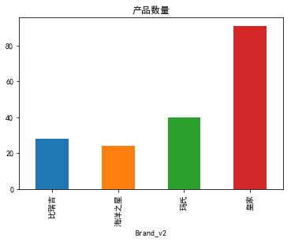


#### 总销量


```python
df_raw_1.groupby('Brand_v2').total_sale.sum().plot(kind='bar')
plt.title('产品总销量')
```


    Text(0.5,1,'产品总销量')


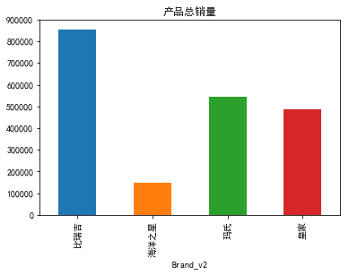


#### 总销售额


```python
df_raw_1['total_amount'] = df_raw_1.price * df_raw_1.total_sale
```


```python
df_raw_1.groupby('Brand_v2').total_amount.sum().plot(kind='bar')
plt.title('产品总销售额')
```


    Text(0.5,1,'产品总销售额')


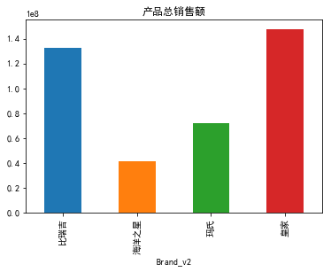


#### 月销量


```python
df_raw_1.groupby('Brand_v2').month_sale.sum().plot(kind='bar')
plt.title('产品月销量')
```


    Text(0.5,1,'产品月销量')


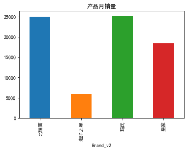


#### 月销售额


```python
df_raw_1['month_amount'] = df_raw_1.price * df_raw_1.month_sale
```


```python
df_raw_1.groupby('Brand_v2').month_amount.sum().plot(kind='bar')
plt.title('产品月销售额')
```


    Text(0.5,1,'产品月销售额')


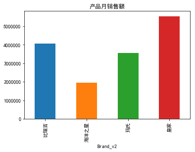


#### 收藏数


```python
df_raw_1.groupby('Brand_v2').CollectCount.sum().plot(kind='bar')
plt.title('收藏数')
```


    Text(0.5,1,'收藏数')


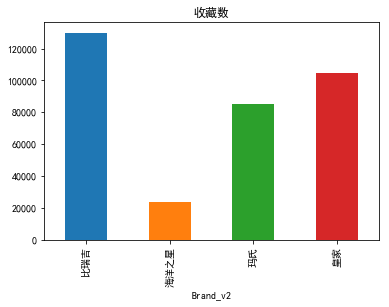


```python
avg_collect = df_raw_1.groupby('Brand_v2').CollectCount.sum()/df_raw_1.groupby('Brand_v2').CollectCount.count()
avg_collect.plot(kind='bar')
plt.title('平均收藏数')
```


    Text(0.5,1,'平均收藏数')


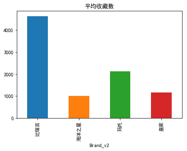


#### 评论数


```python
df_raw_1.groupby('Brand_v2').accum_comm.sum().plot(kind='bar')
plt.title('评论数')
```


    Text(0.5,1,'评论数')


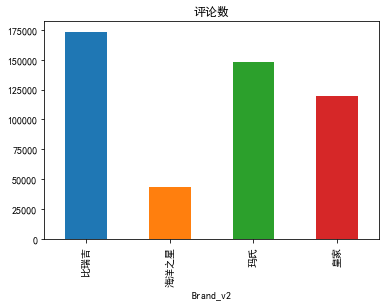


```python
avg_comm = df_raw_1.groupby('Brand_v2').accum_comm.sum()/df_raw_1.groupby('Brand_v2').accum_comm.count()
avg_comm.plot(kind='bar')
plt.title('平均评论数')
```


    Text(0.5,1,'平均评论数')


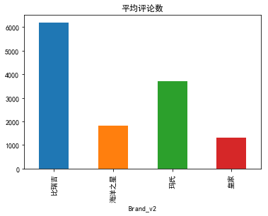


# 产品分析

#### 适用种类


```python
hj_class = df_raw_1[df_raw_1['Brand_v2']=='皇家'].groupby('Classification').item_name.count()
hj_class
```


    Classification
    专用粮    44
    奶糕      8
    犬粮     39
    Name: item_name, dtype: int64


```python
ms_class = df_raw_1[df_raw_1['Brand_v2']=='玛氏'].groupby('Classification').item_name.count()
bjr_class = df_raw_1[df_raw_1['Brand_v2']=='比瑞吉'].groupby('Classification').item_name.count()
hy_class = df_raw_1[df_raw_1['Brand_v2']=='海洋之星'].groupby('Classification').item_name.count()
```


```python
classfication = pd.DataFrame([hj_class,ms_class,bjr_class,hy_class])
classfication.index =['皇家','玛氏','比瑞吉','海洋之星']
classfication.plot(kind='bar')
plt.title('适用种类')
```


    Text(0.5,1,'适用种类')


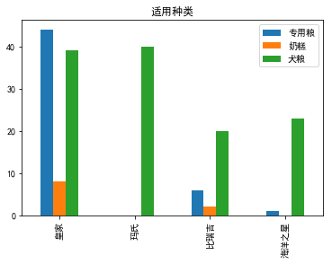


#### 适用品种


```python
hj_breed = df_raw_1[df_raw_1['Brand_v2']=='皇家'].groupby('Breed').item_name.count()
hj_breed
```


    Breed
    博美         1
    可卡         2
    吉娃娃        2
    德国牧羊犬      4
    拉布拉多       4
    斗牛犬        4
    日本柴犬       4
    比熊         2
    约克夏梗       4
    西部高地白梗     2
    贵宾/泰迪     11
    通用型       43
    金毛         4
    雪纳瑞        4
    Name: item_name, dtype: int64


```python
ms_breed = df_raw_1[df_raw_1['Brand_v2']=='玛氏'].groupby('Breed').item_name.count()
bjr_breed = df_raw_1[df_raw_1['Brand_v2']=='比瑞吉'].groupby('Breed').item_name.count()
hy_breed = df_raw_1[df_raw_1['Brand_v2']=='海洋之星'].groupby('Breed').item_name.count()
```


```python
matplotlib.rcParams['figure.figsize'] = (12.0, 6.0)
classfication = pd.DataFrame([hj_breed,ms_breed,bjr_breed,hy_breed])
classfication.index =['皇家','玛氏','比瑞吉','海洋之星']
classfication.plot(kind='bar')
plt.title('适用品种')
```


    Text(0.5,1,'适用品种')


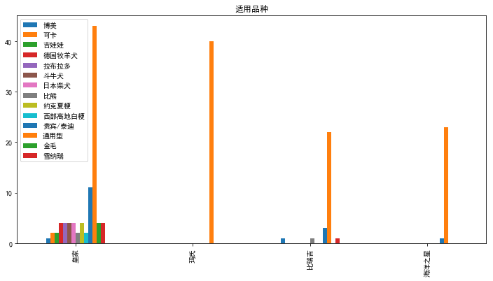


#### 适用体型


```python
hj_body = df_raw_1[df_raw_1['Brand_v2']=='皇家'].groupby('BodyType').item_name.count()
hj_body
```


    BodyType
    中型犬     6
    大型犬    19
    小型犬    38
    通用型    28
    Name: item_name, dtype: int64


```python
ms_body = df_raw_1[df_raw_1['Brand_v2']=='玛氏'].groupby('BodyType').item_name.count()
bjr_body = df_raw_1[df_raw_1['Brand_v2']=='比瑞吉'].groupby('BodyType').item_name.count()
hy_body = df_raw_1[df_raw_1['Brand_v2']=='海洋之星'].groupby('BodyType').item_name.count()
```


```python
matplotlib.rcParams['figure.figsize'] = (8.0, 4.0)
classfication = pd.DataFrame([hj_body,ms_body,bjr_body,hy_body])
classfication.index =['皇家','玛氏','比瑞吉','海洋之星']
classfication.plot(kind='bar')
plt.title('适用体型')
```


    Text(0.5,1,'适用体型')


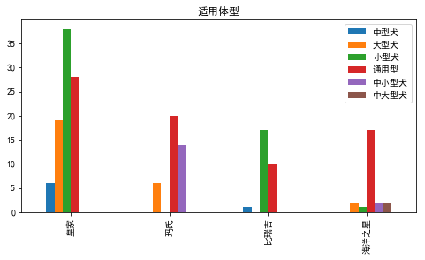


#### 适用年龄


```python
hj_age = df_raw_1[df_raw_1['Brand_v2']=='皇家'].groupby('ApplicablePhase').item_name.count()
hj_age
```


    ApplicablePhase
    使用于怀孕42天起的母犬、哺乳期母犬及2月龄以下离乳期幼犬     4
    幼犬                               31
    成犬                               43
    离乳期                               5
    老年犬                               8
    Name: item_name, dtype: int64


```python
ms_age = df_raw_1[df_raw_1['Brand_v2']=='玛氏'].groupby('ApplicablePhase').item_name.count()
bjr_age = df_raw_1[df_raw_1['Brand_v2']=='比瑞吉'].groupby('ApplicablePhase').item_name.count()
hy_age = df_raw_1[df_raw_1['Brand_v2']=='海洋之星'].groupby('ApplicablePhase').item_name.count()
```


```python
classfication = pd.DataFrame([hj_age,ms_age,bjr_age,hy_age])
classfication.index =['皇家','玛氏','比瑞吉','海洋之星']
classfication.plot(kind='bar')
plt.title('适用年龄')
```


    Text(0.5,1,'适用年龄')


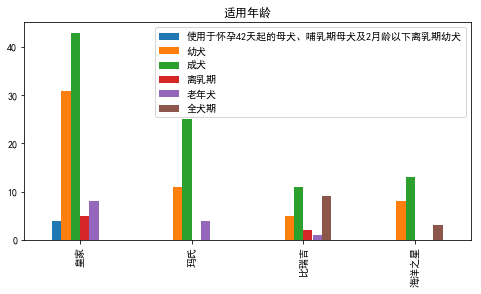


#### 口味配方


```python
hj_taste = df_raw_1[df_raw_1['Brand_v2']=='皇家'].groupby('RecipeTastePrescription_v2').item_name.count()
hj_taste
```


    RecipeTastePrescription_v2
    无    91
    Name: item_name, dtype: int64


```python
ms_taste = df_raw_1[df_raw_1['Brand_v2']=='玛氏'].groupby('RecipeTastePrescription_v2').item_name.count()
bjr_taste = df_raw_1[df_raw_1['Brand_v2']=='比瑞吉'].groupby('RecipeTastePrescription_v2').item_name.count()
hy_taste = df_raw_1[df_raw_1['Brand_v2']=='海洋之星'].groupby('RecipeTastePrescription_v2').item_name.count()
```


```python
classfication = pd.DataFrame([hj_taste,ms_taste,bjr_taste,hy_taste])
classfication.index =['皇家','玛氏','比瑞吉','海洋之星']
classfication.plot(kind='bar')
```


    <matplotlib.axes._subplots.AxesSubplot at 0x152446dfc50>


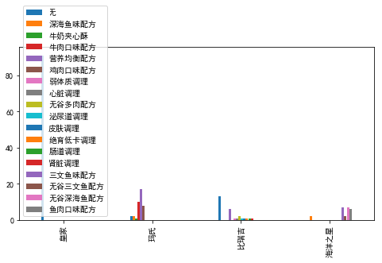


```python
classfication = pd.DataFrame([hj_taste,ms_taste,bjr_taste,hy_taste])
classfication.index =['皇家','玛氏','比瑞吉','海洋之星']
plt.figure(1,figsize = (18,4))
plt.subplot(121)
classfication.T['皇家'].plot(kind = 'bar')
plt.title('皇家')
plt.subplot(122)
classfication.T['玛氏'].plot(kind = 'bar')
plt.title('玛氏')
plt.figure(2,figsize = (18,4))
plt.subplot(121)
classfication.T['比瑞吉'].plot(kind = 'bar')
plt.title('比瑞吉')
plt.subplot(122)
classfication.T['海洋之星'].plot(kind = 'bar')
plt.title('海洋之星')

```


    Text(0.5,1,'海洋之星')


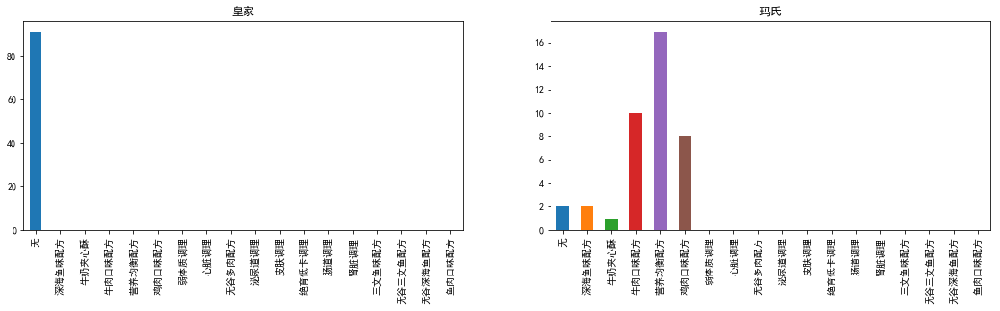


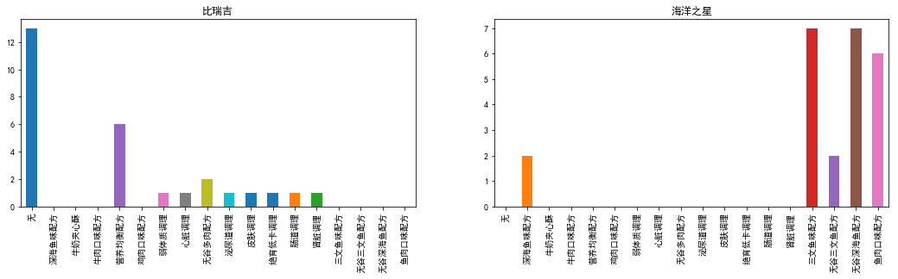


```python

```

对于皇家的细分析品种狗粮，销量情况如何？


```python
df_raw_1.columns
```


    Index(['item_id', 'item_name', 'TradeName', 'price', 'total_sale',
           'month_sale', 'accum_comm', 'TM_points', 'CollectCount', 'Tastes',
           'BodyType', 'ApplicablePhase', 'Brand', 'Classification', 'Breed',
           'Manufacturer', 'Weight', 'Origin', 'ManufacturerAddress',
           'RecipeTastePrescription', 'item_name_cut',
           'RecipeTastePrescription_v2', 'Brand_v2', 'total_amount',
           'month_amount'],
          dtype='object')


```python
hj_breed_sale = df_raw_1[df_raw_1['Brand_v2']=='皇家'].groupby('Breed').total_sale.sum()#.plot(kind ='bar')
hj_breed_sale.plot(kind ='bar')
plt.title('适用品种 总销量')
```


    Text(0.5,1,'适用品种 总销量')


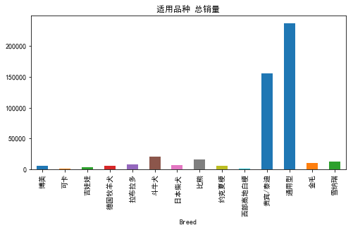


```python
hj_breed = df_raw_1[df_raw_1['Brand_v2']=='皇家'].groupby('Breed').item_name.count()#.plot(kind ='bar')
hj_breed.plot(kind ='bar')
plt.title('适用品种 产品数')
```


    Text(0.5,1,'适用品种 产品数')


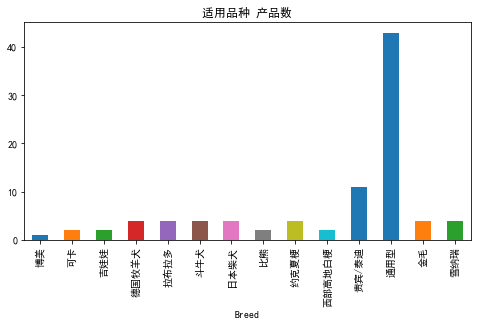


```python
hj_breed_avg_sale =hj_breed_sale/hj_breed
hj_breed_avg_sale.plot(kind ='bar')
plt.title('适用品种 总销量/产品数')
```


    Text(0.5,1,'适用品种 总销量/产品数')


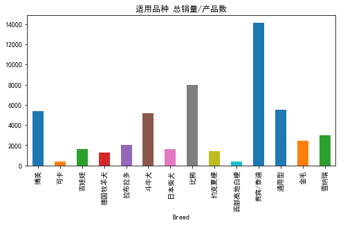


```python

```

比瑞吉的配方粮哪个最畅销？


```python
bjr_taste = df_raw_1[df_raw_1['Brand_v2']=='比瑞吉'].groupby('RecipeTastePrescription_v2').item_name.count()#
bjr_taste.plot(kind ='bar')
plt.title('口味配方 产品数')
```


    Text(0.5,1,'口味配方 产品数')


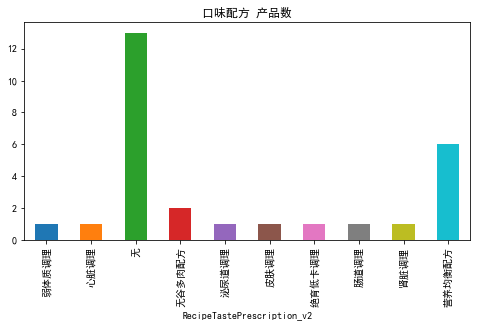


```python
bjr_taste_sale = df_raw_1[df_raw_1['Brand_v2']=='比瑞吉'].groupby('RecipeTastePrescription_v2').total_sale.sum()#
bjr_taste_sale.plot(kind ='bar')
plt.title('口味配方 总销量')
```


    Text(0.5,1,'口味配方 总销量')


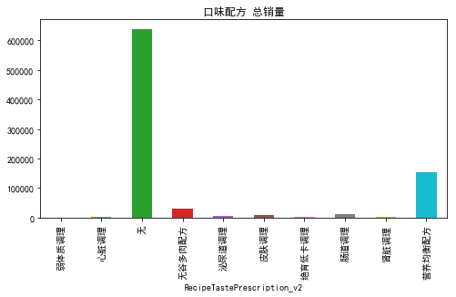


```python
bjr_taste_avg_sale =bjr_taste_sale/bjr_taste
bjr_taste_avg_sale.plot(kind ='bar')
plt.title('适用品种 总销量/产品数')
```


    Text(0.5,1,'适用品种 总销量/产品数')


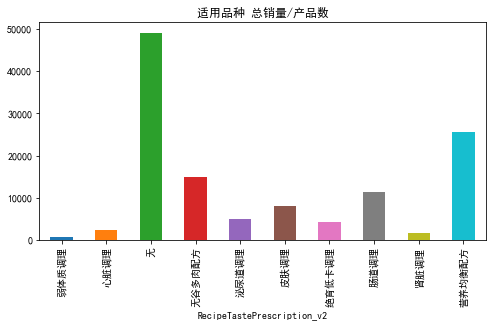


```python

```

# 价格分析 


```python
df_raw_1.columns
```


    Index(['item_id', 'item_name', 'TradeName', 'price', 'total_sale',
           'month_sale', 'accum_comm', 'TM_points', 'CollectCount', 'Tastes',
           'BodyType', 'ApplicablePhase', 'Brand', 'Classification', 'Breed',
           'Manufacturer', 'Weight', 'Origin', 'ManufacturerAddress',
           'RecipeTastePrescription', 'item_name_cut',
           'RecipeTastePrescription_v2', 'Brand_v2', 'total_amount',
           'month_amount'],
          dtype='object')


```python
hj_taste = df_raw_1[df_raw_1['Brand_v2']=='皇家'].groupby('RecipeTastePrescription_v2').item_name.count()
ms_taste = df_raw_1[df_raw_1['Brand_v2']=='玛氏'].groupby('RecipeTastePrescription_v2').item_name.count()
bjr_taste = df_raw_1[df_raw_1['Brand_v2']=='比瑞吉'].groupby('RecipeTastePrescription_v2').item_name.count()
hy_taste = df_raw_1[df_raw_1['Brand_v2']=='海洋之星'].groupby('RecipeTastePrescription_v2').item_name.count()
```


```python
hj_taste = df_raw_1[df_raw_1['Brand_v2']=='皇家'].price
ms_taste = df_raw_1[df_raw_1['Brand_v2']=='玛氏']
bjr_taste = df_raw_1[df_raw_1['Brand_v2']=='比瑞吉']
hy_taste = df_raw_1[df_raw_1['Brand_v2']=='海洋之星']
```


```python
hj_avg_price = df_raw_1[df_raw_1['Brand_v2']=='皇家'].price.sum()/df_raw_1[df_raw_1['Brand_v2']=='皇家'].price.count()
```


```python
df_avg_price =DataFrame({"brand":['皇家',"玛氏","比瑞吉","海洋之星"],
         "avg_score":[df_raw_1[df_raw_1['Brand_v2']=='皇家'].price.sum()/df_raw_1[df_raw_1['Brand_v2']=='皇家'].price.count(),
                     df_raw_1[df_raw_1['Brand_v2']=='玛氏'].price.sum()/df_raw_1[df_raw_1['Brand_v2']=='玛氏'].price.count(),
                     df_raw_1[df_raw_1['Brand_v2']=='比瑞吉'].price.sum()/df_raw_1[df_raw_1['Brand_v2']=='比瑞吉'].price.count(),
                     df_raw_1[df_raw_1['Brand_v2']=='海洋之星'].price.sum()/df_raw_1[df_raw_1['Brand_v2']=='海洋之星'].price.count()]}    )
```


```python
matplotlib.rcParams['figure.figsize'] = (6.0, 4.0)
df_avg_price.set_index("brand").plot(kind ="bar")
plt.title('均价')
```


    Text(0.5,1,'均价')


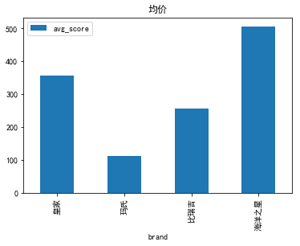


```python
df_raw_1[df_raw_1['Brand_v2']=='皇家'].price.sum()/df_raw_1[df_raw_1['Brand_v2']=='皇家'].Weight.sum()
```


    0.05871469949312093


```python
df_raw_1[df_raw_1['Brand_v2']=='玛氏'].price.sum()/df_raw_1[df_raw_1['Brand_v2']=='玛氏'].Weight.sum()
```


    0.029263199369582348


```python
df_raw_1[df_raw_1['Brand_v2']=='比瑞吉'].price.sum()/df_raw_1[df_raw_1['Brand_v2']=='比瑞吉'].Weight.sum()
```


    0.0615982905982906


```python
df_raw_1[df_raw_1['Brand_v2']=='海洋之星'].price.sum()/df_raw_1[df_raw_1['Brand_v2']=='海洋之星'].Weight.sum()
```


    0.07773401534526854


```python
df_avg_price_per_w =DataFrame({"brand":['皇家',"玛氏","比瑞吉","海洋之星"],
         "avg_score":[df_raw_1[df_raw_1['Brand_v2']=='皇家'].price.sum()/df_raw_1[df_raw_1['Brand_v2']=='皇家'].Weight.sum(),
                     df_raw_1[df_raw_1['Brand_v2']=='玛氏'].price.sum()/df_raw_1[df_raw_1['Brand_v2']=='玛氏'].Weight.sum(),
                     df_raw_1[df_raw_1['Brand_v2']=='比瑞吉'].price.sum()/df_raw_1[df_raw_1['Brand_v2']=='比瑞吉'].Weight.sum(),
                     df_raw_1[df_raw_1['Brand_v2']=='海洋之星'].price.sum()/df_raw_1[df_raw_1['Brand_v2']=='海洋之星'].Weight.sum()]}    )
```


```python
matplotlib.rcParams['figure.figsize'] = (6.0, 4.0)
df_avg_price_per_w.set_index("brand").plot(kind ="bar")
plt.title('价格/重量')
```


    Text(0.5,1,'价格/重量')


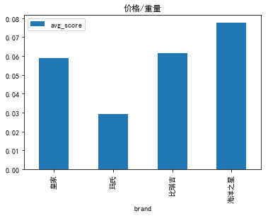


```python
plt.figure(1,figsize = (12,6))

plt.scatter(df_raw_1[df_raw_1['Brand_v2']=='皇家'].price,df_raw_1[df_raw_1['Brand_v2']=='皇家'].total_sale,marker = 'x',color = 'c',label='皇家',s=80)
plt.scatter(df_raw_1[df_raw_1['Brand_v2']=='玛氏'].price,df_raw_1[df_raw_1['Brand_v2']=='玛氏'].total_sale,marker = '+',color = 'm', label='玛氏',s=80)
plt.scatter(df_raw_1[df_raw_1['Brand_v2']=='比瑞吉'].price,df_raw_1[df_raw_1['Brand_v2']=='比瑞吉'].total_sale,marker = 'o',color = 'r', label='比瑞吉',s=80)
plt.scatter(df_raw_1[df_raw_1['Brand_v2']=='海洋之星'].price,df_raw_1[df_raw_1['Brand_v2']=='海洋之星'].total_sale,marker = 'v',color = 'g', label='海洋之星',s=80)
```


    <matplotlib.collections.PathCollection at 0x152451a7320>


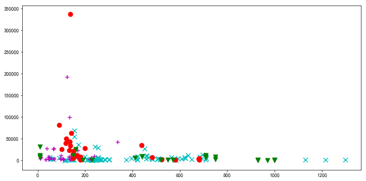


# 数据处理（二）


```python
df_raw_2 = pd.read_excel('Product_comments_rawdata.xlsx') # 96,531 rows x 22 columns
df_raw_2.columns
```


    Index(['brand', 'cmsSource', 'sellerId', 'item_id', 'id', 'displayUserNick',
           'rateContent', 'pics_0', 'pics_1', 'pics_2', 'pics_3', 'pics_4',
           'rateDate', 'reply', 'content', 'commentTime', 'tamllSweetLevel',
           'tradeEndTime'],
          dtype='object')


```python
len(df_raw_2)
```


    96531


```python
print("min comment time:", min(df_raw_2.rateDate))
print("max comment time:",max(df_raw_2.rateDate))
```

    min comment time: 2016-03-27 07:11:10
    max comment time: 2018-03-31 21:35:11


```python
df_raw_2.head(2)
```


<div>
<style scoped>
    .dataframe tbody tr th:only-of-type {
        vertical-align: middle;
    }

    .dataframe tbody tr th {
        vertical-align: top;
    }
    
    .dataframe thead th {
        text-align: right;
    }
</style>
<table border="1" class="dataframe">
  <thead>
    <tr style="text-align: right;">
      <th></th>
      <th>brand</th>
      <th>cmsSource</th>
      <th>sellerId</th>
      <th>item_id</th>
      <th>id</th>
      <th>displayUserNick</th>
      <th>rateContent</th>
      <th>pics_0</th>
      <th>pics_1</th>
      <th>pics_2</th>
      <th>pics_3</th>
      <th>pics_4</th>
      <th>rateDate</th>
      <th>reply</th>
      <th>content</th>
      <th>commentTime</th>
      <th>tamllSweetLevel</th>
      <th>tradeEndTime</th>
    </tr>
  </thead>
  <tbody>
    <tr>
      <th>0</th>
      <td>royalcanin</td>
      <td>天猫</td>
      <td>1728261286</td>
      <td>19045209534</td>
      <td>342988772811</td>
      <td>万***娆</td>
      <td>第二次购买，可以说营养很好了。狗子长得不像两个月小狗狗。如果不是有个慢食盆，估计30秒解决战斗</td>
      <td>//img.alicdn.com/bao/uploaded/i3/0/TB2yRxwa_qW...</td>
      <td>//img.alicdn.com/bao/uploaded/i1/0/TB2fiJbaVko...</td>
      <td>NaN</td>
      <td>NaN</td>
      <td>NaN</td>
      <td>2018-03-16 18:42:18</td>
      <td>NaN</td>
      <td>NaN</td>
      <td>NaT</td>
      <td>0</td>
      <td>2018-03-16 10:39:49</td>
    </tr>
    <tr>
      <th>1</th>
      <td>royalcanin</td>
      <td>天猫</td>
      <td>1728261286</td>
      <td>19045209534</td>
      <td>343864372011</td>
      <td>水***7</td>
      <td>闻起来有种奶味～还不错。</td>
      <td>//img.alicdn.com/bao/uploaded/i4/0/TB2E2NrfYSY...</td>
      <td>NaN</td>
      <td>NaN</td>
      <td>NaN</td>
      <td>NaN</td>
      <td>2018-03-24 17:22:00</td>
      <td>NaN</td>
      <td>NaN</td>
      <td>NaT</td>
      <td>0</td>
      <td>2018-03-21 14:26:20</td>
    </tr>
  </tbody>
</table>
</div>


```python
df_raw_2[['rateContent','content']].head(10)
```


<div>
<style scoped>
    .dataframe tbody tr th:only-of-type {
        vertical-align: middle;
    }

    .dataframe tbody tr th {
        vertical-align: top;
    }
    
    .dataframe thead th {
        text-align: right;
    }
</style>
<table border="1" class="dataframe">
  <thead>
    <tr style="text-align: right;">
      <th></th>
      <th>rateContent</th>
      <th>content</th>
    </tr>
  </thead>
  <tbody>
    <tr>
      <th>0</th>
      <td>第二次购买，可以说营养很好了。狗子长得不像两个月小狗狗。如果不是有个慢食盆，估计30秒解决战斗</td>
      <td>NaN</td>
    </tr>
    <tr>
      <th>1</th>
      <td>闻起来有种奶味～还不错。</td>
      <td>NaN</td>
    </tr>
    <tr>
      <th>2</th>
      <td>我们小红包很爱吃，?也很正常。第一天没有泡够时间，吃吐了。不过后来就好了。就是有点贵，别的没...</td>
      <td>NaN</td>
    </tr>
    <tr>
      <th>3</th>
      <td>此用户没有填写评论!</td>
      <td>差评！差评！差评！当时一次买了两袋，第一袋子吃了20天之后狗狗开始拉肚子，于是给狗狗换馒头和...</td>
    </tr>
    <tr>
      <th>4</th>
      <td>靠谱 打开很香不腥</td>
      <td>NaN</td>
    </tr>
    <tr>
      <th>5</th>
      <td>东西蛮不错的，希望能有用，我的德牧也很爱吃。</td>
      <td>NaN</td>
    </tr>
    <tr>
      <th>6</th>
      <td>很好，包装扎实，品牌信得过</td>
      <td>NaN</td>
    </tr>
    <tr>
      <th>7</th>
      <td>划算～多做活动呀～狗狗爱吃…不过我们家狗狗也是真的不挑食了…简直什么都想吃</td>
      <td>NaN</td>
    </tr>
    <tr>
      <th>8</th>
      <td>第二次买</td>
      <td>NaN</td>
    </tr>
    <tr>
      <th>9</th>
      <td>宝贝买的很划算，其他就不评价了</td>
      <td>NaN</td>
    </tr>
  </tbody>
</table>
</div>


```python
df_raw_2['rateContent'][3]
```


    '此用户没有填写评论!'


```python
# " ".join(aaa) list 合并连接字符串的方法
aaa=['stt','hiud']
bbb=[]
content = " ".join(aaa)
bbb.append(content)
bbb
```


    ['stt hiud']


```python
Comment = []
for i in range(len(df_raw_2)):
    if df_raw_2.rateContent[i] == '此用户没有填写评论!' and not pd.isnull(df_raw_2.content[i]) :
        Comment.append(df_raw_2.content[i])
    elif df_raw_2.rateContent[i] == '此用户没有填写评论!':
        Comment.append('')
    elif not pd.isnull(df_raw_2.content[i]):
        Comment.append(" ".join([str(df_raw_2.rateContent[i]),str(df_raw_2.content[i])])) 
    else:
        Comment.append(df_raw_2.rateContent[i])
    
```


```python
len(Comment)
```


    96531


```python
Comment[0:500]
```


    ['第二次购买，可以说营养很好了。狗子长得不像两个月小狗狗。如果不是有个慢食盆，估计30秒解决战斗',
     '闻起来有种奶味～还不错。',
     '我们小红包很爱吃，?也很正常。第一天没有泡够时间，吃吐了。不过后来就好了。就是有点贵，别的没毛病。不过好像没有送狗粮产，不开心。跟店家说了小狗等着吃，当天就给发货了，大过年的谢谢了！',
     '差评！差评！差评！当时一次买了两袋，第一袋子吃了20天之后狗狗开始拉肚子，于是给狗狗换馒头和鸡肉吃了4天，狗狗不拉稀了，我以为是第一袋开了太长时间于是就把第一袋剩余的狗粮扔了，打开了第二袋，第二代吃了两天之后狗狗又开始拉稀，我觉得应该是狗粮有问题，请大家慎重购买。',
     '靠谱 打开很香不腥',
     '东西蛮不错的，希望能有用，我的德牧也很爱吃。',
     '很好，包装扎实，品牌信得过',
     '划算～多做活动呀～狗狗爱吃…不过我们家狗狗也是真的不挑食了…简直什么都想吃',
     '第二次买',
     '宝贝买的很划算，其他就不评价了',
     '第二袋了，赶上双11买一袋备着先，包装完好，好评先',
     '12公斤包装很好，还未吃追评吧。',
     '双十一的价格很实惠，快递也给力',
     '多次买了',
     '傻狗喜欢',
     '我家德牧第一天很爱吃，可这几天不怎么爱吃，不知怎么回事？',
     '这是第二袋了，狗狗吃了毛色蛮好的，其他暂时还不知道',
     '一直买，挺好的，就是总断货，抢到一次不容易',
     '外面箱子写的是英短猫粮。。。吓死，以为这么重，要退回去。 。。。打开一看，幸好没错。自己尝了一下，很香，口感也挺好，而且确实有股鱼虾的鲜腥味，不知道是不是发现了什么',
     '正在吃，单独吃狗粮会拉稀而且很臭，可能我狗狗不太适应狗粮。后期追评。',
     '狗狗不喜欢吃！！！习惯好评而已',
     '还行。不错。',
     '和我平时买的我个人认为还是有点小区别的 首先颜色对比 不愿来的浅还有 狗粮很湿一样 搞的我还买了4大袋呢',
     '寄来的是成犬又要寄回去再换…希望发货能进行复查，这样的大件寄来寄去非常不方便…',
     '跟平时买的好像不太一样',
     '好大一袋这样不好保存吧？而且也没有赠品待遇还不一样，而且狗狗吃了几次就不爱吃了。',
     '回购',
     '可以',
     '可以',
     '很好',
     '挺好',
     '爱吃',
     '还行。不错。',
     '数量足',
     '东西很好，连续2次买了，就是钱跟不上。。。。 好',
     '一分钱 一分货，确实不错。狗狗很希望吃，希望狗狗吃了，毛毛可以发亮。',
     '好',
     '我家宝贝四个多月一直吃咱家狗粮，壮壮的！',
     '连续购买两次了，物流给力，狗狗爱吃，正品满分！ 很好，满意',
     '不错，送货超快，好大一袋，赠送的礼品好贴心，谢谢',
     '皇家的狗粮可以信赖，狗狗吃了非常好，便便也很正常，狗狗也很喜欢吃。',
     '很好。大箱子包装运输，包装到位，而且送量杯，勺子，刷子，感觉很贴心，想的周到，服务周全。先摆了一勺子200克，狗狗很快吃完了，感觉不错。',
     '正品',
     '好',
     '刚收到。看着挺整齐。比京东贵。看不懂上边的喂量。',
     '虎子一直吃皇家德牧幼犬粮  第一次在这家买 比别家贵了100多 对比一下试试吧  真有区别的话 还会来',
     '一如既往的好',
     '皇家德牧幼犬狗粮很好，狗宝宝很爱吃',
     '发货快，包装严实，生产日期是今年5月份的，第二次购买了，家里两只德牧吃得太快了哈哈',
     '老顾客了，买了第三袋了，??挺喜欢吃的。',
     '包装非常好，两个大盒子，狗狗非常喜欢吃，还会再光顾的。',
     '一波三折',
     '挺好的',
     '宝贝儿很喜欢这个',
     '一直买的这款～～ 一如既往的好 满意',
     '挺重！',
     '多次购买了，这次发生一点小状况(物流延误送货)，卖家积极帮忙联系沟通，才使得货物安全收到。对卖家负责的态度点赞?',
     '收到了还没开箱查看，待会回家看',
     '',
     '好东东，名不虚传',
     '东西好，客服好',
     '物流非常快！第二次购买',
     '非常好！速度很快！送的东西很实用！',
     '德牧的的狗粮吃了毛很亮',
     '第二次购买了 感觉忒贵勒 嘿嘿 总体来说产品质量很好 狗狗喜欢吃',
     '狗狗挺爱吃，应该不错',
     '包装好，生产日期是今年五月份的，好评！',
     '多次购买了',
     '坚持给狗狗吃狗粮，就算它不怎么爱吃，总是盯着人手里的任何零食一副馋相，不为它的可怜相心软，就算零食解馋，狗粮还是主食，每天两顿，它饿了还是会吃光的。',
     '有点大，毕竟12公斤装，感觉要吃很久',
     '活动时买的，价格在同品牌中有优惠，商家还送了自动宠物喂食器～好评～',
     '吃了泪痕比较严重',
     '非常满意的! 赞一个!~',
     '第二次买了',
     '狗狗超爱吃，皇家的狗粮就是好',
     '包装不错快递不错，看我家宝贝以后是不是喜欢吃吧',
     '根本没有收到赠品，没诚信',
     '满分 正品 满意 很放心 很喜欢 很好',
     '喜欢',
     '狗狗喜欢吃。运气不好。货还没收到就降价52元。',
     '被训了，狗粮比狗贵系列……哈哈，不过狗狗喜欢吃就好～',
     '狗狗还没吃呢？吃完再评吧？',
     '皇家品牌完蛋了，你怎么让我们相信？真心差劲，每次都给好评，因为相信品牌相信天猫。结果发现这么好的狗粮竟然有这样的问题……真是令人作呕',
     '很不错，狗狗很喜欢吃。',
     '吃了，还行吧。怕是过敏呢。',
     '狗狗一直不爱吃这个?',
     '好',
     '反正就是长期驻扎户～',
     '闻起来没有原来的奶香味了，换配方了难道？',
     '比一般狗粮好，只是我家狗狗习惯了自己做的，牛肉加青鱼加玉米面为基本材料，这个几乎不吃，咋整？',
     '狗狗不爱吃，吃了两天就不吃了，无语，买了一大包，它不吃，我也是醉了',
     '好',
     '应该不错。毕竟价格摆在那里 就是袋子的封口不太喜欢。不能二次密封。',
     '一定要严格按照换食流程，不然会出现不良反映',
     '一如既往、下次应该再有活动时候多囤一些',
     '包装非常严实，貌似应该是正品',
     '过段时间来追加',
     '买了不少，开始狗狗喜欢吃，可能是嘴叼了，也可能是吃腻了，现在就饿了吃，我也无法分辨是否好，觉得大牌子吧，就吃着呗',
     '很不错',
     '来过很多次了，不过怎么价格一直在长，考虑换别的吧',
     '很不错。现在6个月大了',
     '旗舰店的东西正品是肯定的，就是价格相对于其他点来说高的有点离谱了，双十一送的狗狗牵引绳还不错',
     '很好',
     '先不说别的 第一感觉是轻 意思就是不太像12公斤 专门买了称 明天称一下 看看够不够 先好评吧',
     '好',
     '小建议?，12公斤包装太大，要有4公斤的就好了。',
     '老顾客啦～',
     '第三次购买了，狗狗爱吃，长的也很快～',
     '第三个月了?',
     '质量很好 一直买这款 和在国外买的味道都是一样的。',
     '包装不够牢固，还好里面袋子没穿。狗狗爱吃，查询过属正品，建议买！',
     '很好',
     '好好好！',
     '回到家就开始吃，长的棒棒的',
     '好',
     '货已收到挺实惠，等用了再来评价！',
     '一直这家买，很不错',
     '东西不错，以后会常来的。东西不错，以后会常来的。东西不错，以后会常来的。东西不错，以后会常来的。东西不错，以后会常来的。东西不错，以后会常来的。东西不错，以后会常来的。',
     '很香也很油,德牧爱吃.五分',
     '好',
     '好评',
     '包装很好！物流很快，昨天买的今天下午就到了，狗狗还没吃，到时候追评。 棒棒哒',
     '很赞，非常好',
     '发货速度快、包装完整严密、狗粮已经开始更换、有问题再追加',
     '非常的好，第二次购买还给优惠了，非常满意 服务好极了',
     '狗狗很爱吃',
     '不是第一次买了 没啥说的',
     '超级好，客服很棒',
     '不错，狗狗很喜欢吃',
     '发货快包装精致，收到货电话验证是正品，狗狗很喜欢吃，一个月了长得也快，特别是毛长得好，今天去打疫苗别人说这狗吃的狗粮肯定好，看那毛长得就知道了。真心不错希望质量一如既往的好',
     '包装很好，应该是正品吧，还没给狗狗吃等吃了在追许',
     '是正品，狗狗特别喜欢吃，很满意，放心购买吧，给满分！',
     '老顾客的，宝贝狗狗爱吃，非常好',
     '发货快，包装不错，应该是真货～',
     '物流快！满意！',
     '很好！宝贝喜欢吃！',
     '收到有点漏了618货物多可以理解，下次建议狗粮袋外面加点防护，开口后必须有狗粮桶放，不能封口的，10升的米桶放了两桶半，要是能封口就好了。这个确实比通用的幼犬粮适合德牧通用的颗粒太大了牙没有换完的宝宝吃了容易卡，这个它的小大牙正好可以咬碎，感觉这个比奶糕更油腻，宝宝吃奶糕尿已经不怎么黄了，过度了这个又开始尿出来的巨黄巨油，不知道过段时间会不会好点',
     '好大一袋，包装很好，狗狗还没吃，它应该会喜欢',
     '适口性不好，狗狗不爱吃',
     '老顾客了',
     '包装很完美 产品质量与描述相符 送勒塑料存粮桶 我的德牧爱犬很喜欢吃 坐等吃后效果 物流速度也非常不错 卖家服务态度很好 希望能帮到大家 谢谢',
     '我觉得贵点无所谓，最重要的是品要正！只要宝宝们吃的安全就可以了?官方旗舰店值得信赖！',
     '买了不少，开始狗狗喜欢吃，可能是嘴叼了，也可能是吃腻了，现在就饿了吃，我也无法分辨是否好，觉得大牌子吧，就吃着呗',
     '送了胸背～',
     '非常好，狗狗超爱吃，',
     '狗粮很好，狗狗很爱吃。',
     '买了好多次！',
     '一如既往的好',
     '今天给狗狗吃了，感觉够爱吃',
     '好',
     '上一袋还没有吃完，先备着。',
     '这狗粮有诱食剂吧，吃了这个，老挑食了，煮的肉稀饭也不吃了，加了狗粮也不吃，只有狗粮才会吃，这个价格以后还是买天然粮吧，',
     '我的狗狗一直吃这个粮 还不错',
     '不错一直买的这家',
     '棒',
     '狗狗还比较喜欢，比较满意',
     '每次都来这儿买～买得放心～',
     '狗狗比较喜欢吃',
     '当初买的当天就写着拍下送储量筒，没写开始时间结束时间。我们买主肯定都认为买下就送了啊！结果今天才反应过来，马上去找他，结果马上便宜了150块钱。最后商家说我买早了，没有参与到活动时间。。。。。我就醉了，有你做生意的吗，在你官网买就信任你，结果价格升幅那么大不说，赠品又不是买不起，显得你多小气！',
     '老客户价钱时高时低差不少、希望实惠点，印象中前后能差一百几近二百的样子',
     '一个是上个月买的（颜色浅.显得饱满），一个是这次买的颜色深不饱满。不知为什么？',
     '运输途中破了一个洞，包装太粗糙',
     '很好',
     '狗狗很喜欢吃，不错',
     '很好',
     '买过很多次了，非常满意',
     '狗还没到',
     '好评',
     '狗狗很喜欢，服务也很好，全五星',
     '好评！',
     '好',
     '包装很完整，看着很好，待狗狗吃后来评价',
     '不错不错不错不错不错不错不错不错不错',
     '很棒～双十一发货也快～服务质量一直都高～反正认准旗舰店买的～',
     '赞！',
     '发货很及时',
     '简直就是狗子的救命粮，因为少根筋，一直以为家里还有一袋存货，等到要用了，才发现压根没有存货了，可是，大过年的，都不发货了……幸好这家还可以发顺丰，太好了，虽然比平时久了一点，但好歹也是到货了。替狗子谢谢你们了……感激……',
     '现在已经从奶糕转换到专用狗粮啦，肠胃已经适应，也没有挑食',
     '送货很快，不知道狗狗吃了会不会更好 没送量杯，有点失望',
     '儿砸不太爱吃呢。看了下配料表，还挺全面的。',
     '狗狗爱吃，就是吃了尿黄，',
     '比比瑞吉的好很多 便便正常了 也没那么臭 大家有推荐的狗粮么 很多人说皇家的太油 不适合长期吃 麻烦赐教',
     '第一次买皇家 特意等狗狗吃了一段时间才来评价 很好 狗狗很爱吃 才吃了一阵 就觉得他长肉了 狗狗九个月了 下次就该买成犬粮了 希望他吃皇家还可以再窜窜个 嘻嘻嘻',
     '竟然破口了！什么质量啊 垃圾！里面的狗粮都潮了，太垃圾了！！！店大欺客',
     '狗失踪了……240包邮转卖…要的私信我',
     '货品和快递还是很给力的，就是派送员放在门口也不电话或短信通知一声，有点小缺憾',
     '狗子一直吃的',
     '之前用宝路的狗粮。这回试了一下皇家。狗狗好像吃少了。但不至于绝食不吃的状态。慢慢看吧',
     '还不错',
     '柴柴幼犬专配的狗粮，宝宝4个月大，换食后肠胃反应正常……日期新鲜，搞活动囤了几包……物流超快，客服热情',
     '狗吃了两天就不吃了。',
     '快递垃圾',
     '我家狗只要是狗粮就不爱吃，挑食，我以为这个能改善它的挑食，结果并没有，还是照样不好好吃狗粮，我好郁闷……当然不是说这个狗粮不好，可能只是我家狗的原因，心累……',
     '狗狗接受的',
     '非常满意，好评！',
     '宝贝在吃了',
     '柴柴幼犬的专配狗粮，宝宝4个月，换食后肠胃反应正常……日期新鲜，物流超快，客服热情',
     '狗粮已经收到啦，小狗很喜欢吃',
     '我发现我家狗啥都吃_(：_」∠)_我可能养了一头猪',
     '照！完美！正品',
     '东西好 邮费贵',
     '还没给狗狗吃，看起来不错的',
     '好大一包，还没用先确认了',
     '很好',
     '狗狗挺爱吃的 就是贵啊！',
     '活动囤货',
     '发货龟速害的我家狗子断了几天吃的',
     '跟之前买的一样，我家狗狗现在已经长了2斤了，希望长得',
     '不错',
     '很好！谢谢小礼物！',
     '狗狗很喜欢吃！',
     '柴犬六个月，不爱吃 无良商家！不到一个月，降价60！而且我家柴犬不爱吃！怀疑此粮质量！！大家小心！！',
     '这一次的幼犬粮好像吸引力不高哦，不是很爱吃。之前的试用装，狗狗吃了粑粑偏溏。相对来说，我去年底买的那一批比较好。',
     '挺好的',
     '小狗很喜欢吃',
     '狗狗在家里，应该还不错，卖家挺好的',
     '柴柴幼犬的狗粮，四个月的宝宝吃了肠胃反应正常……日期新鲜，搞活动时囤了几包……物流超快，客服热情',
     '第二次了 不上图了 好评。 啥时候送送东西就更好了~',
     '很喜欢吃。',
     '狗狗还没吃，包装很不错',
     '打开连个量杯都没有，有这张表不知道有啥用，真怀疑是假货',
     '非常好',
     '二货挺爱吃的，目前还是两种对着吃，还没完全吃新狗粮，大便之类的还算正常。',
     '要是运费能便宜点就好了',
     '第一次用皇家，不知道效果怎么样，用用再来评价',
     '不错，送货很快',
     '脆脆的！狗子喜欢。但是物流曲折，浙江发货一路运去了虎门......从广州那边飞过来的，幸亏家里有屯粮，要不然狗子就要在家里饿死了。',
     'emm，我也不知道旗舰店的是不是正品，因为别人跟我说旗舰店的也不一定是正品，不过用微信扫有积分什么的，我也不懂。反正给我家狗狗吃了以后，我家狗是刚拿来的，以前在原来那户人家吃的不太好，第一次到我家拉的便便又干又黑，我给它吃这个狗粮两天以后，拉的便便已经是健康的状态了，所以这个狗粮应该还是比较好的吧，至少看屎是比较好的，至于长身体方面，才吃了两天，也看不太出来。然后它挺爱吃的',
     '还没吃，用后再说，客服挺不错的',
     '狗狗很爱吃，会再来的',
     '狗狗很喜欢吃，好评',
     '好大一包 加了羊奶一起泡的 已吃了六天 胃口越来越大 便便正常 很好',
     '物流慢的像牛一样，狗狗没有食物了，剩的一点被它弄洒到马桶里面，急的我，这个粮食等我我真的心痛，狗狗饿了两天，着急的小伙伴要慎拍啊',
     '奶糕，奶香味，有点油，两个月的拉布拉多吃的还可以，就是吃过爱睡觉不解',
     '狗狗爱吃，确实有增胖的效果，闻着有股奶香，只是便便有点丑。',
     '很好   狗狗爱吃  双十一又拍了两袋',
     '同样的东西这边卖307，京东比这边便宜105，这家太黑。',
     '京东价格便宜多了',
     '买给狗子过度的，可惜他不爱吃，宁可吃咬不动的渴望',
     '吃不起啊。。。这么一袋子，我家狗一周留给干掉了，！！油比较大。。',
     '除了贵，没毛病',
     '好评',
     '好',
     '挺好的',
     '特别生气外加无语的一次购物，买过来盒子这样的，拆开过。联系客服，让我看看里面东西有没有漏气，看了告诉她一开始里面看起来鼓鼓的，但是手一抓气就跑没了，她告诉我，这不叫漏气！！！！请问，哪样才叫漏气？？？反正估计我不管说哪样他们都有借口说这不是漏气。总之就是那几句复制粘贴的话来回发给你，就是没具体解决！！狗狗的狗粮，吃的东西啊，这样的谁敢给狗狗吃！和客服说的不想再说了，我说算我倒霉吧，人家客服心真大，发一笑脸过来。真是够了，在狗狗群里说了这个事儿，人家也说下次换家店，就算运输不好，至少从事后解决来看真心不行→_→ 除了客服解决问题的方式，包装也长点儿心吧，别把老客户都弄跑了',
     '狗狗有口福了，买最好的，皇家！哈哈不用天天早起给它煮饭了。。。可以歇歇了',
     '40天小狗，早上拉的正常便便，中午吃一顿就拉稀便，找客服让问兽医，就这工作态度，我看也是最后一次了，真垃圾',
     '狗粮很正，我家狗狗很爱吃！吃完再来买！！',
     '前脚买 后脚降价？刚开始问不能提醒一下有活动？客服这么牛逼？ 不退拉倒以后不买了 问啥都是你有理？谁家不退？',
     '客服态度好   是正品    会回购的',
     '有点贵啊，狗狗不是很爱吃的样子',
     '天猫没有差评选项挺恶心的，对于这家店铺一星都不愿意给！家里小朋友不懂淘宝结果挑了家全网最贵的！客服跟机器人一样古板僵硬无法沟通，活动随时降价可见利润空间有多大却连一点点买家权益都不肯保障，养狗是长期的，这种做生意的方式不会有回头客的。给后面的买家提个醒，多看看追评，看大家是怎么评价这家售后是有多差劲！ps.同样的狗粮人家正经品牌店比这便宜了近100块。',
     '小狗吃了之后拉稀发烧 得了肠胃炎 不敢再给他吃了 心碎',
     '满意',
     '不错，很好',
     '非常好',
     '略贵',
     '卖家真心非常好  小金毛也爱吃 下次一定会在光顾 多谢卖家推荐买这款奶糕??\\( ??`)/??感恩节快乐',
     '袋子里现在不配有量杯了，面对一大袋狗粮根本无从下手，不知道要喂多少，询问客服，只会说些无用的官方用于搪塞客户，从不会站在客户的角度思考和为客户解决问题，皇家的品牌没有问题，但皇家的售后问题极大，相当不满意。什么问题都无法解决还当什么客服！ 皇家的品牌没有问题，但皇家的售后问题极大，相当不满意。什么问题都无法解决还当什么客服！',
     '还可以',
     '只能说比京东自营贵了将近80块，第一次买没经验没办法啦，狗狗吃着还是不错嗒',
     '狗狗很喜欢吃，就是价格太高，有点心痛',
     '吃了好几天，一开始换一点，后来干脆全换了，狗狗吃得不亦悦乎！也可能是以前为少了，饿的。三餐5：30-50g,18：00-50g,22：30-30g,早晚半个蛋黄。便便成形，气味也还好吧。就是不知道喂的多还是少了，反正一副饿死鬼的样子，我家是50天的拉拉。谢谢卖家推荐的奶糕粮！',
     '活动时购买优惠了不少，希望吃了对狗狗好',
     '小金毛已经出生了，过几天就要来我家了，一切都是为它准备的！希望它健健康康的长大！',
     '官网验证是正品 我家多多从小奶糕换成大奶糕 没出现什么症状 都很喜欢吃',
     '还行',
     '就是价格和实体店一样  没优惠',
     '店家超级好哒。????????',
     '这次真的不满意，刚拆开包裹就发现撕条撕了一段。都漏气了。狗粮的味道都闻得到',
     '一直在买',
     '狗宝快生小宝宝了，特别喜欢吃这个狗粮，下次还来~',
     '好大一包~希望小奶狗喜欢！',
     '很香，但是我家狗狗不吃。',
     '不错，没有香精味！带点湿，跟以前店里买的一样，正品，狗狗也喜欢吃，小时候就喂的皇家，现在怀孕了也继续喂皇家，很不错的粮',
     '发货慢',
     '感觉不合适自家狗狗',
     '家里的德牧超级挑食，成犬狗粮也不吃。奶糕吃的比较好。以后都给他吃奶糕了',
     '呵呵，这种服务态度，审核一下要三天，搞笑，那我狗粮断了怎么办？说了稍后售后处理，不问就不管，这就是你们服务态度？自己的产品包装箱上的条形码还能证明是你们的东西？这种店简直垃圾，以后再也不会买了，稍后回请天猫介入！！！差评！',
     '还可以',
     '正品不正品不怎么清楚，但是狗只吃了没有拉肚子，一切正常，叔一个五星好评吧？',
     '狗狗爱吃 小贵',
     '狗狗吃了这个狗粮拉稀了，而且油特别大，以前买的没有这么多油，泡过之后一层油',
     '狗狗爱吃。。',
     '挺好的，有奶粉味道。狗子爱吃',
     '',
     '狗狗还没满月',
     '用奶粉给我家狗狗泡着吃的 狗狗吃的可欢腾了呢',
     '很好 宝宝爱吃',
     '东西还不错，发货和物流上有点延迟',
     '一如既往的好',
     '两个问题，第一，付款第二天立马活动降价了，购买时因为运费问题问过有没有活动。客服无正面回答。第二，咨询时明确表示四十多天狗狗，这袋狗粮吃多久？大于两个月还能不能吃？答复二十天的量。拿到手懵逼了，才一个刚断奶的狗狗，这么大量俩月都吃不完。知道商家利益为重，但也不能拿消费者当傻子。可能这就是所谓的店大欺客。 再次重申，店大欺客。不评论，整个退款过程只让人恶心，不想浪费时间就这样吧。天猫介入后仍然歪理邪说，避重就轻。消费者只能吃哑巴亏。淘宝第一次差评，给商家及天猫。',
     '满意',
     '味道不是很好闻，个人认为，希望狗狗喜欢~',
     '第三包了啦……',
     '狗狗很爱吃，拉的粑粑也正常，1包4公斤吃完长大了许多。',
     '东西不错 很大一袋 看评价好像之前活动的时候优惠不少...期待双十一有活动',
     '我们家狗狗很爱吃',
     '家里三只宠物都是吃的这家粮食！所以不需要多说什么了！吃完了就买！正品！吃的放心！',
     '非常好，狗狗吃了很健康',
     '狗粮还可以，还没用，用了再来评论',
     '不错，小狗挺喜欢的',
     '很好的狗粮',
     '好大一包。问着非常香。下次还会过来买',
     '狗狗很喜欢吃。',
     '包装完好，还没有吃，囤货中',
     '刚用上，狗狗吃的很开心～',
     '狗爱吃',
     '给宝贝吃了2天才来评价，味道很香，宝贝特别喜欢吃，就是宝贝刚35天大，不知道喂多少合适……',
     '好大一袋子，够小朋友吃一阵了。我家是两个月的阿拉斯加，小家伙肠胃较弱，皇家的粮比较油，直接泡了吃会拉软便。我每次都用热水快速漂两遍再正式泡发，拌上熬稠的玉米面粥给小朋友吃，这样就好很多。给家里同样是阿拉斯加的参考下。',
     '好评，狗狗爱吃',
     '超棒的宝贝',
     '狗狗爱吃，就是有点贵了，快递也不包邮',
     '非常好，狗狗爱吃，已经验证是正品啦！',
     '不错哦',
     '很大一包，先囤货，等小家伙的到来，希望她喜欢，卖家服务态度好，很干脆',
     '有点硬啊 狗狗要咬好久才咬动 我的宝宝40天 狗狗确实很喜欢吃 长得挺胖 但是拉的屎超级臭',
     '非常满意，没有很浓的香精味，狗狗吃的挺好。',
     '不错，第二次买了，奶味很重，狗狗喜欢吃',
     '狗狗很喜欢！',
     '果冻爱吃的。',
     '还不错  狗狗挺喜欢',
     '好大好大一包，还没开始换粮，到时候再来评～',
     '就是运费太贵了！',
     '我家臭臭很喜欢 现在还不到两个月 吃时先用水稍微泡一下下 然后拌羊奶 混合均匀给臭臭~ 不过便便也是真臭? 有的狗狗直接用羊奶泡软了吃 但是可能容易拉肚肚吧 还是建议慎重用这种方法',
     '非常满意的! 赞一个!~',
     '，',
     '好大一包。这下有的吃了',
     '宝贝阿拉斯加很喜欢吃',
     '好评',
     '狗狗吃了，好像有点上火，在吃一段时间试试看。',
     '帮别人买的，不知道咋样',
     '还可以，狗很喜欢吃，第一次买的狗粮不好，狗都不愿意吃，这个它喜欢吃',
     '狗粮很棒，快递速度也好快，每次喂食都跟饿了几百年似得，抢疯了，一周从5.3长到8.1都叫他小胖猪?',
     '第三次买了，阿拉斯加犬的食量真的牛逼啊。只希望你家那狗能快点长大，好去撩妹?',
     '我们家狗狗很喜欢吃',
     '黑豆很爱吃，好大一袋，比宠物医院的实惠多了，楼下的宠物医院6斤360元，有点坑人！这家店看整体，应该是正品，推荐！',
     'kobe一直都不挑食，这个也很喜欢，吃了几顿，看拉出来的粑粑还不错',
     '好大一袋子！够吃一个月的 泡了给狗狗吃 她很爱吃的样子 还行',
     '不错，挺大一袋，狗狗很喜欢吃',
     '布吉岛狗狗稀饭不，用后再来追评 狗狗带回家第二天，吃的便便很好！没有任何问题。',
     '第一次购买，还没有给狗狗吃，希望会很好，等过几天再来追评吧 不错',
     '非常好的，狗狗很喜欢，好狗粮是不一样',
     '狗狗吃的还不错。',
     '物流很快，东西很好',
     '非常好，家里的小家伙吃完后粪便形状颜色很正.我是泡着拌别的东西给他吃的',
     '还没吃    先好评',
     '我狗都一个多月他们让我买这个，买回来上面说的两个月以下的吃，推荐你倒是推荐个合适的容量啊，这么一大袋全都浪费了！客服太不负责了！',
     '不错不错',
     '很好',
     '狗狗吃了一天还不错',
     '棒棒哒棒棒哒棒棒哒棒棒哒',
     '狗吃了拉肚子，进了宠物店，宠物店的老板说就没有他卖的这种皇家狗粮，他家的皇家狗粮是假的，大家要小心，从未给过差评，第一次',
     '挺大一袋子，狗狗爱吃',
     '不错。',
     '超大的一包，才买回来的萨摩耶，逛了很多论坛，最后选择了皇家狗粮，冲着信誉来的，让人放心，狗狗很喜欢吃。是正品。很满意。五星好评',
     '吃了几天看了一下，挺好的，小金毛很爱吃，闻着味道也很好。 服务周到。',
     '刚买的狗狗，新人不怎么会喂，总是拉稀，可能吃太多了',
     '第三次购买了，不错 还可以',
     '按客服说的，2个月的金毛每天喂320g，但吃了几天，狗狗突然变胖很多，就不敢再喂那么多了，分量上让人很纠结',
     '好大一包 够吃好久了 现在才一个月 不知道怎么样 喜不喜欢 反正以后都买这个了',
     '狗狗大病初愈 吃得挺欢 就是颗粒大了点儿 泡软不容易 看它咬得有点吃力 对健康的狗宝宝这个大小肯定没问题～  希望它快点康复！',
     '不错，狗狗爱吃，就是包装太大，取出来太不方便',
     '第一次购买，还没有给狗狗吃，希望会很好，等过几天再来追评吧',
     '第三次买了，继续好评。狗狗喜欢',
     '第二次来了，很信任这家店',
     '发货快，狗狗爱吃',
     '还行，物流可快',
     '验证过了，是正品，因为家里还有余粮就没拆',
     'GOOD',
     '吃的蛮好的 六百块钱买的狗粮让我家狗狗吐的黄胆水都出来了！还口吐白沫！天哪！我们两个担心得不行，还以为得了细小，结果医生试纸测试不是细小！本来狗狗闻着那味道很不好闻都不想吃，我把狗粮放手上喂给它的，它也没吃完。早上起来，吐了一大摊，全是前晚吃的。可怜的宝贝！我应该听老公的话，不买皇家的！看了下评论，原来也有好多狗宝宝吃了这款狗粮，不是呕吐就是拉臭粑粑！唉，都怪我当初没看全评论！唉！后悔死了！宝贝要吃这么多苦！',
     '很赞，狗狗很爱吃',
     '都推荐这个牌子，准备给它吃',
     '挺好的',
     '很好，我家两个月的拉布拉多很喜欢。原来买的一个牌子不愿吃，这个回来给他一半一半搀起来，泡软，吃的很起劲。',
     '可以，狗狗喜欢的程度一般！',
     '一如既往的好',
     '发货很快，狗狗很喜欢吃，我也很放心，一直吃的皇家狗粮',
     '狗狗很喜欢吃',
     '狗狗换了这个拉出来的便便很正常，雪纳瑞专属的狗粮应该不错，继续观察看看。',
     '还没有给狗狗吃，过一段时间再评价。',
     '量太少，贵',
     '还不错 狗狗不挑剔',
     '速度真快，生产日期2017年12月，赞?',
     '正品',
     '好',
     '反复购买了，?',
     '不错～',
     '很好',
     '店家不诚信，活动说明送狗粮铲，收到货物后却没有，请问你们的活动具有真实性吗？！',
     '正品！速度快！',
     '不爱吃 —_—',
     '好大颗呀，从左边小小颗直接换到这么大颗，这货直接蒙逼了，看了我好久才吃，好在这货吃嘛嘛香，哈哈哈，好评',
     '一直非常好！',
     '好评',
     '狗狗换粮很顺利，便便臭味要轻一点了',
     '好，老顾客了 卖家太贴心了，还送了个自动喂食器',
     '不错，狗狗很喜欢',
     '还没有打开 相信狗狗喜欢吃',
     '等吃一段时间再追评吧 宝贝吃狗粮了，感动得我都要哭了',
     '好',
     '反正一直买的，我家狗宝只吃这个牌子的狗粮',
     '狗粮咸，不知道对狗狗身体有没有影响，之前都已经不吃狗粮了，这款我家小雪还真上口了。为了它的健康，不再喂人食了。大拇指甲盖那么大颗。',
     '试吃，应该是正品，颗粒挺大的，有海鱼的味道，要是能像日本的狗粮那样小包分装就更好了，没有量杯',
     '从幼犬粮换成成犬粮，第一天不适应呕吐了，客服非常耐心指导，第二天二种狗粮混合泡开吃。',
     '比其他渠道贵很多，不过起码放心',
     '不错！好！',
     '我家宝宝还是喜欢吃这个，现在吃的是福摩吃的不如这款欢，所以又换回皇家这款了。',
     '第二次购买。',
     '看着不错，拿回来给熊孩子就吃了。',
     '都挺好的，就是颗粒大了些',
     '吃吃看',
     '好',
     '我家狗狗吃了会有点吐 后来问店家 老板说是因为没有过渡期 现在好像好多了 慢慢适应过来了 因为一开始我家狗子吃的是幼犬狗粮 后来改的成犬 一下没适应过来也属于正常 还是很不错的618抢的 全靠手速啊哈哈哈哈',
     '老顾客了，经常购买这次活动力度大~~~非常好，BUT快递不满意~~~',
     '第二次购买了，不错，支持',
     '这狗粮也不知道是啥做的，我家狗一口都不吃！给她伴上猪蹄和鸡腿肉也不吃！',
     '有一点点贵，不过是雪纳瑞专门的粮，应该比较好吧，买了给我家狗狗吃吃看。',
     '好！正品！',
     '不错',
     '一直给狗狗吃皇家的粮食，雪纳瑞狗狗的皮肤特别容易被真菌感染，特意换了有这方面功效的粮食，希望对狗狗有帮助。',
     '多次购买  旗舰店里应该是正品  送了勺子  谢谢',
     '又跑回来买这个了，宠物店老板说狗狗有点尿结石，吃这个会好些，希望千万要好用啊！！！',
     '老客户了当然满意啦?',
     '很好很划算',
     '很好',
     '很好',
     '很好，一直在他家购买狗粮',
     '好评～',
     '狗狗不怎么喜欢吃，要混着白饭才肯吃',
     '很好',
     '狗狗很喜欢吃这款狗粮，口臭也有所改善。准备再囤一袋～～',
     '狗狗看起来很喜欢吃',
     '狗狗很喜欢哦',
     '宝贝很喜欢。',
     '多次回购',
     '老顾客了，经常购买这次活动力度大~~~非常好，BUT快递不满意~~~',
     '狗狗喜欢吃',
     '皇家狗粮小雪爱吃，快递极时送到，京东买到',
     '老顾客了，经常购买这次活动力度大~~~非常好，BUT快递不满意~~~',
     '不错',
     '和事物一样，小包装的',
     '很好！',
     '不错',
     '狗狗爱吃',
     '正如说明里说的那样喝水比以前多了，当然尿尿也多了不少。原来吃皇家处方粮眼屎还蛮多的，现在几乎没有了特别好。',
     '一直在这里买',
     '一如既往地好！',
     '比较香，小东西爱吃',
     '送的沾毛的都断了，不知道是快递太暴力还是发货的时候就没检查，虽然是赠品，但是既然送了就希望能更注意些',
     '还没吃',
     '很好和店里买的一样！！！',
     '还没有打开吃、不知道好不好。朋友说好就买了试试',
     '第一次买，好下次再卖。 给100分吧。',
     '狗狗似乎不怎么喜欢，可能还没习惯',
     '好看，修身，A型的长度刚刚好',
     '分量很足  狗狗一直吃他们家的  非常好',
     '根本不嚼 直接吞…',
     '黑拉拉一直都吃这个',
     '狗狗很喜欢吃，好评',
     '一如既往的好！',
     '吃完软便拉稀…一直以为感冒或者肠胃有炎症结果一换粮就好了，还是要买进口的',
     '小东西很喜欢，不错，但愿一直喜欢',
     '狗狗爱吃，5星级好评',
     '双十一是真实惠，果断囤',
     '边境本来吃东西不挑食，所以一扫而光。泰迪吃东西比较挑，但这狗粮头一次就吃了好几粒，好评。',
     '奶香味很浓狗狗爱吃',
     '好大一袋，看着很香，狗狗爱吃，好评～',
     '刚接回家的拉布拉多两个月很爱吃。',
     '发货快到货快主要大儿za喜欢吃',
     '之前买的金毛狗粮不怎么消化，用水泡软就好；但这次确非常臭，用水泡过后更臭，有朋友和我一样吗？',
     '特意过了两天才收货的，狗粮打开一股香味，泡大了很大一个，狗很爱吃，拉出来的屎稍微有点稀，狗粮很好，但是太贵了，太贵了，太贵了。???',
     '我家拉拉吃了2顿了，便便正常',
     '还没吃',
     '可以',
     '挺好的',
     '蛮好的，以后会常来的，他家还不错的，回头客，哦啦啦啦啦啦啦啦啦哈哈啦啦噜啦logjob 旅游了就埋头哦舞台小脚裤具体慕就足够慕斯抹茶哦圐他家经历过推广具体讨论了太久啦啦噜，淘气值涨起来吧',
     '好评',
     '好大一包，但是不知道真伪，相信旗舰店的诚信！如果会再来买?????? 第一次买不知道真假，婆婆把粮磨成粉兑在奶粉里让狗狗吃，可是狗狗吃了之后有点吐，不知道是什么原因？掌柜能否答疑？？谢谢',
     '非常好 狗狗爱吃',
     '别的都好，就是太贵了，打算换了。',
     '还没吃，希望宝贝会喜欢吧～',
     '狗狗很喜欢吃，很大一颗！',
     '狗狗很喜欢！好评！',
     '我家多多，特喜欢吃，就吃货……??明后天又要买了??   长大了好多',
     '狗狗很爱吃',
     '皇家就是好',
     '三个月的狗狗，根本吃不了这么大的圈，吃下去隔一会就都吐出来了，水泡也不行',
     '第一次吃皇家，先试试，狗狗喜欢的话还会回来追加的',
     '狗仔50多天，不知道什么原因，突然不吃了',
     '不错，正品',
     '咬都不咬 直接吞，形状没什么用啊',
     '好评',
     '等待小拉回家中，希望她会喜欢新狗粮',
     '好',
     '儿砸很喜欢吃，咬的嘎嘣嘎嘣脆的，听着都觉得吃得香！',
     '皇家狗粮没得说',
     '狗狗不怎么吃',
     '一直买的这种',
     '小狗还没有开始吃。稍后追评']


```python
df_raw_2['Comment']=Comment
```


```python
len(df_raw_2[df_raw_2.Comment== ''])
```


    442


```python
jieba.load_userdict('AddWords.txt')
Comment_cut=[]
for i in df_raw_2.Comment:
    j=jieba.lcut(str(i))
    Comment_cut.append(j)
```


```python
df_raw_2['Comment_cut'] =Comment_cut
```


```python
df_raw_2.head(1)
```


<div>
<style scoped>
    .dataframe tbody tr th:only-of-type {
        vertical-align: middle;
    }

    .dataframe tbody tr th {
        vertical-align: top;
    }
    
    .dataframe thead th {
        text-align: right;
    }
</style>
<table border="1" class="dataframe">
  <thead>
    <tr style="text-align: right;">
      <th></th>
      <th>brand</th>
      <th>cmsSource</th>
      <th>sellerId</th>
      <th>item_id</th>
      <th>id</th>
      <th>displayUserNick</th>
      <th>rateContent</th>
      <th>pics_0</th>
      <th>pics_1</th>
      <th>pics_2</th>
      <th>pics_3</th>
      <th>pics_4</th>
      <th>rateDate</th>
      <th>reply</th>
      <th>content</th>
      <th>commentTime</th>
      <th>tamllSweetLevel</th>
      <th>tradeEndTime</th>
      <th>Comment</th>
      <th>Comment_cut</th>
    </tr>
  </thead>
  <tbody>
    <tr>
      <th>0</th>
      <td>royalcanin</td>
      <td>天猫</td>
      <td>1728261286</td>
      <td>19045209534</td>
      <td>342988772811</td>
      <td>万***娆</td>
      <td>第二次购买，可以说营养很好了。狗子长得不像两个月小狗狗。如果不是有个慢食盆，估计30秒解决战斗</td>
      <td>//img.alicdn.com/bao/uploaded/i3/0/TB2yRxwa_qW...</td>
      <td>//img.alicdn.com/bao/uploaded/i1/0/TB2fiJbaVko...</td>
      <td>NaN</td>
      <td>NaN</td>
      <td>NaN</td>
      <td>2018-03-16 18:42:18</td>
      <td>NaN</td>
      <td>NaN</td>
      <td>NaT</td>
      <td>0</td>
      <td>2018-03-16 10:39:49</td>
      <td>第二次购买，可以说营养很好了。狗子长得不像两个月小狗狗。如果不是有个慢食盆，估计30秒解决战斗</td>
      <td>[第二次, 购买, ，, 可以, 说, 营养, 很好, 了, 。, 狗子, 长得, 不, 像...</td>
    </tr>
  </tbody>
</table>
</div>


# 评论概况


```python
df_raw_2.brand.value_counts()
```


    royalcanin    31377
    biruiji       29292
    marspet       21894
    fish4dogs     13968
    Name: brand, dtype: int64


```python
matplotlib.rcParams['figure.figsize'] = (6.0, 4.0)
df_raw_2.groupby('brand').Comment.count().plot(kind='bar')
plt.title('过去两年评论数量')
```


    Text(0.5,1,'过去两年评论数量')


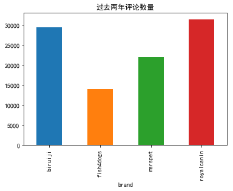


```python
df_raw_2[df_raw_2['Comment']!=''].groupby('brand').Comment.count().plot(kind='bar')
```


    <matplotlib.axes._subplots.AxesSubplot at 0x15247541630>


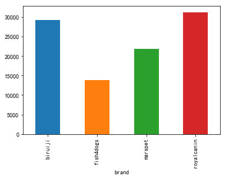


# 评论文本挖掘


```python
from wordcloud import WordCloud
```


```python
comm_hj = df_raw_2[df_raw_2['brand'] =='royalcanin']['Comment_cut']
len(comm_hj)
```


    31377


```python
type(comm_hj)
```


    pandas.core.series.Series


```python
comm_hj
```


    0        [第二次, 购买, ，, 可以, 说, 营养, 很好, 了, 。, 狗子, 长得, 不, 像...
    1                             [闻, 起来, 有种, 奶味, ～, 还, 不错, 。]
    2        [我们, 小, 红包, 很, 爱吃, ，, ?, 也, 很, 正常, 。, 第一天, 没有,...
    3        [差评, ！, 差评, ！, 差评, ！, 当时, 一次, 买, 了, 两袋, ，, 第一,...
    4                                    [靠, 谱,  , 打开, 很香, 不腥]
    5        [东西, 蛮, 不错, 的, ，, 希望, 能, 有用, ，, 我, 的, 德牧, 也, 很...
    6                              [很好, ，, 包装, 扎实, ，, 品牌, 信得过]
    7        [划算, ～, 多, 做, 活动, 呀, ～, 狗狗, 爱吃, …, 不过, 我们, 家, ...
    8                                                 [第二次, 买]
    9                      [宝贝, 买, 的, 很, 划算, ，, 其他, 就, 不评价, 了]
    10       [第二袋, 了, ，, 赶上, 双11, 买, 一袋, 备着, 先, ，, 包装, 完好, ...
    11                  [12, 公斤, 包装, 很好, ，, 还, 未, 吃, 追评, 吧, 。]
    12                     [双十一, 的, 价格, 很, 实惠, ，, 快递, 也, 给, 力]
    13                                              [多次, 买, 了]
    14                                                [傻狗, 喜欢]
    15       [我家, 德牧, 第一天, 很, 爱吃, ，, 可, 这, 几天, 不怎么, 爱吃, ，, ...
    16       [这是, 第二袋, 了, ，, 狗狗, 吃, 了, 毛色, 蛮好, 的, ，, 其他, 暂时...
    17       [一直, 买, ，, 挺, 好, 的, ，, 就是, 总, 断货, ，, 抢, 到, 一次,...
    18       [外面, 箱子, 写, 的, 是, 英短, 猫, 粮, 。, 。, 。, 吓死, ，, 以为...
    19       [正在, 吃, ，, 单独, 吃, 狗粮, 会, 拉稀, 而且, 很, 臭, ，, 可能, ...
    20                       [狗狗, 不, 喜欢, 吃, ！, ！, ！, 习惯好评, 而已]
    21                                        [还, 行, 。, 不错, 。]
    22       [和, 我, 平时, 买, 的, 我, 个人, 认为, 还是, 有点, 小区, 别的,  ,...
    23       [寄来, 的, 是, 成犬, 又, 要, 寄, 回去, 再换, …, 希望, 发货, 能, ...
    24                                 [跟, 平时, 买, 的, 好像, 不太一样]
    25       [好大, 一袋, 这样, 不好, 保存, 吧, ？, 而且, 也, 没有, 赠品, 待遇, ...
    26                                                    [回购]
    27                                                    [可以]
    28                                                    [可以]
    29                                                    [很好]
                                   ...                        
    31347    [第三次, 购买, 了, ，, 很, 满意, ！, 狗狗, 也好, 喜欢, 吃, ，, 是,...
    31348    [618, 囤货, ，, 狗子, 很能, 吃, ，, 应该, 能, 吃, 两个, 月, 吧,...
    31349                           [还, 没, 给, 宝贝, 们, 吃, ，, 期待]
    31350                            [年, 中大促, 买, 的, ，, 特别, 划算]
    31351    [一直, 购买, 的,  , 狗狗, 很, 喜欢, 吃,  , 很, 正宗,  , 发货, ...
    31352              [刚, 收到, ，, 还, 没, 开包, ，, 不, 知道, 是不是, 正品]
    31353                     [第二次, 买, 了, ，, 我家, 狗狗, 很, 喜欢, 吃]
    31354                      [一直, 吃, 的, 皇家, ，, 宝宝, 超, 喜欢, 吃]
    31355                                [狗狗, 正在, 吃, ，, 还, 可以]
    31356         [从, 浙江, 往, 济南, 发用, 了, 7, 天, ，, 圆通, 真是, 醉, 了]
    31357    [一直, 购买, 的,  , 老, 顾客, 了,  , 是, 正品,  , 真的, 很好, ...
    31358                                           [非常, 好, ！]
    31359                                 [姑娘, 把, 盆, 舔, 的, 锃亮]
    31360                                          [狗狗, 喜欢, 吃]
    31361           [一大, 箱子, ，, 棒棒, 哒, ，, 就是, 客服, 是不是, 缺心眼, 啊]
    31362                                                  [好]
    31363                                                   []
    31364                                                 [正品]
    31365                                    [一直, 买, ，, 不错, ～]
    31366                                            [挺, 好, 的]
    31367                                        [n, 次, 购买, 了]
    31368                            [一直, 吃, 这家, 的, ，, 值得, 信赖]
    31369    [东西, 有点, 偏贵, ，, 只要, 不是, 假货, 就行, 。, 客服, 上班时间, 太...
    31370                                            [发货, 速度慢]
    31371              [囤货, 的, ，, 够, 我们, 家狗, 吃, 很, 久, 了, …, …]
    31372    [还, 没, 拆, 给, 狗狗, 吃, 。, 不过, 一直, 在, 这家, 店买, 狗粮, ...
    31373                                                 [好像]
    31374    [跟, 我, 在, 实体店, 买, 的, 不太一样, ，, 但, 狗宝, 好, 是, 很, 爱吃]
    31375                                  [我家, 狗狗, 喜欢, 吃, 嘿嘿]
    31376         [确认, 晚, 了, ，, 狗粮, 很好, 狗狗, 爱吃, ，, 就是, 有点, 小贵]
    Name: Comment_cut, Length: 31377, dtype: object


```python
comm_hj_v2=[]
for i in range(len(comm_hj)):
    comm_hj_v2 =comm_hj_v2 +comm_hj[i]
```


    ---------------------------------------------------------------------------
    
    NameError                                 Traceback (most recent call last)
    
    <ipython-input-139-d6630a4db1b4> in <module>()
          1 comm_hj_v2=[]
    ----> 2 for i in range(len(comm_hj)):
          3     comm_hj_v2 =comm_hj_v2 +comm_hj[i]


    NameError: name 'comm_hj' is not defined


```python
len(comm_hj_v2)
```


    430045


```python
words_df = pd.DataFrame({'segment': comm_hj_v2})
```


```python
words_df.head(100)
```


<div>
<style scoped>
    .dataframe tbody tr th:only-of-type {
        vertical-align: middle;
    }

    .dataframe tbody tr th {
        vertical-align: top;
    }
    
    .dataframe thead th {
        text-align: right;
    }
</style>
<table border="1" class="dataframe">
  <thead>
    <tr style="text-align: right;">
      <th></th>
      <th>segment</th>
    </tr>
  </thead>
  <tbody>
    <tr>
      <th>0</th>
      <td>第二次</td>
    </tr>
    <tr>
      <th>1</th>
      <td>购买</td>
    </tr>
    <tr>
      <th>2</th>
      <td>，</td>
    </tr>
    <tr>
      <th>3</th>
      <td>可以</td>
    </tr>
    <tr>
      <th>4</th>
      <td>说</td>
    </tr>
    <tr>
      <th>5</th>
      <td>营养</td>
    </tr>
    <tr>
      <th>6</th>
      <td>很好</td>
    </tr>
    <tr>
      <th>7</th>
      <td>了</td>
    </tr>
    <tr>
      <th>8</th>
      <td>。</td>
    </tr>
    <tr>
      <th>9</th>
      <td>狗子</td>
    </tr>
    <tr>
      <th>10</th>
      <td>长得</td>
    </tr>
    <tr>
      <th>11</th>
      <td>不</td>
    </tr>
    <tr>
      <th>12</th>
      <td>像</td>
    </tr>
    <tr>
      <th>13</th>
      <td>两个</td>
    </tr>
    <tr>
      <th>14</th>
      <td>月</td>
    </tr>
    <tr>
      <th>15</th>
      <td>小狗狗</td>
    </tr>
    <tr>
      <th>16</th>
      <td>。</td>
    </tr>
    <tr>
      <th>17</th>
      <td>如果</td>
    </tr>
    <tr>
      <th>18</th>
      <td>不是</td>
    </tr>
    <tr>
      <th>19</th>
      <td>有个</td>
    </tr>
    <tr>
      <th>20</th>
      <td>慢食</td>
    </tr>
    <tr>
      <th>21</th>
      <td>盆</td>
    </tr>
    <tr>
      <th>22</th>
      <td>，</td>
    </tr>
    <tr>
      <th>23</th>
      <td>估计</td>
    </tr>
    <tr>
      <th>24</th>
      <td>30</td>
    </tr>
    <tr>
      <th>25</th>
      <td>秒</td>
    </tr>
    <tr>
      <th>26</th>
      <td>解决</td>
    </tr>
    <tr>
      <th>27</th>
      <td>战斗</td>
    </tr>
    <tr>
      <th>28</th>
      <td>闻</td>
    </tr>
    <tr>
      <th>29</th>
      <td>起来</td>
    </tr>
    <tr>
      <th>...</th>
      <td>...</td>
    </tr>
    <tr>
      <th>70</th>
      <td>不过</td>
    </tr>
    <tr>
      <th>71</th>
      <td>好像</td>
    </tr>
    <tr>
      <th>72</th>
      <td>没有</td>
    </tr>
    <tr>
      <th>73</th>
      <td>送</td>
    </tr>
    <tr>
      <th>74</th>
      <td>狗粮</td>
    </tr>
    <tr>
      <th>75</th>
      <td>产</td>
    </tr>
    <tr>
      <th>76</th>
      <td>，</td>
    </tr>
    <tr>
      <th>77</th>
      <td>不</td>
    </tr>
    <tr>
      <th>78</th>
      <td>开心</td>
    </tr>
    <tr>
      <th>79</th>
      <td>。</td>
    </tr>
    <tr>
      <th>80</th>
      <td>跟</td>
    </tr>
    <tr>
      <th>81</th>
      <td>店家</td>
    </tr>
    <tr>
      <th>82</th>
      <td>说</td>
    </tr>
    <tr>
      <th>83</th>
      <td>了</td>
    </tr>
    <tr>
      <th>84</th>
      <td>小狗</td>
    </tr>
    <tr>
      <th>85</th>
      <td>等</td>
    </tr>
    <tr>
      <th>86</th>
      <td>着</td>
    </tr>
    <tr>
      <th>87</th>
      <td>吃</td>
    </tr>
    <tr>
      <th>88</th>
      <td>，</td>
    </tr>
    <tr>
      <th>89</th>
      <td>当天</td>
    </tr>
    <tr>
      <th>90</th>
      <td>就</td>
    </tr>
    <tr>
      <th>91</th>
      <td>给</td>
    </tr>
    <tr>
      <th>92</th>
      <td>发货</td>
    </tr>
    <tr>
      <th>93</th>
      <td>了</td>
    </tr>
    <tr>
      <th>94</th>
      <td>，</td>
    </tr>
    <tr>
      <th>95</th>
      <td>大过年</td>
    </tr>
    <tr>
      <th>96</th>
      <td>的</td>
    </tr>
    <tr>
      <th>97</th>
      <td>谢谢</td>
    </tr>
    <tr>
      <th>98</th>
      <td>了</td>
    </tr>
    <tr>
      <th>99</th>
      <td>！</td>
    </tr>
  </tbody>
</table>
<p>100 rows × 1 columns</p>
</div>


```python
words_stat = words_df.groupby(by=['segment'])['segment'].agg({'counts':np.size})
words_stat = words_stat.reset_index().sort_values(by=['counts'], ascending=False)
```

    C:\ProgramData\Anaconda3\lib\site-packages\ipykernel_launcher.py:1: FutureWarning: using a dict on a Series for aggregation
    is deprecated and will be removed in a future version
      """Entry point for launching an IPython kernel.


```python
# 生成词云图，WordCloud默认不支持中文，需要自己下载好中文字库
wordcloud = WordCloud(font_path="simhei.ttf", background_color="white", max_font_size=80)
word_frequence = {x[0]: x[1] for x in words_stat.head(1000).values}
word_frequence_list=[]
for key in word_frequence:
    temp = (key, word_frequence[key])
    word_frequence_list.append(temp)


```


```python
print(word_frequence)
print(word_frequence_list)
```

    {'，': 37535, '的': 18997, '了': 15844, '吃': 13779, ' ': 10854, '。': 10428, '狗狗': 9300, '！': 7423, '买': 6767, '很': 6550, '好': 6443, '狗粮': 5060, '喜欢': 4740, '一直': 4665, '不错': 4115, '爱吃': 3987, '还': 3964, '是': 3723, '很好': 3383, '都': 3277, '也': 3168, '我家': 3093, '就': 3002, '不': 2852, '我': 2720, '这个': 2504, '在': 2307, '给': 2188, '皇家': 2149, '没': 2038, '挺': 1957, '好评': 1711, '没有': 1666, '非常': 1659, '送': 1595, '?': 1479, '…': 1453, '就是': 1381, '购买': 1357, '有': 1345, '双十一': 1306, '宝贝': 1276, '正品': 1232, '狗': 1163, '满意': 1154, '活动': 1131, '快': 1131, '物流': 1101, '可以': 1093, '再': 1093, '发货': 1090, '希望': 1070, '还是': 1060, '～': 1046, '到': 1017, '知道': 997, '收到': 967, '东西': 964, '一如既往': 945, '快递': 933, '大': 923, '很快': 917, '这次': 901, '啦': 890, '多': 875, '包装': 875, '说': 869, '来': 852, '吧': 834, '之前': 829, '会': 801, '换': 794, '好好': 792, '划算': 789, '狗子': 782, '这': 779, '以后': 777, '但是': 758, '有点': 755, '和': 741, '多次': 737, '它': 733, '第二次': 720, '价格': 712, '家里': 707, '现在': 704, '特别': 693, '客服': 686, '完': 681, '便': 673, '牌子': 669, '这家': 667, '感觉': 654, '比': 650, '啊': 647, '小': 647, '着': 639, '月': 632, '能': 629, '要': 622, '第一次': 621, '粮': 616, '奶糕': 600, '速度': 599, '不吃': 598, '便宜': 593, '优惠': 593, '？': 586, '已经': 586, '应该': 585, '又': 584, '比较': 578, '真的': 564, '什么': 555, '贵': 549, '宝宝': 546, '一样': 546, '太': 542, '个': 538, '老': 538, '以前': 532, '卖家': 531, '才': 531, '开始': 530, '一个': 522, '不过': 508, '味道': 507, '颗粒': 496, '赠品': 495, '谢谢': 495, '小狗': 493, '放心': 488, '问题': 471, '哦': 471, '质量': 465, '顾客': 460, '~': 458, '旗舰店': 453, '得': 451, '家': 450, '超级': 442, '用': 436, '不是': 435, '囤货': 427, '店家': 425, '呢': 418, '这款': 415, '时候': 413, '他': 412, '挑食': 409, '、': 406, '我们': 403, '等': 397, '评价': 388, '过': 388, '不爱吃': 383, '从': 377, '泪痕': 377, '但': 376, '下次': 369, '看': 368, '双11': 368, '回购': 361, '后': 357, '而且': 356, '一点': 349, '很多': 344, '跟': 344, '一次': 339, '臭': 336, '让': 335, '老客户': 332, '点': 329, '碗': 328, '服务': 326, '继续': 320, '这么': 317, '每次': 315, '喂': 312, '对': 309, '所以': 307, '品牌': 306, '香': 306, '只': 305, '一袋': 303, '这里': 301, '上': 301, '赞': 299, '刚': 291, '自己': 288, '还会': 282, '幼犬粮': 277, '囤': 276, '健康': 275, '因为': 275, '一包': 275, '其他': 273, '不会': 273, '.': 272, '礼物': 270, '一下': 269, ',': 264, '一': 263, '去': 255, '把': 252, '打开': 252, '日期': 251, '好多': 248, '还有': 247, '追评': 247, '他家': 245, '2': 243, '货': 238, '人': 238, '粑': 237, '实惠': 237, '你们': 234, '推荐': 234, '闻': 233, '两个': 233, '搞': 231, '哈哈哈': 229, '新鲜': 229, '相信': 229, '品质': 227, '你家': 226, '那么': 226, '想': 225, '信赖': 224, '别的': 220, '不好': 220, '做': 219, '值得': 219, '虽然': 219, '直接': 217, '成犬粮': 216, '结果': 215, '开心': 214, '你': 213, '先': 210, '评论': 210, '之后': 208, '这种': 208, '拉': 207, '今天': 207, '起来': 207, '最': 206, '为什么': 205, '啥': 203, '还好': 202, '哈哈': 202, '很大': 201, '几天': 200, '几次': 200, '4': 199, '幼犬': 198, '是不是': 198, '朋友': 198, '觉得': 197, '更': 193, '泰迪': 193, '可能': 192, '她': 190, '次': 190, '这样': 189, '行': 188, '哒': 186, '平时': 186, '好像': 186, '棒棒': 184, '618': 183, '圆通': 183, '5': 183, '买过': 180, '粮食': 179, '毛色': 178, '不能': 176, '中': 176, '好大': 175, '发现': 175, '很棒': 174, '怎么': 174, '差评': 174, '正常': 172, '年': 169, '力': 169, '如果': 168, '只是': 168, '淘气': 167, '态度': 166, '超': 166, '袋': 165, '不怎么': 164, '吗': 164, '产品': 163, '宠物店': 163, '拍': 163, '到货': 162, '购物': 162, '两袋': 162, '3': 161, '岁': 161, '店': 160, '款': 160, '商家': 158, '看看': 158, '后来': 157, '桶': 157, '那': 156, '大家': 156, '然后': 155, '服务态度': 154, '原来': 153, '爱': 151, '蛮': 149, '棒': 149, '看到': 148, '很香': 148, '适应': 146, '肉': 145, '不要': 145, '一段时间': 144, '需要': 144, '们': 143, '他们': 142, '值': 142, '下': 141, '一些': 140, '大包': 139, '!': 138, '方便': 138, '经常': 137, '袋子': 136, '好吃': 136, '猫': 135, '拉肚子': 135, '帮': 134, '追加': 133, '一起': 133, '支持': 133, '最近': 133, '毛': 132, '试试': 130, '为了': 130, '问': 130, '长期': 129, '两天': 128, '呀': 127, '拉稀': 127, '终于': 127, '不太': 127, '确实': 126, '新': 126, '看着': 125, '适合': 125, '第三次': 125, '本来': 124, '两包': 124, '没什么': 124, '抢': 124, '完全': 124, '第二天': 124, '及时': 123, '真': 123, '以为': 122, '吐': 122, '分': 122, '出来': 122, '只能': 120, '小贵': 120, '合适': 120, '光顾': 120, '反正': 119, '习惯': 119, '量杯': 118, '老板': 118, '小包装': 118, '淘宝': 118, '效果': 118, '网上': 117, '感谢': 117, '五星': 117, '拿': 117, '实体店': 117, '全': 117, '给力': 116, '上次': 116, '泡': 115, '箱子': 115, '送到': 115, '试用装': 115, '号': 114, '包': 114, '原因': 113, '真是': 113, '牵引绳': 112, '两只': 112, '少': 112, '口味': 112, '够': 112, '三个': 112, '12': 111, '越来越': 111, '双': 111, '验证': 111, '最后': 110, '差': 110, '公司': 110, '元': 109, '不用': 109, '蛮好': 109, '换粮': 109, '回来': 108, '居然': 108, '真心': 107, '香味': 107, '更好': 106, '过年': 106, '从小': 106, '成犬': 106, '大便': 106, '斤': 106, '情况': 105, '鸡': 105, '一般': 104, '里': 104, '建议': 103, '送货': 103, '狗宝': 103, '挺快': 103, '准备': 102, '可是': 102, '担心': 102, '油': 102, '长大': 102, '礼品': 101, '太贵': 101, '比熊': 101, '长': 101, '除了': 100, '炒': 100, '不少': 100, '小吃': 100, '的话': 100, '重': 99, '8': 99, '官网': 99, '买来': 98, '容易': 98, '一天': 98, '降价': 98, '天': 98, '还行': 97, '些': 97, '联系': 97, '断粮': 97, '长得': 97, '时': 97, '大袋': 97, '嘻嘻': 96, '力度': 96, '公斤': 96, '试吃': 96, '6': 95, '与': 95, '两': 95, '10': 94, '期待': 94, 'N': 94, '慢慢': 94, '营养': 94, '小袋': 94, '怎么样': 94, '没想到': 93, '超快': 93, '一只': 93, '高': 92, '慢': 92, '退': 91, '时间': 91, '眼屎': 91, '已': 90, '选择': 90, '怕': 89, '换成': 89, '饿': 89, '儿子': 89, '梳子': 88, '身体': 88, '颜色': 88, '实在': 88, '必须': 88, '里面': 88, '也好': 88, '卖': 87, '天猫': 87, '一个月': 87, '官方': 87, '肯定': 86, '估计': 86, '耐心': 86, '一年': 85, '差不多': 84, '别人': 84, '1': 84, '垃圾': 84, '晚': 83, '赠送': 83, '专用': 83, '量': 83, '毛孩子': 83, '胖': 82, '可惜': 82, '目前': 82, '保证': 82, '愿意': 82, '根本': 82, '两次': 81, '多少': 81, '严实': 81, '还要': 80, '马上': 80, '可': 79, '：': 79, '买回来': 79, ')': 79, '信任': 79, '金毛': 79, '小哥': 79, '20': 78, '电话': 78, '口粮': 78, '_': 78, '^': 78, '假货': 78, '像': 77, '(': 77, '被': 77, '假': 77, '肠胃': 77, '不到': 77, '哎': 77, '智能': 77, '久': 77, '比瑞吉': 77, '店铺': 77, '多月': 77, '失望': 76, '）': 75, '拆': 75, '明显': 75, '出': 75, '有些': 75, '小型犬': 75, '发': 74, '找': 74, '不了': 74, '店里': 74, '屯': 74, '犬': 74, '那个': 74, '描述': 74, '屎': 73, '这是': 73, '挑': 73, '贵宾': 73, '要是': 73, '味': 73, '昨天': 73, '小包': 72, '（': 72, '小家伙': 72, '只有': 72, '小狗狗': 71, '竟然': 71, '老年': 71, '仔细': 71, '涨价': 71, '第': 71, '十二': 71, '严重': 71, '钱': 70, '拉屎': 70, '太大': 70, '过来': 70, '今年': 70, '狗宝宝': 70, '字': 70, '倒': 69, '无': 69, '任何': 69, '封口': 69, '够吃': 68, '买家': 68, '几个': 68, '确认': 68, '下去': 68, '拆开': 68, '查': 68, '京东': 68, '奶': 68, '解决': 68, '算': 68, '刚刚': 67, '不知': 67, '为': 67, '前': 67, '...': 67, '简直': 66, '打电话': 66, '看起来': 66, '四袋': 66, '不行': 66, '最好': 66, '谁': 65, '地好': 65, '并': 65, '不良反应': 65, '后悔': 65, '绝对': 64, '好久': 64, '积分': 64, '一定': 64, '太慢': 64, '50': 63, '多多': 63, '每天': 63, '合算': 63, '实用': 63, '下单': 63, '办法': 63, '地址': 63, '雪纳瑞': 63, '老年犬': 63, '完好': 62, '养': 62, '五分': 62, '胃口': 62, '一箱': 62, '放': 62, '来说': 61, '破损': 61, '样子': 61, '半年': 61, '正好': 61, '掉': 60, '包裹': 60, '装': 60, '吃饭': 60, '一大': 60, '价': 60, '四个': 60, '嗯': 60, '法斗': 60, '别家': 60, '员': 60, '一颗': 59, '赶上': 59, '大包装': 59, '自动': 59, '优惠活动': 59, '硬': 59, '11': 58, '只要': 58, '收货': 58, '么': 58, '趁着': 57, '7': 57, '毕竟': 57, '打': 57, '加': 57, '趁': 57, '神速': 56, '一岁': 56, '零食': 56, '一股': 56, '不肯': 56, '写': 56, '挺不错': 56, '价钱': 56, '主子': 56, '成年': 55, '保质期': 55, '其实': 55, '消化': 55, '回家': 55, '还会来': 54, '再来': 54, '客户': 54, '呵呵': 54, '运费': 54, '带': 54, '走': 54, '牛': 53, '不敢': 53, '高大': 53, 'good': 53, '当': 53, '拌': 53, '惊喜': 53, '不想': 53, '有没有': 52, '运送': 52, '软': 52, '开封': 52, '出现': 52, '怀疑': 52, 'OK': 52, '打折': 52, '从来': 52, '下来': 52, '犬粮': 52, '那种': 52, '后面': 52, '一斤': 52, '再次': 52, '优惠券': 51, '包邮': 51, '哈哈哈哈': 51, '勺子': 51, '相当': 51, '完美': 51, '基本': 51, '去年': 51, '买好': 50, '晚上': 50, '试': 50, '连': 50, '放在': 50, '宠物医院': 49, '稍微': 49, '怎么办': 49, '丢': 49, '主要': 49, '嚼': 49, '闻着': 49, '不同': 49, '星期': 49, '专用粮': 49, '咬': 49, '处理': 49, '签收': 49, '貌似': 48, '哈': 48, '麻烦': 48, '负责': 48, '请': 48, '反应': 48, '超出': 48, '不好意思': 48, '超值': 48, '再也': 48, '依然': 48, 'n': 48, '表示': 47, '咯': 47, '介绍': 47, '观察': 47, '打算': 47, '告诉': 47, '毛发': 47, '期望值': 47, '退款': 46, '不然': 46, '正在': 46, '喂食': 46, '盆': 46, '屯粮': 46, '好不好': 46, '靠': 46, '宠物': 46, '满分': 46, '四包': 46, '性价比': 46, '适口': 46, '买错': 45, '每个': 45, '商品': 45, '一种': 45, '听说': 45, '关注': 45, '唯一': 45, '破': 45, '期间': 45, '该': 45, '完全一致': 45, '涨': 45, '上火': 45, '是否': 45, '一粒': 44, '暂时': 44, '汪': 44, '医生': 44, '就要': 44, '-': 44, '再说': 44, '没用': 44, '接受': 44, '看来': 44, '醉': 44, '回复': 44, '买点': 44, '贴心': 44, '块': 44, '扔': 44, '总之': 43, '谱': 43, '完整': 43, '太好了': 43, '祝': 43, '牛牛': 43, '密封': 43, '搬': 43, '尝': 43, '特': 43, '试试看': 43, '地': 43, '大小': 43, '不够': 43, '刚好': 43, '同事': 43, '果然': 43, '分量': 43, '拿到': 43, '死': 43, '早': 42, '认准': 42, '柴犬': 42, '价格比': 42, '生产日期': 42, '海洋之星': 42, '掌柜': 42, '其它': 42, '人家': 42, '拉布拉多': 42, '一周': 42, '水泡': 42, '小时候': 42, '*': 41, '刚买': 41, '箱': 41, '忠实': 41, '生意兴隆': 41, '毛病': 41, '星': 41, '注意': 41, '毛孩': 41, '盒子': 41, '9': 41, '改善': 41, '各种': 41, '中型犬': 40, '小宝贝': 40, '习惯好评': 40, '100': 40, '可爱': 40, '一点点': 40, '防伪': 40, '大颗粒': 40, '地方': 40, '开': 40, '迅速': 40, '保障': 40, '干净': 40, '叫': 39, '粮桶': 39, '早上': 39, '却': 39, '半': 39, '自从': 39, '气味': 39, '忘': 39, '总是': 39, '折扣': 39, '为啥': 39, '宝': 39, '促销': 39, '储粮': 39, '退货': 39, '一如': 38, '咸': 38, '唉': 38, '多点': 38, '说明': 38, '单': 38, '拉拉': 38, '干': 38, '..': 38, '一家': 38, '/': 38, '送个': 37, '特意': 37, '泪腺': 37, '顺丰': 37, '热情': 37, '系统': 37, '三天': 37, '俩': 37, '“': 37, '博美': 37, '”': 37, '但愿': 37, 'ok': 37, '重新': 37, '6.18': 37, '几年': 37, '赶紧': 37, '铲': 37, '半个': 37, '月份': 37, '第一': 37, '果断': 37, '吉娃娃': 37, '喝水': 37, '突然': 37, '正': 36, '换换': 36, '全部': 36, '或者': 36, '外面': 36, '吃光': 36, '花': 36, '生病': 36, '喜不喜欢': 36, '年货': 36, '送来': 36, '孩子': 36, '辛苦': 36, '另外': 36, '想象': 36, '尿': 35, '换个': 35, '瘦': 35, '一口': 35, '嘛': 35, '图': 35, '影响': 35, '爱不爱': 35, '怎么回事': 35, '刚换': 35, '16': 35, '还来': 35, '绝育': 35, '决定': 35, '坚持': 35, '医院': 35, '大狗': 35, '选': 34, '真假': 34, '它们': 34, '漂亮': 34, '店买': 34, '沟通': 34, '亮': 34, '提前': 34, '长胖': 34, '试用': 34, '当时': 34, '专门': 34, '抱': 34, '改': 34, '通知': 34, '两年': 34, '不管': 34, '品种': 34, '图片': 34, '寄': 34, '使用': 34, '专业': 34, '一共': 33, '天然粮': 33, '挑嘴': 33, '同样': 33, '点赞': 33, '几袋': 33, '柯基': 33, '意思': 33, '以上': 33, '哟': 33, '小区': 33, '成型': 33, '太小': 33, '考虑': 33, '掺': 32, '送点': 32, '挺大': 32, '无数次': 32, '30': 32, '差点': 32, '不太好': 32, '有人': 32, '不如': 32, '回头客': 32, '对于': 32, '非常感谢': 32, '体重': 32, '显示': 32, '没送': 32, '很赞': 32, '只好': 32}
    [('，', 37535), ('的', 18997), ('了', 15844), ('吃', 13779), (' ', 10854), ('。', 10428), ('狗狗', 9300), ('！', 7423), ('买', 6767), ('很', 6550), ('好', 6443), ('狗粮', 5060), ('喜欢', 4740), ('一直', 4665), ('不错', 4115), ('爱吃', 3987), ('还', 3964), ('是', 3723), ('很好', 3383), ('都', 3277), ('也', 3168), ('我家', 3093), ('就', 3002), ('不', 2852), ('我', 2720), ('这个', 2504), ('在', 2307), ('给', 2188), ('皇家', 2149), ('没', 2038), ('挺', 1957), ('好评', 1711), ('没有', 1666), ('非常', 1659), ('送', 1595), ('?', 1479), ('…', 1453), ('就是', 1381), ('购买', 1357), ('有', 1345), ('双十一', 1306), ('宝贝', 1276), ('正品', 1232), ('狗', 1163), ('满意', 1154), ('活动', 1131), ('快', 1131), ('物流', 1101), ('可以', 1093), ('再', 1093), ('发货', 1090), ('希望', 1070), ('还是', 1060), ('～', 1046), ('到', 1017), ('知道', 997), ('收到', 967), ('东西', 964), ('一如既往', 945), ('快递', 933), ('大', 923), ('很快', 917), ('这次', 901), ('啦', 890), ('多', 875), ('包装', 875), ('说', 869), ('来', 852), ('吧', 834), ('之前', 829), ('会', 801), ('换', 794), ('好好', 792), ('划算', 789), ('狗子', 782), ('这', 779), ('以后', 777), ('但是', 758), ('有点', 755), ('和', 741), ('多次', 737), ('它', 733), ('第二次', 720), ('价格', 712), ('家里', 707), ('现在', 704), ('特别', 693), ('客服', 686), ('完', 681), ('便', 673), ('牌子', 669), ('这家', 667), ('感觉', 654), ('比', 650), ('啊', 647), ('小', 647), ('着', 639), ('月', 632), ('能', 629), ('要', 622), ('第一次', 621), ('粮', 616), ('奶糕', 600), ('速度', 599), ('不吃', 598), ('便宜', 593), ('优惠', 593), ('？', 586), ('已经', 586), ('应该', 585), ('又', 584), ('比较', 578), ('真的', 564), ('什么', 555), ('贵', 549), ('宝宝', 546), ('一样', 546), ('太', 542), ('个', 538), ('老', 538), ('以前', 532), ('卖家', 531), ('才', 531), ('开始', 530), ('一个', 522), ('不过', 508), ('味道', 507), ('颗粒', 496), ('赠品', 495), ('谢谢', 495), ('小狗', 493), ('放心', 488), ('问题', 471), ('哦', 471), ('质量', 465), ('顾客', 460), ('~', 458), ('旗舰店', 453), ('得', 451), ('家', 450), ('超级', 442), ('用', 436), ('不是', 435), ('囤货', 427), ('店家', 425), ('呢', 418), ('这款', 415), ('时候', 413), ('他', 412), ('挑食', 409), ('、', 406), ('我们', 403), ('等', 397), ('评价', 388), ('过', 388), ('不爱吃', 383), ('从', 377), ('泪痕', 377), ('但', 376), ('下次', 369), ('看', 368), ('双11', 368), ('回购', 361), ('后', 357), ('而且', 356), ('一点', 349), ('很多', 344), ('跟', 344), ('一次', 339), ('臭', 336), ('让', 335), ('老客户', 332), ('点', 329), ('碗', 328), ('服务', 326), ('继续', 320), ('这么', 317), ('每次', 315), ('喂', 312), ('对', 309), ('所以', 307), ('品牌', 306), ('香', 306), ('只', 305), ('一袋', 303), ('这里', 301), ('上', 301), ('赞', 299), ('刚', 291), ('自己', 288), ('还会', 282), ('幼犬粮', 277), ('囤', 276), ('健康', 275), ('因为', 275), ('一包', 275), ('其他', 273), ('不会', 273), ('.', 272), ('礼物', 270), ('一下', 269), (',', 264), ('一', 263), ('去', 255), ('把', 252), ('打开', 252), ('日期', 251), ('好多', 248), ('还有', 247), ('追评', 247), ('他家', 245), ('2', 243), ('货', 238), ('人', 238), ('粑', 237), ('实惠', 237), ('你们', 234), ('推荐', 234), ('闻', 233), ('两个', 233), ('搞', 231), ('哈哈哈', 229), ('新鲜', 229), ('相信', 229), ('品质', 227), ('你家', 226), ('那么', 226), ('想', 225), ('信赖', 224), ('别的', 220), ('不好', 220), ('做', 219), ('值得', 219), ('虽然', 219), ('直接', 217), ('成犬粮', 216), ('结果', 215), ('开心', 214), ('你', 213), ('先', 210), ('评论', 210), ('之后', 208), ('这种', 208), ('拉', 207), ('今天', 207), ('起来', 207), ('最', 206), ('为什么', 205), ('啥', 203), ('还好', 202), ('哈哈', 202), ('很大', 201), ('几天', 200), ('几次', 200), ('4', 199), ('幼犬', 198), ('是不是', 198), ('朋友', 198), ('觉得', 197), ('更', 193), ('泰迪', 193), ('可能', 192), ('她', 190), ('次', 190), ('这样', 189), ('行', 188), ('哒', 186), ('平时', 186), ('好像', 186), ('棒棒', 184), ('618', 183), ('圆通', 183), ('5', 183), ('买过', 180), ('粮食', 179), ('毛色', 178), ('不能', 176), ('中', 176), ('好大', 175), ('发现', 175), ('很棒', 174), ('怎么', 174), ('差评', 174), ('正常', 172), ('年', 169), ('力', 169), ('如果', 168), ('只是', 168), ('淘气', 167), ('态度', 166), ('超', 166), ('袋', 165), ('不怎么', 164), ('吗', 164), ('产品', 163), ('宠物店', 163), ('拍', 163), ('到货', 162), ('购物', 162), ('两袋', 162), ('3', 161), ('岁', 161), ('店', 160), ('款', 160), ('商家', 158), ('看看', 158), ('后来', 157), ('桶', 157), ('那', 156), ('大家', 156), ('然后', 155), ('服务态度', 154), ('原来', 153), ('爱', 151), ('蛮', 149), ('棒', 149), ('看到', 148), ('很香', 148), ('适应', 146), ('肉', 145), ('不要', 145), ('一段时间', 144), ('需要', 144), ('们', 143), ('他们', 142), ('值', 142), ('下', 141), ('一些', 140), ('大包', 139), ('!', 138), ('方便', 138), ('经常', 137), ('袋子', 136), ('好吃', 136), ('猫', 135), ('拉肚子', 135), ('帮', 134), ('追加', 133), ('一起', 133), ('支持', 133), ('最近', 133), ('毛', 132), ('试试', 130), ('为了', 130), ('问', 130), ('长期', 129), ('两天', 128), ('呀', 127), ('拉稀', 127), ('终于', 127), ('不太', 127), ('确实', 126), ('新', 126), ('看着', 125), ('适合', 125), ('第三次', 125), ('本来', 124), ('两包', 124), ('没什么', 124), ('抢', 124), ('完全', 124), ('第二天', 124), ('及时', 123), ('真', 123), ('以为', 122), ('吐', 122), ('分', 122), ('出来', 122), ('只能', 120), ('小贵', 120), ('合适', 120), ('光顾', 120), ('反正', 119), ('习惯', 119), ('量杯', 118), ('老板', 118), ('小包装', 118), ('淘宝', 118), ('效果', 118), ('网上', 117), ('感谢', 117), ('五星', 117), ('拿', 117), ('实体店', 117), ('全', 117), ('给力', 116), ('上次', 116), ('泡', 115), ('箱子', 115), ('送到', 115), ('试用装', 115), ('号', 114), ('包', 114), ('原因', 113), ('真是', 113), ('牵引绳', 112), ('两只', 112), ('少', 112), ('口味', 112), ('够', 112), ('三个', 112), ('12', 111), ('越来越', 111), ('双', 111), ('验证', 111), ('最后', 110), ('差', 110), ('公司', 110), ('元', 109), ('不用', 109), ('蛮好', 109), ('换粮', 109), ('回来', 108), ('居然', 108), ('真心', 107), ('香味', 107), ('更好', 106), ('过年', 106), ('从小', 106), ('成犬', 106), ('大便', 106), ('斤', 106), ('情况', 105), ('鸡', 105), ('一般', 104), ('里', 104), ('建议', 103), ('送货', 103), ('狗宝', 103), ('挺快', 103), ('准备', 102), ('可是', 102), ('担心', 102), ('油', 102), ('长大', 102), ('礼品', 101), ('太贵', 101), ('比熊', 101), ('长', 101), ('除了', 100), ('炒', 100), ('不少', 100), ('小吃', 100), ('的话', 100), ('重', 99), ('8', 99), ('官网', 99), ('买来', 98), ('容易', 98), ('一天', 98), ('降价', 98), ('天', 98), ('还行', 97), ('些', 97), ('联系', 97), ('断粮', 97), ('长得', 97), ('时', 97), ('大袋', 97), ('嘻嘻', 96), ('力度', 96), ('公斤', 96), ('试吃', 96), ('6', 95), ('与', 95), ('两', 95), ('10', 94), ('期待', 94), ('N', 94), ('慢慢', 94), ('营养', 94), ('小袋', 94), ('怎么样', 94), ('没想到', 93), ('超快', 93), ('一只', 93), ('高', 92), ('慢', 92), ('退', 91), ('时间', 91), ('眼屎', 91), ('已', 90), ('选择', 90), ('怕', 89), ('换成', 89), ('饿', 89), ('儿子', 89), ('梳子', 88), ('身体', 88), ('颜色', 88), ('实在', 88), ('必须', 88), ('里面', 88), ('也好', 88), ('卖', 87), ('天猫', 87), ('一个月', 87), ('官方', 87), ('肯定', 86), ('估计', 86), ('耐心', 86), ('一年', 85), ('差不多', 84), ('别人', 84), ('1', 84), ('垃圾', 84), ('晚', 83), ('赠送', 83), ('专用', 83), ('量', 83), ('毛孩子', 83), ('胖', 82), ('可惜', 82), ('目前', 82), ('保证', 82), ('愿意', 82), ('根本', 82), ('两次', 81), ('多少', 81), ('严实', 81), ('还要', 80), ('马上', 80), ('可', 79), ('：', 79), ('买回来', 79), (')', 79), ('信任', 79), ('金毛', 79), ('小哥', 79), ('20', 78), ('电话', 78), ('口粮', 78), ('_', 78), ('^', 78), ('假货', 78), ('像', 77), ('(', 77), ('被', 77), ('假', 77), ('肠胃', 77), ('不到', 77), ('哎', 77), ('智能', 77), ('久', 77), ('比瑞吉', 77), ('店铺', 77), ('多月', 77), ('失望', 76), ('）', 75), ('拆', 75), ('明显', 75), ('出', 75), ('有些', 75), ('小型犬', 75), ('发', 74), ('找', 74), ('不了', 74), ('店里', 74), ('屯', 74), ('犬', 74), ('那个', 74), ('描述', 74), ('屎', 73), ('这是', 73), ('挑', 73), ('贵宾', 73), ('要是', 73), ('味', 73), ('昨天', 73), ('小包', 72), ('（', 72), ('小家伙', 72), ('只有', 72), ('小狗狗', 71), ('竟然', 71), ('老年', 71), ('仔细', 71), ('涨价', 71), ('第', 71), ('十二', 71), ('严重', 71), ('钱', 70), ('拉屎', 70), ('太大', 70), ('过来', 70), ('今年', 70), ('狗宝宝', 70), ('字', 70), ('倒', 69), ('无', 69), ('任何', 69), ('封口', 69), ('够吃', 68), ('买家', 68), ('几个', 68), ('确认', 68), ('下去', 68), ('拆开', 68), ('查', 68), ('京东', 68), ('奶', 68), ('解决', 68), ('算', 68), ('刚刚', 67), ('不知', 67), ('为', 67), ('前', 67), ('...', 67), ('简直', 66), ('打电话', 66), ('看起来', 66), ('四袋', 66), ('不行', 66), ('最好', 66), ('谁', 65), ('地好', 65), ('并', 65), ('不良反应', 65), ('后悔', 65), ('绝对', 64), ('好久', 64), ('积分', 64), ('一定', 64), ('太慢', 64), ('50', 63), ('多多', 63), ('每天', 63), ('合算', 63), ('实用', 63), ('下单', 63), ('办法', 63), ('地址', 63), ('雪纳瑞', 63), ('老年犬', 63), ('完好', 62), ('养', 62), ('五分', 62), ('胃口', 62), ('一箱', 62), ('放', 62), ('来说', 61), ('破损', 61), ('样子', 61), ('半年', 61), ('正好', 61), ('掉', 60), ('包裹', 60), ('装', 60), ('吃饭', 60), ('一大', 60), ('价', 60), ('四个', 60), ('嗯', 60), ('法斗', 60), ('别家', 60), ('员', 60), ('一颗', 59), ('赶上', 59), ('大包装', 59), ('自动', 59), ('优惠活动', 59), ('硬', 59), ('11', 58), ('只要', 58), ('收货', 58), ('么', 58), ('趁着', 57), ('7', 57), ('毕竟', 57), ('打', 57), ('加', 57), ('趁', 57), ('神速', 56), ('一岁', 56), ('零食', 56), ('一股', 56), ('不肯', 56), ('写', 56), ('挺不错', 56), ('价钱', 56), ('主子', 56), ('成年', 55), ('保质期', 55), ('其实', 55), ('消化', 55), ('回家', 55), ('还会来', 54), ('再来', 54), ('客户', 54), ('呵呵', 54), ('运费', 54), ('带', 54), ('走', 54), ('牛', 53), ('不敢', 53), ('高大', 53), ('good', 53), ('当', 53), ('拌', 53), ('惊喜', 53), ('不想', 53), ('有没有', 52), ('运送', 52), ('软', 52), ('开封', 52), ('出现', 52), ('怀疑', 52), ('OK', 52), ('打折', 52), ('从来', 52), ('下来', 52), ('犬粮', 52), ('那种', 52), ('后面', 52), ('一斤', 52), ('再次', 52), ('优惠券', 51), ('包邮', 51), ('哈哈哈哈', 51), ('勺子', 51), ('相当', 51), ('完美', 51), ('基本', 51), ('去年', 51), ('买好', 50), ('晚上', 50), ('试', 50), ('连', 50), ('放在', 50), ('宠物医院', 49), ('稍微', 49), ('怎么办', 49), ('丢', 49), ('主要', 49), ('嚼', 49), ('闻着', 49), ('不同', 49), ('星期', 49), ('专用粮', 49), ('咬', 49), ('处理', 49), ('签收', 49), ('貌似', 48), ('哈', 48), ('麻烦', 48), ('负责', 48), ('请', 48), ('反应', 48), ('超出', 48), ('不好意思', 48), ('超值', 48), ('再也', 48), ('依然', 48), ('n', 48), ('表示', 47), ('咯', 47), ('介绍', 47), ('观察', 47), ('打算', 47), ('告诉', 47), ('毛发', 47), ('期望值', 47), ('退款', 46), ('不然', 46), ('正在', 46), ('喂食', 46), ('盆', 46), ('屯粮', 46), ('好不好', 46), ('靠', 46), ('宠物', 46), ('满分', 46), ('四包', 46), ('性价比', 46), ('适口', 46), ('买错', 45), ('每个', 45), ('商品', 45), ('一种', 45), ('听说', 45), ('关注', 45), ('唯一', 45), ('破', 45), ('期间', 45), ('该', 45), ('完全一致', 45), ('涨', 45), ('上火', 45), ('是否', 45), ('一粒', 44), ('暂时', 44), ('汪', 44), ('医生', 44), ('就要', 44), ('-', 44), ('再说', 44), ('没用', 44), ('接受', 44), ('看来', 44), ('醉', 44), ('回复', 44), ('买点', 44), ('贴心', 44), ('块', 44), ('扔', 44), ('总之', 43), ('谱', 43), ('完整', 43), ('太好了', 43), ('祝', 43), ('牛牛', 43), ('密封', 43), ('搬', 43), ('尝', 43), ('特', 43), ('试试看', 43), ('地', 43), ('大小', 43), ('不够', 43), ('刚好', 43), ('同事', 43), ('果然', 43), ('分量', 43), ('拿到', 43), ('死', 43), ('早', 42), ('认准', 42), ('柴犬', 42), ('价格比', 42), ('生产日期', 42), ('海洋之星', 42), ('掌柜', 42), ('其它', 42), ('人家', 42), ('拉布拉多', 42), ('一周', 42), ('水泡', 42), ('小时候', 42), ('*', 41), ('刚买', 41), ('箱', 41), ('忠实', 41), ('生意兴隆', 41), ('毛病', 41), ('星', 41), ('注意', 41), ('毛孩', 41), ('盒子', 41), ('9', 41), ('改善', 41), ('各种', 41), ('中型犬', 40), ('小宝贝', 40), ('习惯好评', 40), ('100', 40), ('可爱', 40), ('一点点', 40), ('防伪', 40), ('大颗粒', 40), ('地方', 40), ('开', 40), ('迅速', 40), ('保障', 40), ('干净', 40), ('叫', 39), ('粮桶', 39), ('早上', 39), ('却', 39), ('半', 39), ('自从', 39), ('气味', 39), ('忘', 39), ('总是', 39), ('折扣', 39), ('为啥', 39), ('宝', 39), ('促销', 39), ('储粮', 39), ('退货', 39), ('一如', 38), ('咸', 38), ('唉', 38), ('多点', 38), ('说明', 38), ('单', 38), ('拉拉', 38), ('干', 38), ('..', 38), ('一家', 38), ('/', 38), ('送个', 37), ('特意', 37), ('泪腺', 37), ('顺丰', 37), ('热情', 37), ('系统', 37), ('三天', 37), ('俩', 37), ('“', 37), ('博美', 37), ('”', 37), ('但愿', 37), ('ok', 37), ('重新', 37), ('6.18', 37), ('几年', 37), ('赶紧', 37), ('铲', 37), ('半个', 37), ('月份', 37), ('第一', 37), ('果断', 37), ('吉娃娃', 37), ('喝水', 37), ('突然', 37), ('正', 36), ('换换', 36), ('全部', 36), ('或者', 36), ('外面', 36), ('吃光', 36), ('花', 36), ('生病', 36), ('喜不喜欢', 36), ('年货', 36), ('送来', 36), ('孩子', 36), ('辛苦', 36), ('另外', 36), ('想象', 36), ('尿', 35), ('换个', 35), ('瘦', 35), ('一口', 35), ('嘛', 35), ('图', 35), ('影响', 35), ('爱不爱', 35), ('怎么回事', 35), ('刚换', 35), ('16', 35), ('还来', 35), ('绝育', 35), ('决定', 35), ('坚持', 35), ('医院', 35), ('大狗', 35), ('选', 34), ('真假', 34), ('它们', 34), ('漂亮', 34), ('店买', 34), ('沟通', 34), ('亮', 34), ('提前', 34), ('长胖', 34), ('试用', 34), ('当时', 34), ('专门', 34), ('抱', 34), ('改', 34), ('通知', 34), ('两年', 34), ('不管', 34), ('品种', 34), ('图片', 34), ('寄', 34), ('使用', 34), ('专业', 34), ('一共', 33), ('天然粮', 33), ('挑嘴', 33), ('同样', 33), ('点赞', 33), ('几袋', 33), ('柯基', 33), ('意思', 33), ('以上', 33), ('哟', 33), ('小区', 33), ('成型', 33), ('太小', 33), ('考虑', 33), ('掺', 32), ('送点', 32), ('挺大', 32), ('无数次', 32), ('30', 32), ('差点', 32), ('不太好', 32), ('有人', 32), ('不如', 32), ('回头客', 32), ('对于', 32), ('非常感谢', 32), ('体重', 32), ('显示', 32), ('没送', 32), ('很赞', 32), ('只好', 32)]


```python
# 显示图片
plt.rcParams['figure.figsize'] = (12.0,6.0)
wordcloud = wordcloud.fit_words(dict(word_frequence_list))
plt.imshow(wordcloud)   # 以图片形式显示词云
plt.axis('off')     # 关闭图像坐标系
plt.show()
# plt.savefig('plot123_1.png', dpi=1200)
```


```python
# from IPython.core.pylabtools import figsize
# figsize(12.5, 4)
# plt.rcParams['figure.dpi'] = 100 #分辨率
# plt.rcParams['savefig.dpi'] = 100 #图片像素
```

*  很多干扰词存在，且词频很高
*  图片像素不够清晰

###### 引入停用词


```python
stopwords = pd.read_csv('stopwords.txt', index_col=False, quoting=3, sep='\t', names=['stopword'],
                        encoding='utf-8')  # quoting=3全不引用

```


```python
type(stopwords)
```


    pandas.core.frame.DataFrame


```python
stopwords.head()
```


<div>
<style scoped>
    .dataframe tbody tr th:only-of-type {
        vertical-align: middle;
    }

    .dataframe tbody tr th {
        vertical-align: top;
    }
    
    .dataframe thead th {
        text-align: right;
    }
</style>
<table border="1" class="dataframe">
  <thead>
    <tr style="text-align: right;">
      <th></th>
      <th>stopword</th>
    </tr>
  </thead>
  <tbody>
    <tr>
      <th>0</th>
      <td>!</td>
    </tr>
    <tr>
      <th>1</th>
      <td>"</td>
    </tr>
    <tr>
      <th>2</th>
      <td>#</td>
    </tr>
    <tr>
      <th>3</th>
      <td>$</td>
    </tr>
    <tr>
      <th>4</th>
      <td>%</td>
    </tr>
  </tbody>
</table>
</div>


```python
stopwords_list = stopwords.values
```


```python
type(stopwords_list)
```


    numpy.ndarray


```python
stopwords_list[0:5]
```


    array([['!'],
           ['"'],
           ['#'],
           ['$'],
           ['%']], dtype=object)


```python
# 定义另一个变换list形式的函数
def list2_list(list_list, list):
    for item in list_list:
        list_item = item[0]
        list.append(list_item)
    return list
```


```python
stopwords_list = list2_list(stopwords_list, [])
```


```python
stopwords_list[0:5]
```


    ['!', '"', '#', '$', '%']


```python
words_df = words_df[~words_df.segment.isin(stopwords.stopword)]
len(words_df)
```


    206442


```python
len(comm_hj_v2)
```


    430045


```python
words_stat = words_df.groupby(by=['segment'])['segment'].agg({'counts':np.size})
words_stat = words_stat.reset_index().sort_values(by=['counts'], ascending=False)
# 生成词云图，
wordcloud = WordCloud(font_path="simhei.ttf", background_color="white", max_font_size=80)
word_frequence = {x[0]: x[1] for x in words_stat.head(1000).values}
word_frequence_list=[]
for key in word_frequence:
    temp = (key, word_frequence[key])
    word_frequence_list.append(temp)

# 显示图片
wordcloud = wordcloud.fit_words(dict(word_frequence_list))
plt.imshow(wordcloud)   # 以图片形式显示词云
plt.axis('off')     # 关闭图像坐标系
plt.show()
```

    C:\ProgramData\Anaconda3\lib\site-packages\ipykernel_launcher.py:1: FutureWarning: using a dict on a Series for aggregation
    is deprecated and will be removed in a future version
      """Entry point for launching an IPython kernel.


```python
# 自定义显示词云图形状
from wordcloud import WordCloud,ImageColorGenerator
matplotlib.rcParams['figure.figsize'] = (8.0, 10.0)
# from scipy.misc import imread
# bimg=imread('image/dog_1.jpg')
# `imread` is deprecated in SciPy 1.0.0, and will be removed in 1.2.0.
import imageio
bimg = imageio.imread('image/dog_1.jpg')

words_stat = words_df.groupby(by=['segment'])['segment'].agg({'counts':np.size})
words_stat = words_stat.reset_index().sort_values(by=['counts'], ascending=False)

wordcloud=WordCloud(background_color="white",mask=bimg,max_font_size=80,font_path='data/simhei.ttf',)
word_frequence = {x[0]:x[1] for x in words_stat.head(300).values}
wordcloud=wordcloud.fit_words(word_frequence)
bimgColors=ImageColorGenerator(bimg)
plt.axis("off")
plt.imshow(wordcloud.recolor(color_func=bimgColors))
plt.savefig('plot_hj.png')
```

    C:\ProgramData\Anaconda3\lib\site-packages\ipykernel_launcher.py:10: FutureWarning: using a dict on a Series for aggregation
    is deprecated and will be removed in a future version
      # Remove the CWD from sys.path while we load stuff.


```python
* 情感分析
textblog https://blog.csdn.net/u013378306/article/details/55510156
```


```python
import snownlp
from snownlp import SnowNLP
```


```python
df_raw_2['Comment'][4]
```


    '靠谱 打开很香不腥'


```python
df_raw_2['Comment'][3]
```


    '差评！差评！差评！当时一次买了两袋，第一袋子吃了20天之后狗狗开始拉肚子，于是给狗狗换馒头和鸡肉吃了4天，狗狗不拉稀了，我以为是第一袋开了太长时间于是就把第一袋剩余的狗粮扔了，打开了第二袋，第二代吃了两天之后狗狗又开始拉稀，我觉得应该是狗粮有问题，请大家慎重购买。'


```python
ss = s= SnowNLP(df_raw_2['Comment'][3])
ss.sentiments
```


    2.000177801164682e-12


```python
senti_hj = DataFrame(df_raw_2[df_raw_2['brand'] == 'royalcanin']['Comment'])
senti_ms = DataFrame(df_raw_2[df_raw_2['brand'] == 'marspet']['Comment'])
senti_brj = DataFrame(df_raw_2[df_raw_2['brand'] == 'biruiji']['Comment'])
senti_hyzx = DataFrame(df_raw_2[df_raw_2['brand'] == 'fish4dogs']['Comment'])
```


```python
def senti_core (brand_comm):
    score=[]
    for i in brand_comm.Comment:
        if str(i) != '':
            s=SnowNLP(str(i))
            score.append(s.sentiments)
        else:
            score.append('') 
    brand_comm ['Score'] = score
    return brand_comm
```


```python
senti_hj_score = senti_core(senti_hj)
senti_ms_score = senti_core(senti_ms)
senti_brj_score = senti_core(senti_brj)
senti_hyzx_score = senti_core(senti_hyzx)
```


```python
senti_ms_score
```


<div>
<style scoped>
    .dataframe tbody tr th:only-of-type {
        vertical-align: middle;
    }

    .dataframe tbody tr th {
        vertical-align: top;
    }
    
    .dataframe thead th {
        text-align: right;
    }
</style>
<table border="1" class="dataframe">
  <thead>
    <tr style="text-align: right;">
      <th></th>
      <th>Comment</th>
      <th>Score</th>
    </tr>
  </thead>
  <tbody>
    <tr>
      <th>31377</th>
      <td>很好，狗狗很爱吃</td>
      <td>0.961498</td>
    </tr>
    <tr>
      <th>31378</th>
      <td>双11的又吃完了，又来买买买啦哈哈哈哈哈哈</td>
      <td>0.969864</td>
    </tr>
    <tr>
      <th>31379</th>
      <td>应该还不错</td>
      <td>0.883015</td>
    </tr>
    <tr>
      <th>31380</th>
      <td>发货快！8岁的狗狗一直在吃</td>
      <td>0.528303</td>
    </tr>
    <tr>
      <th>31381</th>
      <td>帮朋友买的，评价这事我就给忘了。一直都在这家买。 很好</td>
      <td>0.66663</td>
    </tr>
    <tr>
      <th>31382</th>
      <td>今天收到狗粮了，开始还担心狗不吃狗粮，因为一直都是吃鸭肝拌饭，尝试着放了几颗没想到居然吃了，...</td>
      <td>0.00162892</td>
    </tr>
    <tr>
      <th>31383</th>
      <td>算上邮费比实体店要贵。 但是因为实体店买不到这个品种</td>
      <td>0.0455389</td>
    </tr>
    <tr>
      <th>31384</th>
      <td>到货很快，虽然狗狗不吃，但是到货很快</td>
      <td>0.928277</td>
    </tr>
    <tr>
      <th>31385</th>
      <td>跟超市差不多</td>
      <td>0.71439</td>
    </tr>
    <tr>
      <th>31386</th>
      <td>卖家发货速度非常快，棒棒哒</td>
      <td>0.82654</td>
    </tr>
    <tr>
      <th>31387</th>
      <td>东西到的很快，第一次买，希望我家狗狗喜欢吃。</td>
      <td>0.966634</td>
    </tr>
    <tr>
      <th>31388</th>
      <td>巨拒绝吃狗粮的宝宝居然吃了！！！感动哭！</td>
      <td>0.0910519</td>
    </tr>
    <tr>
      <th>31389</th>
      <td>hahaha, 挺好的</td>
      <td>0.812978</td>
    </tr>
    <tr>
      <th>31390</th>
      <td>这份单包的是11.9号拍的，家里狗粮正好吃完撑不到双十一…结果双十一拍的二十袋都到了…这个单...</td>
      <td>0.3831</td>
    </tr>
    <tr>
      <th>31391</th>
      <td>看着不错，还没吃，等吃后再评价。</td>
      <td>0.639897</td>
    </tr>
    <tr>
      <th>31392</th>
      <td>除了发货有点慢，别的没毛病</td>
      <td>0.265983</td>
    </tr>
    <tr>
      <th>31393</th>
      <td>东西还行，就是客服态度一般</td>
      <td>0.122054</td>
    </tr>
    <tr>
      <th>31394</th>
      <td>家里狗狗九岁了，宠物医生说应该买大龄犬粮吃，就换了大龄犬的！因为掉了几颗牙，每次给他泡着吃！...</td>
      <td>0.509594</td>
    </tr>
    <tr>
      <th>31395</th>
      <td>已经不是第一次买了，不过这次感觉很不好，东西没问题，快递很不好，以前都是送到家，这次家中有人...</td>
      <td>0.0154016</td>
    </tr>
    <tr>
      <th>31396</th>
      <td>终于收到我需要的宝贝了，东西很好，价美物廉，谢谢掌柜的！说实在，这是我淘宝购物来让我最满意的...</td>
      <td>0.999968</td>
    </tr>
    <tr>
      <th>31397</th>
      <td>很好很好</td>
      <td>0.918396</td>
    </tr>
    <tr>
      <th>31398</th>
      <td>很好很好</td>
      <td>0.918396</td>
    </tr>
    <tr>
      <th>31399</th>
      <td>回购的 狗狗应该是爱吃的</td>
      <td>0.791982</td>
    </tr>
    <tr>
      <th>31400</th>
      <td>我家宝贝挺喜欢吃的。</td>
      <td>0.967016</td>
    </tr>
    <tr>
      <th>31401</th>
      <td>很好</td>
      <td>0.779523</td>
    </tr>
    <tr>
      <th>31402</th>
      <td>发货很快，狗狗很喜欢吃，下次还来买。</td>
      <td>0.973898</td>
    </tr>
    <tr>
      <th>31403</th>
      <td>喂我家的流浪小狗，它很喜欢吃</td>
      <td>0.989685</td>
    </tr>
    <tr>
      <th>31404</th>
      <td>狗狗喜欢</td>
      <td>0.773328</td>
    </tr>
    <tr>
      <th>31405</th>
      <td>第三次买了</td>
      <td>0.297823</td>
    </tr>
    <tr>
      <th>31406</th>
      <td>我家狗狗从小就不吃狗粮，现在11岁了，自从买这种狗粮搭配着还真吃，这次已经是第三次买了，希望...</td>
      <td>0.768017</td>
    </tr>
    <tr>
      <th>...</th>
      <td>...</td>
      <td>...</td>
    </tr>
    <tr>
      <th>53241</th>
      <td>还行</td>
      <td>0.719444</td>
    </tr>
    <tr>
      <th>53242</th>
      <td>一直买，很好，日期11月份的，新鲜，物流有点慢，狗狗饿了两天，哈哈</td>
      <td>0.147579</td>
    </tr>
    <tr>
      <th>53243</th>
      <td>618活动买的，划算</td>
      <td>0.634465</td>
    </tr>
    <tr>
      <th>53244</th>
      <td>大大一包还赠送冰垫~感谢~</td>
      <td>0.680619</td>
    </tr>
    <tr>
      <th>53245</th>
      <td>还行，狗狗爱吃，其他的都不吃</td>
      <td>0.846729</td>
    </tr>
    <tr>
      <th>53246</th>
      <td>挺好的</td>
      <td>0.828425</td>
    </tr>
    <tr>
      <th>53247</th>
      <td>狗狗一直在吃  很好</td>
      <td>0.834137</td>
    </tr>
    <tr>
      <th>53248</th>
      <td>上次活动买了两袋刚吃完，年货节又买了接上，用了店家送的优惠券，超级划算。这次送货速度很快，快...</td>
      <td>0.991089</td>
    </tr>
    <tr>
      <th>53249</th>
      <td>物流很快</td>
      <td>0.880724</td>
    </tr>
    <tr>
      <th>53250</th>
      <td>我家狗狗三岁了，一直是你家的顾客，真的很好！</td>
      <td>0.837872</td>
    </tr>
    <tr>
      <th>53251</th>
      <td>挺好的</td>
      <td>0.828425</td>
    </tr>
    <tr>
      <th>53252</th>
      <td>一直都是吃这个 狗狗喜欢</td>
      <td>0.785433</td>
    </tr>
    <tr>
      <th>53253</th>
      <td>买了200多块，感觉送的东西很少。不过活动价格还算可以，生产日期也很近。好评。</td>
      <td>0.45462</td>
    </tr>
    <tr>
      <th>53254</th>
      <td>双十一购买，性价比高，狗狗爱吃！</td>
      <td>0.991425</td>
    </tr>
    <tr>
      <th>53255</th>
      <td>很好，狗狗很爱吃！！！</td>
      <td>0.853942</td>
    </tr>
    <tr>
      <th>53256</th>
      <td>还行，挺好。够两只狗狗吃一阵子了。</td>
      <td>0.877055</td>
    </tr>
    <tr>
      <th>53257</th>
      <td>宝贝很爱吃，就是物流太慢了邮政</td>
      <td>0.638348</td>
    </tr>
    <tr>
      <th>53258</th>
      <td>还可以吧</td>
      <td>0.574668</td>
    </tr>
    <tr>
      <th>53259</th>
      <td>这包装真让人无语，包装不好，里面都是灰尘，我还用抹布擦一遍</td>
      <td>0.021703</td>
    </tr>
    <tr>
      <th>53260</th>
      <td>狗狗一直吃宝路的，挺好！</td>
      <td>0.860785</td>
    </tr>
    <tr>
      <th>53261</th>
      <td>多次购买了</td>
      <td>0.60003</td>
    </tr>
    <tr>
      <th>53262</th>
      <td>第二次购买了</td>
      <td>0.491536</td>
    </tr>
    <tr>
      <th>53263</th>
      <td>我是趁着活动，买来给我家狗狗囤货的</td>
      <td>0.536564</td>
    </tr>
    <tr>
      <th>53264</th>
      <td>好</td>
      <td>0.655863</td>
    </tr>
    <tr>
      <th>53265</th>
      <td>发货速度太慢，狗狗还没有吃，所以其他方面暂时没有发言权</td>
      <td>0.864638</td>
    </tr>
    <tr>
      <th>53266</th>
      <td>好</td>
      <td>0.655863</td>
    </tr>
    <tr>
      <th>53267</th>
      <td>老顾客了，品质保证，发货迅速，赞一个</td>
      <td>0.922427</td>
    </tr>
    <tr>
      <th>53268</th>
      <td>好</td>
      <td>0.655863</td>
    </tr>
    <tr>
      <th>53269</th>
      <td>划算</td>
      <td>0.802469</td>
    </tr>
    <tr>
      <th>53270</th>
      <td>挺好的，家里狗狗一直吃这个牌子</td>
      <td>0.938393</td>
    </tr>
  </tbody>
</table>
<p>21894 rows × 2 columns</p>
</div>


```python
plt.figure(1,figsize = (12,3))
plt.subplot(121)
senti_hj_score[senti_hj_score['Comment']!='']['Score'].hist(bins = 30)
plt.title('皇家')
plt.subplot(122)
senti_ms_score[senti_ms_score['Comment']!='']['Score'].hist(bins = 30)
plt.title('玛氏')
plt.figure(2,figsize = (12,3))
plt.subplot(121)
senti_brj_score[senti_brj_score['Comment']!='']['Score'].hist(bins = 30)
plt.title('比瑞吉')
plt.subplot(122)
senti_hyzx_score[senti_hyzx_score['Comment']!='']['Score'].hist(bins = 30)
plt.title('海洋之星')
```


```python
def average(seq): 
    return float(sum(seq)) / len(seq)
```


```python
hj_dic = {"brand":"皇家","avg_score":average(senti_hj_score[senti_hj_score['Comment']!='']['Score'])}
ms_dic = {"brand":"玛氏","avg_score":average(senti_ms_score[senti_ms_score['Comment']!='']['Score'])}
brj_dic = {"brand":"比瑞吉","avg_score":average(senti_brj_score[senti_brj_score['Comment']!='']['Score'])}
hyzx_dic = {"brand":"海洋之星","avg_score":average(senti_hyzx_score[senti_hyzx_score['Comment']!='']['Score'])}

```


```python
df_avg_score =DataFrame({"brand":['皇家',"玛氏","比瑞吉","海洋之星"],
                         "avg_score":[average(senti_hj_score[senti_hj_score['Comment']!='']['Score']),
                                     average(senti_ms_score[senti_ms_score['Comment']!='']['Score']),
                                     average(senti_brj_score[senti_brj_score['Comment']!='']['Score']),
                                     average(senti_hyzx_score[senti_hyzx_score['Comment']!='']['Score'])]}    )
```


```python
matplotlib.rcParams['figure.figsize'] = (6.0, 6.0)
df_avg_score.set_index("brand").plot(kind ="bar")
```


```python

```
